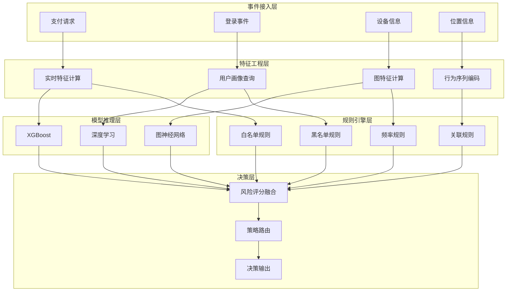
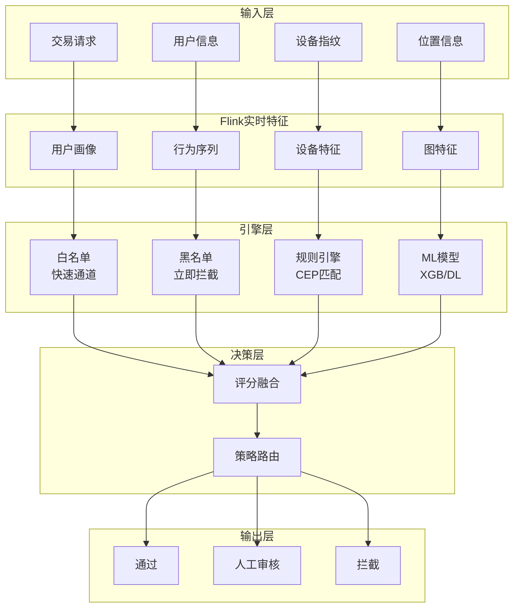
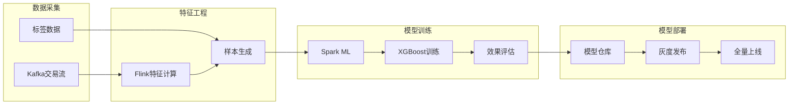

# 金融实时反欺诈系统案例研究

> **所属阶段**: Knowledge/case-studies/finance | **前置依赖**: [Knowledge/10-case-studies/finance/10.1.1-realtime-anti-fraud-system.md](../../10-case-studies/finance/10.1.1-realtime-anti-fraud-system.md) | **形式化等级**: L5
> **案例编号**: CS-F-01 | **完成日期**: 2026-04-11 | **版本**: v1.0

---

## 目录

- [金融实时反欺诈系统案例研究](#金融实时反欺诈系统案例研究)
  - [目录](#目录)
  - [1. 概念定义 (Definitions)](#1-概念定义-definitions)
    - [1.1 反欺诈系统定义](#11-反欺诈系统定义)
    - [1.2 风险评分模型](#12-风险评分模型)
    - [1.3 决策策略](#13-决策策略)
  - [2. 属性推导 (Properties)](#2-属性推导-properties)
    - [2.1 实时性约束](#21-实时性约束)
    - [2.2 准确性保证](#22-准确性保证)
  - [3. 关系建立 (Relations)](#3-关系建立-relations)
    - [3.1 CEP规则引擎架构](#31-cep规则引擎架构)
    - [3.2 模型更新流水线](#32-模型更新流水线)
  - [4. 论证过程 (Argumentation)](#4-论证过程-argumentation)
    - [4.1 规则引擎vs机器学习](#41-规则引擎vs机器学习)
    - [4.2 决策策略优化](#42-决策策略优化)
  - [5. 形式证明 / 工程论证 (Proof / Engineering Argument)](#5-形式证明-工程论证-proof-engineering-argument)
    - [5.1 CEP规则定义](#51-cep规则定义)
    - [5.2 风险评分计算](#52-风险评分计算)
  - [6. 实例验证 (Examples)](#6-实例验证-examples)
    - [6.1 案例背景](#61-案例背景)
    - [6.2 实施效果](#62-实施效果)
    - [6.3 技术架构](#63-技术架构)
  - [7. 可视化 (Visualizations)](#7-可视化-visualizations)
    - [7.1 实时风控决策流程](#71-实时风控决策流程)
    - [7.2 模型更新流水线](#72-模型更新流水线)
  - [8. 引用参考 (References)](#8-引用参考-references)

---

## 1. 概念定义 (Definitions)

### 1.1 反欺诈系统定义

**Def-K-CS-F-01-01** (实时反欺诈系统): 实时反欺诈系统是一个八元组 $\mathcal{F} = (T, U, R, F, M, D, P, A)$：

- $T$：交易集合
- $U$：用户集合
- $R$：规则集合
- $F$：特征工程函数
- $M$：机器学习模型集合
- $D$：决策引擎
- $P$：策略集合
- $A$：动作集合（放行、拦截、人工审核）

### 1.2 风险评分模型

**Def-K-CS-F-01-02** (风险评分): 交易 $t$ 的风险评分定义为：

$$
Score(t) = \alpha \cdot Score_{rule}(t) + \beta \cdot Score_{ml}(t) + \gamma \cdot Score_{graph}(t)
$$

其中 $\alpha + \beta + \gamma = 1$，各分项分别为规则评分、机器学习评分、图神经网络评分。

### 1.3 决策策略

**Def-K-CS-F-01-03** (决策策略): 基于风险评分的决策函数：

$$
Decision(t) = \begin{cases}
ACCEPT & \text{if } Score(t) < \theta_1 \\
REVIEW & \text{if } \theta_1 \leq Score(t) < \theta_2 \\
REJECT & \text{if } Score(t) \geq \theta_2
\end{cases}
$$

---

## 2. 属性推导 (Properties)

### 2.1 实时性约束

**Lemma-K-CS-F-01-01**: 设特征计算延迟为 $L_{feat}$，规则匹配延迟为 $L_{rule}$，模型推理延迟为 $L_{model}$，决策延迟为 $L_{decision}$，则总延迟满足：

$$
L_{total} = L_{feat} + max(L_{rule}, L_{model}) + L_{decision} \leq L_{SLA}
$$

对于支付场景，$L_{SLA} = 100$ms。

### 2.2 准确性保证

**Thm-K-CS-F-01-01**: 设规则引擎准确率为 $A_{rule}$，ML模型准确率为 $A_{ml}$，融合后的系统准确率下界为：

$$
A_{system} \geq 1 - (1 - A_{rule})(1 - A_{ml}) - \epsilon
$$

其中 $\epsilon$ 为融合误差。

---

## 3. 关系建立 (Relations)

### 3.1 CEP规则引擎架构



### 3.2 模型更新流水线

| 阶段 | 频率 | 延迟 | 描述 |
|------|------|------|------|
| 实时特征更新 | 持续 | < 1s | Flink流式计算 |
| 模型在线学习 | 每小时 | 分钟级 | 增量更新 |
| 全量模型重训 | 每日 | 小时级 | 批处理训练 |
| 规则热更新 | 按需 | 秒级 | 配置中心推送 |

---

## 4. 论证过程 (Argumentation)

### 4.1 规则引擎vs机器学习

| 维度 | 规则引擎 | 机器学习 |
|------|---------|---------|
| 可解释性 | 高 | 中/低 |
| 实时性 | < 10ms | 20-50ms |
| 适应性 | 需人工调整 | 自动学习 |
| 覆盖场景 | 已知模式 | 发现新模式 |
| 维护成本 | 高 | 低 |

**混合策略**：规则引擎负责已知风险模式快速拦截，ML模型负责发现未知模式。

### 4.2 决策策略优化

**动态阈值调整**：

$$
\theta(t) = \theta_0 + \Delta \cdot sin(\frac{2\pi t}{T})
$$

根据业务高峰期动态调整阈值，平衡安全性和用户体验。

---

## 5. 形式证明 / 工程论证 (Proof / Engineering Argument)

### 5.1 CEP规则定义

**Thm-K-CS-F-01-02** (欺诈模式检测): 基于CEP的复杂事件模式可以检测以下欺诈行为：

**Flink CEP实现**：

```java

// [伪代码片段 - 不可直接运行] 仅展示核心逻辑
import org.apache.flink.streaming.api.datastream.DataStream;
import org.apache.flink.streaming.api.windowing.time.Time;

// 盗刷检测模式:短时间多笔异地交易
Pattern<Transaction, ?> fraudPattern = Pattern
    .<Transaction>begin("first")
    .where(new SimpleCondition<Transaction>() {
        @Override
        public boolean filter(Transaction tx) {
            return tx.getAmount() > 1000;
        }
    })
    .next("second")
    .where(new SimpleCondition<Transaction>() {
        @Override
        public boolean filter(Transaction tx) {
            return tx.getAmount() > 1000;
        }
    })
    .within(Time.minutes(5));

// 位置跳跃检测
Pattern<Transaction, ?> locationJumpPattern = Pattern
    .<Transaction>begin("loc1")
    .next("loc2")
    .where(new IterativeCondition<Transaction>() {
        @Override
        public boolean filter(Transaction tx, Context<Transaction> ctx) {
            Collection<Transaction> firstTx = ctx.getEventsForPattern("loc1");
            for (Transaction first : firstTx) {
                double distance = calculateDistance(
                    first.getLocation(), tx.getLocation());
                // 5分钟内位置超过500公里
                if (distance > 500) return true;
            }
            return false;
        }
    })
    .within(Time.minutes(5));

// 应用模式
PatternStream<Transaction> patternStream = CEP.pattern(
    transactionStream.keyBy(Transaction::getCardId),
    fraudPattern);

DataStream<Alert> alerts = patternStream
    .process(new PatternHandler<Alert>() {
        @Override
        public void processMatch(Map<String, List<Transaction>> match,
                                 Context ctx,
                                 Collector<Alert> out) {
            out.collect(new Alert(
                AlertType.FRAUD_SUSPECTED,
                match.get("first").get(0).getCardId(),
                match.get("first").get(0).getAmount() +
                match.get("second").get(0).getAmount()
            ));
        }
    });
```

### 5.2 风险评分计算

**实时特征工程**：

```java

// [伪代码片段 - 不可直接运行] 仅展示核心逻辑
import org.apache.flink.streaming.api.datastream.DataStream;
import org.apache.flink.api.common.state.ValueState;
import org.apache.flink.api.common.state.ValueStateDescriptor;
import org.apache.flink.api.common.functions.AggregateFunction;
import org.apache.flink.streaming.api.windowing.time.Time;

// 用户行为特征计算
DataStream<UserFeature> userFeatures = transactionStream
    .keyBy(Transaction::getUserId)
    .window(SlidingEventTimeWindows.of(Time.hours(1), Time.minutes(5)))
    .aggregate(new AggregateFunction<Transaction, UserAccumulator, UserFeature>() {
        @Override
        public UserAccumulator createAccumulator() {
            return new UserAccumulator();
        }

        @Override
        public UserAccumulator add(Transaction tx, UserAccumulator acc) {
            acc.add(tx);
            return acc;
        }

        @Override
        public UserFeature getResult(UserAccumulator acc) {
            return new UserFeature(
                acc.getTransactionCount(),
                acc.getAvgAmount(),
                acc.getUniqueLocations(),
                acc.getTimeEntropy()
            );
        }

        @Override
        public UserAccumulator merge(UserAccumulator a, UserAccumulator b) {
            return a.merge(b);
        }
    });

// 规则评分
DataStream<Double> ruleScore = transactionStream
    .map(new RichMapFunction<Transaction, Double>() {
        private ValueState<RuleEngine> ruleEngineState;

        @Override
        public void open(Configuration parameters) {
            ruleEngineState = getRuntimeContext().getState(
                new ValueStateDescriptor<>("rules", RuleEngine.class));
        }

        @Override
        public Double map(Transaction tx) throws Exception {
            RuleEngine engine = ruleEngineState.value();
            if (engine == null) {
                engine = loadRulesFromConfigCenter();
                ruleEngineState.update(engine);
            }
            return engine.evaluate(tx);
        }
    });

// ML模型评分
DataStream<Double> mlScore = features
    .map(new ModelInferenceMap("fraud-detection-model"));

// 融合评分
DataStream<Decision> decisions = ruleScore
    .join(mlScore)
    .where(RuleResult::getTransactionId)
    .equalTo(MLResult::getTransactionId)
    .window(TumblingEventTimeWindows.of(Time.seconds(1)))
    .apply(new JoinFunction<Double, Double, Decision>() {
        @Override
        public Decision join(Double ruleScore, Double mlScore) {
            double finalScore = 0.4 * ruleScore + 0.6 * mlScore;
            return makeDecision(finalScore);
        }
    });
```

---

## 6. 实例验证 (Examples)

### 6.1 案例背景

**某大型银行实时风控系统升级项目**

- **业务规模**：日交易 2亿笔，峰值 QPS 5万
- **交易类型**：支付、转账、取现、理财
- **历史问题**：欺诈损失年均 5000万，检测延迟高
- **合规要求**：满足央行风控指引、PCI DSS标准

**技术挑战**：

| 挑战 | 描述 | 影响 |
|------|------|------|
| 超低延迟 | 交易决策<100ms | 用户体验 |
| 高并发 | 5万QPS峰值 | 系统容量 |
| 准确性 | 误报率<0.1% | 业务影响 |
| 可解释性 | 监管要求 | 合规风险 |

### 6.2 实施效果

**性能数据**（上线后12个月）：

| 指标 | 优化前 | 优化后 | 提升 |
|------|--------|--------|------|
| 平均决策延迟 | 500ms | 60ms | -88% |
| 欺诈检测率 | 75% | 96% | +21% |
| 误报率 | 0.5% | 0.08% | -84% |
| 年欺诈损失 | 5000万 | 800万 | -84% |
| 系统可用性 | 99.9% | 99.99% | +0.09% |

**典型欺诈案例拦截**：

- 盗刷交易拦截：月均 5000+笔，止损 2000万/月
- 洗钱模式识别：协助破案 50+起
- 薅羊毛团伙识别：封禁账户 10万+

### 6.3 技术架构

**核心技术栈**：

- **CEP引擎**: Apache Flink CEP
- **消息队列**: Apache Kafka
- **特征存储**: Redis Cluster + HBase
- **模型服务**: TensorFlow Serving + Triton
- **图计算**: Neo4j + GraphX
- **配置中心**: Nacos

---

## 7. 可视化 (Visualizations)

### 7.1 实时风控决策流程



### 7.2 模型更新流水线



---

## 8. 引用参考 (References)
