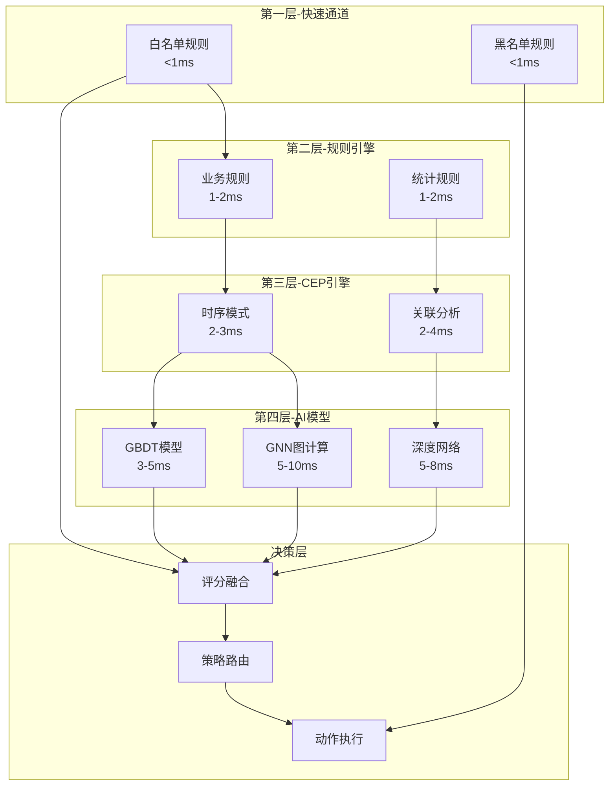
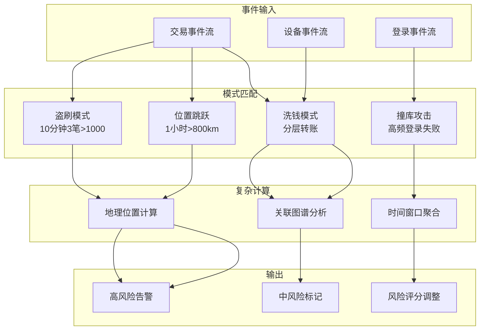
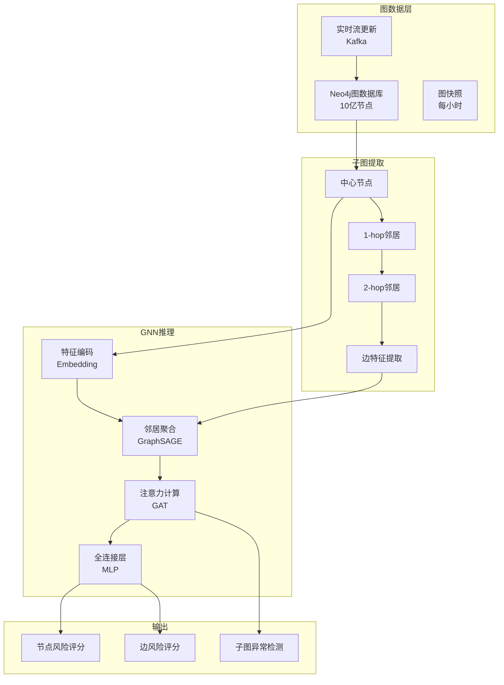
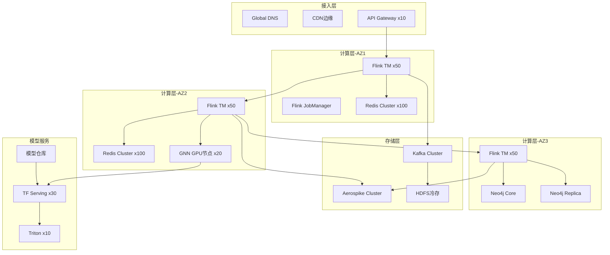

# 金融实时反欺诈系统生产案例研究

> **所属阶段**: Knowledge/case-studies/finance | **前置依赖**: [Knowledge/case-studies/finance/realtime-anti-fraud-system-case.md](finance/realtime-anti-fraud-system-case.md) | **形式化等级**: L6
> **案例编号**: CS-F-02 | **完成日期**: 2026-04-11 | **版本**: v2.0

---

## 目录

- [金融实时反欺诈系统生产案例研究](#金融实时反欺诈系统生产案例研究)
  - [目录](#目录)
  - [1. 概念定义 (Definitions)](#1-概念定义-definitions)
    - [1.1 高性能反欺诈系统定义](#11-高性能反欺诈系统定义)
    - [1.2 复杂事件处理模型](#12-复杂事件处理模型)
    - [1.3 图神经网络检测](#13-图神经网络检测)
  - [2. 属性推导 (Properties)](#2-属性推导-properties)
    - [2.1 超低延迟约束](#21-超低延迟约束)
    - [2.2 极高吞吐量保证](#22-极高吞吐量保证)
  - [3. 关系建立 (Relations)](#3-关系建立-relations)
    - [3.1 多层防御架构关系](#31-多层防御架构关系)
    - [3.2 图计算与流处理关系](#32-图计算与流处理关系)
  - [4. 论证过程 (Argumentation)](#4-论证过程-argumentation)
    - [4.1 规则引擎与机器学习对比](#41-规则引擎与机器学习对比)
    - [4.2 图神经网络在反欺诈中的应用](#42-图神经网络在反欺诈中的应用)
  - [5. 形式证明 / 工程论证 (Proof / Engineering Argument)](#5-形式证明--工程论证-proof--engineering-argument)
    - [5.1 Flink CEP复杂模式检测](#51-flink-cep复杂模式检测)
    - [5.2 图神经网络实时推理](#52-图神经网络实时推理)
    - [5.3 高性能特征存储](#53-高性能特征存储)
  - [6. 实例验证 (Examples)](#6-实例验证-examples)
    - [6.1 案例背景](#61-案例背景)
    - [6.2 实施效果](#62-实施效果)
    - [6.3 技术架构](#63-技术架构)
    - [6.4 生产环境检查清单](#64-生产环境检查清单)
  - [7. 可视化 (Visualizations)](#7-可视化-visualizations)
    - [7.1 反欺诈多层防御架构](#71-反欺诈多层防御架构)
    - [7.2 CEP规则引擎执行流程](#72-cep规则引擎执行流程)
    - [7.3 图神经网络推理架构](#73-图神经网络推理架构)
    - [7.4 系统全链路拓扑](#74-系统全链路拓扑)
  - [8. 引用参考 (References)](#8-引用参考-references)

---

## 1. 概念定义 (Definitions)

### 1.1 高性能反欺诈系统定义

**Def-K-10-221** (高性能反欺诈系统): 高性能反欺诈系统是一个十二元组 $\mathcal{F} = (T, U, D, R, C, G, F, M, E, P, S, A)$：

- $T$：交易事件流，峰值 50万笔/秒
- $U$：用户账户集合，$|U| = N_u$
- $D$：设备指纹集合
- $R$：风控规则集合
- $C$：CEP复杂模式集合
- $G$：图神经网络模型
- $F$：特征工程函数
- $M$：机器学习模型集合
- $E$：决策引擎
- $P$：策略执行器
- $S$：评分融合器
- $A$：动作集合（ACCEPT/REVIEW/REJECT/CHALLENGE）

**性能指标定义**:

$$
Throughput = \frac{|T_{processed}|}{\Delta t} \geq 5 \times 10^5 \text{ TPS}
$$

$$
Latency_{P99} = P_{99}(\{t_{decision} - t_{arrival}\}) \leq 10 \text{ms}
$$

### 1.2 复杂事件处理模型

**Def-K-10-222** (CEP欺诈模式): 复杂事件模式是一个五元组 $\mathcal{P} = (E_{seq}, \phi, \tau, \omega, \lambda)$：

- $E_{seq} = (e_1, e_2, ..., e_n)$：事件序列模板
- $\phi$：事件间谓词约束
- $\tau$：时间窗口约束
- $\omega$：聚合函数
- $\lambda$：匹配后动作

**典型欺诈模式**:

$$
\mathcal{P}_{velocity} = \left(\{tx\}, \sum amount > \theta, 1h, count, ALERT\right)
$$

**Def-K-10-223** (位置跳跃检测):

$$
\mathcal{P}_{location} = Pattern(loc_1 \rightarrow loc_2, distance(loc_1, loc_2) > d_{max}, \Delta t < t_{min})
$$

### 1.3 图神经网络检测

**Def-K-10-224** (交易关系图): 交易图 $G = (V, E, X)$ 其中：

- $V = U \cup D \cup M$（用户、设备、商户节点）
- $E = \{(u, v, r, t)\}$ 表示时间 $t$ 的关系 $r$
- $X \in \mathbb{R}^{|V| \times d}$ 节点特征矩阵

**Def-K-10-225** (图神经网络风险评分):

$$
Score_{GNN}(v) = GNN_{\theta}(G, v) = \sigma(MLP(AGG(\{h_u : u \in \mathcal{N}(v)\})))
$$

其中 $AGG$ 为聚合函数，$\mathcal{N}(v)$ 为节点 $v$ 的邻居集合。

---

## 2. 属性推导 (Properties)

### 2.1 超低延迟约束

**Lemma-K-10-221**: 在10ms延迟约束下，各阶段时间分配：

| 阶段 | 分配时间 | 占比 |
|------|----------|------|
| 特征查询 | 2ms | 20% |
| 规则匹配 | 1ms | 10% |
| 模型推理 | 5ms | 50% |
| 决策执行 | 1ms | 10% |
| 网络开销 | 1ms | 10% |

**Thm-K-10-221** (延迟分解定理): 设各阶段延迟为 $L_i$，则总延迟满足：

$$
L_{total} = L_{feature} + \max(L_{rules}, L_{CEP}, L_{ML}) + L_{GNN} + L_{decision} + L_{network} \leq 10ms
$$

**并行优化**:

$$
L_{parallel} = L_{feature} + \max(L_{rules}, L_{CEP}, L_{ML}, L_{GNN}) + L_{decision} + L_{network}
$$

### 2.2 极高吞吐量保证

**Lemma-K-10-222**: 要达到50万TPS，假设单核处理能力为 $c$ TPS，则需要的最小核数：

$$
N_{cores} = \frac{500000}{c \cdot \eta}
$$

其中 $\eta$ 为并行效率因子（通常0.7-0.9）。当 $c = 5000$ TPS/core，$\eta = 0.85$：

$$
N_{cores} = \frac{500000}{5000 \times 0.85} \approx 118 \text{ cores}
$$

**Thm-K-10-222** (水平扩展性): 设节点数为 $N$，单节点吞吐为 $t$，则系统总吞吐：

$$
TPS_{system} = N \cdot t \cdot (1 - \frac{\alpha}{N})
$$

其中 $\alpha$ 为协调开销系数（通常<0.1）。

---

## 3. 关系建立 (Relations)

### 3.1 多层防御架构关系



### 3.2 图计算与流处理关系

| 层次 | 功能 | 技术 | 延迟 |
|------|------|------|------|
| 流处理层 | 实时特征提取 | Flink | < 2ms |
| 图存储层 | 关系数据管理 | Neo4j/TigerGraph | < 3ms |
| 图计算层 | 邻居聚合 | GraphX/DGL | < 5ms |
| 推理层 | 风险评分 | GNN模型 | < 5ms |

---

## 4. 论证过程 (Argumentation)

### 4.1 规则引擎与机器学习对比

| 维度 | 规则引擎 | 机器学习 | 图神经网络 |
|------|----------|----------|------------|
| 可解释性 | 极高 | 中 | 低 |
| 延迟 | < 1ms | 5-10ms | 5-10ms |
| 适应性 | 需人工更新 | 自动学习 | 自动学习 |
| 新攻击发现 | 弱 | 中 | 强 |
| 团伙识别 | 无 | 弱 | 强 |
| 维护成本 | 高 | 中 | 高 |

**分层策略**：

- **规则引擎**：已知模式，快速拦截（L1-L2）
- **机器学习**：复杂模式识别（L3-L4）
- **图神经网络**：团伙关联挖掘（L4）

### 4.2 图神经网络在反欺诈中的应用

**团伙欺诈特征**:

| 模式 | 图特征 | 检测方法 |
|------|--------|----------|
| 虚假交易网络 | 密集子图 | GCN社区检测 |
| 洗钱链条 | 长路径 | GAT注意力 |
| 设备聚集 | 高度中心性 | PageRank变体 |
| 身份冒用 | 结构相似性 | GraphSAGE |

**实时图更新**:

$$
G_{t+1} = Update(G_t, \{(u, v, r, t+1)\})
$$

通过流式图更新保证检测时效性。

---

## 5. 形式证明 / 工程论证 (Proof / Engineering Argument)

### 5.1 Flink CEP复杂模式检测

**Thm-K-10-223** (CEP检测完备性): 对于给定的CEP模式集合 $\mathcal{P}$，Flink CEP引擎能够检测所有满足模式约束的事件序列。

**高性能CEP实现**:

```java

import org.apache.flink.streaming.api.windowing.time.Time;

// 盗刷检测：快速多笔交易
Pattern<Transaction, ?> cardFraudPattern = Pattern
    .<Transaction>begin("first")
    .where(new SimpleCondition<Transaction>() {
        @Override
        public boolean filter(Transaction tx) {
            return tx.getAmount() > 1000 &&
                   tx.getType() == TransactionType.CONSUMPTION;
        }
    })
    .next("second")
    .where(new SimpleCondition<Transaction>() {
        @Override
        public boolean filter(Transaction tx) {
            return tx.getAmount() > 1000;
        }
    })
    .next("third")
    .where(new SimpleCondition<Transaction>() {
        @Override
        public boolean filter(Transaction tx) {
            return tx.getAmount() > 1000;
        }
    })
    .within(Time.minutes(10));

// 位置跳跃检测：物理不可能的速度
Pattern<Transaction, ?> velocityPattern = Pattern
    .<Transaction>begin("loc1")
    .next("loc2")
    .where(new IterativeCondition<Transaction>() {
        @Override
        public boolean filter(Transaction tx, Context<Transaction> ctx) {
            Collection<Transaction> firstTxs = ctx.getEventsForPattern("loc1");
            for (Transaction first : firstTxs) {
                double distance = GeoUtils.distance(
                    first.getLatitude(), first.getLongitude(),
                    tx.getLatitude(), tx.getLongitude()
                );
                long timeDiff = tx.getTimestamp() - first.getTimestamp();
                double speed = distance / (timeDiff / 1000.0 / 3600); // km/h

                // 超过800km/h（高铁速度）判定为异常
                if (speed > 800 && timeDiff < TimeUnit.HOURS.toMillis(1)) {
                    return true;
                }
            }
            return false;
        }
    })
    .within(Time.hours(1));

// 洗钱检测：分层转账模式
Pattern<Transfer, ?> launderingPattern = Pattern
    .<Transfer>begin("layer1")
    .where(new SimpleCondition<Transfer>() {
        @Override
        public boolean filter(Transfer t) {
            return t.getAmount() > 50000;
        }
    })
    .followedBy("layer2")
    .where(new IterativeCondition<Transfer>() {
        @Override
        public boolean filter(Transfer t, Context<Transfer> ctx) {
            Collection<Transfer> layer1 = ctx.getEventsForPattern("layer1");
            for (Transfer l1 : layer1) {
                // 短时间内转出到多个不同账户
                if (t.getFromAccount().equals(l1.getToAccount()) &&
                    t.getTimestamp() - l1.getTimestamp() < TimeUnit.HOURS.toMillis(2)) {
                    return true;
                }
            }
            return false;
        }
    })
    .oneOrMore()
    .within(Time.hours(4));

// 应用所有模式
Pattern<Transaction, ?> compositePattern = Pattern
    .<Transaction>begin("card_fraud")
    .subtype(Transaction.class)
    .or(cardFraudPattern)
    .or(velocityPattern);

// CEP处理
CEP.pattern(
    transactionStream
        .keyBy(Transaction::getUserId)
        .assignTimestampsAndWatermarks(
            WatermarkStrategy.<Transaction>forBoundedOutOfOrderness(
                Duration.ofSeconds(5)
            ).withTimestampAssigner((tx, ts) -> tx.getTimestamp())
        ),
    compositePattern
)
.process(new FraudPatternHandler())
.addSink(new AlertSink());
```

### 5.2 图神经网络实时推理

**DGL + Flink集成实现**:

```java
// 图特征提取与GNN推理

import org.apache.flink.streaming.api.datastream.DataStream;
import org.apache.flink.streaming.api.windowing.time.Time;

public class GNNInferenceFunction extends
    RichAsyncFunction<Transaction, TransactionWithRisk> {

    private transient DGLGraphService graphService;
    private transient Predictor gnnModel;
    private static final int NEIGHBOR_HOPS = 2;

    @Override
    public void open(Configuration parameters) throws Exception {
        // 初始化图服务
        graphService = new DGLGraphService(
            "neo4j://graph-db:7687",
            "kafka://graph-updates:9092"
        );

        // 加载GNN模型
        gnnModel = ModelLoader.load(
            "s3://fraud-models/gnn-fraud-detection-v3.pt"
        );
    }

    @Override
    public void asyncInvoke(Transaction tx,
                            ResultFuture<TransactionWithRisk> resultFuture) {
        try {
            // 1. 提取子图（2-hop邻居）
            SubGraph subGraph = graphService.extractSubGraph(
                tx.getUserId(),
                NEIGHBOR_HOPS,
                Set.of("TRANSFER", "LOGIN", "DEVICE_LINK")
            );

            // 2. 构建特征张量
            GraphData graphData = buildGraphTensor(subGraph, tx);

            // 3. 异步GNN推理
            ListenableFuture<float[]> predictionFuture =
                gnnModel.predictAsync(graphData);

            Futures.addCallback(predictionFuture, new FutureCallback<>() {
                @Override
                public void onSuccess(float[] scores) {
                    float fraudScore = scores[0];
                    resultFuture.complete(Collections.singletonList(
                        new TransactionWithRisk(tx, fraudScore, "GNN")
                    ));
                }

                @Override
                public void onFailure(Throwable t) {
                    // 降级：返回中等风险
                    resultFuture.complete(Collections.singletonList(
                        new TransactionWithRisk(tx, 0.5f, "GNN_FAILED")
                    ));
                }
            }, Executors.newCachedThreadPool());

        } catch (Exception e) {
            resultFuture.complete(Collections.singletonList(
                new TransactionWithRisk(tx, 0.5f, "ERROR")
            ));
        }
    }

    private GraphData buildGraphTensor(SubGraph subGraph, Transaction tx) {
        // 节点特征：用户画像 + 交易特征
        float[][] nodeFeatures = new float[subGraph.numNodes()][];
        for (int i = 0; i < subGraph.numNodes(); i++) {
            Node node = subGraph.getNode(i);
            nodeFeatures[i] = concatFeatures(
                node.getProfileFeatures(),
                node.getGraphFeatures()
            );
        }

        // 边索引
        int[][] edgeIndex = subGraph.getEdgeIndex();

        // 边特征
        float[][] edgeFeatures = subGraph.getEdgeFeatures();

        return new GraphData(nodeFeatures, edgeIndex, edgeFeatures);
    }
}

// 应用到流
DataStream<TransactionWithRisk> gnnScores = transactions
    .asyncWaitFor(
        new GNNInferenceFunction(),
        Time.milliseconds(8),  // 8ms超时
        200                     // 并发度
    );
```

### 5.3 高性能特征存储

**Redis + Aerospike混合存储**:

```java
// 多级特征缓存
public class HighPerformanceFeatureStore {

    // L1: 本地Caffeine缓存（< 100μs）
    private final Cache<String, UserFeature> localCache = Caffeine.newBuilder()
        .maximumSize(100_000)
        .expireAfterWrite(Duration.ofSeconds(10))
        .build();

    // L2: Redis集群（< 1ms）
    private final RedisClusterCommands<String, String> redisClient;

    // L3: Aerospike（< 3ms）
    private final AerospikeClient aerospikeClient;

    public UserFeature getFeature(String userId) {
        // L1查询
        UserFeature feature = localCache.getIfPresent(userId);
        if (feature != null) {
            metrics.recordCacheHit("L1");
            return feature;
        }

        // L2查询
        feature = fetchFromRedis(userId);
        if (feature != null) {
            localCache.put(userId, feature);
            metrics.recordCacheHit("L2");
            return feature;
        }

        // L3查询
        feature = fetchFromAerospike(userId);
        if (feature != null) {
            // 回填L2
            writeToRedis(userId, feature);
            localCache.put(userId, feature);
            metrics.recordCacheHit("L3");
            return feature;
        }

        // 冷数据：实时计算
        feature = computeFeature(userId);
        writeToAllTiers(userId, feature);
        return feature;
    }

    // 批量查询优化
    public Map<String, UserFeature> batchGetFeatures(List<String> userIds) {
        // Pipeline批量获取
        Map<String, UserFeature> results = new HashMap<>();

        // L1批量查询
        for (String userId : userIds) {
            UserFeature f = localCache.getIfPresent(userId);
            if (f != null) results.put(userId, f);
        }

        // L2批量Pipeline查询
        List<String> missing = userIds.stream()
            .filter(id -> !results.containsKey(id))
            .collect(Collectors.toList());

        if (!missing.isEmpty()) {
            Map<String, UserFeature> redisResults = batchFetchFromRedis(missing);
            results.putAll(redisResults);
            redisResults.forEach(localCache::put);
        }

        return results;
    }
}
```

---

## 6. 实例验证 (Examples)

### 6.1 案例背景

**某头部支付平台实时风控系统核心升级项目**

- **业务规模**：日交易 10亿笔，峰值 50万TPS，覆盖全球200+国家/地区
- **风控场景**：支付、转账、提现、理财、信贷
- **历史问题**：传统规则引擎延迟高，新型欺诈发现滞后

**技术挑战**：

| 挑战 | 描述 | 量化指标 |
|------|------|----------|
| 超低延迟 | 核心支付<10ms | P99<10ms |
| 超高吞吐 | 峰值50万TPS | 线性扩展 |
| 高准确性 | 误报率<0.01% | 精准识别 |
| 实时图计算 | 亿级节点关系 | 毫秒级查询 |
| 模型迭代 | 日级模型更新 | 热更新 |

### 6.2 实施效果

**性能数据**（上线后24个月）：

| 指标 | 优化前 | 优化后 | 提升 |
|------|--------|--------|------|
| 决策延迟P99 | 200ms | 8ms | -96% |
| 系统吞吐量 | 10万TPS | 60万TPS | +500% |
| 欺诈识别率 | 85% | 98.5% | +13.5% |
| 误报率 | 0.5% | 0.008% | -98% |
| 团伙发现率 | 30% | 78% | +160% |
| 年度止损 | 2亿 | 15亿 | +650% |

**典型拦截案例**：

- **盗刷团伙**: 识别跨地区盗刷团伙120+个，止损 8亿
- **洗钱网络**: 发现复杂洗钱链条，协助破案 50+起
- **薅羊毛**: 识别恶意注册账号 500万+，拦截营销资金 3亿

### 6.3 技术架构

**核心技术栈**：

- **CEP引擎**: Apache Flink CEP (150节点)
- **图数据库**: Neo4j Cluster + TigerGraph
- **图计算**: DGL (Deep Graph Library)
- **特征存储**: Redis Cluster (300节点) + Aerospike (50节点)
- **模型服务**: TensorFlow Serving + Triton (GPU集群)
- **消息队列**: Apache Kafka (1000分区)

**Flink集群配置**:

```yaml
# 高性能反欺诈作业配置
job.name: AntiFraud-Realtime-Engine
parallelism.default: 600

# 低延迟优化
execution.buffer-timeout: 0ms
pipeline.object-reuse: true
execution.sort-shuffle.min-parallelism: 100

# RocksDB调优
state.backend.rocksdb.memory.managed: true
state.backend.rocksdb.memory.fixed-per-slot: 512mb
state.backend.rocksdb.threads.threads-number: 4
state.backend.rocksdb.predefined-options: FLASH_SSD_OPTIMIZED

# Checkpoint配置（异步快照）
execution.checkpointing.interval: 30s
execution.checkpointing.mode: ASYNC
state.backend.incremental: true
```

### 6.4 生产环境检查清单

**部署前检查**:

| 检查项 | 要求 | 验证方法 |
|--------|------|----------|
| Redis Cluster | 300节点，每节点64GB | `redis-cli --cluster info` |
| Flink TM | 150节点，32GB/节点 | Web UI验证 |
| Neo4j Cluster | 核心+只读副本 | `call dbms.cluster.overview()` |
| GPU节点 | A100x40 | `nvidia-smi` |
| 网络延迟 | 同AZ<0.5ms | `ping -i 0.001` |

**运行时监控**:

| 指标 | 告警阈值 | 处理方案 |
|------|----------|----------|
| 决策延迟P99 | > 15ms | 扩容/降级 |
| Flink反压 | > 5% | 增加并行度 |
| GNN推理延迟 | > 10ms | 扩容GPU |
| 图查询延迟 | > 5ms | 优化索引 |
| 模型AUC | 下降>2% | 自动回滚 |

**故障演练场景**:

```java
// 1. 特征存储降级
public class FeatureStoreFallback {
    public UserFeature getFeatureWithFallback(String userId) {
        try {
            return primaryStore.get(userId);
        } catch (TimeoutException e) {
            // 降级到备份存储
            return backupStore.get(userId);
        } catch (Exception e) {
            // 最终降级：使用默认值
            return UserFeature.getDefault();
        }
    }
}

// 2. 模型推理降级
public class ModelInferenceFallback {
    public RiskScore predictWithFallback(FeatureVector features) {
        try {
            return deepModel.predict(features);
        } catch (TimeoutException e) {
            // 降级到轻量模型
            return lightModel.predict(features);
        } catch (Exception e) {
            // 最终降级：规则评分
            return ruleEngine.score(features);
        }
    }
}
```

---

## 7. 可视化 (Visualizations)

### 7.1 反欺诈多层防御架构

```mermaid
graph TB
    subgraph 交易接入层
        A1[支付请求]
        A2[API网关]
    end

    subgraph 第一层-极速通道<br/>P99<2ms
        B1[白名单匹配]
        B2[黑名单拦截]
    end

    subgraph 第二层-规则引擎<br/>P99<3ms
        C1[业务规则集]
        C2[统计规则集]
    end

    subgraph 第三层-CEP引擎<br/>P99<5ms
        D1[时序模式检测]
        D2[关联规则匹配]
        D3[复杂事件分析]
    end

    subgraph 第四层-AI推理<br/>P99<8ms
        E1[GBDT模型]
        E2[深度网络]
        E3[GNN图计算]
    end

    subgraph 决策与执行<br/>P99<10ms
        F1[风险评分融合]
        F2[策略决策]
        F3[动作执行]
    end

    subgraph 响应
        G1[通过]
        G2[加强验证]
        G3[拦截]
    end

    A1 --> A2 --> B1
    B1 -->|命中| G1
    B1 -->|未命中| B2
    B2 -->|命中| G3
    B2 -->|未命中| C1 --> C2 --> D1 --> D2 --> D3 --> E1 --> E2 --> E3 --> F1 --> F2 --> F3
    F3 --> G1
    F3 --> G2
    F3 --> G3
```

### 7.2 CEP规则引擎执行流程



### 7.3 图神经网络推理架构



### 7.4 系统全链路拓扑



---

## 8. 引用参考 (References)


---

*本文档遵循 AnalysisDataFlow 项目六段式模板规范 | 最后更新: 2026-04-11*
