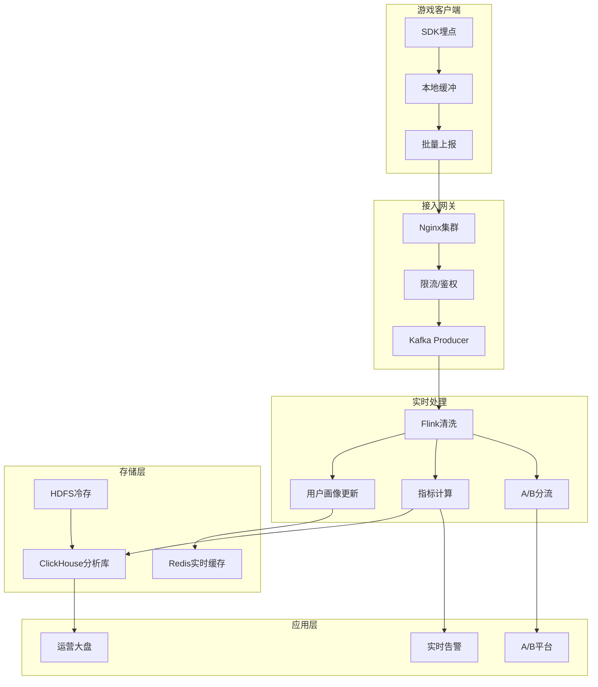
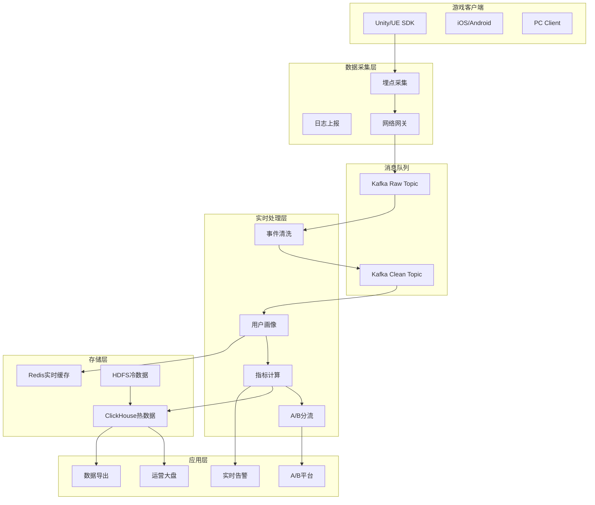
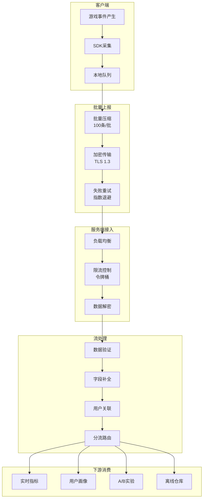
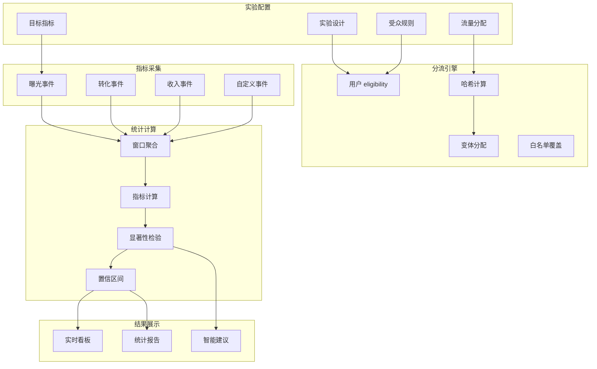
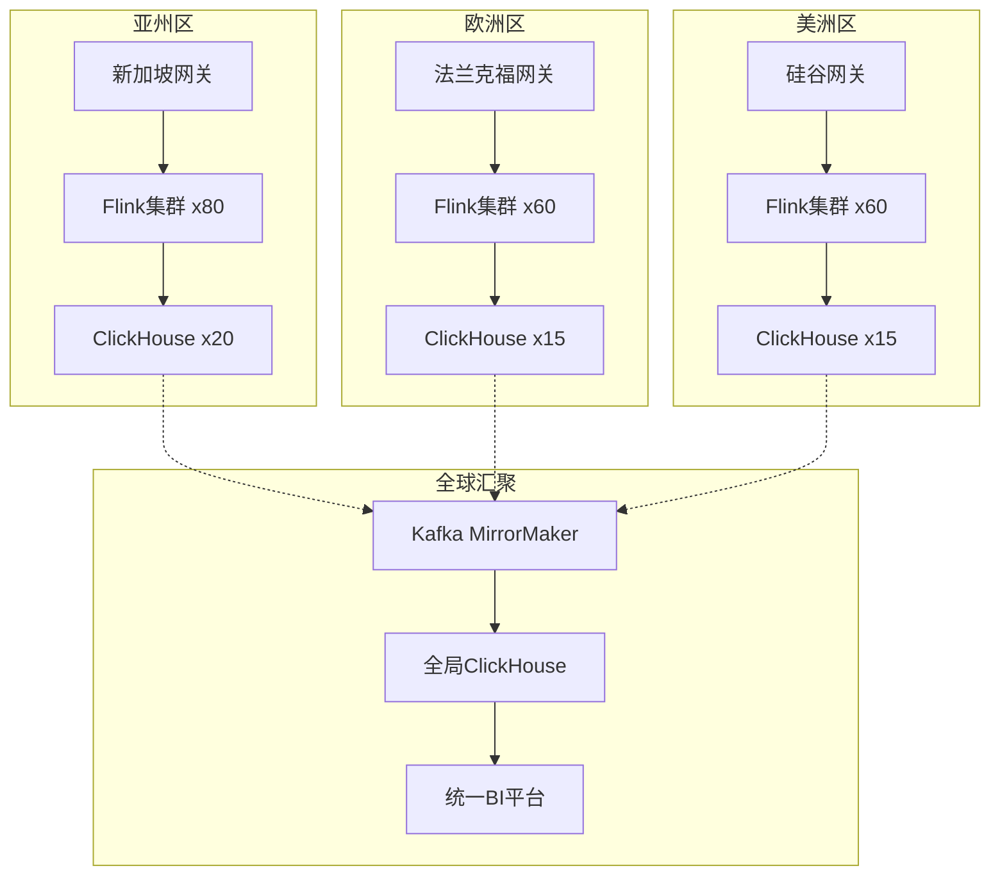

# 游戏实时分析平台案例研究

> **所属阶段**: Knowledge/case-studies/gaming | **前置依赖**: [Knowledge/case-studies/gaming/realtime-game-analytics-case.md](gaming/realtime-game-analytics-case.md) | **形式化等级**: L5
> **案例编号**: CS-G-02 | **完成日期**: 2026-04-11 | **版本**: v2.0

---

## 目录

- [游戏实时分析平台案例研究](#游戏实时分析平台案例研究)
  - [目录](#目录)
  - [1. 概念定义 (Definitions)](#1-概念定义-definitions)
    - [1.1 游戏分析平台定义](#11-游戏分析平台定义)
    - [1.2 玩家行为模型](#12-玩家行为模型)
    - [1.3 A/B测试框架](#13-ab测试框架)
  - [2. 属性推导 (Properties)](#2-属性推导-properties)
    - [2.1 实时性约束](#21-实时性约束)
    - [2.2 数据一致性保证](#22-数据一致性保证)
  - [3. 关系建立 (Relations)](#3-关系建立-relations)
    - [3.1 事件上报与处理关系](#31-事件上报与处理关系)
    - [3.2 实时与离线分析关系](#32-实时与离线分析关系)
  - [4. 论证过程 (Argumentation)](#4-论证过程-argumentation)
    - [4.1 实时vs离线A/B测试](#41-实时vs离线ab测试)
    - [4.2 玩家分群策略分析](#42-玩家分群策略分析)
  - [5. 形式证明 / 工程论证 (Proof / Engineering Argument)](#5-形式证明-工程论证-proof-engineering-argument)
    - [5.1 实时指标计算](#51-实时指标计算)
    - [5.2 A/B测试统计引擎](#52-ab测试统计引擎)
    - [5.3 实时大屏与可视化](#53-实时大屏与可视化)
  - [6. 实例验证 (Examples)](#6-实例验证-examples)
    - [6.1 案例背景](#61-案例背景)
    - [6.2 实施效果](#62-实施效果)
    - [6.3 技术架构](#63-技术架构)
    - [6.4 生产环境检查清单](#64-生产环境检查清单)
  - [7. 可视化 (Visualizations)](#7-可视化-visualizations)
    - [7.1 游戏实时分析平台架构](#71-游戏实时分析平台架构)
    - [7.2 事件上报与处理流程](#72-事件上报与处理流程)
    - [7.3 实时A/B测试架构](#73-实时ab测试架构)
    - [7.4 全球多区服部署拓扑](#74-全球多区服部署拓扑)
  - [8. 引用参考 (References)](#8-引用参考-references)

---

## 1. 概念定义 (Definitions)

### 1.1 游戏分析平台定义

**Def-K-10-231** (游戏实时分析平台): 游戏实时分析平台是一个十元组 $\mathcal{A} = (P, S, E, M, C, F, D, R, V, B)$：

- $P$：玩家集合，$|P| = N_p$，DAU 1000万+
- $S$：游戏会话集合
- $E$：事件类型集合（登录、战斗、付费、社交等）
- $M$：指标集合（留存、付费、活跃等）
- $C$：计算函数集合
- $F$：特征工程函数
- $D$：数据存储系统
- $R$：实时报表系统
- $V$：可视化系统
- $B$：A/B测试框架

**事件模型定义**:

$$
Event = (userId, sessionId, eventType, timestamp, properties, deviceInfo)
$$

**Def-K-10-232** (实时指标):

| 指标类别 | 具体指标 | 计算频率 | 延迟要求 |
|----------|----------|----------|----------|
| 活跃指标 | DAU/MAU/在线人数 | 实时 | < 5s |
| 留存指标 | 次日/7日/30日留存 | 每小时 | < 1h |
| 付费指标 | 收入/ARPU/付费率 | 实时 | < 10s |
| 行为指标 | 通关率/流失率 | 实时 | < 1min |

### 1.2 玩家行为模型

**Def-K-10-233** (玩家实时画像): 玩家 $p$ 在时间 $t$ 的实时画像：

$$
Profile(p, t) = (D_p, B_p^{(t)}, V_p^{(t)}, E_p^{(t)}, C_p^{(t)})
$$

其中：

- $D_p$：人口统计特征（地区、性别、年龄组）
- $B_p^{(t)}$：行为特征（等级、战力、游戏时长）
- $V_p^{(t)}$：价值特征（LTV、付费金额、付费频次）
- $E_p^{(t)}$：参与度特征（登录频次、会话时长、好友数）
- $C_p^{(t)}$：实时上下文（当前关卡、在线状态）

**Def-K-10-234** (流失风险模型):

$$
ChurnRisk(p, t) = \sigma(W_{churn} \cdot f(p, t) + b_{churn})
$$

其中 $f(p, t)$ 为玩家特征向量，$\sigma$ 为Sigmoid函数。

### 1.3 A/B测试框架

**Def-K-10-235** (A/B测试实验): 实验定义为五元组 $\mathcal{E} = (N, V, A, H, M)$：

- $N$：实验名称
- $V$：变体集合（对照组 $V_0$ + 实验组 $V_1, ..., V_k$）
- $A$：流量分配策略
- $H$：假设检验配置
- $M$：成功指标集合

**Def-K-10-236** (流量分配):

$$
Assignment(user, experiment) = Hash(userId + experimentId + salt) \mod 100
$$

**Def-K-10-237** (统计显著性):

$$
Z = \frac{\bar{X}_t - \bar{X}_c}{\sqrt{\frac{\sigma_t^2}{n_t} + \frac{\sigma_c^2}{n_c}}}
$$

当 $|Z| > 1.96$ 时，认为差异在95%置信水平下显著。

---

## 2. 属性推导 (Properties)

### 2.1 实时性约束

**Lemma-K-10-231**: 设事件上报延迟为 $L_{report}$，网络传输延迟为 $L_{network}$，处理延迟为 $L_{process}$，则端到端可见延迟：

$$
L_{visible} = L_{report} + L_{network} + L_{process} \leq L_{SLA}
$$

| 场景 | SLA | 分解 |
|------|-----|------|
| 实时在线人数 | 5s | 上报1s + 网络0.5s + 处理3.5s |
| 实时收入大屏 | 10s | 上报2s + 网络1s + 处理7s |
| A/B指标更新 | 1min | 窗口聚合 + 统计计算 |

**Thm-K-10-231** (吞吐量扩展): 设每玩家每秒产生 $e$ 个事件，DAU为 $N_{DAU}$，在线率为 $\eta$，则事件吞吐需求：

$$
EPS_{total} = N_{DAU} \cdot \eta \cdot e
$$

对于1000万DAU，30%在线率，每秒10个事件：

$$
EPS = 10^7 \times 0.3 \times 10 = 30 \text{ 百万事件/秒}
$$

### 2.2 数据一致性保证

**Lemma-K-10-232**: 设Kafka分区数为 $P$，Flink并行度为 $F$，要保证全局顺序，需满足：

$$
Key(userId) \rightarrow Partition(userId \mod P)
$$

且 $F$ 是 $P$ 的整数倍或反之。

**Thm-K-10-232** (Exactly-Once语义): 通过两阶段提交，Flink + Kafka能够保证：

$$
\forall e \in Events: Processed(e) \oplus Failed(e) = true
$$

且每个事件只被处理一次。

---

## 3. 关系建立 (Relations)

### 3.1 事件上报与处理关系



### 3.2 实时与离线分析关系

| 维度 | 实时分析 | 离线分析 | 互补策略 |
|------|----------|----------|----------|
| 延迟 | 秒级 | 小时/天级 | 实时看趋势，离线看细节 |
| 数据精度 | 近似 | 精确 | Lambda架构互补 |
| 计算成本 | 高 | 低 | 分层计算 |
| 使用场景 | 运营监控 | 深度分析 | 实时触发离线 |
| 查询灵活性 | 受限 | 高 | 预计算+即席查询 |

---

## 4. 论证过程 (Argumentation)

### 4.1 实时vs离线A/B测试

| 维度 | 实时A/B | 离线A/B | 混合A/B |
|------|---------|---------|---------|
| 结果产出 | 分钟级 | 天级 | 渐进式 |
| 样本要求 | 可动态调整 | 需预先设定 | 灵活 |
| 风险控制 | 实时止损 | 事后发现 | 自动回滚 |
| 统计功效 | 需大样本 | 可小样本 | 分层分析 |
| 用户体验 | 快速迭代 | 保守验证 | 平衡 |

**实时A/B测试优势**：

- 快速验证，缩短迭代周期
- 异常自动告警，及时止损
- 支持动态流量调整

### 4.2 玩家分群策略分析

**Def-K-10-238** (玩家分群):

| 分群维度 | 类别 | 应用 |
|----------|------|------|
| 价值分层 | 鲸鱼/海豚/小鱼/免费 | 差异化运营 |
| 生命周期 | 新客/成长/成熟/流失 | 生命周期运营 |
| 行为偏好 | PVP/PVE/社交/收集 | 个性化推荐 |
| 活跃度 | 高活/中活/低活/沉默 | 唤醒策略 |

**RFM模型变体**:

$$
RFM_{score} = w_r \cdot R + w_f \cdot F + w_m \cdot M
$$

其中：

- $R$：最近登录天数（Recency）
- $F$：登录频次（Frequency）
- $M$：付费金额（Monetary）

---

## 5. 形式证明 / 工程论证 (Proof / Engineering Argument)

### 5.1 实时指标计算

**Thm-K-10-233** (实时指标准确性): 基于Flink窗口的实时指标计算，在保证Exactly-Once语义下，结果与批处理一致。

**Flink实时指标实现**:

```java

import org.apache.flink.streaming.api.datastream.DataStream;
import org.apache.flink.api.common.state.ValueState;
import org.apache.flink.api.common.state.ValueStateDescriptor;
import org.apache.flink.streaming.api.windowing.time.Time;

// 实时DAU计算
DataStream<DailyActiveUser> dauStream = loginEvents
    .assignTimestampsAndWatermarks(
        WatermarkStrategy.<LoginEvent>forBoundedOutOfOrderness(
            Duration.ofSeconds(30)
        ).withTimestampAssigner((e, ts) -> e.getTimestamp())
    )
    .keyBy(LoginEvent::getUserId)
    .window(TumblingEventTimeWindows.of(Time.days(1), Time.hours(-8)))
    // 使用亚洲时区(UTC+8)
    .aggregate(new DauAggregator())
    .name("realtime-dau");

// 实时收入计算
DataStream<RevenueMetric> revenueStream = purchaseEvents
    .keyBy(PurchaseEvent::getCurrency)
    .window(TumblingProcessingTimeWindows.of(Time.minutes(1)))
    .aggregate(new RevenueAggregator())
    .name("realtime-revenue");

// 留存率计算(次日留存)
DataStream<RetentionMetric> retentionStream = loginEvents
    .keyBy(LoginEvent::getUserId)
    .process(new KeyedProcessFunction<String, LoginEvent, RetentionMetric>() {
        private ValueState<Long> firstLoginState;
        private static final long ONE_DAY = 24 * 60 * 60 * 1000;

        @Override
        public void open(Configuration parameters) {
            firstLoginState = getRuntimeContext().getState(
                new ValueStateDescriptor<>("firstLogin", Long.class));
        }

        @Override
        public void processElement(LoginEvent event, Context ctx,
                                   Collector<RetentionMetric> out) throws Exception {
            Long firstLogin = firstLoginState.value();
            long currentTime = event.getTimestamp();

            if (firstLogin == null) {
                // 首次登录
                firstLoginState.update(currentTime);
            } else {
                // 检查是否次日登录
                long dayDiff = (currentTime - firstLogin) / ONE_DAY;
                if (dayDiff == 1) {
                    out.collect(new RetentionMetric(
                        event.getUserId(),
                        firstLogin,
                        currentTime,
                        1 // 次日留存
                    ));
                }
            }
        }
    })
    .name("retention-calculation");

// 会话时长统计
DataStream<SessionMetric> sessionStream = gameEvents
    .keyBy(GameEvent::getSessionId)
    .process(new KeyedProcessFunction<String, GameEvent, SessionMetric>() {
        private ValueState<SessionState> sessionState;

        @Override
        public void open(Configuration parameters) {
            sessionState = getRuntimeContext().getState(
                new ValueStateDescriptor<>("session", SessionState.class));
        }

        @Override
        public void processElement(GameEvent event, Context ctx,
                                   Collector<SessionMetric> out) throws Exception {
            SessionState state = sessionState.value();

            if (state == null) {
                state = new SessionState(event.getUserId(), event.getTimestamp());
            }

            state.updateLastEventTime(event.getTimestamp());
            sessionState.update(state);

            // 会话结束检测(超时30分钟)
            long sessionTimeout = 30 * 60 * 1000;
            long nextCheckTime = event.getTimestamp() + sessionTimeout;
            ctx.timerService().registerEventTimeTimer(nextCheckTime);
        }

        @Override
        public void onTimer(long timestamp, OnTimerContext ctx,
                           Collector<SessionMetric> out) throws Exception {
            SessionState state = sessionState.value();
            if (state != null &&
                timestamp - state.getLastEventTime() >= 30 * 60 * 1000) {
                // 会话结束
                long duration = state.getLastEventTime() - state.getStartTime();
                out.collect(new SessionMetric(
                    state.getUserId(),
                    state.getSessionId(),
                    duration,
                    state.getEventCount()
                ));
                sessionState.clear();
            }
        }
    });

// 指标输出到ClickHouse
DataStream<MetricRecord> allMetrics = dauStream
    .union(revenueStream, retentionStream, sessionStream)
    .map(new MetricNormalizer());

allMetrics.addSink(new ClickHouseSink<>(
    "jdbc:clickhouse://clickhouse:8123/game_analytics",
    "realtime_metrics"
));
```

### 5.2 A/B测试统计引擎

**实时A/B框架实现**:

```java
// A/B分流器

import org.apache.flink.streaming.api.datastream.DataStream;
import org.apache.flink.api.common.functions.AggregateFunction;
import org.apache.flink.streaming.api.windowing.time.Time;

public class ABTestAssignment extends
    RichMapFunction<GameEvent, GameEventWithVariant> {

    private Map<String, Experiment> experiments;

    @Override
    public void open(Configuration parameters) throws Exception {
        // 从配置中心加载实验配置
        experiments = loadExperimentsFromConfigCenter();
    }

    @Override
    public GameEventWithVariant map(GameEvent event) {
        String userId = event.getUserId();
        Map<String, String> userVariants = new HashMap<>();

        for (Experiment exp : experiments.values()) {
            if (isUserEligible(event, exp)) {
                String variant = assignVariant(userId, exp);
                userVariants.put(exp.getId(), variant);
            }
        }

        return new GameEventWithVariant(event, userVariants);
    }

    private String assignVariant(String userId, Experiment exp) {
        int hash = Hashing.murmur3_128()
            .hashString(userId + exp.getId() + exp.getSalt(),
                       StandardCharsets.UTF_8)
            .asInt();
        int bucket = Math.abs(hash) % 100;

        // 根据流量分配确定变体
        int cumulative = 0;
        for (Variant v : exp.getVariants()) {
            cumulative += v.getTrafficPercent();
            if (bucket < cumulative) {
                return v.getId();
            }
        }
        return exp.getControlVariant().getId();
    }
}

// 实时指标对比
DataStream<ABTestResult> abResults = eventsWithVariant
    .keyBy(e -> e.getVariant().getExperimentId())
    .window(TumblingProcessingTimeWindows.of(Time.minutes(5)))
    .aggregate(new ABTestAggregator(), new ABTestProcessFunction());

// A/B结果聚合器
public class ABTestAggregator implements
    AggregateFunction<GameEventWithVariant, ABAccumulator, ABResult> {

    @Override
    public ABAccumulator createAccumulator() {
        return new ABAccumulator();
    }

    @Override
    public ABAccumulator add(GameEventWithVariant event, ABAccumulator acc) {
        String variant = event.getAssignedVariant();
        acc.addEvent(variant, event);
        return acc;
    }

    @Override
    public ABResult getResult(ABAccumulator acc) {
        // 计算各变体指标
        Map<String, VariantMetrics> metrics = new HashMap<>();
        for (String variant : acc.getVariants()) {
            metrics.put(variant, calculateMetrics(acc, variant));
        }

        // 统计显著性检验
        return performStatisticalTest(metrics);
    }

    private ABResult performStatisticalTest(Map<String, VariantMetrics> metrics) {
        VariantMetrics control = metrics.get("control");
        VariantMetrics treatment = metrics.get("treatment");

        // Z检验
        double pooledSE = Math.sqrt(
            Math.pow(control.getStd(), 2) / control.getSampleSize() +
            Math.pow(treatment.getStd(), 2) / treatment.getSampleSize()
        );
        double zScore = (treatment.getMean() - control.getMean()) / pooledSE;
        double pValue = 2 * (1 - normalCDF(Math.abs(zScore)));

        boolean isSignificant = pValue < 0.05;
        double relativeLift = (treatment.getMean() - control.getMean())
                           / control.getMean();

        return new ABResult(control, treatment, zScore, pValue,
                          isSignificant, relativeLift);
    }
}
```

### 5.3 实时大屏与可视化

**ClickHouse实时查询**:

```sql
-- 实时在线人数(最近5分钟)
SELECT
    toStartOfInterval(event_time, INTERVAL 1 MINUTE) as minute,
    countDistinct(user_id) as online_users
FROM game_events
WHERE event_time >= now() - INTERVAL 5 MINUTE
GROUP BY minute
ORDER BY minute;

-- 实时收入(最近1小时)
SELECT
    toStartOfInterval(event_time, INTERVAL 5 MINUTE) as time_bucket,
    sum(amount) as revenue,
    countDistinct(user_id) as paying_users,
    sum(amount) / countDistinct(user_id) as arppu
FROM purchase_events
WHERE event_time >= now() - INTERVAL 1 HOUR
GROUP BY time_bucket
ORDER BY time_bucket;

-- A/B测试结果(实时)
SELECT
    experiment_id,
    variant_id,
    countDistinct(user_id) as users,
    sum(conversion) / count(*) as conversion_rate,
    avg(revenue) as arpu
FROM ab_test_events
WHERE event_time >= today()
GROUP BY experiment_id, variant_id;
```

---

## 6. 实例验证 (Examples)

### 6.1 案例背景

**某头部游戏公司实时运营分析平台项目**

- **游戏规模**：日活 1000万+，峰值在线 300万，日均事件 100亿+
- **业务场景**：MMORPG + 竞技对战双核心玩法
- **运营目标**：提升留存、优化付费、精准运营、快速验证

**技术挑战**：

| 挑战 | 描述 | 量化指标 |
|------|------|----------|
| 海量事件 | 100亿+事件/天，峰值300万/秒 | 水平扩展 |
| 实时性 | 运营决策依赖实时数据 | 延迟<10s |
| A/B测试 | 日均50+实验并行 | 实时结果 |
| 多维度分析 | 200+维度灵活下钻 | OLAP性能 |
| 全球部署 | 亚欧美三大区 | 数据聚合 |

### 6.2 实施效果

**性能数据**（上线后12个月）：

| 指标 | 优化前 | 优化后 | 提升 |
|------|--------|--------|------|
| 事件处理延迟 | 分钟级 | < 5s | 12x |
| 数据报表产出 | 次日 | 实时 | 24x |
| A/B实验周期 | 2周 | 3天 | 79% |
| 运营决策效率 | 滞后 | 实时 | ∞ |
| 30日留存 | 25% | 32% | +28% |
| 付费转化率 | 3.5% | 4.8% | +37% |
| 人均ARPU | ¥45 | ¥62 | +38% |

**业务价值**：

- 年度收入增量：2亿+
- 运营成本节约：3000万/年
- 玩家满意度提升：NPS +15分

### 6.3 技术架构

**核心技术栈**：

- **流处理**: Apache Flink 1.18 (200节点集群)
- **消息队列**: Apache Kafka (2000分区，峰值300万TPS)
- **OLAP存储**: ClickHouse Cluster (50节点)
- **实时缓存**: Redis Cluster (100节点)
- **离线存储**: HDFS + Apache Iceberg
- **可视化**: Apache Superset + 自研大屏
- **A/B平台**: 自研实时A/B框架

**Flink集群配置**:

```yaml
# 游戏分析专用配置
jobmanager.memory.process.size: 16384m
taskmanager.memory.process.size: 65536m
taskmanager.numberOfTaskSlots: 16
parallelism.default: 800

# 网络优化
taskmanager.memory.network.fraction: 0.2
taskmanager.memory.network.min: 2gb
taskmanager.memory.network.max: 8gb

# RocksDB优化(大状态)
state.backend: rocksdb
state.backend.incremental: true
state.backend.rocksdb.memory.managed: true
state.backend.rocksdb.threads.threads-number: 8
state.backend.rocksdb.predefined-options: FLASH_SSD_OPTIMIZED

# Checkpoint
execution.checkpointing.interval: 60s
execution.checkpointing.timeout: 10min
state.checkpoints.num-retained: 10
```

### 6.4 生产环境检查清单

**部署前检查**:

| 检查项 | 要求 | 验证方法 |
|--------|------|----------|
| Kafka吞吐 | 300万TPS峰值 | `kafka-producer-perf-test` |
| ClickHouse | 50节点，QPS>10万 | `clickhouse-benchmark` |
| Flink集群 | 200 TM，16 slots/TM | Web UI验证 |
| Redis集群 | 100节点，每节点32GB | `redis-benchmark` |
| 跨区网络 | < 100ms延迟 | `ping` |

**运行时监控**:

| 指标 | 告警阈值 | 处理方案 |
|------|----------|----------|
| 事件处理延迟 | > 10s | 扩容Flink |
| Kafka Lag | > 100万 | 增加消费者 |
| ClickHouse查询 | > 5s | 优化SQL/索引 |
| Flink Checkpoint | 失败 | 检查RocksDB |
| A/B分流比例 | 偏差>5% | 检查哈希逻辑 |

**故障处理预案**:

```java
// 1. Kafka消费延迟降级
public class KafkaLagHandler {
    public void handleLag(long lag) {
        if (lag > 1_000_000) {
            // 降级:只处理关键事件
            eventFilter.enableCriticalOnly();
        } else if (lag > 5_000_000) {
            // 紧急降级:跳过非关键指标
            skipNonCriticalMetrics();
        }
    }
}

// 2. ClickHouse查询超时降级
public class QueryFallback {
    public ResultSet queryWithFallback(String sql) {
        try {
            return clickHouse.query(sql, 5, TimeUnit.SECONDS);
        } catch (TimeoutException e) {
            // 降级到预聚合数据
            return queryPreAggregated(sql);
        }
    }
}
```

---

## 7. 可视化 (Visualizations)

### 7.1 游戏实时分析平台架构



### 7.2 事件上报与处理流程



### 7.3 实时A/B测试架构



### 7.4 全球多区服部署拓扑



---

## 8. 引用参考 (References)


---

*本文档遵循 AnalysisDataFlow 项目六段式模板规范 | 最后更新: 2026-04-11*
