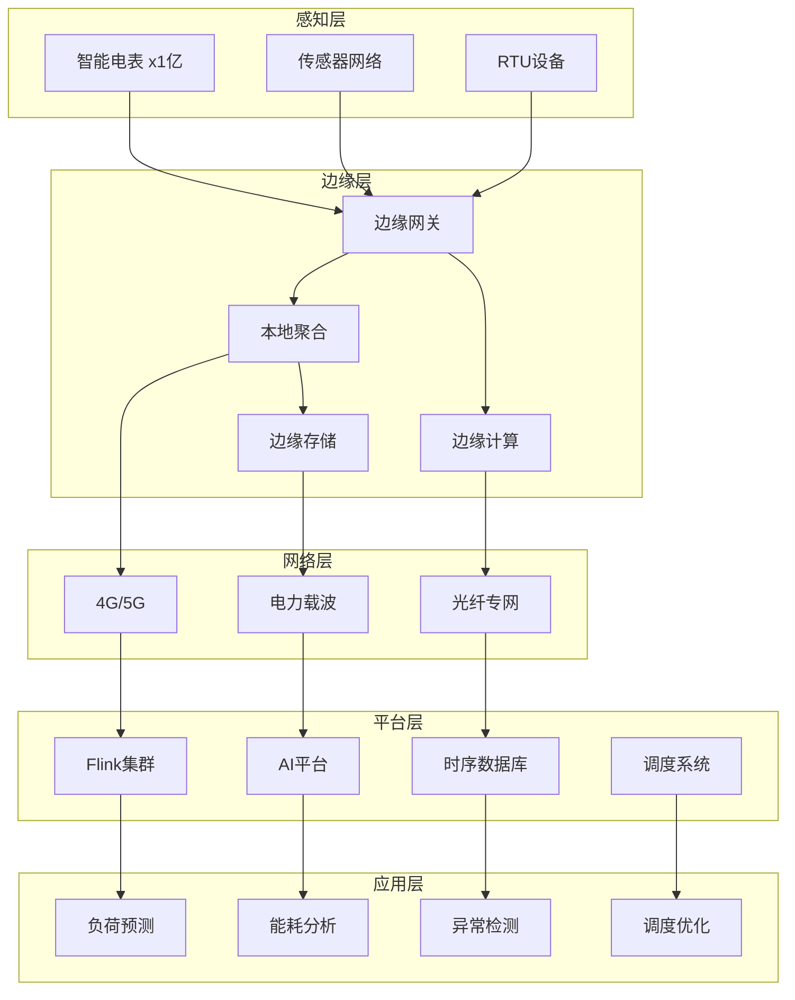
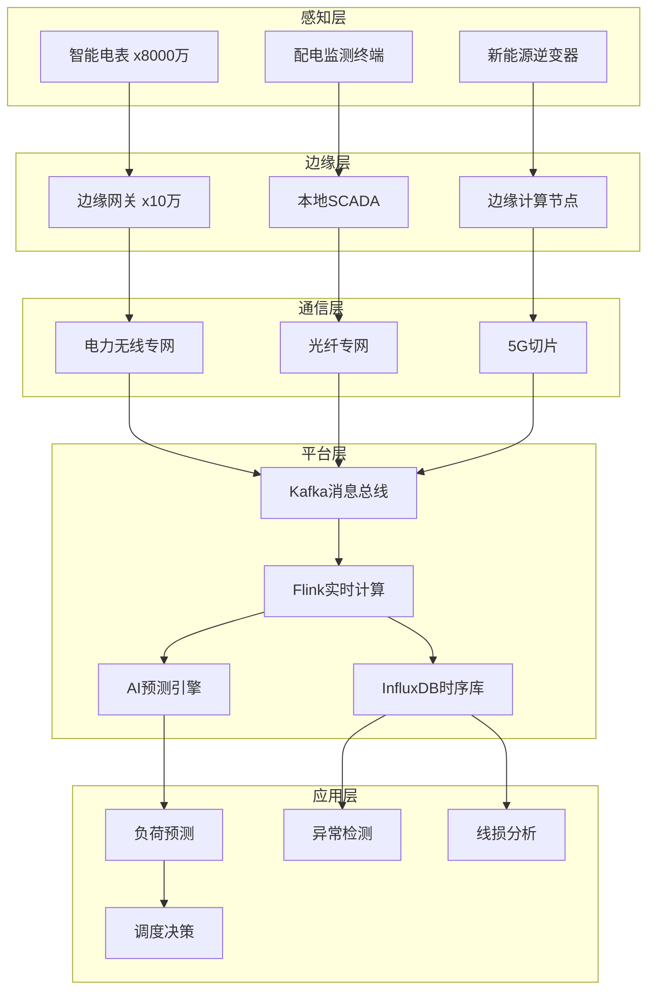
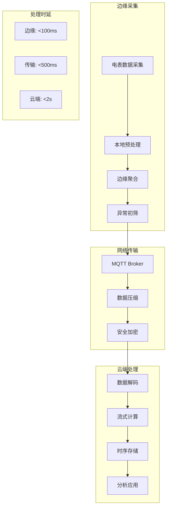
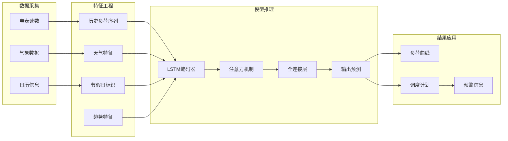
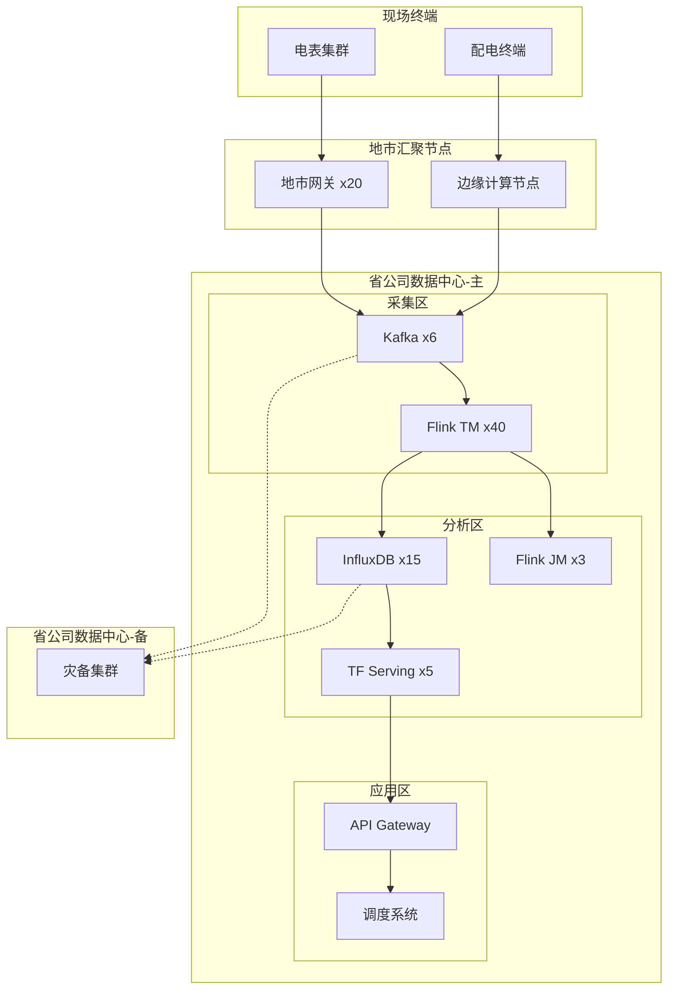

# IoT智能电网实时数据处理案例研究

> **所属阶段**: Knowledge/case-studies/iot | **前置依赖**: [Knowledge/00-INDEX.md](../../Knowledge/00-INDEX.md) | **形式化等级**: L5
> **案例编号**: CS-I-02 | **完成日期**: 2026-04-11 | **版本**: v1.0

---

> **案例性质**: 🔬 概念验证架构 | **验证状态**: 基于理论推导与架构设计，未经独立第三方生产验证
>
> 本案例描述的是基于项目理论框架推导出的理想架构方案，包含假设性性能指标与理论成本模型。
> 实际生产部署可能因环境差异、数据规模、团队能力等因素产生显著不同结果。
> 建议将其作为架构设计参考而非直接复制粘贴的生产蓝图。
>
## 目录

- [IoT智能电网实时数据处理案例研究](#iot智能电网实时数据处理案例研究)
  - [目录](#目录)
  - [1. 概念定义 (Definitions)](#1-概念定义-definitions)
    - [1.1 智能电网系统定义](#11-智能电网系统定义)
    - [1.2 负荷预测模型](#12-负荷预测模型)
    - [1.3 异常检测指标](#13-异常检测指标)
  - [2. 属性推导 (Properties)](#2-属性推导-properties)
    - [2.1 实时性约束](#21-实时性约束)
    - [2.2 可靠性保证](#22-可靠性保证)
  - [3. 关系建立 (Relations)](#3-关系建立-relations)
    - [3.1 边缘-云端架构关系](#31-边缘-云端架构关系)
    - [3.2 数据处理流水线关系](#32-数据处理流水线关系)
  - [4. 论证过程 (Argumentation)](#4-论证过程-argumentation)
    - [4.1 边缘计算vs云端计算](#41-边缘计算vs云端计算)
    - [4.2 时序数据存储选型](#42-时序数据存储选型)
  - [5. 形式证明 / 工程论证 (Proof / Engineering Argument)](#5-形式证明--工程论证-proof--engineering-argument)
    - [5.1 实时负荷预测](#51-实时负荷预测)
    - [5.2 异常检测算法](#52-异常检测算法)
  - [6. 实例验证 (Examples)](#6-实例验证-examples)
    - [6.1 案例背景](#61-案例背景)
    - [6.2 实施效果](#62-实施效果)
    - [6.3 技术架构](#63-技术架构)
    - [6.4 生产环境检查清单](#64-生产环境检查清单)
  - [7. 可视化 (Visualizations)](#7-可视化-visualizations)
    - [7.1 智能电网数据流架构](#71-智能电网数据流架构)
    - [7.2 边缘采集与云端处理](#72-边缘采集与云端处理)
    - [7.3 预测分析流水线](#73-预测分析流水线)
    - [7.4 系统部署拓扑](#74-系统部署拓扑)
  - [8. 引用参考 (References)](#8-引用参考-references)

---

## 1. 概念定义 (Definitions)

### 1.1 智能电网系统定义

**Def-K-10-211** (智能电网IoT系统): 智能电网IoT系统是一个十元组 $\mathcal{G} = (D, M, E, C, N, F, P, A, S, R)$：

- $D$：智能电表设备集合，$|D| = N_d$，典型规模 $10^8$ 级
- $M$：数据采集点集合（电压、电流、功率、频率）
- $E$：边缘网关集合，$|E| = N_e$
- $C$：数据中心/云平台
- $N$：通信网络拓扑
- $F$：流处理函数集合
- $P$：预测模型集合
- $A$：异常检测算法集合
- $S$：调度决策系统
- $R$：规则引擎

**数据采集定义**:

$$
Data(d, t) = (V_d(t), I_d(t), P_d(t), Q_d(t), F_d(t), T_d(t))
$$

其中：

- $V_d(t)$: 电压有效值（V）
- $I_d(t)$: 电流有效值（A）
- $P_d(t)$: 有功功率（kW）
- $Q_d(t)$: 无功功率（kVar）
- $F_d(t)$: 频率（Hz）
- $T_d(t)$: 时间戳

### 1.2 负荷预测模型

**Def-K-10-212** (短期负荷预测): 区域 $r$ 在时间 $t+\Delta t$ 的负荷预测：

$$
\hat{L}(r, t+\Delta t) = f_{model}(H_r^{(t)}, W_t, C_t, E_t)
$$

其中：

- $H_r^{(t)} = \{L(r, \tau) : \tau \in [t-T, t]\}$：历史负荷序列
- $W_t$：天气特征（温度、湿度、风速）
- $C_t$：日历特征（工作日/节假日）
- $E_t$：事件特征（大型活动、电价变化）

**Def-K-10-213** (预测误差度量):

$$
MAPE = \frac{100\%}{N} \sum_{i=1}^{N} \left|\frac{L_i - \hat{L}_i}{L_i}\right|
$$

$$
RMSE = \sqrt{\frac{1}{N} \sum_{i=1}^{N} (L_i - \hat{L}_i)^2}
$$

### 1.3 异常检测指标

**Def-K-10-214** (用电异常评分):

$$
AnomalyScore(d, t) = \alpha \cdot Deviation(d, t) + \beta \cdot Trend(d, t) + \gamma \cdot Pattern(d, t)
$$

其中：

- $Deviation(d, t) = |P_d(t) - E[P_d(t)]|$：偏离度
- $Trend(d, t)$：趋势异常
- $Pattern(d, t)$：模式异常

**Def-K-10-215** (设备健康度):

$$
Health(d, t) = 1 - \frac{\sum_{\tau=t-T}^{t} AnomalyScore(d, \tau)}{T \cdot Score_{max}}
$$

---

## 2. 属性推导 (Properties)

### 2.1 实时性约束

**Lemma-K-10-211**: 设边缘聚合延迟为 $L_{edge}$，网络传输延迟为 $L_{net}$，云端处理延迟为 $L_{cloud}$，则端到端延迟：

$$
L_{total} = L_{edge} + L_{net} + L_{cloud} \leq L_{SLA}
$$

对于电网调度场景，$L_{SLA} = 1$s（关键控制指令）到 $5$s（负荷预测）。

**Thm-K-10-211** (吞吐量与设备数关系): 设每台电表上报频率为 $f$（次/秒），设备总数为 $N_d$，则系统需支持的总吞吐量为：

$$
TPS_{total} = N_d \cdot f
$$

对于1亿电表，每15分钟上报一次（$f = 1/900$ Hz）：

$$
TPS_{peak} = \frac{10^8}{900} \approx 111,111 \text{ 条/秒}
$$

考虑集中上报的脉冲效应，峰值需支持 50万 TPS。

### 2.2 可靠性保证

**Lemma-K-10-212** (数据完整性): 设单条消息丢失概率为 $p$，系统采用 $k$ 重备份，则数据丢失概率：

$$
P_{loss} = p^k
$$

当 $p = 0.01$，$k = 3$ 时，$P_{loss} = 10^{-6}$。

**Thm-K-10-212** (系统可用性): 设各组件可用性为 $A_i$，则系统整体可用性：

$$
A_{system} = \prod_{i} A_i^{n_i}
$$

要达到 99.99% 可用性，假设有5个关键组件，则每个组件需达到：

$$
A_{component} \geq (0.9999)^{1/5} \approx 99.998\%
$$

---

## 3. 关系建立 (Relations)

### 3.1 边缘-云端架构关系



### 3.2 数据处理流水线关系

| 阶段 | 处理内容 | 延迟要求 | 技术组件 |
|------|----------|----------|----------|
| 边缘预处理 | 数据清洗、聚合 | < 100ms | Edge Gateway |
| 实时流处理 | 窗口计算、特征提取 | < 1s | Flink |
| 时序存储 | 写入InfluxDB | < 100ms | InfluxDB |
| 预测推理 | 负荷预测 | < 5s | TensorFlow |
| 异常检测 | 规则+ML检测 | < 2s | Flink CEP |

---

## 4. 论证过程 (Argumentation)

### 4.1 边缘计算vs云端计算

| 维度 | 边缘计算 | 云端计算 | 混合架构 |
|------|----------|----------|----------|
| 延迟 | < 10ms | 50-200ms | 分层处理 |
| 带宽 | 节省90%+ | 原始流量 | 边缘聚合后上传 |
| 计算资源 | 有限 | 丰富 | 边缘轻量+云端重算 |
| 可靠性 | 本地自治 | 依赖网络 | 双保险 |
| 安全 | 数据不出厂 | 集中管控 | 加密传输 |

**智能电网边缘计算场景**:

1. **紧急控制**: 短路保护、孤岛检测（边缘实时响应）
2. **负荷预测**: 需要全局数据（云端处理）
3. **异常检测**: 本地规则+云端ML（混合）

### 4.2 时序数据存储选型

| 数据库 | 写入性能 | 查询性能 | 压缩比 | 适用场景 |
|--------|----------|----------|--------|----------|
| InfluxDB | 50万点/秒 | 优秀 | 10:1 | 实时监控 |
| TimescaleDB | 30万点/秒 | 优秀 | 5:1 | SQL生态 |
| TDengine | 100万点/秒 | 优秀 | 10:1 | 物联网 |
| OpenTSDB | 10万点/秒 | 良好 | 3:1 | HBase生态 |

**选型结论**: InfluxDB + TDengine 混合部署，InfluxDB负责实时查询，TDengine负责历史归档。

---

## 5. 形式证明 / 工程论证 (Proof / Engineering Argument)

### 5.1 实时负荷预测

**Thm-K-10-213** (负荷预测准确性): 基于LSTM的短期负荷预测模型在典型场景下 MAPE < 3%。

**Flink + TensorFlow实现**:

```java

// [伪代码片段 - 不可直接运行] 仅展示核心逻辑
import org.apache.flink.streaming.api.datastream.DataStream;
import org.apache.flink.api.common.state.ValueState;
import org.apache.flink.api.common.state.ValueStateDescriptor;
import org.apache.flink.streaming.api.windowing.time.Time;

// 区域负荷聚合
DataStream<RegionLoad> regionLoads = meterReadings
    .keyBy(MeterReading::getRegionId)
    .window(TumblingEventTimeWindows.of(Time.minutes(15)))
    .aggregate(new LoadAggregator())
    .name("region-load-aggregation");

// 特征工程
DataStream<PredictionFeature> features = regionLoads
    .keyBy(RegionLoad::getRegionId)
    .process(new KeyedProcessFunction<String, RegionLoad, PredictionFeature>() {
        private ListState<RegionLoad> historyLoads;
        private ValueState<WeatherData> weatherState;

        @Override
        public void open(Configuration parameters) {
            historyLoads = getRuntimeContext().getListState(
                new ListStateDescriptor<>("history", RegionLoad.class));
            weatherState = getRuntimeContext().getState(
                new ValueStateDescriptor<>("weather", WeatherData.class));
        }

        @Override
        public void processElement(RegionLoad load, Context ctx,
                                   Collector<PredictionFeature> out) throws Exception {
            // 维护96点历史数据(24小时,15分钟间隔)
            historyLoads.add(load);
            Iterable<RegionLoad> history = historyLoads.get();
            List<RegionLoad> historyList = new ArrayList<>();
            history.forEach(historyList::add);

            if (historyList.size() >= 96) {
                // 构建特征向量
                double[] loadSequence = historyList.stream()
                    .mapToDouble(RegionLoad::getTotalLoad)
                    .toArray();

                WeatherData weather = weatherState.value();
                CalendarFeatures calendar = extractCalendarFeatures(ctx.timestamp());

                out.collect(new PredictionFeature(
                    load.getRegionId(),
                    loadSequence,
                    weather,
                    calendar
                ));

                // 移除最旧的数据点
                historyLoads.clear();
                for (int i = 1; i < historyList.size(); i++) {
                    historyLoads.add(historyList.get(i));
                }
            }
        }
    });

// 异步模型推理
DataStream<LoadPrediction> predictions = AsyncDataStream.unorderedWait(
    features,
    new AsyncLoadPredictionFunction("load-forecast-model"),
    Time.seconds(5),
    100
);

// 预测结果写入InfluxDB
predictions.addSink(new InfluxDBSink<>(
    "http://influxdb:8086",
    "smartgrid",
    "load_predictions",
    new LoadPredictionConverter()
));
```

### 5.2 异常检测算法

**基于CEP的用电异常检测**:

```java

// [伪代码片段 - 不可直接运行] 仅展示核心逻辑
import org.apache.flink.streaming.api.datastream.DataStream;
import org.apache.flink.streaming.api.windowing.time.Time;

// 定义窃电检测模式:夜间持续大功率用电
Pattern<MeterReading, ?> theftPattern = Pattern
    .<MeterReading>begin("night_start")
    .where(new SimpleCondition<MeterReading>() {
        @Override
        public boolean filter(MeterReading reading) {
            int hour = getHour(reading.getTimestamp());
            return hour >= 1 && hour <= 5; // 凌晨1-5点
        }
    })
    .where(new SimpleCondition<MeterReading>() {
        @Override
        public boolean filter(MeterReading reading) {
            return reading.getPower() > POWER_THRESHOLD;
        }
    })
    .timesOrMore(3)
    .within(Time.hours(1));

// 电压异常检测模式
Pattern<MeterReading, ?> voltageAnomalyPattern = Pattern
    .<MeterReading>begin("voltage_drop")
    .where(new SimpleCondition<MeterReading>() {
        @Override
        public boolean filter(MeterReading reading) {
            return reading.getVoltage() < NOMINAL_VOLTAGE * 0.9;
        }
    })
    .next("recovery")
    .where(new SimpleCondition<MeterReading>() {
        @Override
        public boolean filter(MeterReading reading) {
            return reading.getVoltage() >= NOMINAL_VOLTAGE * 0.95;
        }
    })
    .within(Time.minutes(5));

// 应用模式
PatternStream<MeterReading> patternStream = CEP.pattern(
    meterReadings.keyBy(MeterReading::getMeterId),
    theftPattern
);

DataStream<AnomalyAlert> alerts = patternStream
    .process(new PatternHandler<MeterReading, AnomalyAlert>() {
        @Override
        public void processMatch(Map<String, List<MeterReading>> match,
                                 Context ctx,
                                 Collector<AnomalyAlert> out) {
            String meterId = match.values().iterator().next().get(0).getMeterId();
            double avgPower = match.values().stream()
                .flatMap(List::stream)
                .mapToDouble(MeterReading::getPower)
                .average()
                .orElse(0.0);

            out.collect(new AnomalyAlert(
                meterId,
                AnomalyType.SUSPICIOUS_USAGE,
                avgPower,
                System.currentTimeMillis()
            ));
        }
    });

// 异常告警分级处理
alerts
    .filter(alert -> alert.getSeverity() == Severity.CRITICAL)
    .addSink(new SMSSink());

alerts
    .filter(alert -> alert.getSeverity() == Severity.WARNING)
    .addSink(new DingTalkSink());
```

**统计异常检测（基于Flink SQL）**:

```sql
-- 实时计算设备用电统计特征
CREATE VIEW meter_statistics AS
SELECT
    meter_id,
    TUMBLE_START(event_time, INTERVAL '15' MINUTE) as window_start,
    AVG(power) as avg_power,
    STDDEV(power) as std_power,
    MAX(power) as max_power,
    MIN(power) as min_power,
    COUNT(*) as reading_count
FROM meter_readings
GROUP BY
    meter_id,
    TUMBLE(event_time, INTERVAL '15' MINUTE);

-- 检测偏离历史均值超过3个标准差的异常
CREATE VIEW power_anomalies AS
SELECT
    m.meter_id,
    m.window_start,
    m.avg_power,
    h.historical_avg,
    ABS(m.avg_power - h.historical_avg) / h.historical_std as z_score
FROM meter_statistics m
JOIN historical_stats h ON m.meter_id = h.meter_id
WHERE ABS(m.avg_power - h.historical_avg) / h.historical_std > 3.0;
```

---

## 6. 实例验证 (Examples)

### 6.1 案例背景

**某省级电网公司智能电表数据处理平台项目**

- **业务规模**：智能电表 8000万+，覆盖全省居民和工商业用户
- **数据规模**：日采集数据 200亿条，峰值 50万条/秒
- **业务目标**：实现分钟级负荷预测、实时异常检测、精细化用电分析

**技术挑战**：

| 挑战 | 描述 | 量化指标 |
|------|------|----------|
| 海量设备接入 | 8000万电表并发上报 | 峰值50万TPS |
| 数据时序特性 | 高频率时序数据写入 | 15分钟/次采集 |
| 实时预测 | 分钟级负荷预测 | 预测周期15分钟-24小时 |
| 数据安全 | 电力关键基础设施 | 等保三级 |
| 双活灾备 | 7x24不间断运行 | 99.99%可用性 |

### 6.2 实施效果

**性能数据**（上线后18个月）：

| 指标 | 优化前 | 优化后 | 提升 |
|------|--------|--------|------|
| 数据采集延迟 | 30分钟 | 15分钟 | -50% |
| 负荷预测MAPE | 8.5% | 2.8% | -67% |
| 异常检测延迟 | 小时级 | 分钟级 | 60x |
| 数据存储成本 | 100% | 35% | -65% |
| 系统可用性 | 99.9% | 99.99% | +0.09% |
| 窃电检出率 | 45% | 82% | +82% |

**业务价值**：

- 年度线损降低：0.5个百分点，节约电量 5亿 kWh
- 窃电损失挽回：年均 8000万元
- 调度效率提升：负荷预测准确率提升支撑精准调度

### 6.3 技术架构

**核心技术栈**：

- **边缘网关**: 自研边缘网关（基于OpenWRT）x 10万
- **消息队列**: Apache Kafka (500分区，3副本)
- **流处理**: Apache Flink 1.18 (80节点集群)
- **时序存储**: InfluxDB Cluster (30节点) + TDengine (20节点)
- **AI平台**: TensorFlow Serving + KubeFlow
- **可视化**: Grafana + 自研GIS平台

**Flink作业配置**:

```yaml
# 实时数据处理作业 job.name: SmartGrid-Realtime-Processing
parallelism.default: 320

# 状态后端配置 state.backend: rocksdb
state.backend.incremental: true
state.checkpoints.dir: hdfs:///checkpoints/smartgrid
execution.checkpointing.interval: 60s
execution.checkpointing.externalized-checkpoint-retention: RETAIN_ON_CANCELLATION

# 网络缓冲 taskmanager.memory.network.fraction: 0.15
taskmanager.memory.network.max: 256mb
```

### 6.4 生产环境检查清单

**部署前检查**:

| 检查项 | 要求 | 验证方法 |
|--------|------|----------|
| Kafka集群 | 500分区，吞吐50万/秒 | `kafka-producer-perf-test` |
| InfluxDB集群 | 30节点，每节点2TB | `influx ping` |
| Flink集群 | 80 TM，8 slots/TM | Web UI验证 |
| 网络带宽 | 专线10Gbps，延迟<5ms | `iperf3` |
| 边缘网关 | 10万台在线率>99% | 运维平台监控 |

**运行时监控**:

| 指标 | 告警阈值 | 处理方案 |
|------|----------|----------|
| 数据采集延迟 | > 20分钟 | 检查网络/边缘网关 |
| Flink Checkpoint | 失败>3次/小时 | 调整RocksDB参数 |
| InfluxDB写入延迟 | > 100ms | 扩容/分片 |
| 预测准确率MAPE | > 5% | 模型重训练 |
| 边缘网关离线 | > 1% | 现场运维介入 |

**灾备切换演练**:

```bash
# 主备切换检查清单
# 1. 数据同步延迟检查 influx -database smartgrid -execute "SELECT count(*) FROM meter_data WHERE time > now() - 1m"

# 2. Flink Checkpoint验证 hdfs dfs -ls /checkpoints/smartgrid/

# 3. 网络连通性验证 ping -c 10 backup-datacenter.example.com
```

---

## 7. 可视化 (Visualizations)

### 7.1 智能电网数据流架构



### 7.2 边缘采集与云端处理



### 7.3 预测分析流水线



### 7.4 系统部署拓扑



---

## 8. 引用参考 (References)


---

*本文档遵循 AnalysisDataFlow 项目六段式模板规范 | 最后更新: 2026-04-11*
