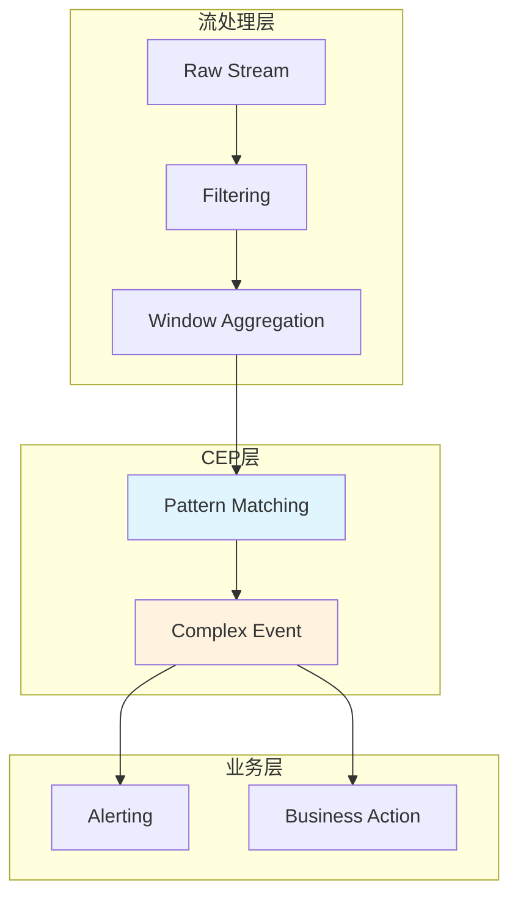
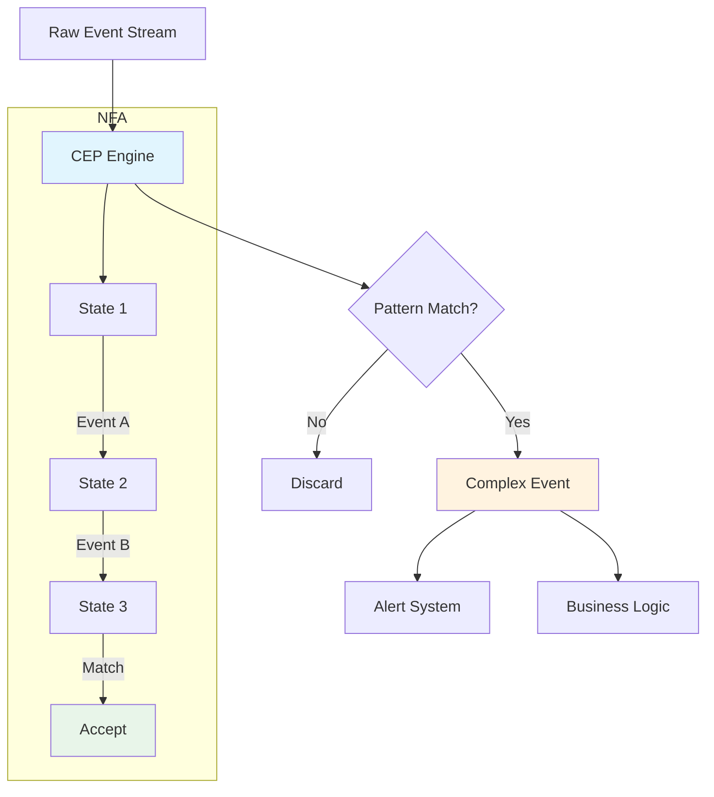
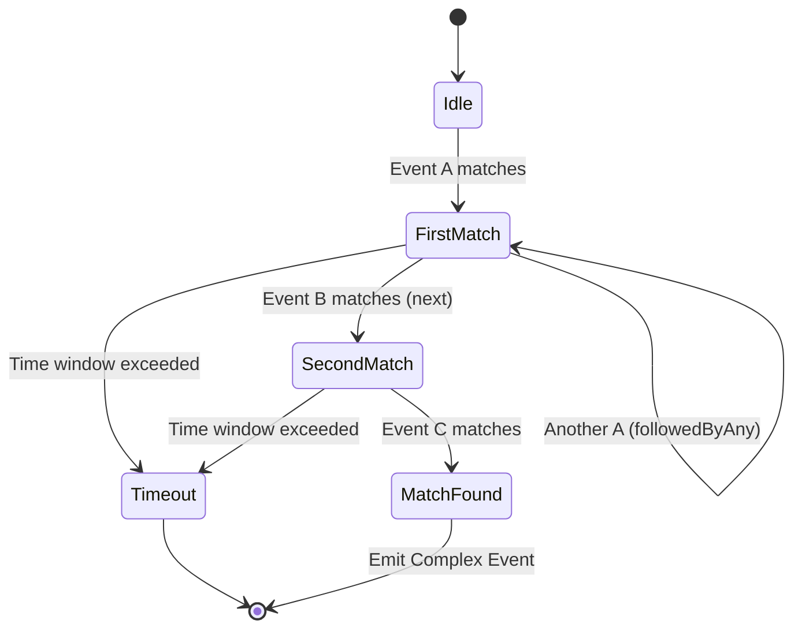
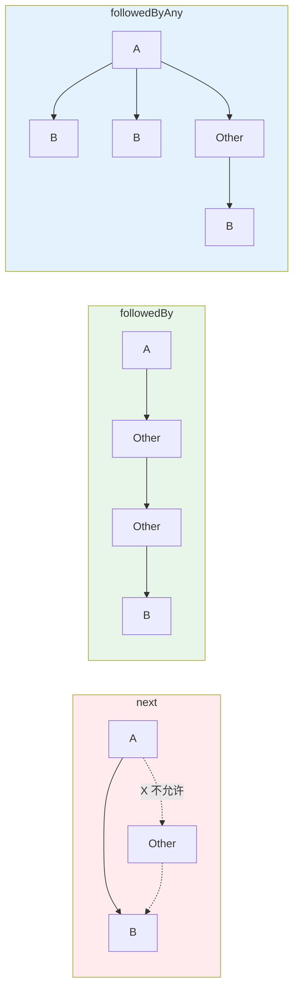

# CEP (Complex Event Processing) 完整教程

> 所属阶段: Knowledge | 前置依赖: [Flink/time-semantics-and-watermark.md](../Flink/02-core/time-semantics-and-watermark.md) | 形式化等级: L4

---

## 1. 概念定义 (Definitions)

### Def-K-CEP-01: 复杂事件处理 (CEP)

**定义**: CEP 是一种从事件流中检测复杂模式的技术，通过识别低层事件关联关系，推导出更高层次的业务事件。

$$
\text{CEP} = (E, P, M, A)
$$

其中：

- $E$: 事件流 $E = \{e_1, e_2, ..., e_n\}$
- $P$: 模式定义 $P = (S, C, T)$
  - $S$: 结构约束（事件序列顺序）
  - $C$: 属性条件（事件内容匹配）
  - $T$: 时间约束（窗口限制）
- $M$: 匹配函数 $M: E \times P \rightarrow \{0, 1\}$
- $A$: 动作（匹配后的处理逻辑）

**核心能力**：

```
低层事件 → [CEP引擎] → 复杂模式识别 → 高层业务事件
├── 登录事件         ├── 异常登录序列      └── 账户被盗告警
├── 交易事件         ├── 欺诈交易模式      └── 欺诈交易告警
└── 设备事件         └── 设备故障序列      └── 设备故障预测
```

### Def-K-CEP-02: 模式 (Pattern)

**定义**: 模式是对目标事件序列的抽象描述：

$$
\text{Pattern} = (N, R, C, T)
$$

其中：

- $N$: 模式阶段名称集合
- $R$: 连续性策略
- $C$: 个体事件条件
- $T$: 全局时间窗口

**模式类型层次**：

| 类型 | 符号 | 示例 |
|------|------|------|
| 单事件 | $A$ | `temperature > 100` |
| 序列 | $A \rightarrow B$ | `登录 → 支付` |
| 循环 | $A\{n,m\}$ | `失败登录尝试{3,5}` |
| 否定 | $A \rightarrow !B \rightarrow C$ | `开始 → 无取消 → 完成` |
| 组合 | $(A \rightarrow B) \text{ OR } (C \rightarrow D)$ | 多路径模式 |

### Def-K-CEP-03: 连续性策略

**定义**: 定义事件序列中相邻事件的允许间隔：

| 策略 | 符号 | 语义描述 |
|------|------|----------|
| **严格连续** | $\xrightarrow{\text{next}}$ | 事件必须紧邻，中间不能有任何事件 |
| **宽松连续** | $\xrightarrow{\text{followedBy}}$ | 事件按顺序，中间可有其他事件 |
| **非确定性宽松** | $\xrightarrow{\text{followedByAny}}$ | 每个事件可匹配多个后续 |
| **紧邻否定** | $\xrightarrow{\text{notNext}}$ | 紧邻不能有某事件 |
| **宽松否定** | $\xrightarrow{\text{notFollowedBy}}$ | 后续不能有某事件 |

---

## 2. 属性推导 (Properties)

### Lemma-K-CEP-01: 模式匹配完备性

**引理**: 给定模式 $P$ 和事件流 $E$，CEP 引擎可找到所有满足 $P$ 的事件子序列。

**证明概要**：

1. 使用 NFA（非确定性有限自动机）建模模式
2. 每个事件驱动状态转换
3. 到达接受状态时输出匹配
4. 回溯机制保证不遗漏任何可能匹配

### Lemma-K-CEP-02: 时间窗口约束

**引理**: 时间窗口 $T$ 限制了模式匹配的时间跨度：

$$
\text{Match}(S, P) \Rightarrow t_{last} - t_{first} \leq T_{window}
$$

**超时处理**：

- 部分匹配在窗口超时时被丢弃
- 超时事件可触发超时告警（通过 `within` 和 `timeout` 标签）

### Prop-K-CEP-01: 状态空间复杂度

**命题**: 模式匹配的状态空间与模式长度和事件类型数成线性关系。

$$
\text{Space} = O(|P| \times |E_{types}|)
$$

其中：

- $|P|$: 模式阶段数
- $|E_{types}|$: 事件类型数

---

## 3. 关系建立 (Relations)

### 3.1 CEP 与正则表达式关系

| 正则表达式 | CEP 模式 | 语义 |
|-----------|----------|------|
| `a*` | `A.oneOrMore()` | A 出现一次或多次 |
| `a?` | `A.optional()` | A 出现零次或一次 |
| `a{n,m}` | `A.times(n, m)` | A 出现 n 到 m 次 |
| `a\|b` | `A.or(B)` | A 或 B |
| `ab` | `A.next(B)` | A 后紧跟 B |
| `a.*b` | `A.followedBy(B)` | A 后在任意事件后出现 B |

### 3.2 CEP 与 SQL 模式识别对比

| 特性 | Flink CEP | SQL MATCH_RECOGNIZE |
|------|-----------|---------------------|
| 表达能力 | 强（图灵完备） | 中等（正则类） |
| 使用方式 | Java API | SQL 声明式 |
| 窗口处理 | 显式 | 隐式 PARTITION BY |
| 动作定义 | 灵活 | SELECT 投影 |
| 适用场景 | 复杂业务逻辑 | 简单模式识别 |

### 3.3 CEP 与流处理关系



---

## 4. 论证过程 (Argumentation)

### 4.1 连续性策略选择

**决策矩阵**：

| 策略 | 优点 | 缺点 | 适用场景 |
|------|------|------|----------|
| next | 精确匹配，性能高 | 容易漏匹配 | 严格顺序要求 |
| followedBy | 灵活，容错性高 | 可能匹配过多 | 一般业务流程 |
| followedByAny | 捕获所有可能 | 状态爆炸风险 | 需要全部匹配 |

### 4.2 时间窗口设计

**窗口大小权衡**：

| 窗口大小 | 优点 | 缺点 |
|----------|------|------|
| 小（秒级） | 低延迟，少误报 | 可能漏慢速攻击 |
| 中（分钟级） | 平衡 | 中等状态开销 |
| 大（小时级） | 捕获长期模式 | 高状态开销，延迟高 |

---

## 5. 形式证明 / 工程论证 (Proof / Engineering Argument)

### Thm-K-CEP-01: NFA 模式匹配正确性

**定理**: 基于 NFA 的 CEP 实现可正确识别所有满足模式的事件序列。

**证明概要**：

1. **模式到 NFA**: 每个模式阶段对应 NFA 状态
2. **事件驱动**: 每个事件触发状态转换
3. **接受状态**: 到达接受状态时输出匹配
4. **完备性**: NFA 的 $\epsilon$-转移和回溯保证不遗漏匹配

### Thm-K-CEP-02: Checkpoint 恢复一致性

**定理**: 在 Exactly-Once 语义下，CEP 状态恢复后模式匹配结果与故障前一致。

**证明**：

1. CEP 状态包括：待匹配的部分序列、NFA 状态
2. Checkpoint 时持久化完整状态
3. 恢复时从 Checkpoint 状态继续
4. 已处理的事件不会重放（Flink 保证）
5. 因此匹配结果一致

---

## 6. 实例验证 (Examples)

### 6.1 Maven 依赖

```xml
<dependency>
    <groupId>org.apache.flink</groupId>
    <artifactId>flink-cep</artifactId>
    <version>1.17.0</version>
</dependency>
```

### 6.2 欺诈检测模式示例

```java
// [伪代码片段 - 不可直接运行] 仅展示核心逻辑
import org.apache.flink.cep.Pattern;
import org.apache.flink.cep.CEP;
import org.apache.flink.cep.pattern.conditions.SimpleCondition;

import org.apache.flink.streaming.api.datastream.DataStream;
import org.apache.flink.streaming.api.windowing.time.Time;


// 定义欺诈检测模式:小额测试后大额交易
Pattern<Transaction, ?> fraudPattern = Pattern
    .<Transaction>begin("small-amount")
    .where(new SimpleCondition<Transaction>() {
        @Override
        public boolean filter(Transaction tx) {
            return tx.getAmount() < 10.0;  // 小额测试
        }
    })
    .followedBy("large-amount")
    .where(new SimpleCondition<Transaction>() {
        @Override
        public boolean filter(Transaction tx) {
            return tx.getAmount() > 1000.0;  // 大额交易
        }
    })
    // 同一用户,10分钟内
    .where(new SimpleCondition<Transaction>() {
        @Override
        public boolean filter(Transaction tx) {
            return tx.getUserId().equals(
                ctx.getEventsForPattern("small-amount")
                   .get(0).getUserId()
            );
        }
    })
    .within(Time.minutes(10));

// 应用到流
DataStream<Transaction> txStream = ...;
PatternStream<Transaction> patternStream = CEP.pattern(txStream, fraudPattern);

// 处理匹配结果
DataStream<Alert> alerts = patternStream
    .select(new PatternSelectFunction<Transaction, Alert>() {
        @Override
        public Alert select(Map<String, List<Transaction>> pattern) {
            Transaction small = pattern.get("small-amount").get(0);
            Transaction large = pattern.get("large-amount").get(0);
            return new Alert(small.getUserId(), "FRAUD_PATTERN",
                "Small: " + small.getAmount() + ", Large: " + large.getAmount());
        }
    });
```

### 6.3 异常登录检测模式

```java

// [伪代码片段 - 不可直接运行] 仅展示核心逻辑
import org.apache.flink.streaming.api.windowing.time.Time;

// 3分钟内 5 次失败登录后 1 次成功登录
Pattern<LoginEvent, ?> suspiciousLogin = Pattern
    .<LoginEvent>begin("failed-logins")
    .where(new SimpleCondition<LoginEvent>() {
        @Override
        public boolean filter(LoginEvent event) {
            return !event.isSuccess();
        }
    })
    .timesOrMore(5)
    .greedy()
    .followedBy("success-login")
    .where(new SimpleCondition<LoginEvent>() {
        @Override
        public boolean filter(LoginEvent event) {
            return event.isSuccess();
        }
    })
    .within(Time.minutes(3));

// 处理超时(未出现成功登录)
patternStream
    .process(new PatternProcessFunction<LoginEvent, Alert>() {
        @Override
        public void processMatch(Map<String, List<LoginEvent>> match,
                                 Context ctx, Collector<Alert> out) {
            // 处理匹配
        }

        @Override
        public void processTimedOutMatch(Map<String, List<LoginEvent>> match,
                                         Context ctx, Collector<Alert> out) {
            // 超时处理:多次失败登录但未成功
            out.collect(new Alert(match.get("failed-logins").get(0).getUserId(),
                "BRUTE_FORCE_ATTEMPT", "Multiple failed logins without success"));
        }
    });
```

### 6.4 设备故障预测模式

```java

// [伪代码片段 - 不可直接运行] 仅展示核心逻辑
import org.apache.flink.streaming.api.windowing.time.Time;

// 温度持续上升趋势后超过阈值
Pattern<SensorReading, ?> overheatingPattern = Pattern
    .<SensorReading>begin("first")
    .where(new SimpleCondition<SensorReading>() {
        @Override
        public boolean filter(SensorReading reading) {
            return reading.getTemperature() > 80;
        }
    })
    .next("second")
    .where(new IterativeCondition<SensorReading>() {
        @Override
        public boolean filter(SensorReading reading, Context<SensorReading> ctx) {
            double firstTemp = ctx.getEventsForPattern("first")
                .get(0).getTemperature();
            return reading.getTemperature() > firstTemp + 5;
        }
    })
    .next("third")
    .where(new IterativeCondition<SensorReading>() {
        @Override
        public boolean filter(SensorReading reading, Context<SensorReading> ctx) {
            double secondTemp = ctx.getEventsForPattern("second")
                .get(0).getTemperature();
            return reading.getTemperature() > secondTemp + 5;
        }
    })
    .within(Time.seconds(30));
```

### 6.5 SQL MATCH_RECOGNIZE 等价写法

```sql
-- 使用 SQL 模式识别(Flink SQL)
SELECT *
FROM transactions
MATCH_RECOGNIZE (
    PARTITION BY user_id
    ORDER BY event_time
    MEASURES
        A.amount AS small_amount,
        B.amount AS large_amount,
        A.event_time AS start_time
    ONE ROW PER MATCH
    PATTERN (A B)
    DEFINE
        A AS amount < 10,
        B AS amount > 1000
) MR;
```

---

## 7. 可视化 (Visualizations)

### 7.1 CEP 架构流程图



### 7.2 模式匹配状态机



### 7.3 连续性策略对比



---

## 8. 引用参考 (References)
