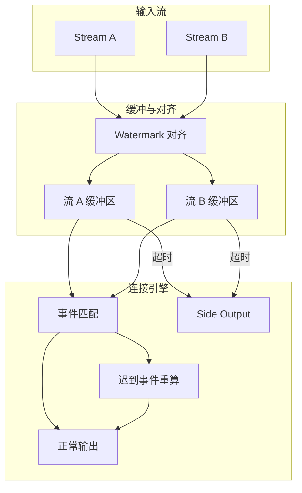
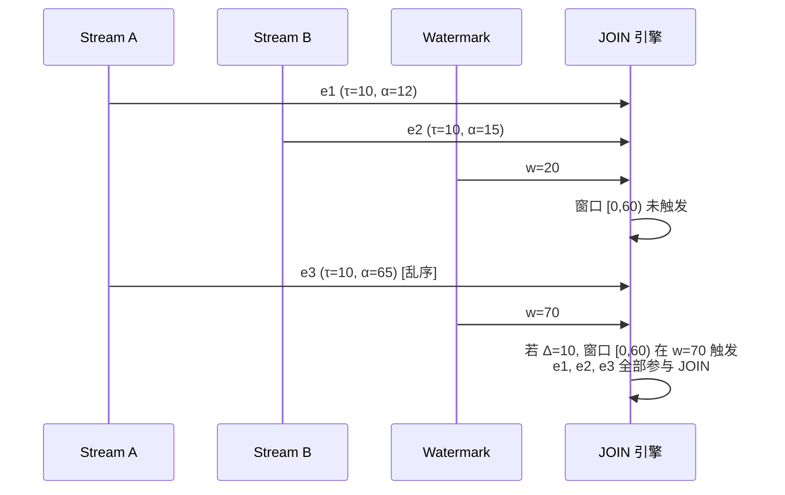

# 乱序数据流的窗口连接优化

> **所属阶段**: Knowledge/ | **前置依赖**: [window-join-reordering.md](../Struct/window-join-reordering.md), [window-algebra-properties.md](../Struct/window-algebra-properties.md) | **形式化等级**: L4

---

## 1. 概念定义 (Definitions)

在分布式流处理中，由于网络延迟、节点间时钟差异和数据源的发送策略，事件往往不会按照其事件时间顺序到达。
这种乱序（Disorder）现象给窗口连接（Window Join）带来了额外的挑战：当一个流中的乱序事件到达时，可能已经错过了与另一个流中对应事件在同一个窗口内连接的机会。
PECJ（SIGMOD 2024）等工作提出了专门针对乱序数据流的窗口连接优化机制，通过延迟窗口触发、增量重计算和缓冲管理来保证连接结果的正确性。

**Def-K-06-375 乱序窗口连接 (Disordered Window Join)**

设流 $A$ 和流 $B$ 的事件时间分别为 $\tau_A$ 和 $\tau_B$，到达时间分别为 $\alpha_A$ 和 $\alpha_B$。乱序窗口连接 $A \bowtie_W^{\Delta} B$ 允许事件在到达时间比事件时间延迟最多 $\Delta$ 的情况下仍参与连接：

$$
A \bowtie_W^{\Delta} B = \{(a, b) : a \in A, b \in B, \tau(a) \in W, \tau(b) \in W, \theta(a, b), \alpha(a) \leq t_W + \Delta, \alpha(b) \leq t_W + \Delta\}
$$

其中 $t_W$ 为窗口 $W$ 的关闭时间，$\Delta \geq 0$ 为乱序容忍度（Allowed Lateness）。

**Def-K-06-376 迟到事件容忍 (Late Arrival Tolerance)**

迟到事件容忍 $\mathcal{T}_{late}$ 定义为系统允许处理的最大事件时间延迟：

$$
\mathcal{T}_{late} = \max_{e \in S} (\alpha(e) - \tau(e))
$$

对于窗口连接，若 $\mathcal{T}_{late} > \Delta$，则部分迟到事件将被丢弃或输出到侧流（Side Output），无法参与正常连接。

**Def-K-06-377 乱序缓冲区 (Disorder Buffer)**

乱序缓冲区 $\mathcal{B}$ 是用于暂存未匹配事件的内存结构。对于每个窗口 $W$，缓冲区保存来自流 $A$ 和流 $B$ 的事件，直到窗口触发条件满足：

$$
\mathcal{B}_W = \{e : e \in A \cup B, \tau(e) \in W, \alpha(e) > t_W\}
$$

缓冲区大小 $|\mathcal{B}_W|$ 直接影响系统的内存消耗和连接延迟。

**Def-K-06-378 窗口触发条件 (Window Trigger Condition)**

乱序窗口连接的窗口触发条件为：

1. **时间条件**: 当前 Watermark $w(t) \geq t_W + \Delta$（即窗口关闭时间加上乱序容忍度）
2. **缓冲区条件**: 缓冲区中来自两个流的事件均已清空或达到最大保留时间

仅当两个条件同时满足时，窗口才被允许触发并输出连接结果。

---

## 2. 属性推导 (Properties)

**Lemma-K-06-141 乱序度的单调性**

设系统的乱序容忍度为 $\Delta$，实际最大乱序度为 $\delta_{max}$。若 $\delta_{max} \leq \Delta$，则所有事件都能被正确连接；若 $\delta_{max} > \Delta$，则存在事件丢失。

*说明*: 这是配置乱序容忍度的核心依据。$\square$

**Lemma-K-06-142 缓冲区大小的期望上界**

设事件到达服从泊松过程，速率为 $\lambda$，乱序容忍度为 $\Delta$。则在任意窗口 $W$ 内，乱序缓冲区的期望大小为：

$$
\mathbb{E}[|\mathcal{B}_W|] \leq \lambda \cdot \Delta \cdot P_{late}
$$

其中 $P_{late}$ 为事件迟到的概率。

*说明*: 增大 $\Delta$ 会线性增加内存压力。$\square$

**Prop-K-06-135 乱序容忍与端到端延迟的权衡**

设窗口大小为 $T$，乱序容忍度为 $\Delta$。则乱序窗口连接的最小端到端延迟为：

$$
L_{min} = T + \Delta
$$

*说明*: 放宽乱序容忍度可以提升结果完整性，但会成比例增加延迟。$\square$

---

## 3. 关系建立 (Relations)

### 3.1 乱序窗口连接与有序窗口连接的对比

| 维度 | 有序窗口连接 | 乱序窗口连接 |
|------|-------------|-------------|
| Watermark 要求 | $w(t) \geq t_W$ | $w(t) \geq t_W + \Delta$ |
| 缓冲区需求 | 无 | 有（与 $\Delta$ 成正比） |
| 结果延迟 | $T$ | $T + \Delta$ |
| 结果完整性 | 可能丢失迟到事件 | 在 $\Delta$ 范围内完整 |
| 重计算需求 | 无 | 迟到事件触发重算 |
| 适用场景 | 低乱序网络 | 广域网、IoT、边缘节点 |

### 3.2 PECJ 的乱序 JOIN 架构



### 3.3 乱序处理策略对比

| 策略 | 机制 | 延迟 | 完整性 | 内存 |
|------|------|------|--------|------|
| **忽略乱序** | Watermark 到达即触发 | 低 | 差 | 低 |
| **固定缓冲** | 等待固定时间 $\Delta$ | 中 | 中 | 中 |
| **动态缓冲** | 基于历史乱序度自适应 | 中 | 好 | 中 |
| **推测执行** | 先输出推测结果，后修正 | 低 | 好* | 高 |

*注：推测执行的"好"是指最终一致性，中间结果可能不一致。*

---

## 4. 论证过程 (Argumentation)

### 4.1 为什么乱序对窗口 JOIN 的影响比单流聚合更严重？

1. **双向依赖**: 单流聚合只需要等待本流的数据到达即可触发；而窗口 JOIN 需要同时等待两个流的数据，乱序概率成倍增加
2. **状态膨胀**: JOIN 需要在缓冲区中保留两个流的事件进行配对。若其中一个流严重乱序，另一个流的事件需要长时间驻留内存
3. **重计算复杂**: 当迟到事件到达并触发重算时，已经输出的 JOIN 结果需要被撤回或覆盖，这在下游系统中往往难以处理
4. **Watermark 推进困难**: 多流 JOIN 的 Watermark 取各流最小值。若一个流延迟推进，会拖慢整个系统的处理进度

### 4.2 PECJ 的核心优化策略

PECJ（Predictive Early Cleaning for Window Joins）提出了三项关键优化：

1. **预测性清理**: 基于历史乱序统计，预测某个窗口中未来迟到的概率。若概率低于阈值，即使 Watermark 未完全推进，也可以提前清理缓冲区
2. **增量重计算**: 对于迟到事件，只重算涉及该事件的窗口分区，避免全局窗口重触发
3. **不对称缓冲**: 允许两个流配置不同的乱序容忍度，避免一个流的慢速数据拖累另一个流

### 4.3 反例：过度缓冲导致的 OOM

某 IoT 流处理系统将窗口 JOIN 的乱序容忍度设置为 30 分钟，以应对边缘设备的不稳定网络。结果：

- 高峰期每秒 100K 事件，30 分钟的缓冲区需要保留 1.8 亿个事件
- TaskManager 的堆内存迅速耗尽，频繁触发 Full GC
- 最终系统 OOM 崩溃，反而没有任何结果能输出

**教训**: 乱序容忍度的设置必须与可用内存资源匹配。对于高乱序场景，应考虑使用外部状态存储（如 RocksDB）而非纯内存缓冲。

---

## 5. 形式证明 / 工程论证 (Proof / Engineering Argument)

**Thm-K-06-147 乱序感知 JOIN 的正确性**

设乱序窗口连接的配置为 $(W, \Delta)$。若对于所有输入事件 $e$，其事件时间与到达时间的差满足 $\alpha(e) - \tau(e) \leq \Delta$，则乱序窗口连接 $A \bowtie_W^{\Delta} B$ 的输出与先将两个流按事件时间排序后再做有序窗口连接的输出完全相同。

*证明*:

有序窗口连接在窗口关闭时刻 $t_W$ 触发，此时所有 $\tau(e) \leq t_W$ 的事件都已处理。乱序窗口连接将触发时间推迟到 $t_W + \Delta$。若所有事件的延迟都不超过 $\Delta$，则在 $t_W + \Delta$ 时刻，所有本应属于窗口 $W$ 的事件都已到达。此时缓冲区中的事件集合与有序情况下的窗口内事件集合相同，连接结果必然相同。$\square$

---

**Thm-K-06-148 缓冲区大小的概率上界**

设事件到达过程为泊松过程（速率 $\lambda$），事件时间延迟 $D$ 服从指数分布（均值 $1/\mu$）。则在时刻 $t$，乱序缓冲区中属于窗口 $W$ 的期望事件数为：

$$
\mathbb{E}[|\mathcal{B}_W(t)|] \leq \frac{\lambda}{\mu} \cdot (1 - e^{-\mu \Delta})
$$

*证明*:

泊松过程中，时间区间 $[t - \Delta, t]$ 内到达的事件数期望为 $\lambda \Delta$。其中，事件时间延迟超过当前窗口关闭时间的概率为 $P(D > \Delta) = e^{-\mu \Delta}$。因此，需要被缓冲的事件比例为 $1 - e^{-\mu \Delta}$。结合 Little's Law，期望缓冲区大小为 $\frac{\lambda}{\mu}(1 - e^{-\mu \Delta})$。$\square$

---

## 6. 实例验证 (Examples)

### 6.1 Flink SQL 中的乱序 JOIN 配置

```sql
-- 使用 Watermark 和 Allowed Lateness 处理乱序 JOIN
CREATE TABLE stream_a (
    id STRING,
    ts TIMESTAMP(3),
    WATERMARK FOR ts AS ts - INTERVAL '5' SECOND
) WITH ('connector' = 'kafka', ...);

CREATE TABLE stream_b (
    id STRING,
    ts TIMESTAMP(3),
    WATERMARK FOR ts AS ts - INTERVAL '10' SECOND
) WITH ('connector' = 'kafka', ...);

-- 窗口 JOIN（Flink 自动取两个 Watermark 的最小值）
SELECT a.id, a.value, b.score
FROM stream_a a
JOIN stream_b b ON a.id = b.id
  AND a.ts BETWEEN b.ts - INTERVAL '1' MINUTE AND b.ts + INTERVAL '1' MINUTE;
```

### 6.2 Python 中的乱序缓冲 JOIN 模拟

```python
from collections import defaultdict
import heapq

class DisorderedWindowJoin:
    def __init__(self, window_size, allowed_lateness):
        self.window_size = window_size
        self.allowed_lateness = allowed_lateness
        self.buffers = defaultdict(lambda: {"A": [], "B": []})
        self.watermark = 0

    def ingest(self, stream, event):
        win_id = event["ts"] // self.window_size
        self.buffers[win_id][stream].append(event)

    def advance_watermark(self, new_watermark):
        self.watermark = new_watermark
        results = []
        expired = []
        for win_id, buf in self.buffers.items():
            trigger_time = (win_id + 1) * self.window_size + self.allowed_lateness
            if self.watermark >= trigger_time:
                # 执行 JOIN
                for a in buf["A"]:
                    for b in buf["B"]:
                        if a["key"] == b["key"]:
                            results.append((a, b))
                expired.append(win_id)
        for win_id in expired:
            del self.buffers[win_id]
        return results

# 示例
joiner = DisorderedWindowJoin(window_size=60, allowed_lateness=30)
joiner.ingest("A", {"key": "x", "ts": 50})
joiner.ingest("B", {"key": "x", "ts": 55})
# 假设 Watermark 推进到 100
results = joiner.advance_watermark(100)
print(f"JOIN 结果: {results}")
```

### 6.3 动态乱序容忍度调整

```python
class AdaptiveLateness:
    def __init__(self, base_delta=10, alpha=0.3):
        self.delta = base_delta
        self.alpha = alpha
        self.history = []

    def update(self, actual_delay):
        self.history.append(actual_delay)
        if len(self.history) > 100:
            self.history.pop(0)
        p99 = sorted(self.history)[int(len(self.history) * 0.99)]
        self.delta = self.alpha * p99 + (1 - self.alpha) * self.delta
        return self.delta
```

---

## 7. 可视化 (Visualizations)

### 7.1 乱序窗口 JOIN 的时间线



### 7.2 乱序容忍度与资源消耗的关系

```mermaid
xychart-beta
    title "乱序容忍度对系统指标的影响"
    x-axis [0s, 5s, 10s, 30s, 60s]
    y-axis "相对值" 0 --> 2.0
    line "端到端延迟" {0.5, 0.7, 1.0, 2.0, 3.5}
    line "内存占用" {0.3, 0.5, 0.8, 1.8, 3.0}
    line "结果完整性" {0.6, 0.85, 0.95, 0.99, 1.0}
```

---

## 8. 引用参考 (References)
