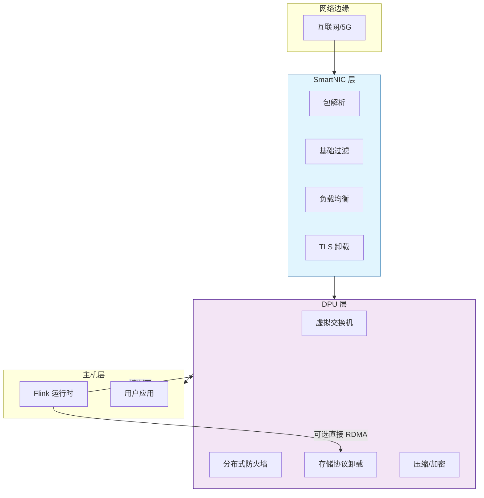
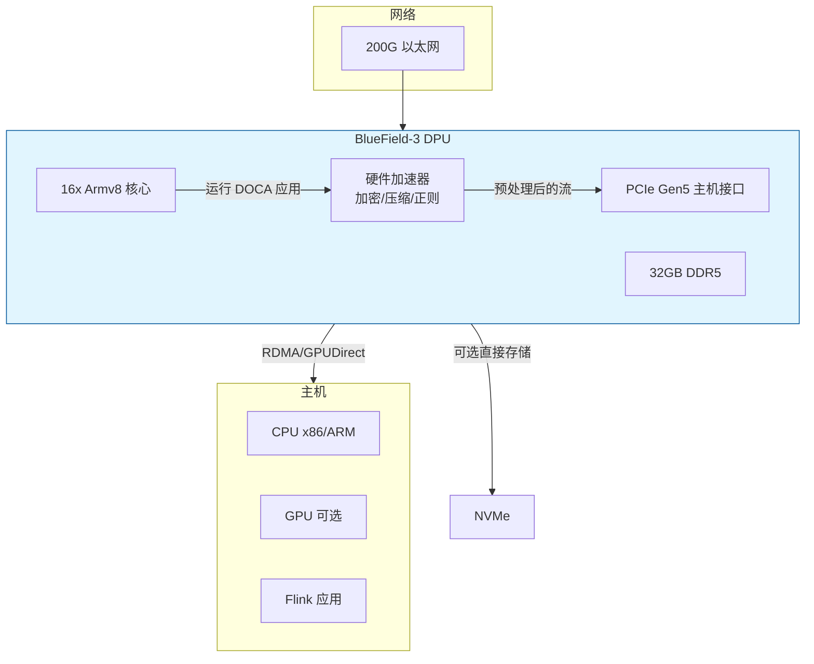
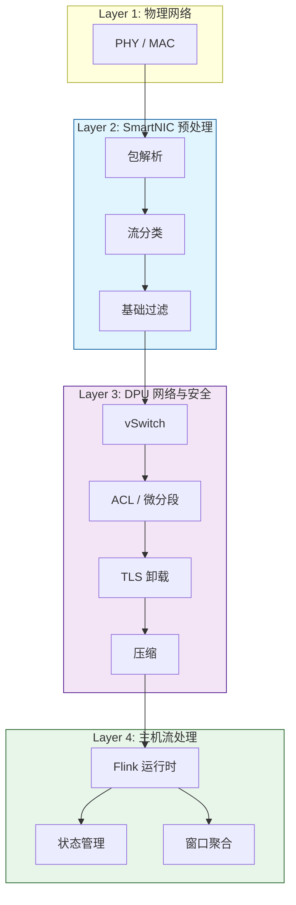

# DPU 与 SmartNIC 在流处理中的角色

> **所属阶段**: Knowledge/ | **前置依赖**: [hardware-accelerated-streaming.md](./hardware-accelerated-streaming.md), [network-stack-internals.md](../Flink/10-internals/network-stack-internals.md) | **形式化等级**: L4

---

## 1. 概念定义 (Definitions)

DPU（Data Processing Unit）和 SmartNIC（Smart Network Interface Card）是近年来数据中心和边缘计算领域兴起的新型网络加速设备。它们将 CPU 上运行的网络协议栈、安全加密、存储虚拟化和部分数据处理任务卸载到网卡上的专用处理器上，从而释放主机 CPU 用于核心计算任务。

**Def-K-06-332 SmartNIC (智能网卡)**

SmartNIC 是一种可编程的网络接口卡，在传统网卡的数据收发功能之外，集成了通用处理器核心（ARM/ MIPS）、FPGA 或 ASIC，能够执行网络包处理、安全卸载和轻量级数据转换。形式上：

$$
\mathcal{SN} = (NIC_{base}, P_{offload}, M_{onboard}, \Pi_{prog})
$$

- $NIC_{base}$ 为底层网络物理层和数据链路层功能
- $P_{offload}$ 为可卸载协议集合（如 TCP/IP 栈、TLS、RDMA、OVS）
- $M_{onboard}$ 为板载内存（通常 4-32GB DDR）
- $\Pi_{prog}$ 为可编程接口（P4、DPDK、eBPF、自定义 SDK）

**Def-K-06-333 DPU (数据处理单元)**

DPU 是一种系统级处理器，通常集成多个 ARM 核心、硬件加速器（加密、压缩、正则表达式）、高速网络接口和可编程数据通路。形式上：

$$
\mathcal{DPU} = (C_{arm}, A_{hw}, N_{ports}, M_{mem}, V_{virt}, I_{host})
$$

- $C_{arm}$ 为通用计算核心集合
- $A_{hw}$ 为硬件加速引擎集合
- $N_{ports}$ 为网络端口（通常 1-2 个 100G/200G）
- $M_{mem}$ 为独立内存子系统
- $V_{virt}$ 为虚拟化能力（SR-IOV、VirtIO、隔离域）
- $I_{host}$ 为主机互联接口（PCIe、CXL）

**Def-K-06-334 内核旁路 (Kernel Bypass)**

内核旁路是指数据包从网络接口到达应用程序的过程中，绕过操作系统内核网络协议栈，直接在用户态或设备内存中可用的机制。典型实现包括 DPDK、RDMA 和 GPUDirect。设传统内核路径的延迟为 $L_{kernel}$，内核旁路路径的延迟为 $L_{bypass}$，则延迟降低比例为：

$$
\Delta L = \frac{L_{kernel} - L_{bypass}}{L_{kernel}}
$$

对于高频流处理场景，$\Delta L$ 通常可达 80-95%。

**Def-K-06-335 网络功能虚拟化流处理 (NFV-Streaming)**

NFV-Streaming 是指在 SmartNIC/DPU 上直接部署流处理算子（过滤、聚合、路由、协议转换），形成"Bump-in-the-Wire"或"Bump-in-the-Stack"架构。数据在到达主机 CPU 之前已被预处理，仅将相关子集传递给上层流处理引擎。

**Def-K-06-336 零拷贝数据通路 (Zero-Copy Data Path)**

零拷贝是指数据从网络接口到流处理应用（或加速器）的过程中，无需经过 CPU 介入的多次内存拷贝。设传统路径的拷贝次数为 $n_{copy}$（通常为 3-4 次：网卡 DMA → 内核缓冲区 → 用户态缓冲区 → 应用内存），零拷贝路径的拷贝次数为 $n_{zero} \approx 1$（网卡 DMA 直接到应用内存或 GPU 显存）。

---

## 2. 属性推导 (Properties)

**Lemma-K-06-118 内核旁路的延迟确定性**

设传统内核路径的延迟分布为 $\mathcal{D}_{kernel}$，均值为 $\mu_{k}$，标准差为 $\sigma_{k}$；内核旁路路径的延迟分布为 $\mathcal{D}_{bypass}$，均值为 $\mu_{b}$，标准差为 $\sigma_{b}$。则对于确定性要求高的流处理场景（如金融交易），有：

$$
\sigma_{b} \ll \sigma_{k}
$$

*说明*: SmartNIC/DPU 的硬件流水线消除了操作系统调度、中断处理和上下文切换的不确定性，使得延迟分布更加集中。$\square$

**Lemma-K-06-119 CPU 释放比例**

设某流处理系统中网络协议栈和安全处理占用的 CPU 周期比例为 $f_{net}$，将其完全卸载到 SmartNIC/DPU 后，主机 CPU 可用于核心计算的比例从 $1 - f_{net}$ 提升到接近 $1$。

*说明*: 在云计算和 5G 边缘场景中，$f_{net}$ 可能高达 30-50%，卸载后相当于将有效计算容量提升了 $1/(1-f_{net})$ 倍。$\square$

**Lemma-K-06-120 DPU 的虚拟化隔离边界**

DPU 支持的硬件隔离域（如 NVIDIA DOCA、Marvell OCTEON 的硬件分区）能够保证不同租户的数据流在设备内部互不干扰。设租户集合为 $\mathcal{U} = \{u_1, u_2, \dots, u_n\}$，则对于任意 $u_i, u_j \in \mathcal{U}$（$i \neq j$）：

$$
\text{Memory}(u_i) \cap \text{Memory}(u_j) = \emptyset \land \text{Bandwidth}(u_i) \geq B_{guaranteed}
$$

*说明*: 这使得 DPU 成为多租户流处理平台（如公有云 Flink 服务）的理想基础设施组件。$\square$

**Prop-K-06-121 SmartNIC 在流过滤中的能效优势**

对于基于固定字段匹配（如 IP 五元组、VLAN Tag、GRE 隧道 ID）的流过滤任务，SmartNIC 的能效比（每瓦处理数据包数）通常是通用 CPU 的 20-100 倍。

---

## 3. 关系建立 (Relations)

### 3.1 SmartNIC vs DPU 的能力边界

| 能力维度 | SmartNIC | DPU |
|---------|:--------:|:---:|
| 通用计算能力 | 弱（协处理器/轻量 ARM） | 强（多核 ARM，可运行 Linux） |
| 可编程性 | 中（P4/eBPF/FPGA） | 高（完整 OS + SDK） |
| 网络卸载 | 强 | 强 |
| 存储卸载 | 弱 | 强（NVMe-oF, 压缩, 加密） |
| 安全卸载 | 中（TLS/IPsec） | 强（零信任、微分段） |
| 虚拟化支持 | 中（SR-IOV） | 强（硬件隔离域、vSwitch） |
| 成本 | 较低 | 较高 |
| 适用场景 | 网络入口过滤、负载均衡 | 全栈卸载、云原生基础设施 |

### 3.2 在 Flink 架构中的部署位置



### 3.3 与 RDMA 和 GPUDirect 的协同

- **RDMA**: DPU/SmartNIC 可直接将网络数据写入远程主机内存或 GPU 显存，无需本地 CPU 参与数据搬运
- **GPUDirect**: 网络数据流可直接进入 GPU 显存，形成 "Network → SmartNIC → GPU" 的零拷贝路径
- **Flink 集成**: 在支持 GPUDirect RDMA 的集群中，Flink Source 可直接消费 GPU 显存中的数据缓冲区

---

## 4. 论证过程 (Argumentation)

### 4.1 为什么 DPU/SmartNIC 是云原生流处理的未来基础设施？

现代数据中心的计算资源正在被"税"侵蚀——网络、存储、安全、虚拟化等基础设施开销消耗了 30-50% 的 CPU 周期。对于流处理这种对延迟和吞吐极度敏感的工作负载，这种"税"是不可接受的。

DPU/SmartNIC 的价值主张：

1. **基础设施卸载**: 将虚拟化、网络协议栈、安全加密从 CPU 彻底剥离
2. **确定性延迟**: 硬件流水线消除 OS 调度的不确定性
3. **多租户隔离**: 在硬件层面保证租户间的性能隔离和安全边界
4. **可编程性**: 通过 P4、eBPF、DOCA 等框架，基础设施团队可独立演进数据面逻辑

### 4.2 典型应用场景

**场景 1: 金融交易前置网关**

高频交易（HFT）要求端到端延迟 < 10 μs。SmartNIC 在网卡层面完成：

- FIX 协议解析和校验
- 白名单/黑名单过滤
- 时间戳打标（精准计时）
- 仅将有效交易请求通过 RDMA 推送到 Flink 实时风控引擎

**场景 2: 5G MEC 边缘流处理**

在 5G 边缘节点，DPU 负责：

- 5G GTP-U 隧道封装/解封装
- 用户面数据过滤和 DPI（深度包检测）
- 将特定业务流（如视频流、IoT 传感器流）路由到本地的 Flink 作业

**场景 3: 云原生数据面安全**

公有云中的 Flink 集群通过 DPU 实现：

- 东西向流量微分段（Micro-segmentation）
- TLS 1.3 全卸载
- 分布式拒绝服务（DDoS）清洗
- 零信任架构中的每包认证

### 4.3 反例：过度卸载的复杂性陷阱

某团队试图将所有流处理算子（包括复杂的窗口聚合和状态管理）迁移到 DPU 的 ARM 核心上。结果：

- DPU ARM 核心的单核性能远低于主机 x86 CPU，复杂算子执行缓慢
- DPU 板载内存有限，无法承载大规模 Keyed State
- 调试和运维困难，DPU 上的崩溃日志难以收集和分析

**教训**: DPU/SmartNIC 的最佳定位是"基础设施卸载 + 轻量级预处理"，而非"通用计算替代"。

---

## 5. 形式证明 / 工程论证 (Proof / Engineering Argument)

**Thm-K-06-122 内核旁路的最小延迟边界**

设数据包从网卡物理接口到达应用内存的路径包括：

1. 网卡 DMA 到板载内存：$t_{dma}^{nic}$
2. 内核协议栈处理（传统路径）：$t_{kernel}$
3. 内核旁路直接映射（DPDK/RDMA 路径）：$t_{map}$

则内核旁路路径的总延迟为：

$$
L_{bypass} = t_{dma}^{nic} + t_{map}
$$

而传统路径为：

$$
L_{kernel} = t_{dma}^{nic} + t_{kernel} + t_{copy} + t_{ctx}
$$

其中 $t_{copy}$ 为内存拷贝时间，$t_{ctx}$ 为上下文切换时间。由于 $t_{map} \ll t_{kernel} + t_{copy} + t_{ctx}$，有 $L_{bypass} \ll L_{kernel}$。$\square$

---

**Thm-K-06-123 DPU 卸载的总拥有成本（TCO）优化**

设一台服务器的总 CPU 核心数为 $N_{cpu}$，基础设施开销占比为 $f_{infra}$。将基础设施完全卸载到 DPU 后，可用于业务计算的有效核心数从 $N_{cpu}(1-f_{infra})$ 恢复为 $N_{cpu}$。若每台 DPU 成本为 $C_{dpu}$，节省的 CPU 核心价值为 $C_{cpu} \cdot N_{cpu} \cdot f_{infra}$，则 TCO 优化的盈亏平衡点为：

$$
C_{dpu} \leq C_{cpu} \cdot N_{cpu} \cdot f_{infra} \cdot T_{lifespan}
$$

其中 $T_{lifespan}$ 为服务器生命周期（年），右侧代表因 DPU 卸载而在生命周期内节省的 CPU 采购成本。

*说明*: 在大型数据中心中，$f_{infra}$ 通常为 0.3-0.5，DPU 的 TCO 回报周期通常为 1-2 年。$\square$

---

**Thm-K-06-124 零拷贝数据通路的带宽守恒**

设网络链路带宽为 $B_{link}$，单条流的数据拷贝开销为 $C_{copy}$（CPU 周期/字节）。传统路径下，每字节数据需经过 $n$ 次拷贝，CPU 用于数据拷贝的饱和带宽为：

$$
B_{cpu}^{sat} = \frac{f_{cpu}^{max} \cdot N_{cpu}}{n \cdot C_{copy}}
$$

其中 $f_{cpu}^{max}$ 为单核最大可用周期率。零拷贝路径下 $n \to 1$ 且 $C_{copy} \to 0$（由 DMA 直接完成），因此：

$$
B_{zero}^{sat} \gg B_{cpu}^{sat}
$$

这意味着零拷贝架构可支持远高于传统架构的网络带宽，而不会使 CPU 饱和。$\square$

---

## 6. 实例验证 (Examples)

### 6.1 NVIDIA BlueField DPU 与 Flink 集成架构

NVIDIA BlueField-3 DPU 提供了一个完整的 Arm 计算子系统和可编程加速器：



在 Flink 场景中，BlueField DPU 可以：

- 运行轻量级 DPDK 应用过滤网络数据包
- 通过 DOCA SDK 与主机 Flink 作业进行零拷贝数据交换
- 在 DPU 上执行 TLS 卸载，将明文数据直接注入 Flink Source Buffer

### 6.2 Pensando DSC-200 分布式服务卡

Pensando（AMD 收购）DSC-200 是一款面向云数据中心的 DPU：

- **P4 可编程数据面**: 支持用户自定义包处理逻辑
- **硬件状态表**: 支持百万级流表项的线速匹配
- **虚拟化**: 每个租户可拥有独立的虚拟 NIC 和 vSwitch 实例

对于多租户 Flink 平台，DSC-200 可以实现租户级别的网络 QoS 和安全隔离，而不消耗主机 CPU 资源。

### 6.3 SmartNIC 上的 eBPF 流过滤

部分 SmartNIC（如 Mellanox ConnectX-6 Dx）支持在网卡上直接运行 eBPF 程序：

```c
// 在 SmartNIC 上运行的 eBPF 程序示例（概念性）
SEC("xdp")
int xdp_filter(struct xdp_md *ctx) {
    void *data_end = (void *)(long)ctx->data_end;
    void *data = (void *)(long)ctx->data;
    struct ethhdr *eth = data;

    if ((void *)(eth + 1) > data_end)
        return XDP_DROP;

    // 仅放行目标端口为 9092（Kafka）的数据包
    struct iphdr *ip = (void *)(eth + 1);
    if ((void *)(ip + 1) > data_end)
        return XDP_DROP;

    struct tcphdr *tcp = (void *)(ip + (ip->ihl * 4));
    if ((void *)(tcp + 1) > data_end)
        return XDP_DROP;

    if (ntohs(tcp->dest) == 9092)
        return XDP_PASS;  // 允许通过到主机

    return XDP_DROP;  // 在网卡层直接丢弃
}
```

通过这种方式，90% 以上的无关网络流量在 SmartNIC 层被过滤，只有目标流量进入主机 CPU 和 Flink 运行时。

---

## 7. 可视化 (Visualizations)

### 7.1 传统架构 vs DPU 卸载架构


### 7.2 DPU 在流处理数据面中的分层角色



---

## 8. 引用参考 (References)
