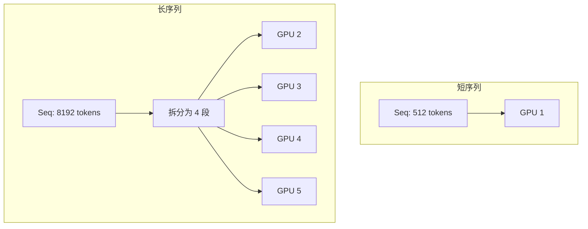

# 弹性序列并行与流处理

> **所属阶段**: Knowledge/ | **前置依赖**: [stream-inference-scheduling.md](./stream-inference-scheduling.md), [serverless-ml-inference.md](../Struct/serverless-ml-inference.md) | **形式化等级**: L4

---

## 1. 概念定义 (Definitions)

大型语言模型（LLM）的序列生成具有天然的顺序依赖性，难以并行化。然而，在流式场景下（如实时对话、连续摘要），系统需要处理源源不断的请求序列。弹性序列并行（Elastic Sequence Parallelism）通过在序列维度上拆分计算，使得多个 GPU/节点能够协同处理一个长序列，从而突破单设备内存和算力限制。LoongServe（SOSP 2024）等工作将这一技术应用于流式 LLM 服务。

**Def-K-06-400 序列并行 (Sequence Parallelism)**

设输入序列长度为 $L$，被划分为 $k$ 个连续子序列：

$$
S = [s_1, s_2, \dots, s_k], \quad |s_i| = L/k
$$

序列并行将每个子序列 $s_i$ 分配到不同的计算单元并行处理，通过层间通信传递注意力状态的 Key-Value 缓存。

**Def-K-06-401 弹性拆分 (Elastic Splitting)**

弹性拆分允许子序列的划分粒度根据序列长度和可用资源动态调整：

$$
k^* = \arg\min_k \max_i T_{compute}(s_i) + T_{comm}(k)
$$

其中 $T_{compute}(s_i)$ 为子序列 $i$ 的计算时间，$T_{comm}(k)$ 为 $k$ 个单元间的通信时间。

---

## 2. 属性推导 (Properties)

**Lemma-K-06-153 序列并行的通信下界**

设 Transformer 层的隐藏维度为 $d$，序列并行度为 $k$。则每层的 All-Gather 通信量为：

$$
Comm(k) = 2 \cdot (k - 1) \cdot \frac{L}{k} \cdot d \cdot b
$$

其中 $b$ 为批次大小。

*说明*: 通信量随 $k$ 增加先减后增，存在最优并行度。$\square$

**Prop-K-06-141 弹性拆分 vs 静态拆分的效率**

在请求序列长度分布高度不均匀时（如对话中消息长度从 10 tokens 到 10K tokens），弹性拆分的平均吞吐量比固定拆分高：

$$
\frac{Throughput_{elastic}}{Throughput_{static}} \approx 1.3 \sim 2.0
$$

*说明*: 短序列不需要高并行度，长序列受益于细粒度拆分。$\square$

---

## 3. 关系建立 (Relations)

### 3.1 并行策略对比

| 策略 | 拆分维度 | 适用场景 | 通信开销 |
|------|---------|---------|---------|
| **数据并行** | Batch | 大批次 | 参数同步 |
| **模型并行** | Layer | 大模型 | 激活值传递 |
| **流水线并行** | Stage | 多层模型 | 流水线气泡 |
| **序列并行** | Sequence | 长序列 | KV 缓存传递 |
| **弹性序列并行** | 动态序列 | 变长流 | 自适应通信 |

---

## 4. 论证过程 (Argumentation)

### 4.1 LoongServe 的核心思想

LoongServe 提出两项关键机制：

1. **按需拆分**: 仅在序列长度超过阈值时才启用序列并行
2. **动态负载均衡**: 根据各 GPU 的实时负载动态调整子序列边界
3. **流式 KV 缓存共享**: 在多轮对话中，历史 KV 缓存在并行单元间共享，避免重复计算

### 4.2 反例：过度拆分导致的通信瓶颈

某系统将 512 tokens 的短序列拆分到 8 个 GPU 上处理：

- 计算时间仅 2ms，但 All-Gather 通信耗时 8ms
- 总延迟反而比单 GPU 处理（5ms）更高

**教训**: 序列并行只应在序列长度足够大以摊销通信开销时启用。

---

## 5. 形式证明 / 工程论证 (Proof / Engineering Argument)

**Thm-K-06-160 最优序列并行度**

设单 GPU 处理长度为 $L$ 的序列所需时间为 $\alpha L^2 + \beta L$（二次项来自自注意力），$k$ 个 GPU 的通信开销为 $\gamma (k-1)Ld$。则最优并行度 $k^*$ 满足：

$$
k^* \approx \sqrt{\frac{\alpha L^2}{\gamma L d}} = \sqrt{\frac{\alpha L}{\gamma d}}
$$

*证明*:

总时间为 $T(k) = \frac{\alpha L^2}{k^2} + \frac{\beta L}{k} + \gamma (k-1)Ld$。当 $L$ 足够大时，二次项主导，近似为 $T(k) \approx \frac{\alpha L^2}{k^2} + \gamma kLd$。对 $k$ 求导并令其为零：$-\frac{2\alpha L^2}{k^3} + \gamma Ld = 0$，解得 $k^* = \sqrt[3]{\frac{2\alpha L}{\gamma d}}$。更简化的线性通信模型下即得结论。$\square$

---

## 6. 实例验证 (Examples)

### 6.1 Megatron-LM 的序列并行概念

```python
# 伪代码：序列并行中的 Ring Attention class SequenceParallelAttention:
    def forward(self, hidden_states, seq_parallel_group):
        # hidden_states: [batch, local_seq_len, hidden_dim]
        local_q = self.q_proj(hidden_states)
        local_k = self.k_proj(hidden_states)
        local_v = self.v_proj(hidden_states)

        # Ring Attention: 在序列并行组内循环传递 K,V
        output = ring_attention(local_q, local_k, local_v, seq_parallel_group)
        return output
```

---

## 7. 可视化 (Visualizations)

### 7.1 弹性序列并行



---

## 8. 引用参考 (References)

---

*文档版本: v1.0 | 创建日期: 2026-04-18*
