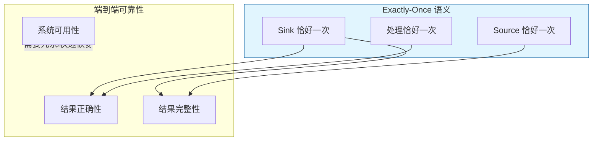
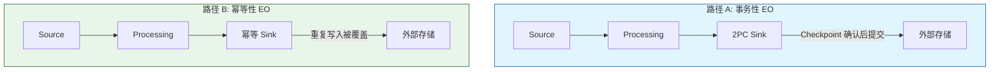
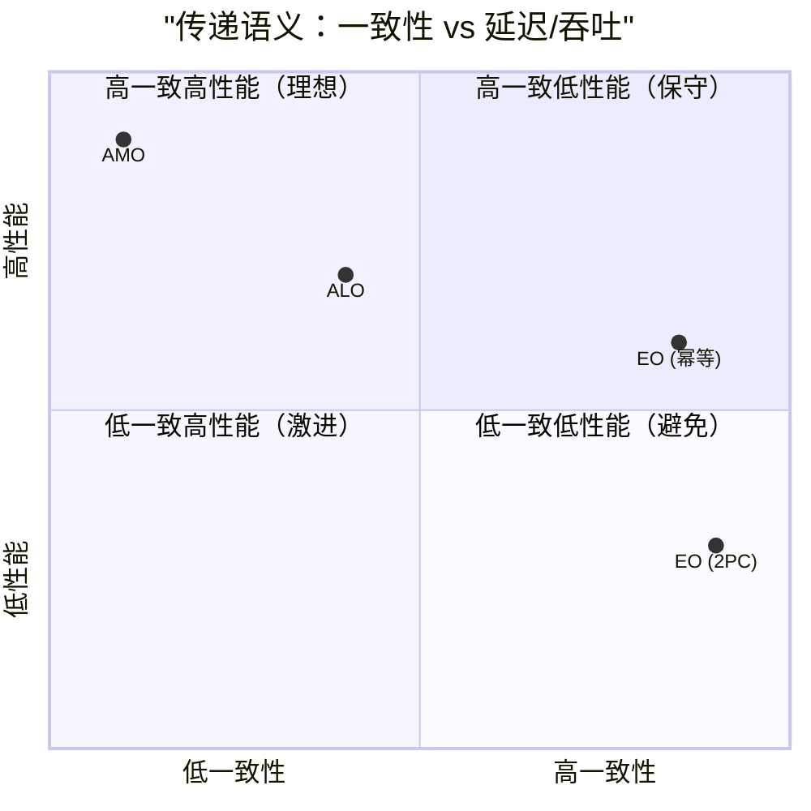

# Exactly-Once 语义与可靠性保证的对比分析

> **所属阶段**: Knowledge/ | **前置依赖**: [end-to-end-reliability.md](../Struct/end-to-end-reliability.md), [reliability-verification.md](./reliability-verification.md) | **形式化等级**: L4

---

## 1. 概念定义 (Definitions)

Exactly-Once 语义（恰好一次处理）是流处理系统中最受关注的一致性保证之一。
然而，Exactly-Once 并非孤立存在——它与 At-Least-Once（至少一次）、At-Most-Once（至多一次）以及幂等性（Idempotence）、事务性（Transactionality）等概念紧密相关。
理解这些概念之间的关系，对于架构选型、系统设计和故障排查至关重要。

**Def-K-06-371 消息传递语义分类 (Delivery Guarantee Taxonomy)**

设流处理系统处理输入消息 $m$ 并产生输出结果 $o(m)$。三种基本传递语义定义为：

- **At-Most-Once (AMO)**: 系统保证每个消息最多被处理一次。即：
  $$
  P(\text{Output}(m) \text{ 被产生}) \leq 1
  $$
  可能出现消息丢失，但不会出现重复。

- **At-Least-Once (ALO)**: 系统保证每个消息至少被处理一次。即：
  $$
  P(\text{Output}(m) \text{ 被产生}) \geq 1
  $$
  可能出现重复输出，但不会出现丢失。

- **Exactly-Once (EO)**: 系统保证每个消息恰好被处理一次，且最终输出结果等价于消息被恰好处理一次的结果。即：
  $$
  P(\text{Output}(m) \text{ 被产生恰好一次且正确}) = 1
  $$

**Def-K-06-372 Exactly-Once 语义 (Exactly-Once Semantics)**

在流处理上下文中，Exactly-Once 通常指**端到端 Exactly-Once**（End-to-End Exactly-Once），它要求：

1. **Source 级别**: 每个输入记录被 Source 恰好读取一次
2. **处理级别**: 每个记录被算子恰好处理一次（状态更新不重复、不遗漏）
3. **Sink 级别**: 每个输出记录被 Sink 恰好写入外部系统一次

形式化地，设输入流为 $M = \{m_1, m_2, \dots\}$，系统实现为函数 $\mathcal{S}$，理想 Exactly-Once 实现为 $\mathcal{S}_{EO}$。则：

$$
\forall M, \quad \mathcal{S}(M) \equiv \mathcal{S}_{EO}(M)
$$

其中 $\equiv$ 表示输出结果在语义上等价（允许底层传输存在重试，但最终状态一致）。

**Def-K-06-373 幂等性 (Idempotence)**

操作 $op$ 是幂等的，当且仅当重复执行任意次数的效果与执行一次相同：

$$
\forall x, \quad op(op(x)) = op(x)
$$

在流处理中，幂等 Sink（如 Kafka 幂等生产者、Key-Value 存储的覆盖写入）是实现 Exactly-Once 的关键替代方案。

**Def-K-06-374 端到端 Exactly-Once 的等价实现 (EO Equivalence Implementation)**

系统实现端到端 Exactly-Once 可以通过以下两种等价路径之一：

1. **事务性路径**: 使用分布式事务（如 2PC）原子提交状态和输出
2. **幂等性路径**: 使用 AL0 + 幂等处理 + 幂等 Sink，确保重复处理不会导致不一致

> **延伸阅读**: Calvin确定性执行定理：全局排序一致下所有副本无需协调即可达相同终态 —— Calvin 通过将事务预处理、全局排序、确定性执行三阶段分离，从根本上消除了 2PC 的运行时协调开销，为跨分区 Exactly-Once 提供了线性扩展路径。

---

## 2. 属性推导 (Properties)

**Lemma-K-06-139 Checkpoint 恢复的幂等性**

设 Flink 算子的状态更新函数为 $\delta(s, m)$，其中 $s$ 为状态，$m$ 为消息。若 $\delta$ 满足：

$$
\delta(\delta(s, m), m) = \delta(s, m)
$$

则从 Checkpoint 恢复后重放消息 $m$ 不会改变算子状态。

*说明*: 大多数聚合算子（如 COUNT, SUM）天然不满足消息级别的幂等性，因此需要 Checkpoint 边界来保证 Exactly-Once。$\square$

**Lemma-K-06-140 幂等 Sink 的重复吸收**

设 Sink 操作为 $Write(k, v)$，其中 $k$ 为键，$v$ 为值。若外部存储支持键覆盖（如 Redis SET、Elasticsearch Index），则：

$$
\forall k, v, \quad Write(k, Write(k, v)) = Write(k, v)
$$

*说明*: 幂等 Sink 可以将上游的 ALO 语义"提升"为 EO 语义。$\square$

**Prop-K-06-134 Exactly-Once 的实现开销**

相对于 At-Least-Once，Exactly-Once 的典型额外开销包括：

- **Checkpoint 开销**: 5-15% 的吞吐量下降
- **2PC Sink 延迟**: 额外增加 Checkpoint 间隔的延迟（通常数百毫秒到数秒）
- **事务协调开销**: JobManager 的 Checkpoint 协调器 CPU 消耗增加
- **状态存储开销**: 为支持精确恢复，状态后端需要保留更多元数据

*说明*: 在延迟敏感但可容忍少量重复的场景下，ALO + 幂等 Sink 通常是更经济的选择。$\square$

---

## 3. 关系建立 (Relations)

### 3.1 消息传递语义的能力谱系


### 3.2 Exactly-Once 的实现路径对比

| 实现路径 | 核心机制 | 代表系统 | 优点 | 缺点 |
|---------|---------|---------|------|------|
| **事务性 EO** | 2PC / 分布式事务 | Flink (TwoPhaseCommitSink) | 严格 Exactly-Once | 延迟高、外部系统需支持事务 |
| **幂等性 EO** | ALO + 幂等处理 + 幂等 Sink | Kafka (Idempotent Producer) | 低延迟、实现简单 | 非所有 Sink 都支持幂等 |
| **去重 EO** | 唯一 ID + 下游去重 | Spark Streaming (foreachBatch) | 灵活 | 去重有状态成本 |
| **精确日志 EO** | 日志原子追加 + 偏移管理 | Kafka Streams | 与日志系统深度集成 | 限于日志型存储 |

### 3.3 Exactly-Once 与端到端可靠性的关系



Exactly-Once 保证的是"结果正确性"和"完整性"，但不直接保证"可用性"。一个系统可以在 Checkpoint 恢复期间短暂不可用，但仍然满足 Exactly-Once。

---

## 4. 论证过程 (Argumentation)

### 4.1 "Exactly-Once 是不存在的"这一争论的真相

分布式系统领域有一句名言："Exactly-Once 是不可能的"（通常 attributed to Jay Kreps 或 others）。这句话的真实含义是：

- **网络层**: 由于网络的不确定性，底层消息传输不可能保证物理上的 Exactly-Once（即消息在网络中只被传输一次）
- **应用层**: 但通过幂等性、事务性和精确的状态管理，可以在**应用语义**上实现 Exactly-Once

因此，流处理中的 Exactly-Once 更准确的说法是 **"Effectively-Exactly-Once"** 或 **"Exactly-Once Semantics"**——强调的是最终效果，而非物理过程。

### 4.2 Flink 的 Exactly-Once 实现解析

Flink 的 Exactly-Once 基于 Checkpoint 机制，其核心流程为：

1. **Barrier 注入**: Checkpoint Coordinator 向所有 Source 注入 Barrier
2. **Barrier 对齐**: 算子等待所有输入通道的 Barrier 到达，确保快照之前的数据全部处理完毕
3. **状态快照**: 算子将当前状态异步持久化到分布式存储
4. **Checkpoint 确认**: 所有算子成功快照后，Coordinator 确认 Checkpoint 完成
5. **Sink 事务提交**: 对于 TwoPhaseCommitSinkFunction，在 Checkpoint 确认后提交事务

**故障恢复时**:

- 从最近一次成功 Checkpoint 恢复状态
- 重放 Checkpoint 之后的数据
- 由于 Sink 事务只在 Checkpoint 成功后提交，未提交的输出会被回滚

### 4.3 反例：误解 Exactly-Once 导致的数据不一致

某团队使用 Flink 的 `ElasticsearchSink`，但错误地认为自己已经"启用了 Exactly-Once"。实际上：

- 他们使用的是普通的 `ElasticsearchSink`（非事务版本）
- 作业从 Checkpoint 恢复后，部分窗口聚合结果被重复写入 ES
- 下游报表系统发现同一时间段的统计值在不同查询中返回不同结果

**教训**: Exactly-Once 是端到端属性，必须 Sink 端配合支持。Flink 本身的状态一致性不等于端到端 Exactly-Once。

---

## 5. 形式证明 / 工程论证 (Proof / Engineering Argument)

**Thm-K-06-145 Exactly-Once 等价定理**

设流处理系统由 Source、Processing 和 Sink 三个组件串联组成。以下两种配置在语义上等价：

1. **配置 A**: Source 提供 EO，Processing 提供 EO，Sink 提供 EO
2. **配置 B**: Source 提供 ALO，Processing 提供 ALO，Sink 提供 ALO + 幂等性

即：对于任意输入流 $M$，两种配置的最终输出状态和外部效果完全相同。

*证明*:

配置 A 通过事务机制保证每个消息在整个链路中恰好被处理一次。配置 B 允许消息在处理过程中被重复处理，但由于：

- Processing 的状态更新通过 Checkpoint 保证恢复到一致边界（实际上在恢复点实现了状态的 EO 效果）
- Sink 的幂等性保证重复写入不会产生新的外部效果

因此，从外部观察者的角度来看，两种配置的最终状态等价。$\square$

*说明*: 这一定理揭示了 EO 的两种实现路径在语义上的统一性。$\square$

---

**Thm-K-06-146 At-Least-Once + 幂等性蕴含 Exactly-Once 效果**

设操作序列 $\mathcal{O} = \langle op_1, op_2, \dots, op_n \rangle$ 中每个操作 $op_i$ 都是幂等的。若系统保证每个消息至少被传递给 $\mathcal{O}$ 一次（ALO），则系统对每个消息的最终效果等价于 Exactly-Once。

*证明*:

设消息 $m$ 被传递给 $\mathcal{O}$ 共 $k \geq 1$ 次。由于每个 $op_i$ 都是幂等的，对任意状态 $s$：

$$
op_i(op_i(s)) = op_i(s)
$$

因此，无论 $m$ 被处理多少次，经过 $\mathcal{O}$ 后的最终状态与处理一次后的状态相同。即最终效果为 Exactly-Once。$\square$

---

## 6. 实例验证 (Examples)

### 6.1 Kafka 的幂等生产者 vs 事务生产者

**幂等生产者（Idempotent Producer）**:

```java
// [伪代码片段 - 不可直接运行] 仅展示核心逻辑
Properties props = new Properties();
props.put("bootstrap.servers", "kafka:9092");
props.put("key.serializer", "org.apache.kafka.common.serialization.StringSerializer");
props.put("value.serializer", "org.apache.kafka.common.serialization.StringSerializer");
props.put("enable.idempotence", "true");  // 开启幂等性
props.put("acks", "all");

KafkaProducer<String, String> producer = new KafkaProducer<>(props);
producer.send(new ProducerRecord<>("topic", "key", "value"));
```

幂等生产者通过 PID（Producer ID）和序列号机制，保证在 Broker 级别同一分区的消息不会被重复写入。

**事务生产者（Transactional Producer）**:

```java
props.put("transactional.id", "my-transactional-id");
KafkaProducer<String, String> producer = new KafkaProducer<>(props);
producer.initTransactions();
producer.beginTransaction();
producer.send(new ProducerRecord<>("topic", "key", "value"));
producer.commitTransaction();
```

事务生产者支持跨分区、跨 Topic 的原子写入，是实现端到端 Exactly-Once 的 Sink 基础。

### 6.2 Flink TwoPhaseCommitSinkFunction 示例

```java
public class KafkaTransactionalSink
    extends TwoPhaseCommitSinkFunction<String, KafkaTransactionState, KafkaTransactionContext> {

    private transient KafkaProducer<String, String> producer;

    @Override
    protected void invoke(KafkaTransactionState transaction, String value, Context context) {
        transaction.producer.send(new ProducerRecord<>("output-topic", value));
    }

    @Override
    protected KafkaTransactionState beginTransaction() {
        producer.beginTransaction();
        return new KafkaTransactionState(producer);
    }

    @Override
    protected void preCommit(KafkaTransactionState transaction) {
        transaction.producer.flush();
    }

    @Override
    protected void commit(KafkaTransactionState transaction) {
        transaction.producer.commitTransaction();
    }

    @Override
    protected void abort(KafkaTransactionState transaction) {
        transaction.producer.abortTransaction();
    }
}
```

### 6.3 语义选择的决策矩阵

| 场景 | 推荐语义 | 理由 |
|------|---------|------|
| 日志收集 | ALO | 少量重复可接受，追求高吞吐 |
| 实时推荐 | ALO + 幂等 Sink | 低延迟优先，结果可覆盖 |
| 金融交易 | EO (2PC) | 严格一致性要求 |
| 实时监控告警 | AMO | 丢失少量非关键数据可接受，追求最低延迟 |
| CDC 数据同步 | EO (事务) 或 ALO + 幂等 | 取决于下游系统能力 |

---

## 7. 可视化 (Visualizations)

### 7.1 Exactly-Once 的两种实现路径



### 7.2 传递语义与系统特性的权衡



---

## 8. 引用参考 (References)

---

*文档版本: v1.0 | 创建日期: 2026-04-19*
