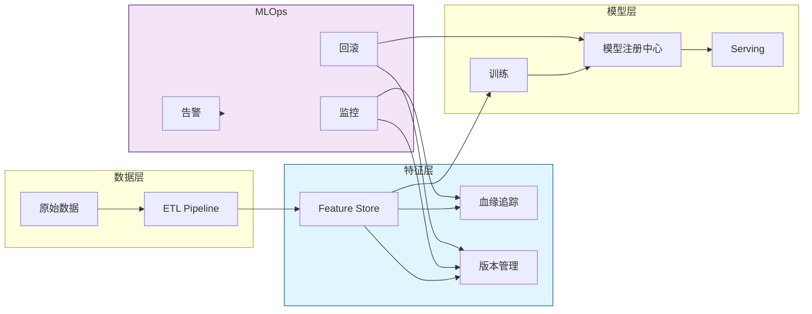
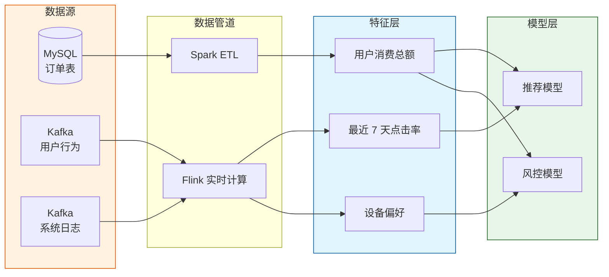
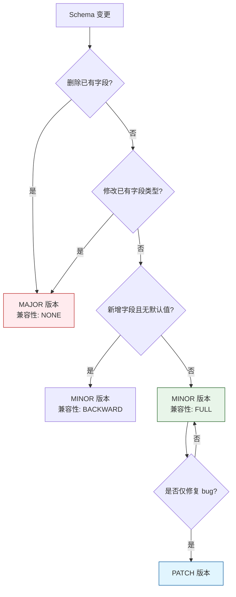

# 特征血缘追踪与版本管理

> **所属阶段**: Knowledge/ | **前置依赖**: [feature-store-architecture.md](./feature-store-architecture.md), [consistency-training-inference.md](../Struct/consistency-training-inference.md) | **形式化等级**: L3

---

## 1. 概念定义 (Definitions)

特征血缘（Feature Lineage）描述了特征从原始数据源到最终模型输入的完整生命周期路径，是数据治理、合规审计和故障排查的核心能力。版本管理则确保特征定义、模式和计算逻辑的可追溯性。

**Def-K-06-316 特征血缘 (Feature Lineage)**

特征 $f$ 的血缘 $\mathcal{L}(f)$ 是一个有向无环图：

$$
\mathcal{L}(f) = (N, E, \lambda, \tau)
$$

- $N$ 为节点集合，每个节点 $n \in N$ 代表数据源、转换操作或特征实体
- $E \subseteq N \times N$ 为有向边，表示数据或控制的依赖关系
- $\lambda: N \to \{\text{Source}, \text{Transform}, \text{Feature}, \text{Model}\}$ 为节点类型标注
- $\tau: E \to \mathbb{R}^+$ 为边上的时间戳标注，记录依赖关系建立的时间

**Def-K-06-317 血缘覆盖度 (Lineage Coverage)**

对于特征集合 $\mathcal{F}$ 和系统内所有数据源 $\mathcal{S}$，血缘覆盖度定义为：

$$
\mathcal{C}_{lineage}(\mathcal{F}, \mathcal{S}) = \frac{| \{ f \in \mathcal{F} \mid \exists s \in \mathcal{S}, s \leadsto f \} |}{|\mathcal{F}|}
$$

其中 $s \leadsto f$ 表示存在从数据源 $s$ 到特征 $f$ 的血缘路径。理想情况下 $\mathcal{C}_{lineage} = 1$。

**Def-K-06-318 特征版本 (Feature Version)**

特征版本 $v_f$ 是一个三元组：

$$
v_f = (schema, code, ts)
$$

- $schema$ 为特征的模式定义（名称、类型、默认值、约束）
- $code$ 为特征计算逻辑的版本标识（如 Git commit hash）
- $ts$ 为该版本创建的时间戳

**Def-K-06-319 版本兼容性 (Version Compatibility)**

设特征的旧版本为 $v_f^{old}$，新版本为 $v_f^{new}$。版本兼容性 $Compat(v_f^{old}, v_f^{new})$ 定义为：

$$
Compat(v_f^{old}, v_f^{new}) =
\begin{cases}
\text{BACKWARD} & \text{if } v_f^{new} \text{ 可被旧消费者读取} \\
\text{FORWARD} & \text{if } v_f^{old} \text{ 可被新消费者读取} \\
\text{FULL} & \text{if 同时满足 BACKWARD 和 FORWARD} \\
\text{NONE} & \text{otherwise}
\end{cases}
$$

**Def-K-06-320 影响分析 (Impact Analysis)**

给定数据源变更 $\Delta s$，影响分析函数 $IA$ 返回所有可能被影响的下游实体集合：

$$
IA(\Delta s) = \{ n \in N \mid s \leadsto n \land s \in \Delta s \}
$$

若 $IA(\Delta s) \cap \mathcal{M} \neq \emptyset$（$\mathcal{M}$ 为生产模型集合），则称该变更为**高风险变更**。

**Def-K-06-321 血缘 freshness (Lineage Freshness)**

血缘图 $\mathcal{L}(f)$ 的 freshness 定义为最近一次成功扫描或更新时间戳 $t_{update}$ 与当前时间 $t_{now}$ 的差值：

$$
\text{freshness}(\mathcal{L}) = t_{now} - t_{update}
$$

若 freshness 超过阈值 $T_{max}$，则血缘信息可能过时，需要重新扫描。

---

## 2. 属性推导 (Properties)

**Lemma-K-06-107 血缘传递性**

若 $a \leadsto b$ 且 $b \leadsto c$，则 $a \leadsto c$。

*证明*: 由血缘图 $\mathcal{L}$ 的定义，$\leadsto$ 即为图中存在有向路径的关系。有向路径的连接仍为有向路径，故传递性成立。$\square$

**Lemma-K-06-108 无环性保证影响分析的有限性**

由于 $\mathcal{L}$ 为有向无环图，对于任意节点 $n$，其下游影响集合 $Downstream(n)$ 的大小是有限的，且可在 $O(|N| + |E|)$ 时间内通过 DFS/BFS 计算。

*证明*: DAG 中不存在无限循环路径，每个节点最多被访问一次。标准图遍历算法的时间复杂度为 $O(|N| + |E|)$。$\square$

**Lemma-K-06-109 版本 FULL 兼容性蕴含无中断升级**

若 $Compat(v_f^{old}, v_f^{new}) = \text{FULL}$，则在不中断现有生产模型 Serving 的前提下，可以平滑地从旧版本迁移到新版本。

*证明*: FULL 兼容性要求新版本向后兼容（旧消费者可读）且向前兼容（新消费者可读旧数据）。因此升级过程中新旧版本可同时存在，无需强制停机迁移。$\square$

**Prop-K-06-110 血缘完整性与故障排查效率的关系**

设某数据质量问题从发现到定位根因所需的排查时间为 $T_{debug}$，则：

$$
T_{debug} \propto \frac{1}{\mathcal{C}_{lineage}}
$$

即血缘覆盖度越高，排查时间越短。

---

## 3. 关系建立 (Relations)

### 3.1 与数据治理框架的关系

特征血缘是数据治理（Data Governance）的关键组成部分：

- **数据质量**: 通过血缘追踪可快速定位质量问题的传播路径
- **隐私合规 (GDPR/CCPA)**: 识别包含 PII 的下游特征和模型，支持数据删除请求的级联执行
- **成本归因**: 将存储和计算成本沿血缘路径向上游数据源归因

### 3.2 与 MLOps 生命周期集成



### 3.3 与 OpenLineage 等开放标准的对接

现代特征存储系统越来越多地对接开放血缘标准：

| 标准/协议 | 作用 | 集成方式 |
|----------|------|---------|
| OpenLineage | 统一血缘元数据格式 | Flink/Spark 作业自动 emit lineage 事件 |
| Apache Atlas | 企业级元数据治理 | 通过 Kafka Hook 同步血缘图 |
| DataHub | 元数据目录与搜索 | REST API 推送特征定义和血缘 |
| Amundsen | 数据发现与文档 | 同步特征文档和使用示例 |

---

## 4. 论证过程 (Argumentation)

### 4.1 为什么特征血缘不可或缺？

在大型 ML 组织中，特征数量可能达到数千甚至数万。没有血缘追踪时，以下场景会变得极其困难：

1. **上游数据 schema 变更**: 某上游表新增一列，哪些特征和模型会受影响？需要数小时甚至数天的人工排查。
2. **数据质量问题溯源**: 发现某模型 AUC 突然下降，无法判断是数据管道问题、特征逻辑问题还是模型本身问题。
3. **合规删除**: GDPR 要求删除某用户的所有个人数据，但无法确定哪些下游特征和模型使用了这些数据。
4. **成本优化**: 无法识别哪些特征是"孤儿特征"（没有任何模型使用），导致存储资源浪费。

### 4.2 版本管理的工程实践

**语义化版本控制 (SemVer)**

特征版本推荐采用 `MAJOR.MINOR.PATCH` 格式：

- **MAJOR**: schema 不兼容变更（如类型从 INT 改为 STRING）
- **MINOR**: 新增向后兼容的功能（如新增一个可选字段）
- **PATCH**: bug 修复，不改变 schema 语义

**版本锁定策略**

生产模型 Serving 时应锁定使用的特征版本，避免自动拉取最新版本导致不可预期的行为变化。训练管道可配置为：

- `pinned`: 固定到特定版本
- `latest-compatible`: 自动使用最新向后兼容版本
- `latest`: 始终使用最新版本（高风险，不推荐生产使用）

### 4.3 反例：无版本管理的生产事故

某推荐团队在夜间部署了新版"用户最近 7 天消费金额"特征，将默认空值从 `0.0` 改为了 `NULL`。由于模型训练时未处理 `NULL`，Serving 时特征存储返回的 `NULL` 被编码为 `0.0`，而训练时旧版本的默认值为 `0.0` —— 表面上一致，但实际上新版本对"无消费"和"数据缺失"的语义区分导致模型输入分布发生微妙变化。上线后 2 小时内，推荐 CTR 下降 15%。

根因分析：

- 缺乏版本锁定：Serving 端自动使用了最新版本
- 缺乏影响分析：未评估该变更对下游 6 个生产模型的影响
- 缺乏监控：没有自动检测特征分布漂移的告警

---

## 5. 形式证明 / 工程论证 (Proof / Engineering Argument)

**Thm-K-06-111 血缘完备性保证影响分析的准确性**

若特征存储系统的血缘覆盖度 $\mathcal{C}_{lineage} = 1$，则对于任意数据源变更 $\Delta s$，影响分析函数 $IA$ 返回的集合包含所有且仅包含可能被影响的下游实体。

*证明*:

**完备性**: $\mathcal{C}_{lineage} = 1$ 意味着每个特征 $f \in \mathcal{F}$ 都至少存在一条从某个数据源到 $f$ 的血缘路径。因此，若数据源 $s$ 发生变更，任何依赖于 $s$ 的特征都会通过该路径与 $s$ 相连。DFS/BFS 遍历会访问到所有这些节点，故 $IA(\Delta s)$ 不会遗漏。

**无冗余**: 由血缘图的定义，边 $E$ 仅存在于真实的依赖关系之间。若节点 $n \notin IA(\Delta s)$，则不存在从 $\Delta s$ 到 $n$ 的路径，即 $n$ 不依赖于变更的数据源。故 $IA(\Delta s)$ 不会包含无关节点。$\square$

---

**Thm-K-06-112 版本兼容性检查的充分条件**

设特征模式从 $v_f^{old}$ 变更为 $v_f^{new}$。若同时满足以下条件，则 $Compat(v_f^{old}, v_f^{new}) = \text{FULL}$：

1. $v_f^{new}$ 未删除 $v_f^{old}$ 中的任何已有字段
2. $v_f^{new}$ 新增的字段均有默认值或允许为空
3. $v_f^{new}$ 未修改已有字段的数据类型

*证明*:

**向后兼容 (BACKWARD)**: 条件 1 和 3 保证旧消费者读取新版本数据时，所有期望的字段都存在且类型不变。条件 2 保证新增字段不会导致解析失败（因为有默认值）。

**向前兼容 (FORWARD)**: 新消费者读取旧版本数据时，条件 2 保证新增字段的缺失可由默认值补全。条件 1 和 3 确保已有字段的读取不受影响。故同时满足 BACKWARD 和 FORWARD，兼容性为 FULL。$\square$

---

## 6. 实例验证 (Examples)

### 6.1 Feast 的血缘与版本管理

Feast 通过 `FeatureView` 和 `Entity` 定义特征的 schema 与计算逻辑：

```python
from feast import Entity, Feature, FeatureView, ValueType
from datetime import timedelta

user = Entity(
    name="user_id",
    value_type=ValueType.INT64,
    description="用户唯一标识"
)

# 版本 V1
transaction_stats_v1 = FeatureView(
    name="transaction_stats",
    entities=["user_id"],
    ttl=timedelta(hours=24),
    features=[
        Feature(name="total_amount", dtype=ValueType.FLOAT),
        Feature(name="count", dtype=ValueType.INT64),
    ],
    online=True,
    source=transaction_source,
    tags={"version": "1.0.0", "owner": "data-team"}
)
```

Feast Registry 自动记录特征版本、数据源引用和特征-实体关系，提供基础的元数据和血缘能力。

### 6.2 OpenLineage 与 Flink 集成

OpenLineage 是一个开放的元数据血缘标准，可通过 Flink Listener 自动捕获作业血缘：

```java
// Flink 配置中启用 OpenLineage
env.getConfig().setJobListener(new OpenLineageJobListener());

// OpenLineage 会自动 emit 以下事件：
// - RUNNING: 作业启动，包含输入/输出数据集
// - COMPLETE: 作业成功完成
// - FAIL: 作业失败
```

生成的血缘事件示例（JSON）：

```json
{
  "eventType": "COMPLETE",
  "run": {
    "runId": "flink-job-001"
  },
  "job": {
    "namespace": "production",
    "name": "user-feature-computation"
  },
  "inputs": [
    {
      "namespace": "kafka",
      "name": "user-behavior-events"
    }
  ],
  "outputs": [
    {
      "namespace": "redis",
      "name": "user_features"
    }
  ]
}
```

### 6.3 DataHub 中的特征目录与影响分析

DataHub 作为元数据目录，可展示特征的全链路血缘：

```
MySQL CDC → Kafka → Flink Job → Redis Feature Store → Model Serving
                ↓
            DataHub Lineage Graph
```

当 MySQL 某表发生 schema 变更时，DataHub 可自动高亮显示受影响的路径上的所有节点，并发送告警给特征 Owner 和模型 Owner。

---

## 7. 可视化 (Visualizations)

### 7.1 特征血缘图示例



### 7.2 版本兼容性决策树



---

## 8. 引用参考 (References)
