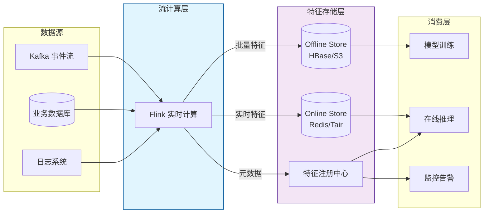
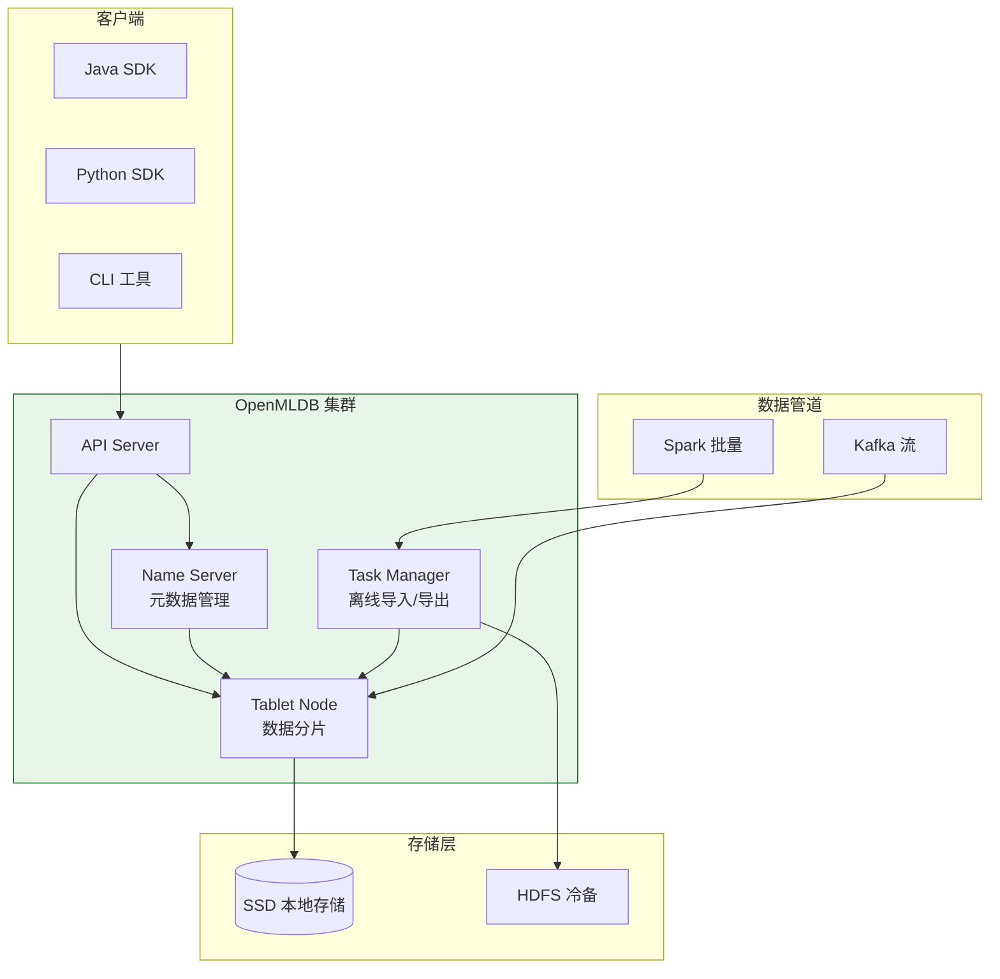
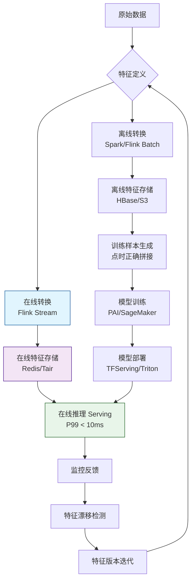
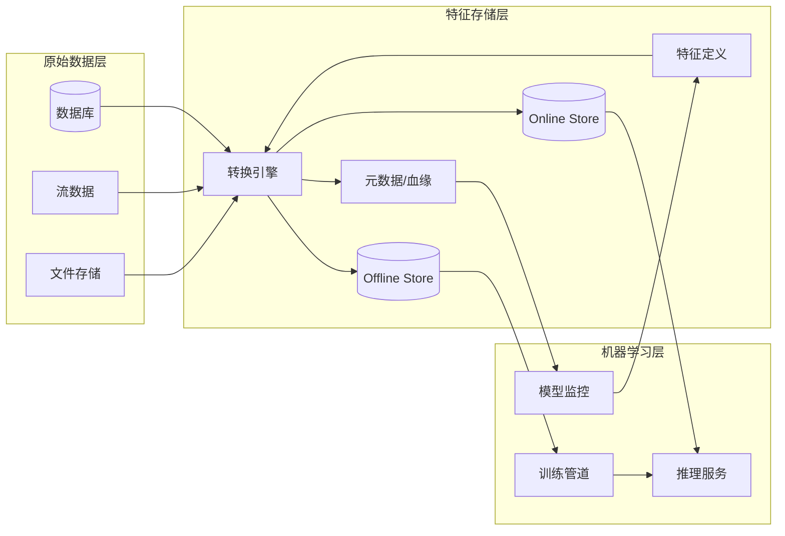

# 特征存储系统架构设计与形式化定义

> **所属阶段**: Knowledge/ | **前置依赖**: [ai-agent-streaming-architecture.md](./06-frontier/ai-agent-streaming-architecture.md), [realtime-feature-engineering-feature-store.md](../Flink/06-ai-ml/realtime-feature-engineering-feature-store.md) | **形式化等级**: L4

---

## 1. 概念定义 (Definitions)

特征存储（Feature Store）是连接数据工程与机器学习模型的关键基础设施，负责特征的全生命周期管理，包括生成、存储、 Serving 和监控。

**Def-K-06-305 特征存储系统 (Feature Store System)**

一个特征存储系统 $\mathcal{FS}$ 是一个五元组：

$$
\mathcal{FS} = (S, T, V, \Phi, \Psi)
$$

其中：

- $S$ 为特征源（Feature Source），即产生原始数据的上游系统集合
- $T$ 为特征转换层（Transformation Layer），负责将原始数据转换为模型可用特征
- $V$ 为特征版本空间（Version Space），记录特征的模式、血缘与历史版本
- $\Phi$ 为特征 Serving 接口（Serving API），提供低延迟特征查询能力
- $\Psi$ 为监控与治理模块（Governance），负责特征漂移检测、质量监控和访问控制

**Def-K-06-306 特征向量 (Feature Vector)**

给定实体 $e \in E$（如用户、商品、会话）和特征族 $\mathcal{F} = \{f_1, f_2, \dots, f_n\}$，实体 $e$ 的特征向量定义为：

$$
\vec{x}_e = (f_1(e), f_2(e), \dots, f_n(e)) \in \mathcal{X}_1 \times \mathcal{X}_2 \times \dots \times \mathcal{X}_n
$$

其中 $\mathcal{X}_i$ 为第 $i$ 个特征的取值空间。

**Def-K-06-307 特征血缘 (Feature Lineage)**

特征 $f$ 的血缘是一个有向无环图（DAG）：

$$
\mathcal{L}(f) = (N, E, \lambda)
$$

- $N$ 为节点集合，每个节点代表一个数据源、转换操作或特征定义
- $E \subseteq N \times N$ 为有向边，表示数据/变换的依赖关系
- $\lambda: N \to \{\text{Source}, \text{Transform}, \text{Feature}\}$ 为节点类型标注函数

**Def-K-06-308 训练-推理一致性 (Training-Serving Consistency)**

设训练时特征值为 $f_{train}(e)$，推理时特征值为 $f_{serve}(e)$，则训练-推理一致性要求：

$$
\Delta(f_{train}, f_{serve}) = \| f_{train}(e) - f_{serve}(e) \| \leq \epsilon
$$

对于所有实体 $e$ 和给定的容差阈值 $\epsilon \geq 0$，其中 $\| \cdot \|$ 为适当的范数或距离度量。

**Def-K-06-309 点时间特征 (Point-in-Time Correctness)**

对于事件时间 $t$ 发生的预测请求，点时正确性要求使用的特征向量必须仅包含时间戳 $\leq t$ 的信息：

$$
\vec{x}_e(t) = (f_1(e, t), f_2(e, t), \dots, f_n(e, t)), \quad \text{其中} \quad \tau(f_i(e, t)) \leq t
$$

$\tau(\cdot)$ 表示特征值所依赖数据的最大事件时间戳。

**Def-K-06-310 特征新鲜度 (Feature Freshness)**

特征 $f$ 在时刻 $t$ 的新鲜度定义为：

$$
\text{freshness}(f, t) = t - \tau_{last}(f)
$$

其中 $\tau_{last}(f)$ 为特征 $f$ 最后一次成功更新的时间戳。系统要求 $\text{freshness}(f, t) \leq T_{SLA}$。

---

## 2. 属性推导 (Properties)

从上述定义可直接推导特征存储系统的关键性质。

**Lemma-K-06-101 特征血缘无环性**

特征血缘图 $\mathcal{L}(f)$ 是无环的。

*证明*: 根据 Def-K-06-307，$\mathcal{L}(f)$ 被定义为有向无环图（DAG），因此不存在从任一节点出发又回到自身的有向路径。$\square$

**Lemma-K-06-102 点时间特征保证因果一致性**

若特征向量满足点时正确性（Def-K-06-309），则基于此向量的预测不会引入来自未来的信息。

*证明*: 假设预测请求发生在事件时间 $t$，点时正确性要求所有特征的时间戳 $\tau(f_i(e, t)) \leq t$。因此不存在任何特征依赖于 $t$ 之后发生的事件，预测仅基于因果关系上可达的历史信息。$\square$

**Lemma-K-06-103 训练-推理一致性蕴含分布稳定性**

在训练与推理阶段，若特征分布满足 $\Delta(f_{train}, f_{serve}) \leq \epsilon$，则模型在推理时的输入分布与训练时的差异受控。

*证明*: 设训练数据集特征分布为 $P_{train}$，推理时为 $P_{serve}$。由 Def-K-06-308，对所有样本点特征差异有界，则通过积分可得分布间的 Wasserstein 距离或总变差距离同样受 $\epsilon$ 和样本规模的函数所限制。$\square$

**Prop-K-06-104 特征新鲜度与系统吞吐量的权衡关系**

在固定计算资源下，特征新鲜度 $\delta$ 与系统吞吐量 $Q$ 存在如下近似反比关系：

$$
Q \approx \frac{C}{\delta + L_{fixed}}
$$

其中 $C$ 为计算容量常数，$L_{fixed}$ 为固定延迟（网络、存储 I/O）。

*说明*: 该命题揭示了实时特征工程中的基本工程权衡——追求极致新鲜度（毫秒级）会显著降低可处理的特征复杂度和系统吞吐量。

---

## 3. 关系建立 (Relations)

### 3.1 特征存储与流处理系统的关系

特征存储与流处理引擎（如 Apache Flink）形成互补架构：

- **Flink 负责**: 事件时间窗口聚合、CEP 模式匹配、双流 Join、实时特征计算
- **Feature Store 负责**: 特征持久化、版本管理、低延迟 Serving、训练样本拼接



### 3.2 特征存储架构模式对比

| 架构模式 | 代表系统 | 实时 Serving | 离线存储 | 一致性保证 | 适用场景 |
|---------|---------|:-----------:|---------|-----------|---------|
| 统一存储 | Feast | 中等 | 共用 | 最终一致 | 中小规模 ML 团队 |
| 双存储分离 | Tecton | 优异 | 独立 | 强一致 | 大规模生产系统 |
| 实时优先 | OpenMLDB | 优异 | 派生 | 因果一致 | 金融风控、推荐 |
| 湖仓一体 | Hologres + Paimon | 良好 | 统一 | 快照隔离 | 企业级数据中台 |

---

## 4. 论证过程 (Argumentation)

### 4.1 为什么需要特征存储？

在没有特征存储的传统 ML 流水线中，数据科学家通常各自维护特征提取代码，导致：

1. **特征重复开发**: 同一特征在不同团队、不同模型中被重复实现
2. **训练-推理 skew**: 离线训练使用的特征逻辑与在线推理不一致
3. **特征发现困难**: 缺乏统一目录，新成员难以发现已有特征
4. **点时正确性缺失**: 回溯历史状态时无法准确复现过去某时刻的特征值

特征存储通过"写一次，用到处"（Write Once, Use Everywhere）和点时正确性查询，系统性解决了上述问题。

### 4.2 实时特征 vs 离线特征的边界

在实际工程中，并非所有特征都需要实时更新。决策边界通常基于以下因素：

- **特征变化频率**: 高波动特征（如实时 CTR）需要实时计算；低波动特征（如用户年龄段）可离线批处理
- **业务延迟 SLA**: 风控场景通常要求 <100ms；用户画像更新可接受小时级延迟
- **计算成本**: 实时特征的计算和存储成本通常是离线特征的 10-100 倍

### 4.3 反例：无时序管理的特征存储的问题

假设某特征存储不提供点时正确性查询。在训练模型时，数据科学家使用"当前日期前 7 天的用户交易总额"作为标签。若特征值在训练时被计算为"截止到训练任务执行时的总额"，而实际标签对应的应该是"截止到每个样本事件发生时的 7 天总额"，则会发生**标签泄漏（Label Leakage）**，导致模型在离线评估中表现优异但线上效果极差。

---

## 5. 形式证明 / 工程论证 (Proof / Engineering Argument)

**Thm-K-06-105 特征存储保证训练-推理一致性的充分条件**

若特征存储系统 $\mathcal{FS}$ 满足以下条件，则对任意特征 $f$ 和实体 $e$，训练-推理一致性成立：

1. **统一转换逻辑**: 离线转换 $T_{offline}$ 与在线转换 $T_{online}$ 在逻辑上完全等价
2. **同源同版本**: 训练和推理使用相同的数据源 $S$ 和特征版本 $v \in V$
3. **点时正确性**: 推理请求的特征值 $\tau(f(e))$ 不超过请求事件时间 $t$

*证明*:

设训练样本 $(e, f_{train}(e), y)$ 在事件时间 $t$ 被构造。由条件 3，训练使用的特征值为 $f(e, t)$，即仅依赖 $\leq t$ 的数据。

推理时，对于同一实体 $e$ 和事件时间 $t$ 的请求，由条件 1 和 2，在线转换逻辑与离线相同，且数据源版本一致。因此：

$$
f_{serve}(e, t) = T_{online}(S_v, e, t) = T_{offline}(S_v, e, t) = f_{train}(e, t)
$$

故 $\Delta(f_{train}, f_{serve}) = 0 \leq \epsilon$，一致性成立。$\square$

---

**Thm-K-06-106 点时正确性查询的可计算性**

对于按事件时间排序的特征更新日志 $\mathcal{H}_f = \{(t_1, v_1), (t_2, v_2), \dots, (t_n, v_n)\}$（其中 $t_i \leq t_{i+1}$），任意查询时刻 $t$ 的点时特征值可在 $O(\log n)$ 时间内计算。

*证明*:

需要找到满足 $t_i \leq t$ 的最大 $t_i$，即：

$$
i^* = \max \{ i \mid t_i \leq t \}
$$

由于 $\mathcal{H}_f$ 已按 $t_i$ 升序排列，该问题等价于二分查找 upper_bound。二分查找的时间复杂度为 $O(\log n)$。返回 $v_{i^*}$ 即为点时正确特征值。$\square$

---

## 6. 实例验证 (Examples)

### 6.1 OpenMLDB 架构实例

OpenMLDB 是一个面向实时特征工程的特征存储系统，其架构如下：



**核心特性**:

- **SQL 定义特征**: 使用标准 SQL 定义特征转换逻辑，自动同步到在线和离线引擎
- **一致性执行计划**: 在线（实时）和离线（批量）执行计划由同一优化器生成，保证逻辑等价
- **低延迟 Serving**: 通过内存索引和预聚合，特征查询 P99 延迟 < 10ms

### 6.2 Feast 特征定义示例

```python
from feast import Entity, Feature, FeatureView, ValueType, FileSource
from datetime import timedelta

# 定义实体 user = Entity(
    name="user_id",
    value_type=ValueType.INT64,
    description="用户唯一标识"
)

# 定义特征视图 user_transactions = FeatureView(
    name="user_transaction_stats",
    entities=["user_id"],
    ttl=timedelta(hours=24),
    features=[
        Feature(name="total_amount_7d", dtype=ValueType.FLOAT),
        Feature(name="transaction_count_7d", dtype=ValueType.INT64),
        Feature(name="avg_amount_7d", dtype=ValueType.FLOAT),
    ],
    online=True,
    source=FileSource(
        path="s3://bucket/user_transactions/",
        event_timestamp_column="event_timestamp"
    ),
    tags={"team": "risk_control"}
)
```

### 6.3 Flink 与 Feature Store 集成模式

```java
/**
 * Flink 实时特征写入 Feature Store 示例
 * 将实时聚合的用户行为特征写入 Redis (Online Store)
 */
public class FlinkFeatureStoreSink extends RichSinkFunction<UserFeature> {

    private transient JedisPool jedisPool;

    @Override
    public void open(Configuration parameters) {
        jedisPool = new JedisPool("redis-feature-store", 6379);
    }

    @Override
    public void invoke(UserFeature feature, Context context) {
        try (Jedis jedis = jedisPool.getResource()) {
            String key = String.format("fs:user:%s", feature.getUserId());
            Map<String, String> fields = new HashMap<>();
            fields.put("total_amount_7d", String.valueOf(feature.getTotalAmount7d()));
            fields.put("txn_count_7d", String.valueOf(feature.getTxnCount7d()));
            fields.put("last_update", String.valueOf(feature.getTimestamp()));

            // 写入 Hash 并设置 TTL
            jedis.hset(key, fields);
            jedis.expire(key, 86400);

            // 发布特征更新事件 (用于缓存失效通知)
            jedis.publish("feature:updates", key);
        }
    }

    @Override
    public void close() {
        if (jedisPool != null) {
            jedisPool.close();
        }
    }
}
```

---

## 7. 可视化 (Visualizations)

### 7.1 特征生命周期管理流程



### 7.2 特征存储在 ML 流水线中的位置



---

## 8. 引用参考 (References)
