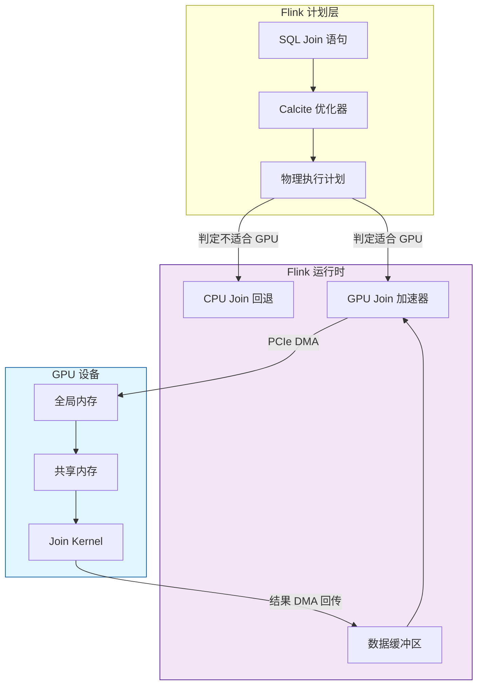
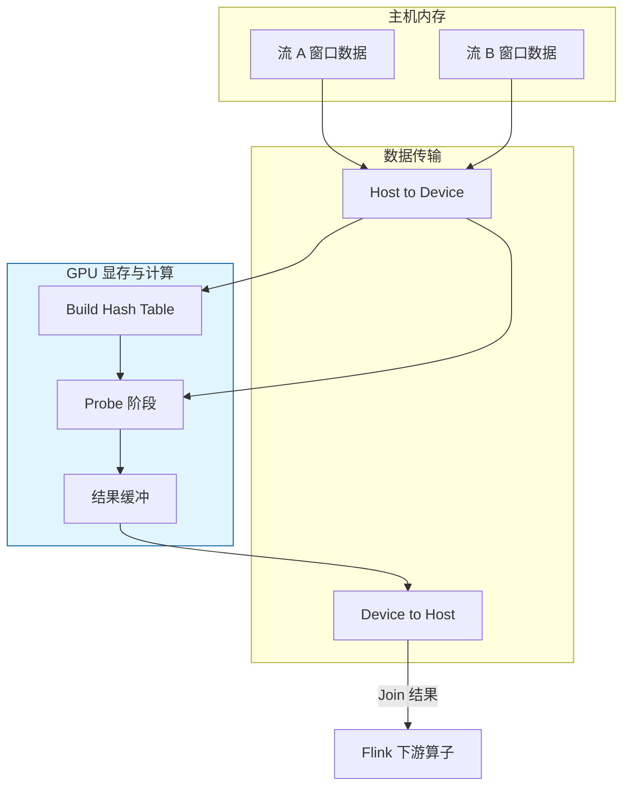

# GPU 加速流连接算法

> **所属阶段**: Knowledge/ | **前置依赖**: [hardware-accelerated-streaming.md](./hardware-accelerated-streaming.md), [flink-sql-calcite-optimizer-deep-dive.md](../Flink/03-api/03.02-table-sql-api/flink-sql-calcite-optimizer-deep-dive.md) | **形式化等级**: L4

---

## 1. 概念定义 (Definitions)

流连接（Stream Join）是流处理系统中最计算密集的算子之一。当连接的数据规模大、窗口宽、或者需要支持复杂的乱序处理时，CPU 架构往往难以满足低延迟和高吞吐的双重要求。GPU 凭借其大规模并行计算能力和高内存带宽，为流连接加速提供了新的可能性。

**Def-K-06-327 GPU 流连接 (GPU Stream Join)**

GPU 流连接是指利用 GPU 的大规模数据并行能力，在显存（Device Memory）中执行两个或多个数据流 $\mathcal{S}_A$ 和 $\mathcal{S}_B$ 的连接操作。形式上，设窗口 $W$ 内的数据分别为 $D_A$ 和 $D_B$，则连接结果为：

$$
Join_{GPU}(D_A, D_B, \theta) = \{ (a, b) \mid a \in D_A, b \in D_B, \theta(a, b) = \text{true} \}
$$

其中 $\theta$ 为连接谓词（如等值连接 $a.key = b.key$ 或范围连接 $|a.ts - b.ts| \leq \delta$）。

**Def-K-06-328 CUDA Warp 与线程协作 (CUDA Warp and Thread Cooperation)**

在 NVIDIA GPU 架构中，一个 Warp 包含 32 个线程，它们以 SIMT（Single Instruction, Multiple Threads）模式执行。Warp 内的线程可以高效地通过共享内存（Shared Memory）和 Warp Shuffle 原语协作。流连接算法通常按 Warp 或 Block 级别组织线程，以最大化内存访问的合并度（coalescing）。

**Def-K-06-329 连接核函数 (Join Kernel)**

连接核函数 $K_{join}$ 是在 GPU 上执行的 CUDA 函数，负责实现连接逻辑：

$$
K_{join}: D_A \times D_B \times \Theta \to R
$$

其中 $\Theta$ 为连接参数（键列索引、谓词类型、输出投影），$R$ 为连接结果集。核函数的输入数据通过主机-设备内存拷贝或统一内存（Unified Memory）传递。

**Def-K-06-330 批处理窗口 (Batch Window for GPU)**

GPU 连接需要足够大的数据批量以摊销核函数启动和数据传输开销。定义最小有效批大小 $B_{min}$ 为：

$$
B_{min} = \arg\min_{B} \left\{ T_{cpu}(B) \geq T_{gpu}(B) + T_{transfer}(B) \right\}
$$

其中 $T_{cpu}(B)$ 为 CPU 处理批量 $B$ 的时间，$T_{gpu}(B)$ 为 GPU 核函数执行时间，$T_{transfer}(B)$ 为数据传输时间。

**Def-K-06-331 内存访问模式 (Memory Access Pattern)**

GPU 连接性能高度依赖于内存访问模式。设全局内存访问步长为 $s$，则合并访问效率为：

$$
\eta_{coalesce}(s) =
\begin{cases}
1 & s = 1 \\
\frac{1}{s} & s > 1
\end{cases}
$$

通过将热点数据预取到共享内存（Shared Memory）或使用纹理内存（Texture Memory），可以显著提升 $\eta_{coalesce}$。

---

## 2. 属性推导 (Properties)

**Lemma-K-06-115 GPU 并行度上界**

设 GPU 有 $S$ 个 SM（Streaming Multiprocessor），每个 SM 最多可同时执行 $W$ 个 Warp，每个 Warp 有 $T$ 个线程。则 GPU 的理论最大活跃线程数为：

$$
N_{threads}^{max} = S \cdot W \cdot T
$$

对于现代 GPU（如 NVIDIA A100，$S=108$，$W=64$，$T=32$），$N_{threads}^{max} \approx 221,184$。

*说明*: 该引理解释了为什么 GPU 在处理大批量连接时具有数量级的并行优势。$\square$

**Lemma-K-06-116 共享内存加速比**

设全局内存访问延迟为 $L_{global}$，共享内存访问延迟为 $L_{shared}$（通常 $L_{shared} \approx L_{global} / 20 \sim L_{global} / 100$）。若连接算法可将 $p$ 比例的数据访问从全局内存转移到共享内存，则有效内存延迟降低为：

$$
L_{eff} = (1-p) \cdot L_{global} + p \cdot L_{shared}
$$

*说明*: 在等值连接中，将小表（Build Side）预加载到共享内存是常见的优化策略。$\square$

**Lemma-K-06-117 核函数启动开销的批量阈值**

设核函数启动开销为 $C_{launch}$，单条记录的处理时间为 $t_{record}$，批量大小为 $B$。则 GPU 处理的单记录均摊成本为：

$$
C_{avg}(B) = \frac{C_{launch}}{B} + t_{record} + \frac{D \cdot B}{B_{pcie}}
$$

其中 $D$ 为单条记录的数据量，$B_{pcie}$ 为 PCIe 带宽。当 $B$ 较小时，$C_{launch}/B$ 占主导；当 $B$ 较大时，$t_{record}$ 和传输成本占主导。

*说明*: 该引理揭示了存在一个最优批量大小 $B^*$，使得 $C_{avg}(B)$ 最小。$\square$

**Prop-K-06-118 GPU 在范围连接中的优势边界**

对于等值连接，GPU 的加速比通常为 5-20 倍；对于范围连接（如时间窗口 Join），由于分支发散和谓词求值复杂，加速比降至 2-5 倍。当连接谓词涉及复杂字符串匹配或嵌套子查询时，GPU 优势进一步缩小。

---

## 3. 关系建立 (Relations)

### 3.1 GPU Join 算法分类

| 算法类别 | 核心思想 | 最佳适用场景 | 代表工作 |
|---------|---------|------------|---------|
| **Nested Loop Join (NLJ)** | 每个线程负责外表面一条记录，遍历内表 | 小批量、复杂谓词 | EDBT 2024 Baseline |
| **Hash Join** | GPU 上构建 Hash Table，Probe 阶段并行查找 | 等值连接、大表 Join | CUDA Join (SIGMOD) |
| **Sort-Merge Join** | 先对键排序，再并行合并 | 范围连接、有序数据 | GPU-Merge (CIDR) |
| **Partitioned Join** | 按键分区后分块处理 | 超大规模 Join | Crystal (CIDR) |

### 3.2 GPU Join 与 Flink Table API 的集成点



### 3.3 CPU-GPU 混合执行策略

并非所有 Join 都适合 GPU 加速。混合执行策略的核心决策：

- **小批量/低延迟路径**: 保留在 CPU 执行（避免 GPU 启动和传输开销）
- **大批量/高吞吐路径**:  offload 到 GPU（充分利用并行计算能力）
- **状态后端同步**: GPU Join 结果需要与 Flink 的 Keyed State 保持一致，通常通过异步回调机制实现

---

## 4. 论证过程 (Argumentation)

### 4.1 为什么流连接是 GPU 加速的甜点？

流连接具有以下特性，使其天然适合 GPU 大规模并行架构：

1. **数据并行度高**: 连接谓词可以在不同记录对上独立求值，几乎没有数据依赖
2. **计算密集**: 尤其是 Hash Join 的 Probe 阶段，需要大量键比较和散列计算
3. **内存访问局部性好**: Build Side 表可被所有线程共享读取，符合 GPU 的广播读取模式
4. **批处理友好**: 窗口内的数据天然形成批量，满足 GPU 的最小有效批大小要求

### 4.2 GPU 流连接的主要工程挑战

**挑战 1: 数据在 CPU-GPU 间的频繁搬运**

若 Flink 的每个窗口都要将数据从主机内存拷贝到 GPU 显存，PCIe 带宽（32-64 GB/s）可能成为瓶颈。

**应对策略**:

- 使用统一内存（Unified Memory）或 GPU Direct RDMA，减少显式拷贝
- 合并多个小窗口为一个大批量后再提交给 GPU
- 在 GPU 上缓存 Build Side 表，仅传输变化的 Probe Side 数据

**挑战 2: 乱序数据导致分支发散**

GPU 的 SIMT 架构要求同 Warp 内的线程尽量执行相同指令路径。若连接谓词包含大量条件分支（如处理乱序数据的边界判断），会导致严重的 Warp Divergence，性能骤降。

**应对策略**:

- 在 GPU 核函数前进行数据预处理，将记录按分支路径分组（Branch Coalescing）
- 尽量将复杂条件逻辑保留在 CPU 端，GPU 只执行高度规则化的核心 Join

**挑战 3: Flink Checkpoint 与 GPU 状态的协同**

若 Build Side 的 Hash Table 构建在 GPU 显存中，Checkpoint 时需要将其持久化到稳定存储。

**应对策略**:

- 限制 GPU 上的状态生命周期，将长期状态保留在主机端（RocksDB/ForSt）
- GPU 仅作为"无状态计算加速器"，不维护跨 Checkpoint 的持久状态

### 4.3 反例：小批量流 Join 的 GPU 陷阱

某团队尝试将 Flink 的 1 秒滑动窗口 Join（每窗口平均 1000 条记录）offload 到 GPU。实测结果：

- CPU 处理时间: 0.5 ms
- GPU 核函数执行时间: 0.1 ms
- 数据拷贝时间 (H2D + D2H): 1.2 ms
- 总时间: 1.3 ms（比 CPU 慢 2.6 倍）

**教训**: 批量过小（< 10,000 条记录）时，PCIe 传输开销和核函数启动开销会完全吞噬 GPU 的计算优势。

---

## 5. 形式证明 / 工程论证 (Proof / Engineering Argument)

**Thm-K-06-119 GPU Hash Join 的线程级并行度上界**

设 Build Side 表大小为 $|B|$，Probe Side 表大小为 $|P|$，GPU 线程数为 $N_{threads}$。在最优调度下，GPU Hash Join 的理论最小执行时间为：

$$
T_{gpu}^{min} = \max\left( T_{build}, \frac{|P|}{N_{threads}} \cdot t_{probe} \right)
$

其中 $T_{build}$ 为 Build Side Hash Table 的构建时间，$t_{probe}$ 为单条 Probe 记录的平均处理时间。

*证明*:

Hash Join 分为两个阶段：Build 阶段和 Probe 阶段。Build 阶段需要对 Build Side 表扫描一次并插入 Hash Table，该阶段通常由所有线程协同完成，时间至少为 $T_{build}$。Probe 阶段需要对 Probe Side 表的每条记录执行 Hash 查找和谓词匹配，该阶段可完全并行化。$N_{threads}$ 个线程同时处理，每条记录耗时 $t_{probe}$，故 Probe 阶段最短时间为 $\frac{|P|}{N_{threads}} \cdot t_{probe}$。总时间由两个阶段的较大值决定。$\square$

---

**Thm-K-06-120 GPU 连接与 CPU 连接的交叉点定理**

设 CPU 处理批量 $B$ 的 Join 时间为 $T_{cpu}(B) = c_1 \cdot B^2$（Nested Loop）或 $T_{cpu}(B) = c_1 \cdot B$（Hash Join），GPU 处理时间为 $T_{gpu}(B) = c_2 \cdot B + C_{launch}$，传输时间为 $T_{transfer}(B) = c_3 \cdot B$。则 GPU 优于 CPU 的条件为：

$$
B \geq B^* = \frac{C_{launch}}{c_1 - c_2 - c_3}
$$

对于 Hash Join，$c_1 > c_2 + c_3$ 时存在有限正解 $B^*$；对于 Nested Loop，$c_1$ 可能随 $B$ 增长更快，$B^*$ 更低。

*证明*: 要求 $T_{cpu}(B) \geq T_{gpu}(B) + T_{transfer}(B)$。对于 Hash Join，代入线性模型：

$$
c_1 B \geq c_2 B + C_{launch} + c_3 B
$$

整理得 $B(c_1 - c_2 - c_3) \geq C_{launch}$。当 $c_1 > c_2 + c_3$ 时，$B \geq \frac{C_{launch}}{c_1 - c_2 - c_3} = B^*$。$\square$

---

**Thm-K-06-121 共享内存 Hash Table 的容量约束**

设 GPU Block 的共享内存容量为 $C_{sm}$（字节），Hash Table 的负载因子为 $\alpha$（$0 < \alpha \leq 1$），每条 Build Side 记录的平均大小为 $r$（字节）。则一个 Block 可直接在共享内存中缓存的 Build Side 表的最大记录数为：

$$
|B|*{sm}^{max} = \frac{C*{sm}}{r / \alpha}
$$

若 $|B| \leq |B|_{sm}^{max}$，则整个 Build Side 表可驻留共享内存，Probe 阶段无需访问全局内存。

*证明*: 共享内存总容量为 $C_{sm}$。Hash Table 的实际占用空间为 $|B| \cdot r / \alpha$（负载因子越低，空闲槽位越多）。要求 $|B| \cdot r / \alpha \leq C_{sm}$，整理即得 $|B|_{sm}^{max}$。$\square$

---

## 6. 实例验证 (Examples)

### 6.1 EDBT 2024 GPU Stream Join Benchmark

EDBT 2024 的一篇论文系统评测了 GPU 在流连接场景中的表现，关键发现：

- **等值 Hash Join**: GPU 相对于 32 核 CPU 的加速比为 8-15 倍（批量 > 100K 记录）
- **范围 Join**: 加速比降至 3-5 倍，主要受限于分支发散和全局内存随机访问
- **时间窗口 Join**: 当窗口内记录数 > 500K 时，GPU 开始展现明显优势

```
┌─────────────────┬────────────┬────────────┬────────────┐
│   Join 类型      │  CPU (ms)  │  GPU (ms)  │  加速比    │
├─────────────────┼────────────┼────────────┼────────────┤
│ 等值 Hash Join  │    120     │     10     │    12x     │
│ 范围 Join       │    200     │     50     │    4x      │
│ 窗口 Join (1M)  │    800     │     80     │    10x     │
│ 窗口 Join (10K) │      5     │     12     │   0.4x     │
└─────────────────┴────────────┴────────────┴────────────┘
```

### 6.2 CUDA Hash Join 核函数实现

以下是一个简化的 GPU 等值连接核函数：

```cuda
__global__ void hashJoinKernel(
    const int* buildKeys,
    const int* buildPayloads,
    int buildSize,
    const int* probeKeys,
    const int* probePayloads,
    int probeSize,
    int* resultCount,
    int2* results,
    int maxResults
) {
    // 每个线程处理 Probe Side 的一条记录
    int tid = blockIdx.x * blockDim.x + threadIdx.x;
    if (tid >= probeSize) return;

    int probeKey = probeKeys[tid];

    // 线性探测 Hash Table（简化示例）
    for (int i = 0; i < buildSize; i++) {
        if (buildKeys[i] == probeKey) {
            int idx = atomicAdd(resultCount, 1);
            if (idx < maxResults) {
                results[idx] = make_int2(buildPayloads[i], probePayloads[tid]);
            }
        }
    }
}

// 主机端调用示例
int threadsPerBlock = 256;
int blocksPerGrid = (probeSize + threadsPerBlock - 1) / threadsPerBlock;
hashJoinKernel<<<blocksPerGrid, threadsPerBlock>>>(
    d_buildKeys, d_buildPayloads, buildSize,
    d_probeKeys, d_probePayloads, probeSize,
    d_resultCount, d_results, maxResults
);
```

> 注意：生产级实现应使用更高效的开放寻址法或链地址法，并配合共享内存缓存 Build Side。

### 6.3 Flink 与 GPU Join 的集成模式

```java
/**
 * Flink 自定义 GPU Join 算子
 * 当窗口数据量超过阈值时，offload 到 GPU 执行
 */
public class GPUStreamJoinFunction extends CoProcessFunction<EventA, EventB, JoinResult> {

    private static final int GPU_OFFLOAD_THRESHOLD = 100000;
    private transient GPUJoinContext gpuContext;

    @Override
    public void open(Configuration parameters) {
        gpuContext = new GPUJoinContext();
    }

    @Override
    public void processElement1(EventA left, Context ctx, Collector<JoinResult> out) {
        // 将事件加入左侧状态缓冲区
        // 当 Watermark 推进到窗口边界时触发 Join
    }

    @Override
    public void processElement2(EventB right, Context ctx, Collector<JoinResult> out) {
        // 同理处理右侧事件
    }

    private void executeJoin(List<EventA> leftBuffer, List<EventB> rightBuffer,
                             Collector<JoinResult> out) {
        if (leftBuffer.size() + rightBuffer.size() > GPU_OFFLOAD_THRESHOLD) {
            // GPU 路径
            List<JoinResult> gpuResults = gpuContext.join(
                leftBuffer, rightBuffer, "keyA = keyB"
            );
            gpuResults.forEach(out::collect);
        } else {
            // CPU 路径（嵌套循环或 Hash Join）
            cpuJoin(leftBuffer, rightBuffer, out);
        }
    }
}
```

---

## 7. 可视化 (Visualizations)

### 7.1 GPU Hash Join 数据流



### 7.2 CPU vs GPU Join 的批量-延迟曲线

```mermaid
xychart-beta
    title "批量大小对 Join 延迟的影响"
    x-axis "批量大小 (记录数)" [1K, 10K, 100K, 500K, 1M, 5M]
    y-axis "延迟 (ms)" 0 --> 1000
    line "CPU Hash Join" {10, 15, 50, 200, 400, 2000}
    line "GPU Hash Join" {12, 14, 18, 35, 50, 180}
    line "GPU 总延迟(含传输)" {15, 20, 25, 45, 65, 220}
```

*说明*: 在批量 < 100K 时，GPU 含传输的总延迟可能高于 CPU；当批量 > 500K 时，GPU 优势显著。

---

## 8. 引用参考 (References)

[^1]: EDBT 2024 Benchmark, "GPU-Accelerated Stream Joins".
[^2]: He et al., "Relational Joins on GPUs: A Closer Look", IEEE TPDS, 2020.
[^3]: NVIDIA CUDA C Programming Guide, "Memory Hierarchy", 2025. https://docs.nvidia.com/cuda/
[^4]: Apache Flink Documentation, "Joins in Continuous Queries", 2025. https://nightlies.apache.org/flink/flink-docs-stable/docs/dev/table/sql/queries/joins/
[^5]: Shanbhag et al., "Large-Scale In-Memory Analytics on GPUs", IEEE Data Eng. Bull., 2019.
[^6]: CUDA Best Practices Guide, "Coalesced Access to Global Memory", 2025.
[^7]: Akidau et al., "The Dataflow Model", PVLDB 8(12), 2015.
