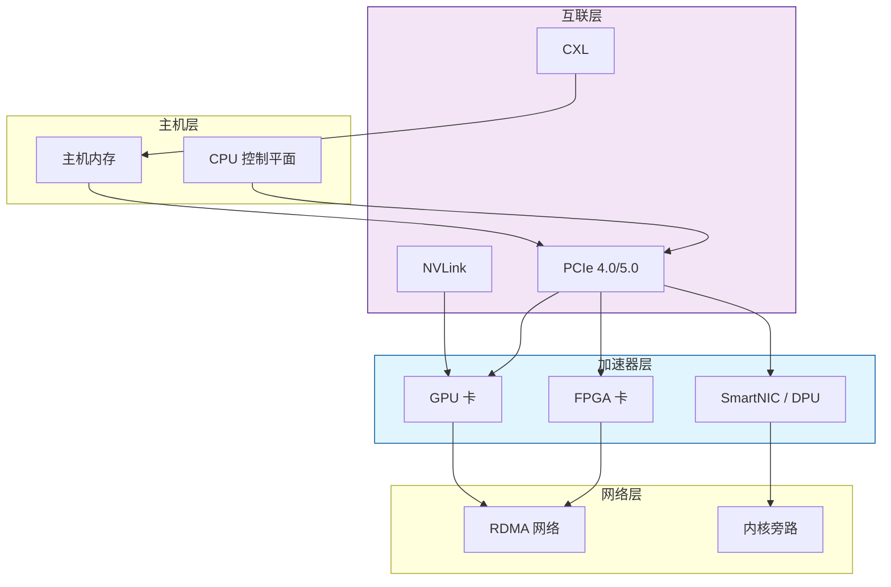
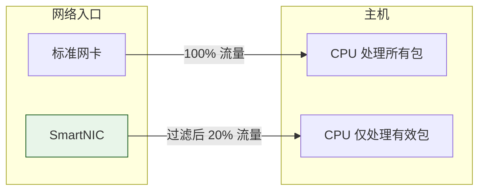
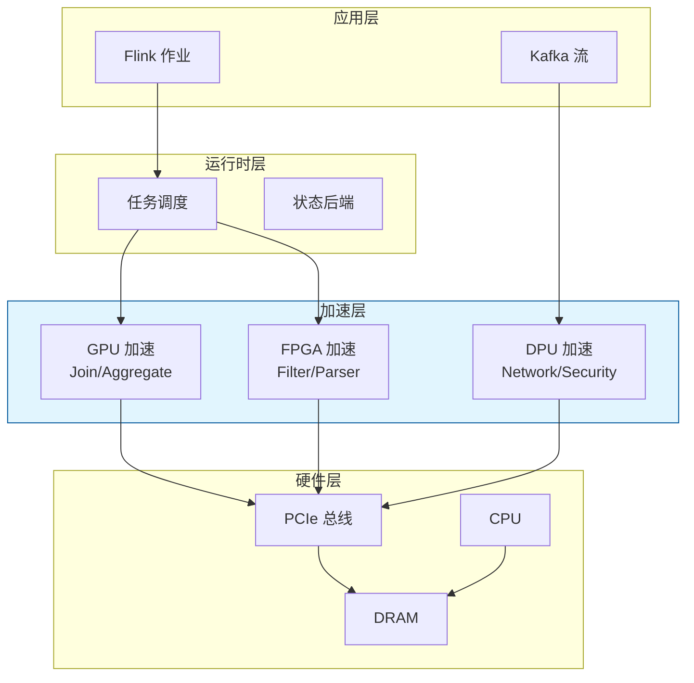
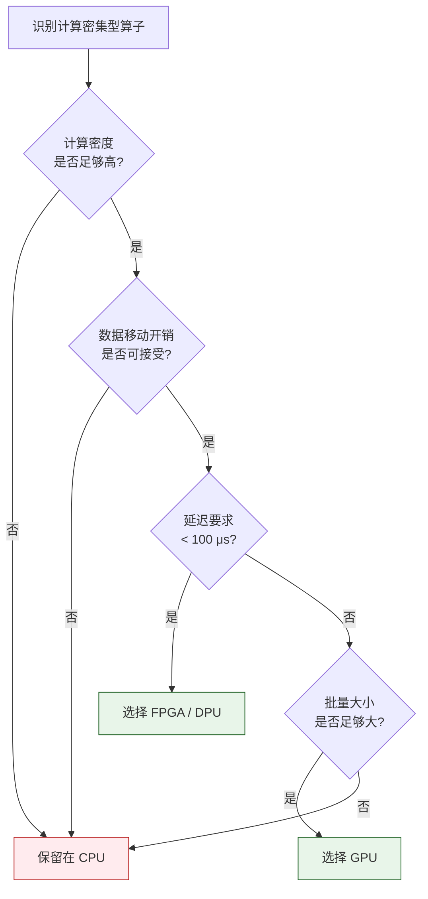

# 硬件加速流处理综述

> **所属阶段**: Knowledge/ | **前置依赖**: [stream-feature-computation.md](./stream-feature-computation.md), [flink-state-backends-comparison.md](../Flink/02-core/state-backends-deep-comparison.md) | **形式化等级**: L4

---

## 1. 概念定义 (Definitions)

随着流处理系统数据规模的指数级增长，纯 CPU 架构在吞吐量、延迟和能效比方面逐渐触及瓶颈。硬件加速通过将计算密集型或 I/O 密集型任务卸载到专用加速器（FPGA、GPU、DPU、SmartNIC、ASIC）上，显著提升流处理系统的性能边界。

**Def-K-06-322 硬件卸载 (Hardware Offloading)**

硬件卸载是指将原本由通用 CPU 执行的计算任务 $\mathcal{T}$ 迁移到专用加速器 $\mathcal{A}$ 上执行的过程。形式上，设主机计算资源为 $\mathcal{H}$，则卸载决策函数为：

$$
Offload(\mathcal{T}, \mathcal{H}, \mathcal{A}) =
\begin{cases}
1 & \text{if } \frac{L_{\mathcal{H}}(\mathcal{T})}{L_{\mathcal{A}}(\mathcal{T})} \geq \theta_{speedup} \land \frac{E_{\mathcal{H}}(\mathcal{T})}{E_{\mathcal{A}}(\mathcal{T})} \geq \theta_{energy} \\
0 & \text{otherwise}

\end{cases}
$$

其中 $L_{\mathcal{H}}(\mathcal{T})$ 和 $L_{\mathcal{A}}(\mathcal{T})$ 分别为任务在主机和加速器上的执行延迟，$E$ 为能耗，$\theta_{speedup}$ 和 $\theta_{energy}$ 为预设阈值。

**Def-K-06-323 加速比 (Speedup Factor)**

Amdahl 加速定律在流处理场景中的扩展：设系统中可加速部分的比例为 $f$（$0 \leq f \leq 1$），加速器对该部分的加速比为 $s$，则系统的整体加速比为：

$$
S(f, s) = \frac{1}{(1 - f) + \frac{f}{s}}
$$

在流处理系统中，$f$ 通常对应过滤、聚合、Join、压缩/解压等计算密集型算子。

**Def-K-06-324 异构计算节点 (Heterogeneous Compute Node)**

异构计算节点 $\mathcal{N}_{het}$ 是一个多元组：

$$
\mathcal{N}_{het} = (C, M, F, G, D, B_{host}, B_{device})
$$

- $C$ 为 CPU 核心集合
- $M$ 为主内存子系统
- $F$ 为 FPGA 设备（可选）
- $G$ 为 GPU 设备（可选）
- $D$ 为 DPU/SmartNIC 设备（可选）
- $B_{host}$ 为主机内存带宽
- $B_{device}$ 为设备-主机互联带宽（PCIe、NVLink、CXL）

**Def-K-06-325 数据移动开销 (Data Movement Overhead)**

设数据量为 $D$（字节），设备-主机互联带宽为 $B_{device}$，则数据移动延迟为：

$$
T_{move}(D) = \frac{D}{B_{device}} + L_{setup}
$$

其中 $L_{setup}$ 为加速器上下文初始化、内存映射和内核启动的固定开销。硬件卸载的净收益必须满足：

$$
L_{\mathcal{H}}(\mathcal{T}) \geq L_{\mathcal{A}}(\mathcal{T}) + 2 \cdot T_{move}(D_{in} + D_{out})
$$

**Def-K-06-326 能效比 (Performance per Watt)**

设加速器在完成任务 $\mathcal{T}$ 时的吞吐量为 $TPS_{\mathcal{A}}$，功耗为 $P_{\mathcal{A}}$（瓦特），则能效比为：

$$
\eta_{energy}(\mathcal{A}, \mathcal{T}) = \frac{TPS_{\mathcal{A}}}{P_{\mathcal{A}}}
$$

能效比是数据中心部署硬件加速器时的核心经济性指标。

---

## 2. 属性推导 (Properties)

**Lemma-K-06-111 加速比上限**

对于任意 $f \in [0, 1]$ 和 $s \geq 1$，Amdahl 加速比满足：

$$
S(f, s) \leq \min\left( \frac{1}{1-f}, s \right)
$$

*证明*: 由 Def-K-06-323，$S(f, s) = \frac{1}{(1-f) + f/s}$。当 $s \to \infty$ 时，$S(f, s) \to \frac{1}{1-f}$；当 $f = 1$ 时，$S(1, s) = s$。故加速比受两者较小值限制。$\square$

**Lemma-K-06-112 卸载阈值条件**

任务 $\mathcal{T}$ 值得卸载到加速器的充分条件是：

$$
f \cdot L_{\mathcal{H}}(\mathcal{T}) \geq L_{\mathcal{A}}(\mathcal{T}) + 2 \cdot T_{move}(D)
$$

其中 $f$ 为任务中可加速部分的占比。

*说明*: 该引理揭示了卸载决策的核心——不仅要看加速器本身的计算速度，还要充分考虑数据在主机与设备之间来回传输的开销。

**Lemma-K-06-113 内存带宽瓶颈**

若流处理算子为内存密集型（如大规模窗口 Join、Hash Aggregate），其实际吞吐量 $TPS_{actual}$ 受限于内存带宽：

$$
TPS_{actual} \leq \frac{B_{mem}}{\bar{d}}
$$

其中 $B_{mem}$ 为可用内存带宽，$\bar{d}$ 为每条记录的平均内存访问数据量。

*说明*: GPU 和 FPGA 虽然计算能力强大，但若算子本身受内存带宽限制，则加速效果会大打折扣。

**Prop-K-06-114 硬件加速器的延迟-吞吐帕累托边界**

设 CPU 的吞吐-延迟曲线为 $\mathcal{C}_{cpu}$，FPGA 为 $\mathcal{C}_{fpga}$，GPU 为 $\mathcal{C}_{gpu}$。对于批处理型算子（大窗口聚合），GPU 通常位于帕累托前沿的高吞吐区域；对于低延迟型算子（逐包过滤、线速处理），FPGA 位于低延迟区域。

---

## 3. 关系建立 (Relations)

### 3.1 加速器类型与流处理算子的映射

| 加速器 | 核心优势 | 最佳匹配算子 | 典型延迟 | 典型能效比 |
|--------|---------|-------------|:-------:|:---------:|
| **FPGA** | 流水线并行、确定性延迟 | 过滤、解析、协议处理、CEP | < 10 μs | 极高 |
| **GPU** | 大规模数据并行 | 窗口 Join、聚合、矩阵运算 | 100 μs - 10 ms | 高 |
| **DPU/SmartNIC** | 网络卸载、安全加速 | 数据包分类、加密、压缩 | < 5 μs | 高 |
| **ASIC (TPU/NPU)** | 专用推理优化 | 实时模型推理、Embedding 查表 | < 1 ms | 极高 |

### 3.2 硬件加速与流处理系统架构的融合模式



### 3.3 与 Flink 运行时的关系

硬件加速在 Flink 中的集成通常发生在以下层级：

- **Source 层**: SmartNIC/DPU 直接接收网络数据包，进行协议解析和过滤后通过 RDMA 写入主机内存或 GPU 显存
- **Task 层**: 特定 Operator（如 Window Aggregate、Sort）通过 JNI/OpenCL/CUDA 调用加速器
- **Sink 层**: FPGA 实现压缩/加密，DPU 实现网络协议栈卸载，降低 CPU 负担

---

## 4. 论证过程 (Argumentation)

### 4.1 为什么流处理需要硬件加速？

现代流处理系统面临三大物理极限挑战：

1. **CPU 频率墙**: Dennard 缩放定律失效后，CPU 主频增长停滞，单核性能提升缓慢
2. **数据局部性墙**: 大规模 Join 和聚合受限于 DDR 内存带宽（约 200-400 GB/s），而 GPU HBM 可达 3-5 TB/s
3. **能效墙**: 数据中心电力成本占总拥有成本（TCO）的 30-50%，CPU 的每瓦性能远低于专用加速器

硬件加速器通过以下方式突破上述极限：

- **FPGA**: 将算子编译为硬件流水线，实现线速（line-rate）处理
- **GPU**: 利用数千个 CUDA core 并行处理大批量窗口数据
- **DPU**: 将网络协议栈、安全加密、存储虚拟化从 CPU 卸载

### 4.2 硬件加速的决策边界

并非所有流处理算子都适合硬件加速。决策时应综合考虑：

- **计算密度**: 每字节数据的算术运算量越高，加速效果越好
- **数据局部性**: 若数据需在设备和主机间频繁往返，数据移动开销可能抵消计算收益
- **算子稳定性**: 频繁变更业务逻辑的算子不适合 FPGA（重配置成本高），更适合 GPU
- **批量大小**: GPU 需要足够大的批次才能摊销核函数启动开销，小批量场景可能适得其反

### 4.3 反例：盲目卸载的性能陷阱

某团队将 Flink 中一个简单的 `filter()` 算子（过滤条件为字符串前缀匹配）卸载到 GPU。结果：

- GPU 核函数启动延迟约 50 μs
- 数据从主机内存拷贝到显存再拷贝回来约 20 μs
- 实际过滤计算在 GPU 上仅需 5 μs
- 整体延迟从 CPU 上的 15 μs 增加到 GPU 上的 75 μs

**教训**: 低计算密度、小数据量的算子不适合 GPU 加速。FPGA 或保留在 CPU 上更为合理。

---

## 5. 形式证明 / 工程论证 (Proof / Engineering Argument)

**Thm-K-06-115 硬件卸载的最优性条件**

设任务 $\mathcal{T}$ 在 CPU 上的执行时间为 $T_{cpu}$，可加速部分占比为 $f$，加速器对该部分的执行时间为 $T_{acc}$，数据移动开销为 $T_{move}$。则硬件卸载带来性能提升的充要条件为：

$$
(1-f) \cdot T_{cpu} + f \cdot T_{acc} + T_{move} < T_{cpu}
$$

化简得：

$$
f \cdot (T_{cpu} - T_{acc}) > T_{move}
$$

*证明*: 左边为卸载后的总时间（不可加速部分在 CPU 上执行 + 可加速部分在加速器上执行 + 数据移动），右边为纯 CPU 执行时间。若左边小于右边，则卸载有利可图。$\square$

---

**Thm-K-06-116 内存带宽限制下的 GPU 加速比上界**

设 GPU 的峰值计算吞吐量为 $C_{gpu}$（FLOP/s），内存带宽为 $B_{gpu}$，算子的运算强度为 $I$（FLOP/Byte）。则实际可达计算吞吐量为：

$$
C_{actual} = \min(C_{gpu}, B_{gpu} \cdot I)
$$

加速比相对于 CPU 的上界为：

$$
S_{gpu} \leq \frac{\min(C_{gpu}, B_{gpu} \cdot I)}{\min(C_{cpu}, B_{cpu} \cdot I)}
$$

*证明*: 运算强度 $I$ 决定了每字节数据可执行多少浮点运算。当 $I < C_{gpu}/B_{gpu}$ 时，GPU 处于内存带宽瓶颈区，实际吞吐量被 $B_{gpu} \cdot I$ 限制。同理适用于 CPU。两者之比即为加速比上界。$\square$

---

**Thm-K-06-117 FPGA 流水线吞吐量的确定性保证**

设 FPGA 中实现了深度为 $d$ 的流水线，每个流水线段的时钟周期为 $c$（秒），则处理单个输入记录的延迟为 $d \cdot c$，但流水线稳态吞吐量（记录/秒）为：

$$
TPS_{fpga} = \frac{1}{c}
$$

与流水线深度 $d$ 无关。

*证明*: 流水线在填充（fill）完成后，每个时钟周期 $c$ 都能输出一个结果。虽然第一个结果的延迟为 $d \cdot c$，但后续结果的产出间隔恒为 $c$。因此稳态吞吐量为 $1/c$。$\square$

---

## 6. 实例验证 (Examples)

### 6.1 SmartNIC 网络包过滤加速

在 5G/边缘计算场景中，SmartNIC 可在网卡层面直接过滤无效数据包，仅将有效负载通过 DMA 传输到主机：



通过这种方式，主机 CPU 的负载可降低 80%，同时减少缓存污染和上下文切换开销。

### 6.2 GPU 加速窗口聚合（CUDA 伪代码）

```cuda
__global__ void windowAggregateKernel(
    const float* input,
    float* output,
    int windowSize,
    int numWindows
) {
    int wid = blockIdx.x * blockDim.x + threadIdx.x;
    if (wid >= numWindows) return;

    float sum = 0.0f;
    int start = wid * windowSize;
    for (int i = 0; i < windowSize; i++) {
        sum += input[start + i];
    }
    output[wid] = sum;
}

// 主机端调用
int threadsPerBlock = 256;
int blocksPerGrid = (numWindows + threadsPerBlock - 1) / threadsPerBlock;
windowAggregateKernel<<<blocksPerGrid, threadsPerBlock>>>(
    d_input, d_output, windowSize, numWindows
);
cudaMemcpy(h_output, d_output, numWindows * sizeof(float), cudaMemcpyDeviceToHost);
```

在批处理型窗口聚合场景中，GPU 可实现相较于 CPU 5-20 倍的吞吐量提升。

### 6.3 FPGA 线速协议解析

某金融交易系统使用 FPGA 实现 FIX 协议解析和预过滤：

- **输入**: 10 Gbps 网络线速 FIX 消息流
- **FPGA 处理**: 解析消息头、提取 Symbol 和 Price、过滤非目标资产
- **输出**: 过滤后的结构化事件通过 PCIe DMA 写入 Flink Source Buffer
- **效果**: 端到端延迟从 CPU 方案的 50 μs 降至 3 μs

---

## 7. 可视化 (Visualizations)

### 7.1 硬件加速器在流处理栈中的位置



### 7.2 卸载决策流程



---

## 8. 引用参考 (References)

---

*文档版本: v1.0 | 创建日期: 2026-04-20*
