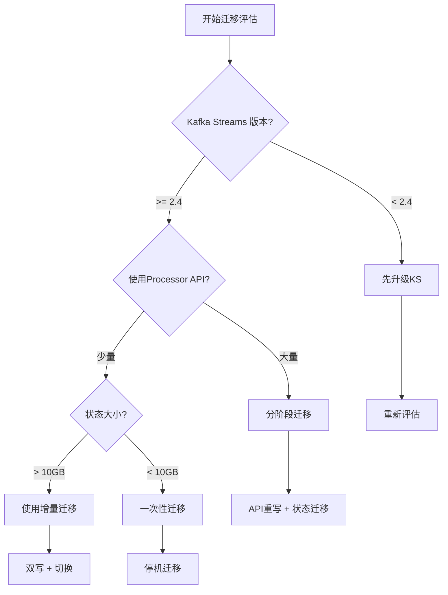
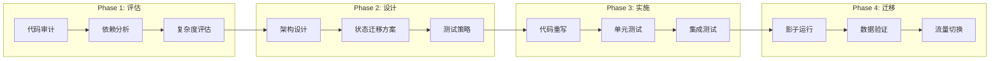

# Kafka Streams 迁移到 Flink 完整指南

> **所属阶段**: Knowledge/ | **前置依赖**: [Flink vs Kafka Streams 对比](../Flink/09-practices/09.03-performance-tuning/05-vs-competitors/flink-vs-kafka-streams.md) | **形式化等级**: L4

---

## 1. 概念定义 (Definitions)

### Def-K-KS-01: Kafka Streams 核心抽象

**定义**: Kafka Streams 的核心编程抽象包括：

```
KStream: 记录流 (无界, 无更新语义)
KTable: 变更日志流 (有更新语义)
GlobalKTable: 全局广播表
```

### Def-K-KS-02: 语义映射

**定义**: Kafka Streams 到 Flink 的概念映射关系：

| Kafka Streams | Flink 等价物 | 说明 |
|---------------|--------------|------|
| KStream | DataStream | 无界数据流 |
| KTable | Table / Dynamic Table | 带更新语义的流 |
| Topology | JobGraph | 执行拓扑 |
| Processor API | ProcessFunction | 底层API |
| DSL | Table API | 高级DSL |

---

## 2. 属性推导 (Properties)

### 迁移复杂度分析

**影响迁移复杂度的因素**:

```
复杂度 = f(自定义处理器数量, 状态存储复杂度, 窗口类型多样性, 外部集成数量)
```

| 因素 | 低复杂度 | 高复杂度 |
|------|----------|----------|
| 处理器类型 | 仅DSL | 大量自定义Processor |
| 状态存储 | 简单K/V | 复杂聚合状态 |
| 窗口 | 仅Tumbling | Session/Custom |
| 外部系统 | 仅Kafka | 多系统集成 |

---

## 3. 关系建立 (Relations)

### API 映射关系图

```mermaid
graph LR
    subgraph "Kafka Streams DSL"
        KS1[stream()]
        KS2[filter()]
        KS3[map()]
        KS4[groupByKey()]
        KS5[aggregate()]
        KS6[to()]
    end

    subgraph "Flink Table API"
        F1[CREATE TABLE]
        F2[WHERE]
        F3[SELECT]
        F4[GROUP BY]
        F5[AGGREGATION]
        F6[INSERT INTO]
    end

    KS1 --> F1
    KS2 --> F2
    KS3 --> F3
    KS4 --> F4
    KS5 --> F5
    KS6 --> F6
```

---

## 4. 论证过程 (Argumentation)

### 迁移决策框架



---

## 5. 形式证明 / 工程论证 (Proof / Engineering Argument)

### 状态迁移正确性论证

**目标**: 保证迁移过程中不丢失状态，且状态一致性保持。

**迁移策略**:

| 策略 | 停机时间 | 数据一致性 | 适用场景 |
|------|----------|------------|----------|
| 停机迁移 | 分钟级 | 完全一致 | 小状态、低SLA |
| 双写迁移 | 零 | 最终一致 | 大状态、高SLA |
| 快照迁移 | 秒级 | 快照点一致 | 中等状态 |

**双写迁移流程**:

```
Phase 1: 部署Flink作业,双写Kafka
    KS → Kafka → Flink → 新Topic

Phase 2: 状态对齐验证
    对比KS和Flink输出

Phase 3: 切换读路径
    消费者切换到新Topic

Phase 4: 下线KS
    停止KS作业
```

---

## 6. 实例验证 (Examples)

### 示例 1: 简单转换迁移

**Kafka Streams 代码**:

```java
// [伪代码片段 - 不可直接运行] 仅展示核心逻辑
KStream<String, Order> orders = builder.stream("orders");

orders.filter((key, order) -> order.getAmount() > 100)
    .mapValues(order -> {
        order.setStatus("HIGH_VALUE");
        return order;
    })
    .to("high-value-orders");
```

**Flink 等效代码**:

```java

// [伪代码片段 - 不可直接运行] 仅展示核心逻辑
import org.apache.flink.streaming.api.datastream.DataStream;

// DataStream API
DataStream<Order> orders = env.fromKafka("orders", ...);

orders.filter(order -> order.getAmount() > 100)
    .map(order -> {
        order.setStatus("HIGH_VALUE");
        return order;
    })
    .toKafka("high-value-orders", ...);

// 或 Table API
Table orders = tableEnv.from("orders");

tableEnv.executeSql(
    "INSERT INTO high_value_orders " +
    "SELECT * FROM orders WHERE amount > 100"
);
```

### 示例 2: 窗口聚合迁移

**Kafka Streams 代码**:

```java
// [伪代码片段 - 不可直接运行] 仅展示核心逻辑
KTable<Windowed<String>, Long> counts = orders
    .groupByKey()
    .windowedBy(TimeWindows.of(Duration.ofMinutes(5)))
    .count(Materialized.as("order-counts"));
```

**Flink 等效代码**:

```sql
-- Flink SQL
CREATE TABLE order_counts (
    user_id STRING,
    window_start TIMESTAMP(3),
    window_end TIMESTAMP(3),
    order_count BIGINT,
    PRIMARY KEY (user_id, window_start) NOT ENFORCED
) WITH (...);

INSERT INTO order_counts
SELECT
    user_id,
    window_start,
    window_end,
    COUNT(*) as order_count
FROM TABLE(
    TUMBLE(TABLE orders, DESCRIPTOR(event_time), INTERVAL '5' MINUTES)
)
GROUP BY user_id, window_start, window_end;
```

### 示例 3: 状态存储迁移

**状态导出脚本**:

```python
# 导出 Kafka Streams 状态
# 使用 Kafka Streams 的 Interactive Queries

# 1. 读取 RocksDB 状态
# 2. 序列化为 Parquet/JSON
# 3. 写入 Flink 支持的格式

import rocksdb
import pyarrow.parquet as pq

def export_rocksdb_to_parquet(db_path: str, output_path: str):
    db = rocksdb.DB(db_path, rocksdb.Options())
    # 遍历并导出
    for key, value in db.iteritems():
        # 转换格式
        pass
```

---

## 7. 可视化 (Visualizations)

### 迁移流程图



---

## 8. 引用参考 (References)


---

*本文档遵循 AnalysisDataFlow 六段式模板规范*
