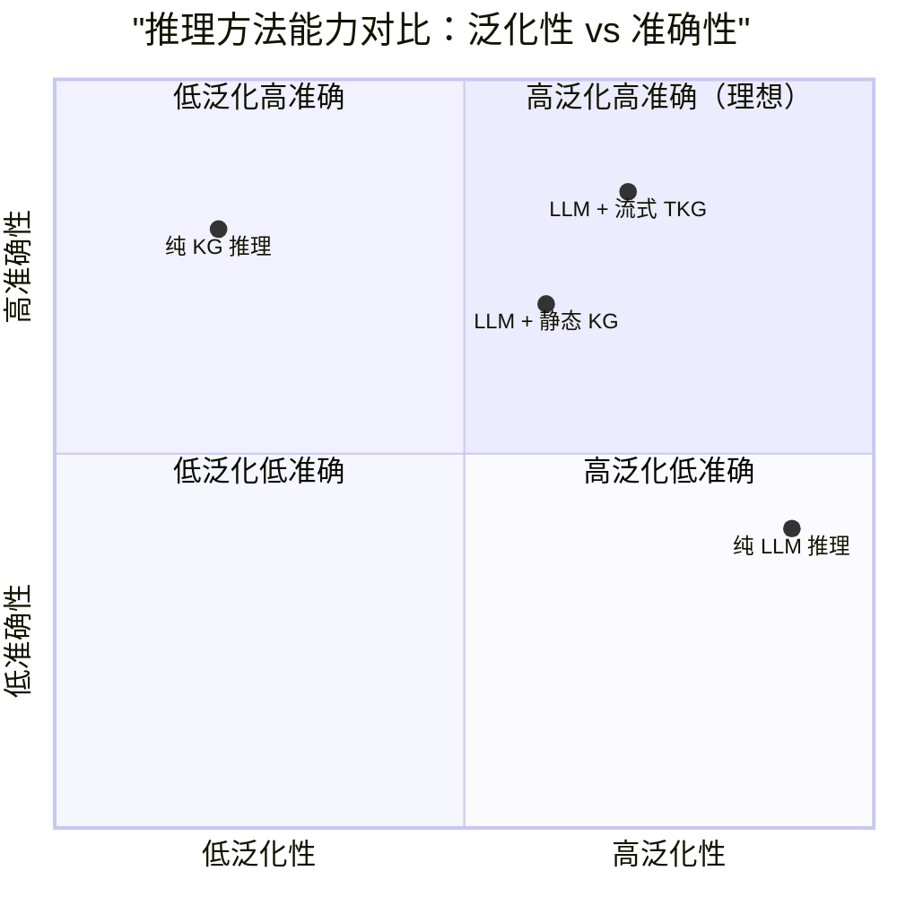
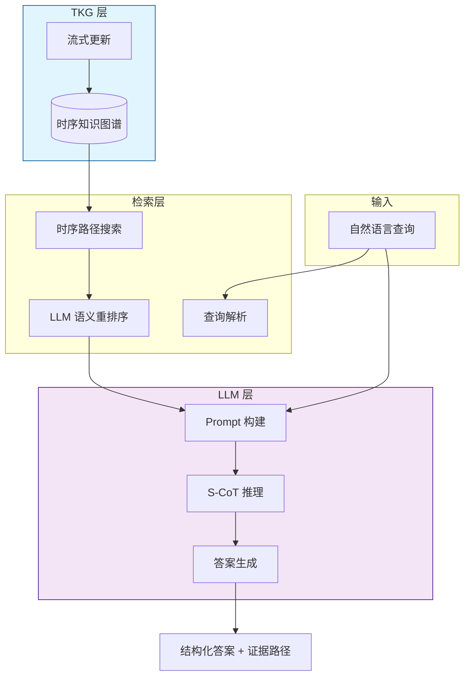
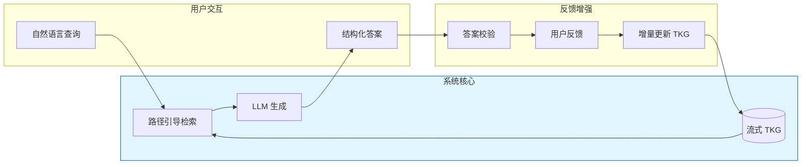
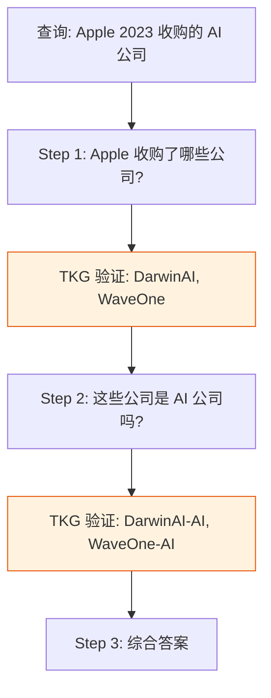

# LLM 与知识图谱结合的流式推理

> **所属阶段**: Knowledge/ | **前置依赖**: [temporal-kg-reasoning.md](./temporal-kg-reasoning.md), [tkg-stream-updates.md](./tkg-stream-updates.md) | **形式化等级**: L4

---

## 1. 概念定义 (Definitions)

大语言模型（LLM）拥有强大的语义理解和生成能力，但在处理结构化知识、实时事实更新和复杂多跳推理时容易出现"幻觉"（Hallucination）。
知识图谱（KG）则提供结构化、可解释的知识表示，但缺乏自然语言理解和泛化能力。
将 LLM 与流式 TKG 结合，可以通过"检索增强生成"（RAG）和"路径引导推理"（Path-Guided Reasoning）实现优势互补。
Follow the Path（2025）等工作提出了专门针对流式场景的 LLM+KG 推理框架。

**Def-K-06-350 LLM 增强流式推理 (LLM-Augmented Stream Reasoning)**

LLM 增强流式推理 $\mathcal{L}_{stream}$ 是一个三元组：

$$
\mathcal{L}_{stream} = (\mathcal{M}, \mathcal{R}, \mathcal{G}_t)
$$

其中 $\mathcal{M}$ 为大语言模型，$\mathcal{R}$ 为检索模块，$\mathcal{G}_t$ 为时刻 $t$ 的时序知识图谱。对于输入查询 $q$，系统首先通过 $\mathcal{R}$ 从 $\mathcal{G}_t$ 中检索相关子图或路径，然后将检索结果作为上下文输入 $\mathcal{M}$ 生成最终答案。

**Def-K-06-351 路径引导检索 (Path-Guided Retrieval, PGR)**

路径引导检索是一种两阶段检索策略：

1. **符号路径搜索**: 在 TKG 中使用时序路径搜索算法（如 EVOREASONER）找到从查询主体到候选答案的 $k$ 条最优路径
2. **语义重排序**: 使用 LLM 或嵌入模型对路径进行语义相关性评分，筛选出最相关的路径作为上下文

形式化地，PGR 输出：

$$
\text{PGR}(q, \mathcal{G}_t) = \{(P_i, score_i) : i = 1, \dots, k, score_i = \mathcal{M}_{rerank}(q, P_i)\}
$$

**Def-K-06-352 流式思维链 (Streaming Chain-of-Thought, S-CoT)**

S-CoT 是一种适应流式场景的推理格式，其中 LLM 的推理过程被分解为与 TKG 更新事件同步的步骤：

$$
\text{S-CoT}(q, \mathcal{G}_t) = \langle c_1, c_2, \dots, c_n \rangle
$$

每一步 $c_i$ 对应一个推理子目标，且每个子目标都通过 PGR 从当前 $\mathcal{G}_t$ 中检索证据进行验证。当 $\mathcal{G}_t$ 更新时，受影响的推理步骤可被增量修正。

**Def-K-06-353 LLM 时序上下文窗口 (Temporal Context Window for LLM)**

由于 LLM 的上下文长度有限，流入 TKG 的海量事实无法全部输入。时序上下文窗口 $C_{llm}(t)$ 定义了在时刻 $t$ 被选中送入 LLM 的事实集合：

$$
C_{llm}(t) = \text{TopK}_{relevance}\left(\{(P_i, \tau_i) : P_i \in \mathcal{G}_t, \tau_i \in [t - \delta_{ctx}, t]\}\right)
$$

其中 $\delta_{ctx}$ 为上下文回溯深度，$\text{TopK}_{relevance}$ 按路径与查询的相关性排序取 Top-K。

---

## 2. 属性推导 (Properties)

**Lemma-K-06-129 路径相关性单调性**

若在时刻 $t$ 路径 $P$ 与查询 $q$ 的相关性评分为 $score(P, q, t)$，且 $P$ 所涉及的事实集合在 $[t, t']$ 内未发生变化，则：

$$
score(P, q, t') = score(P, q, t)
$$

*说明*: 未受 TKG 更新影响的路径，其相关性评分稳定，无需重新计算。这支持了流式场景下的缓存优化。$\square$

**Lemma-K-06-130 检索增强的幻觉抑制**

设 LLM 在没有检索上下文时生成错误答案的概率为 $p_{hallucinate}$，在有检索上下文时为 $p_{hallucinate}^{RAG}$。若检索上下文包含查询的正确答案证据，则：

$$
p_{hallucinate}^{RAG} \leq p_{hallucinate} \cdot (1 - \eta)
$$

其中 $\eta \in (0, 1)$ 为检索增强的幻觉抑制系数，与检索准确率和上下文利用率正相关。

*说明*: 该引理量化了 KG 对 LLM 幻觉问题的缓解作用。$\square$

**Prop-K-06-128 LLM 推理延迟与准确率的权衡**

设路径引导检索返回 $k$ 条路径，LLM 生成长度为 $L$ 的回复。则总延迟为：

$$
T_{total} = T_{retrieve}(k) + T_{LLM}(|C_{llm}|, L)
$$

其中 $T_{LLM}$ 随上下文长度 $|C_{llm}|$ 近似线性增长。增加 $k$ 可提升准确率，但会显著增加延迟。

---

## 3. 关系建立 (Relations)

### 3.1 LLM+KG 与纯 LLM / 纯 KG 推理的对比



### 3.2 流式 LLM+KG 架构



### 3.3 主流 LLM+KG 方法对比

| 方法 | KG 作用 | LLM 作用 | 是否支持流式 | 可解释性 |
|------|--------|---------|-------------|---------|
| **KGQA** | 提供精确答案 | 自然语言理解 | 否（静态 KG） | 高 |
| **RAG** | 检索文档/片段 | 生成答案 | 可扩展 | 中 |
| **Think-on-Graph** | 推理路径引导 | 路径评估与选择 | 有限 | 高 |
| **Follow the Path** | 时序路径搜索 | 语义重排序 + 生成 | 是 | 高 |
| **S-CoT (本文)** | 增量证据验证 | 分步推理生成 | 是 | 高 |

---

## 4. 论证过程 (Argumentation)

### 4.1 为什么需要 LLM + 流式 TKG？

1. **实时问答**: 用户询问"某公司的现任 CEO 是谁？"，答案可能因最新新闻而变化。纯 LLM 的训练数据存在截止时间，无法回答最新事实；流式 TKG 可以实时反映更新
2. **复杂推理**: "Alice 在 2022 年任职的公司收购的子公司生产的产品有哪些？"这类多跳时序查询，纯 LLM 容易在关系链条中迷失，而 KG 提供显式路径证据
3. **可解释性需求**: 金融、医疗、法律领域要求 AI 决策可追溯。KG 路径提供了结构化的证据链，LLM 负责将其转化为人类可读的解释
4. **幻觉抑制**: 在事实密集型任务中，KG 的结构化知识可以显著降低 LLM 的幻觉率

### 4.2 流式场景下的核心挑战

**挑战 1：上下文长度限制**

TKG 的流式更新可能产生海量事实，但 LLM 的上下文窗口有限（通常 4K-128K tokens）。如何在有限窗口内选择最关键的证据？

**解决方案**：

- 使用时序上下文窗口（Def-K-06-353）过滤过期事实
- 通过路径压缩和摘要技术减少输入 token 数
- 对高频更新的实体采用增量摘要而非罗列全部历史

**挑战 2：检索与生成的不一致**

KG 检索到的事实可能与 LLM 的先验知识冲突。例如，KG 显示"某 CEO 已离职"，但 LLM 仍倾向于回答"在职"（因训练数据中该信息更常见）。

**解决方案**：

- 在 Prompt 中显式指示 LLM 优先信任检索到的结构化事实
- 使用 Few-shot Prompting 展示"事实冲突时以 KG 为准"的示例
- 对 LLM 输出进行后校验，与 KG 事实比对并标记不一致

**挑战 3：延迟敏感**

流式应用（如实时客服、风控决策）要求在秒级甚至毫秒级返回结果。完整的 LLM 推理 + KG 检索链路可能太慢。

**解决方案**：

- 对热查询采用缓存（路径缓存 + LLM 响应缓存）
- 使用小型但高效的语言模型（如 7B 参数模型）处理标准化查询
- 将复杂查询分解为简单子查询并行执行

### 4.3 反例：静态 RAG 在流式场景中的失效

某智能客服系统使用基于向量数据库的 RAG 架构回答用户关于企业动态的查询。向量数据库每月更新一次。某天，公司 CEO 突然变更，但：

- 向量数据库中仍包含旧 CEO 的大量文档
- LLM 基于检索到的旧文档回答"现任 CEO 是 XXX（旧）"
- 用户在社交媒体上截图投诉，引发公关危机

**教训**: 在事实快速演化的场景中，静态 RAG 的更新频率无法满足实时性需求，必须引入流式 TKG 作为知识源。

---

## 5. 形式证明 / 工程论证 (Proof / Engineering Argument)

**Thm-K-06-133 LLM 流式推理一致性定理**

设流式 TKG 在时刻 $t$ 和 $t' > t$ 的状态分别为 $\mathcal{G}_t$ 和 $\mathcal{G}_{t'}$。对于固定查询 $q$，若 LLM 增强流式推理系统满足：

1. 检索模块 $\mathcal{R}$ 返回的所有路径都来自当前 $\mathcal{G}_t$（或 $\mathcal{G}_{t'}$）
2. LLM 的输出是检索上下文的确定性函数（温度参数 $T=0$）
3. TKG 的更新已通过 Watermark 机制最终化

则查询答案 $A_t$ 和 $A_{t'}$ 的差异仅由 $\mathcal{G}_t$ 和 $\mathcal{G}_{t'}$ 之间的差异引起：

$$
A_{t'} \neq A_t \implies \Delta\mathcal{G}_{[t, t']} \cap \text{Support}(q) \neq \emptyset
$$

其中 $\text{Support}(q)$ 为查询 $q$ 的相关事实集合。

*证明*: 由条件 1 和 2，LLM 的输出完全由检索到的上下文决定，而检索上下文又完全由当前 TKG 状态决定。若 TKG 在 $[t, t']$ 内未发生与 $q$ 相关的变化，则检索上下文不变，输出必然相同。因此答案变化的必要条件是相关事实发生了变化。$\square$

---

**Thm-K-06-134 检索增强生成的准确率下界**

设查询 $q$ 的正确答案为 $a^*$，检索模块以概率 $p_{recall}$ 在 Top-K 结果中包含支持 $a^*$ 的路径，LLM 在包含正确证据时的准确率为 $p_{LLM|correct}$。则检索增强生成的整体准确率为：

$$
P_{correct} = p_{recall} \cdot p_{LLM|correct} + (1 - p_{recall}) \cdot p_{LLM|missing}
$$

其中 $p_{LLM|missing}$ 为缺失正确证据时 LLM 的准确率。由于 $p_{LLM|correct} \gg p_{LLM|missing}$，提升 $p_{recall}$ 是改善整体准确率的关键。

*说明*: 这一定理为工程优化指明了方向——优先投资检索质量（KG 覆盖度、路径搜索算法、重排序模型）。$\square$

---

## 6. 实例验证 (Examples)

### 6.1 Follow the Path 的流式推理流程

"Follow the Path"框架的工作流程：

1. **查询解析**: 将自然语言查询"Apple 在 2023 年收购了哪些 AI 公司？"解析为结构化查询 $(Apple, acquires, ?, 2023, 2023)$
2. **时序路径搜索**: 在 TKG 中搜索从 Apple 出发、关系为 acquires 的有效路径
3. **路径筛选**: 使用时间约束过滤出 2023 年有效的事实，例如：
   - $(Apple, acquires, DarwinAI, [2023, 2025])$
   - $(Apple, acquires, WaveOne, [2023, 2025])$
4. **Prompt 构建**: 将检索到的事实组织成结构化上下文：

   ```
   已知事实：
   1. Apple 收购了 DarwinAI（2023年起）
   2. Apple 收购了 WaveOne（2023年起）
   问题：Apple 在 2023 年收购了哪些 AI 公司？
   ```

5. **LLM 生成**: 基于上下文生成自然语言答案，并引用证据来源

### 6.2 Python 中的流式 LLM+KG 推理实现

```python
import openai
from typing import List

class StreamingLLMKGReasoner:
    def __init__(self, llm_client, temporal_reasoner):
        self.llm = llm_client
        self.tr = temporal_reasoner

    def reason(self, query_text: str, source: str, query_interval: tuple, max_depth=3):
        # 1. 解析查询（简化版：直接提取主体）
        # 2. 时序路径搜索
        paths = self.tr.search_paths(source, query_interval, max_depth=max_depth, top_k=5)

        # 3. 构建上下文
        context_lines = []
        for idx, (obj, path, interval) in enumerate(paths, 1):
            steps = " -> ".join([f"{f.subject} {f.predicate} {f.object}" for f in path])
            context_lines.append(f"{idx}. {steps} (有效时间: {interval})")

        context = "\n".join(context_lines)

        prompt = f"""基于以下时序知识图谱路径，回答问题。

已知路径：
{context}

问题：{query_text}

请给出简洁答案，并引用支持你的结论的路径编号。"""

        # 4. LLM 生成
        response = self.llm.chat.completions.create(
            model="gpt-4o-mini",
            messages=[{"role": "user", "content": prompt}],
            temperature=0.0
        )
        return response.choices[0].message.content, paths

# 使用示例
# reasoner = StreamingLLMKGReasoner(openai_client, temporal_reasoner)
# answer, evidence = reasoner.reason(
#     "Alice 在 2022 年与哪些产品有关联？",
#     "Alice", (2022, 2022)
# )
```

### 6.3 提示工程模板：事实冲突处理

```markdown
# Role 你是一个基于时序知识图谱的推理助手。

# Rules
1. 优先信任"已知事实"部分提供的信息，即使它与你的先验知识冲突。
2. 如果已知事实不足以回答问题，请明确说明"信息不足"。
3. 每个结论都必须引用对应的已知事实编号。
4. 注意事实的时间有效性，只在查询时间范围内成立的事实才能作为证据。

# Known Facts {context}

# Question {query}

# Answer Format 结论: [你的答案]
证据: [事实编号列表]
解释: [推理过程的简短说明]
```

---

## 7. 可视化 (Visualizations)

### 7.1 LLM + 流式 TKG 的反馈循环



### 7.2 S-CoT 的分步推理与 TKG 验证



---

## 8. 引用参考 (References)

---

*文档版本: v1.0 | 创建日期: 2026-04-18*
