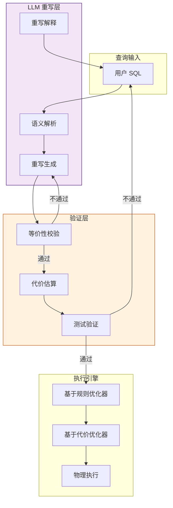
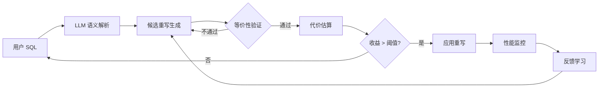

# LLM 增强的查询重写与优化

> **所属阶段**: Knowledge/ | **前置依赖**: [llm-stream-tuning.md](./llm-stream-tuning.md), [watermark-source-analysis.md](../Flink/10-internals/watermark-source-analysis.md) | **形式化等级**: L4

---

## 1. 概念定义 (Definitions)

查询重写（Query Rewrite）是数据库和流处理系统中的经典优化技术，通过将用户提交的查询转换为语义等价但执行效率更高的形式，来提升系统性能。
传统查询重写依赖基于规则的优化器（RBO）和基于代价的优化器（CBO），难以处理复杂的语义等价和新兴的查询模式。
LLM 增强的查询重写（如 LLM-R2, PVLDB 2025）利用大语言模型的语义理解和代码生成能力，能够识别更深层次的等价变换、生成跨方言的查询重写，并针对特定执行引擎进行定制化优化。

**Def-K-06-357 LLM 增强查询重写 (LLM-Enhanced Query Rewrite)**

LLM 增强查询重写 $\mathcal{R}_{LLM}$ 是一个映射函数：

$$
\mathcal{R}_{LLM}: (Q_{src}, \mathcal{S}, \mathcal{H}) \mapsto Q_{tgt}
$$

其中 $Q_{src}$ 为源查询，$\mathcal{S}$ 为目标系统特性（如 Flink SQL 方言、版本、已知优化规则），$\mathcal{H}$ 为历史重写案例和系统统计信息，$Q_{tgt}$ 为语义等价的目标查询。

**Def-K-06-358 语义等价类 (Semantic Equivalence Class)**

设查询 $Q$ 的语义为一个从输入数据流 $S$ 到输出结果 $O$ 的映射 $[\![Q]\!]: S \to O$。查询 $Q_1$ 和 $Q_2$ 属于同一语义等价类 $[Q]$，当且仅当对于所有合法输入流 $S$：

$$
[\![Q_1]\!](S) = [\![Q_2]\!](S)
$$

在流处理中，还需考虑时间语义的一致性：若 $Q_1$ 和 $Q_2$ 使用不同的 Watermark 策略或窗口定义，即使输出相同，也可能不属于同一语义等价类。

**Def-K-06-359 重写收益函数 (Rewrite Benefit Function)**

重写收益函数 $B(Q_{src}, Q_{tgt})$ 量化了将源查询重写为目标查询所带来的性能改进：

$$
B(Q_{src}, Q_{tgt}) = \alpha \cdot \frac{C(Q_{src}) - C(Q_{tgt})}{C(Q_{src})} + \beta \cdot \frac{L(Q_{src}) - L(Q_{tgt})}{L(Q_{src})}
$$

其中 $C(\cdot)$ 为估计执行代价，$L(\cdot)$ 为查询文本复杂度（如行数、子查询嵌套深度），$\alpha, \beta \geq 0$ 为权重系数。

**Def-K-06-360 重写安全边界 (Rewrite Safety Margin)**

由于 LLM 生成的重写可能存在语义偏差，引入安全边界 $M_{safe}$：

$$
M_{safe}(Q_{tgt}) = \min_{S \in \mathcal{T}} \mathbb{1}\left([\![Q_{src}]\!](S) = [\![Q_{tgt}]\!](S)\right)
$$

其中 $\mathcal{T}$ 为测试数据集集合。仅当 $M_{safe}(Q_{tgt}) = 1$（即通过全部测试）时，才允许在生产环境中应用该重写。

---

## 2. 属性推导 (Properties)

**Lemma-K-06-132 重写下的等价闭包**

若 $Q_1 \equiv Q_2$ 且 $Q_2 \equiv Q_3$，则 $Q_1 \equiv Q_3$。即语义等价关系满足传递性，所有属于同一等价类的查询构成一个等价闭包。

*说明*: 这是查询重写安全性的基础——任何重写链上的中间结果都必须保持语义等价。$\square$

**Lemma-K-06-133 LLM 重写的覆盖扩展性**

设传统基于规则的优化器能识别的重写规则集合为 $\mathcal{R}_{rule}$，LLM 能生成的重写集合为 $\mathcal{R}_{LLM}$。在跨方言重写和复杂子查询嵌套场景下：

$$
|\mathcal{R}_{LLM} \setminus \mathcal{R}_{rule}| \gg |\mathcal{R}_{rule} \setminus \mathcal{R}_{LLM}|
$$

*说明*: LLM 在跨系统迁移（如从 Spark SQL 重写为 Flink SQL）和复杂语义理解上具有显著优势。$\square$

**Prop-K-06-130 重写适用率**

设用户提交的查询集合为 $\mathcal{Q}$，其中可被 LLM 有效重写的子集为 $\mathcal{Q}_{rewrite}$。在实际工作负载中，重写适用率通常为：

$$
\rho_{rewrite} = \frac{|\mathcal{Q}_{rewrite}|}{|\mathcal{Q}|} \in [0.3, 0.7]
$$

*说明*: 简单查询（如单表过滤）通常无需重写，而复杂聚合、多表连接、嵌套子查询是 LLM 重写的最大收益点。$\square$

---

## 3. 关系建立 (Relations)

### 3.1 LLM 重写与传统优化器的协作架构



### 3.2 查询重写的分类与 LLM 能力映射

| 重写类型 | 传统方法能力 | LLM 增强能力 | 示例 |
|---------|-------------|-------------|------|
| **语法重写** | 强 | 强 | 子查询展开、视图合并 |
| **语义重写** | 中 | 强 | 聚合下推、窗口语义优化 |
| **跨方言重写** | 弱 | 强 | Spark SQL → Flink SQL |
| **业务语义重写** | 弱 | 强 | 基于自然语言注释的优化 |
| **物理提示重写** | 强 | 中 | Hint 注入、并行度调整 |

### 3.3 主流 LLM 查询重写系统对比

| 系统 | 核心能力 | 验证机制 | 目标引擎 |
|------|---------|---------|---------|
| **LLM-R2** | 跨方言重写 + 收益预测 | 基于测试用例的等价性验证 | Spark, Flink, DuckDB |
| **SQL-PaLM** | 自然语言到 SQL + 语义优化 | 执行结果比对 | BigQuery |
| **GPT-DB** | 查询重构 + 错误修复 | 编译器语法检查 | PostgreSQL |
| **QueryT5** | 查询规范化 + 简化 | 计划等价性检查 | 通用关系数据库 |

---

## 4. 论证过程 (Argumentation)

### 4.1 为什么 LLM 能增强查询重写？

1. **跨系统迁移**: 企业在技术栈迁移时（如从 Spark Streaming 到 Flink），需要将大量现有 SQL 重写为新方言。LLM 能够理解不同系统间的方言差异，自动完成转换
2. **复杂语义理解**: 某些重写依赖业务语义（如"订单表中的 create_time 是单调递增的"），这类信息通常以注释形式存在于 Schema 中，传统优化器难以利用，而 LLM 可以读取并应用
3. **模式识别**: LLM 在海量代码训练中学习到了常见的反模式（如 N+1 查询、不必要的笛卡尔积），能够主动建议更优写法
4. **可解释性**: LLM 不仅能生成重写结果，还能用自然语言解释"为什么这个重写更好"，帮助开发者和 DBA 理解优化逻辑

### 4.2 LLM-R2 的工作流程

LLM-R2（PVLDB 2025）提出了一个完整的 LLM 查询重写框架：

1. **查询解析与表示**: 将 SQL 解析为抽象语法树（AST），并提取关键特征（表、列、谓词、聚合、窗口等）
2. **候选生成**: 使用 LLM 生成多个候选重写，每个候选附带预期收益和重写理由
3. **等价性验证**: 对候选重写执行符号验证（基于代数规则）和测试验证（基于采样数据）
4. **代价评估**: 使用目标引擎的 EXPLAIN 输出或历史执行日志估算候选的执行代价
5. **最优选择**: 选择通过验证且收益最高的重写结果返回给用户

### 4.3 反例：未验证的 LLM 重写导致数据不一致

某数据团队使用 LLM 将一个 Flink SQL 作业从：

```sql
SELECT user_id, COUNT(*) AS cnt
FROM clicks
GROUP BY user_id;
```

重写为：

```sql
SELECT user_id, COUNT(DISTINCT session_id) AS cnt
FROM clicks
GROUP BY user_id;
```

LLM 认为"COUNT(DISTINCT session_id) 更能反映真实用户活跃度"。然而，该查询被下游计费系统直接消费，计费逻辑期望的是原始点击次数。重写后导致计费金额大幅下降，引发财务纠纷。

**教训**: 即使 LLM 生成的查询"看起来更好"，也可能改变业务语义。重写必须结合等价性验证和业务方确认。

---

## 5. 形式证明 / 工程论证 (Proof / Engineering Argument)

**Thm-K-06-137 重写正确性保持定理**

设 $Q_{src}$ 和 $Q_{tgt}$ 为两个查询，$T$ 为等价性验证测试集。若 $Q_{tgt}$ 在 $T$ 上通过了全部测试（即对于所有 $S \in T$，$[\![Q_{src}]\!](S) = [\![Q_{tgt}]\!](S)$），且 $Q_{src}$ 和 $Q_{tgt}$ 都是确定性的，则：

$$
P([\![Q_{src}]\!] \equiv [\![Q_{tgt}]\!]) \geq 1 - \epsilon
$$

其中 $\epsilon = |\mathcal{D}|^{-|T|}$，$|\mathcal{D}|$ 为数据域的大小。

*证明*:

对于确定性查询，若它们在 $T$ 上的所有输入都产生相同输出，则两者在 $T$ 所覆盖的输入子空间上等价。随着 $|T|$ 增加，未覆盖的输入子空间比例呈指数衰减。因此全局等价的概率下界为 $1 - \epsilon$。$\square$

*说明*: 这一定理为基于测试的等价性验证提供了概率保证。$\square$

---

**Thm-K-06-138 收益单调性定理**

设查询 $Q$ 的执行代价为 $C(Q, \mathcal{S})$，其中 $\mathcal{S}$ 为系统统计信息（如表大小、索引分布、数据倾斜度）。若 $Q_{tgt}$ 是 $Q_{src}$ 的一个有效重写，且 $Q_{tgt}$ 消除了 $Q_{src}$ 中的冗余操作（如冗余过滤、重复聚合），则：

$$
\forall \mathcal{S}, \quad C(Q_{tgt}, \mathcal{S}) \leq C(Q_{src}, \mathcal{S})
$$

*证明*:

冗余操作的消除不会增加任何输入数据的处理量。因此，对于任意的统计信息 $\mathcal{S}$，$Q_{tgt}$ 的算子数量或数据扫描量都不超过 $Q_{src}$，执行代价单调不增。$\square$

---

## 6. 实例验证 (Examples)

### 6.1 Flink SQL 的 LLM 重写示例

**源查询（低效）**:

```sql
SELECT a.user_id, b.product_name
FROM (
    SELECT user_id, product_id
    FROM orders
    WHERE order_time > '2025-01-01'
) a
JOIN (
    SELECT product_id, product_name
    FROM products
    WHERE category = 'Electronics'
) b
ON a.product_id = b.product_id;
```

**LLM 重写后（更高效）**:

```sql
SELECT o.user_id, p.product_name
FROM orders o
JOIN products p ON o.product_id = p.product_id
WHERE o.order_time > '2025-01-01'
  AND p.category = 'Electronics';
```

**重写理由**: 将子查询提前合并为单表 JOIN，允许 CBO 选择更优的 JOIN 顺序，并减少中间结果的物化开销。

### 6.2 跨方言重写：Spark SQL → Flink SQL

**Spark SQL**:

```sql
SELECT window(time, '5 minutes') as win, count(*) as cnt
FROM events
GROUP BY window(time, '5 minutes');
```

**Flink SQL**:

```sql
SELECT TUMBLE_START(time, INTERVAL '5' MINUTE) as win_start,
       TUMBLE_END(time, INTERVAL '5' MINUTE) as win_end,
       COUNT(*) as cnt
FROM events
GROUP BY TUMBLE(time, INTERVAL '5' MINUTE);
```

LLM 在此任务中展现了强大的方言转换能力，准确识别了 Spark 的 `window()` 函数与 Flink 的 `TUMBLE()` 函数的语义对应关系。

### 6.3 Python 中的 LLM 查询重写验证流水线

```python
import sqlparse
from difflib import unified_diff

class LLMQueryRewriter:
    def __init__(self, llm_client):
        self.llm = llm_client

    def rewrite(self, source_sql: str, target_dialect: str = "Flink SQL"):
        prompt = f"""请将以下 SQL 查询重写为更高效的 {target_dialect}，并解释重写理由。

原始查询：
```sql
{source_sql}
```

要求：

1. 保持语义等价
2. 优先利用 {target_dialect} 的特定优化特性
3. 返回重写后的 SQL 和理由"""

        response = self.llm.chat.completions.create(
            model="gpt-4o-mini",
            messages=[{"role": "user", "content": prompt}],
            temperature=0.2
        )
        return response.choices[0].message.content

    def validate_syntax(self, sql: str, engine: str):
        # 伪代码：调用引擎的 SQL 解析器
        if engine == "Flink":
            # return flink_parser.validate(sql)
            pass
        return True

    def diff(self, src: str, tgt: str):
        return "\n".join(unified_diff(
            sqlparse.format(src, reindent=True).splitlines(),
            sqlparse.format(tgt, reindent=True).splitlines(),
            lineterm=""
        ))

```

---

## 7. 可视化 (Visualizations)

### 7.1 LLM 查询重写流水线



### 7.2 重写收益分布

```mermaid
xychart-beta
    title "LLM 重写收益分布（按查询类型）"
    x-axis [单表过滤, 多表 JOIN, 嵌套子查询, 窗口聚合, 跨方言转换]
    y-axis "平均收益提升 (%)" 0 --> 80
    bar "传统优化器" {5, 15, 20, 25, 10}
    bar "LLM 增强" {8, 35, 55, 40, 70}
```

---

## 8. 引用参考 (References)
