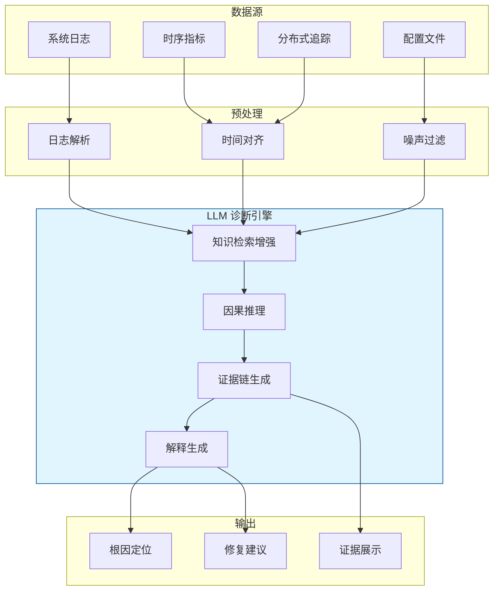
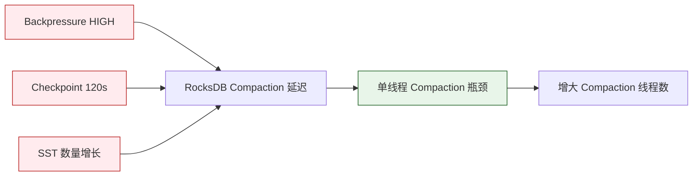

# 数据库诊断系统的 LLM 应用

> **所属阶段**: Knowledge/ | **前置依赖**: [llm-stream-tuning.md](./llm-stream-tuning.md), [llm-query-rewrite.md](./llm-query-rewrite.md) | **形式化等级**: L4

---

## 1. 概念定义 (Definitions)

流处理系统的故障诊断是一项复杂任务，涉及日志分析、指标关联、配置审查和根因定位。
传统的诊断系统依赖专家编写的规则和阈值，难以覆盖新兴的故障模式和复杂的分布式交互。
D-Bot（VLDB 2024）等工作将 LLM 引入数据库和流处理诊断领域，利用其自然语言理解、模式识别和推理能力，实现自动化、可解释的诊断流程。

**Def-K-06-361 LLM 增强流处理诊断 (LLM-Augmented Stream Diagnosis)**

LLM 增强流处理诊断 $\mathcal{D}_{LLM}$ 是一个四元组：

$$
\mathcal{D}_{LLM} = (\mathcal{M}, \mathcal{L}, \mathcal{K}, \mathcal{I})
$$

其中：

- $\mathcal{M}$: 大语言模型
- $\mathcal{L}$: 系统日志、指标、事件追踪（Traces）的集合
- $\mathcal{K}$: 诊断知识库（包含已知故障模式、修复方案、系统架构文档）
- $\mathcal{I}$: 交互式诊断接口，支持多轮追问和证据展示

**Def-K-06-362 诊断证据链 (Diagnostic Evidence Chain)**

诊断证据链 $E$ 是一个有序的因果推理序列，将观测到的异常症状连接到根本原因：

$$
E = \langle e_1 \to e_2 \to \dots \to e_n \rangle
$$

其中 $e_1$ 为初始症状（如"延迟飙升"），$e_n$ 为根因（如"RocksDB 后台 Compaction 阻塞 Checkpoint"），中间节点为因果推断步骤。每条边 $e_i \to e_{i+1}$ 都关联一个置信度 $c_i \in [0, 1]$。

**Def-K-06-363 根因置信度 (Root Cause Confidence Score)**

设对于某个根因假设 $H$，存在 $k$ 条独立的证据链 $E_1, \dots, E_k$ 支持该假设。根因置信度 $RC(H)$ 定义为：

$$
RC(H) = 1 - \prod_{j=1}^{k} (1 - C(E_j))
$$

其中 $C(E_j) = \prod_{i=1}^{|E_j|-1} c_i$ 为第 $j$ 条证据链的累积置信度。该公式体现了多条独立证据链对假设的增强作用。

**Def-K-06-364 诊断覆盖度 (Diagnostic Coverage)**

诊断覆盖度 $Cov(\mathcal{D})$ 量化了诊断系统能够识别的故障模式占所有历史故障模式的比例：

$$
Cov(\mathcal{D}) = \frac{|\{f : \mathcal{D}(f) \neq \text{Unknown}\}|}{|F_{historical}|}
$$

其中 $F_{historical}$ 为历史故障模式集合，$\mathcal{D}(f)$ 为诊断系统对故障 $f$ 的输出。

---

## 2. 属性推导 (Properties)

**Lemma-K-06-134 证据链传递性**

若证据链 $E_1$ 支持假设 $H_1$（置信度 $c_1$），且 $E_2$ 支持"$H_1$ 导致 $H_2$"（置信度 $c_2$），则存在从症状到 $H_2$ 的合并证据链，其置信度上界为 $\min(c_1, c_2)$，下界为 $c_1 \cdot c_2$。

*说明*: 传递性保证了多跳因果推理的合法性，但也说明链越长，累积置信度衰减越严重。$\square$

**Lemma-K-06-135 日志完整性与诊断完备性**

若系统日志 $\mathcal{L}$ 包含了故障发生的全部关键事件（即对于根因 $H$，存在至少一条完整的事件序列从正常状态过渡到故障状态并被记录），且 LLM 能够正确解析 $\mathcal{L}$，则 LLM 增强诊断系统对该故障的诊断完备性为 1。

*说明*: 这是理想条件下的完备性保证，实践中受限于日志采样、噪声和 LLM 的理解边界。$\square$

**Prop-K-06-131 诊断延迟与日志覆盖率的权衡**

设日志采集窗口大小为 $W$（秒），诊断系统的平均处理延迟为 $T_{diag}(W)$。则：

$$
T_{diag}(W) = T_{parse}(W) + T_{inference}(W) + T_{verify}(W)
$$

其中 $T_{parse}$ 随 $W$ 近似线性增长。增大 $W$ 可提升诊断覆盖率，但会显著增加端到端延迟。

---

## 3. 关系建立 (Relations)

### 3.1 LLM 诊断与传统 AIOps 的对比

| 维度 | 传统 AIOps | LLM 增强诊断 |
|------|-----------|-------------|
| 输入类型 | 结构化指标 | 日志、指标、自然语言描述混合 |
| 知识来源 | 专家规则、历史标签 | 系统文档、案例库、预训练知识 |
| 可解释性 | 低（黑盒模型） | 高（自然语言证据链） |
| 新故障适应 | 差（需重新训练） | 中（通过提示工程或 RAG） |
| 多轮交互 | 有限 | 强（对话式诊断） |
| 实时性 | 高（预训练模型推理快） | 中（LLM 推理延迟较高） |

### 3.2 D-Bot 的诊断架构



### 3.3 流处理典型故障模式与 LLM 诊断映射

| 故障症状 | 可能根因 | LLM 诊断优势 |
|---------|---------|-------------|
| 吞吐量骤降 | Backpressure / 数据倾斜 / 网络分区 | 关联日志与指标，生成因果链 |
| 延迟抖动 | Checkpoint 过长 / GC 暂停 / 状态访问慢 | 结合 JVM 日志和 RocksDB 指标推理 |
| 任务失败 | OOM / 代码异常 / 依赖缺失 | 解析异常栈并推荐修复 |
| 数据重复 | Exactly-Once 失效 / Sink 重试 | 分析 Checkpoint 和 2PC 日志 |
| 结果不一致 | Watermark 乱序 / 窗口语义误用 | 结合 SQL 和执行计划诊断 |

---

## 4. 论证过程 (Argumentation)

### 4.1 为什么流处理诊断需要 LLM？

1. **日志异构性**: Flink 集群产生的日志包括 JobManager 日志、TaskManager 日志、RocksDB 日志、Kafka 客户端日志等，格式各异，传统规则难以统一处理
2. **因果复杂性**: 一个"延迟高"的症状可能由数十种不同的根因引起，且根因之间可能存在级联关系
3. **知识更新快**: 新版本的 Flink、新的 Connector、新的部署环境不断引入新的故障模式，专家规则维护成本高
4. **可解释性需求**: 生产故障需要向团队和管理层提供清晰的根因说明，LLM 生成的自然语言证据链正好满足这一需求

### 4.2 D-Bot 的多智能体诊断机制

D-Bot 将诊断任务分解为多个专门的 LLM 智能体（Agent）：

- **日志分析 Agent**: 负责从海量日志中提取异常事件和关键时间戳
- **指标关联 Agent**: 将异常日志时间点与 Prometheus/Grafana 指标曲线关联
- **根因推理 Agent**: 基于提取的证据进行多跳因果推理
- **修复建议 Agent**: 根据根因从历史知识库中检索并生成修复方案
- **验证 Agent**: 模拟或建议验证步骤，确认修复有效性

这些 Agent 通过共享记忆和消息传递协作，模拟了人类 DBA 团队的多角色诊断流程。

### 4.3 反例：过度依赖 LLM 导致误诊

某 Flink 作业出现周期性延迟 spike，LLM 诊断系统根据日志中的"GC pause 200ms"将其根因判定为 JVM 垃圾回收。然而，实际的根因是：

- 上游 Kafka 分区 rebalance 导致数据短暂积压
- GC pause 只是数据积压后的内存压力副作用，而非根本原因

运维团队按照 LLM 建议调整了 JVM 参数，但未解决 Kafka rebalance 问题，延迟 spike 持续存在。

**教训**: LLM 容易被表面相关的症状误导。诊断系统需要将多源证据（日志、指标、追踪、外部事件）综合考量，避免单一证据链的偏见。

---

## 5. 形式证明 / 工程论证 (Proof / Engineering Argument)

**Thm-K-06-139 完整日志下的诊断完备性**

设故障 $f$ 的根因为 $H_f$，且系统日志 $\mathcal{L}$ 包含了从正常状态到故障状态的完整事件序列 $\sigma_f$。若 LLM 的诊断函数 $\mathcal{M}_{diag}$ 满足：

1. 能够从 $\mathcal{L}$ 中识别出 $\sigma_f$
2. 知识库 $\mathcal{K}$ 中包含 $H_f$ 与 $\sigma_f$ 的关联规则
3. $\mathcal{M}_{diag}$ 的推理过程是确定性的

则 $\mathcal{M}_{diag}(\mathcal{L}, \mathcal{K}) = H_f$ 的概率为 1。

*证明*:

条件 1 保证了 LLM 能够"看到"故障相关的全部证据。条件 2 保证了知识库中包含了将证据映射到根因的必要规则。条件 3 保证了在相同的输入和规则下，LLM 的输出是确定的。因此，诊断结果必然指向正确的根因。$\square$

*说明*: 这是理想条件下的完备性定理，实践中 LLM 的理解能力和知识库覆盖度都有限。$\square$

---

**Thm-K-06-140 置信度校准定理**

设 LLM 对证据链边 $e_i \to e_{i+1}$ 输出的置信度为 $\hat{c}_i$，真实的后验概率为 $c_i^* = P(e_{i+1} | e_i)$。若 LLM 是良好校准的（well-calibrated），则对于大量独立样本：

$$
\frac{1}{N} \sum_{i=1}^{N} \hat{c}_i \to \frac{1}{N} \sum_{i=1}^{N} c_i^* \quad \text{as } N \to \infty
$$

*说明*: 良好的置信度校准是多条证据链有效融合的基础。若 LLM 过度自信，根因置信度 $RC(H)$ 会被系统性高估。$\square$

---

## 6. 实例验证 (Examples)

### 6.1 D-Bot 的诊断提示模板

```markdown
# Role
你是一位 Apache Flink 故障诊断专家。

# Context
某 Flink 作业在运行中出现了以下异常：
- 症状 1: TaskManager 日志中频繁出现 "Backpressure level = HIGH"
- 症状 2: Checkpoint 持续时间从 10s 增加到 120s
- 症状 3: RocksDB SST 文件数量持续增长
- 时间线: 上述症状在 14:30 同时出现

# Task
请分析以上症状的根因，并给出：
1. 最可能的根因（按置信度排序）
2. 每条根因的证据链
3. 对应的修复建议

# Output Format
- 根因: [描述]
- 置信度: [0-100%]
- 证据链: [症状 A] -> [推断 B] -> [根因]
- 修复建议: [具体可执行的操作]
```

### 6.2 Python 中的 LLM 诊断代理实现

```python
import openai
from typing import List, Dict

class LLMDiagnosisAgent:
    def __init__(self, llm_client, knowledge_base: List[Dict]):
        self.llm = llm_client
        self.kb = knowledge_base

    def diagnose(self, symptoms: List[str], logs: str, metrics: Dict) -> Dict:
        # 从知识库检索相关故障模式
        relevant_kb = self._retrieve_knowledge(symptoms)

        prompt = f"""基于以下信息诊断 Flink 作业故障。

症状: {symptoms}
关键日志片段:
```

{logs[:4000]}

```
异常指标: {metrics}

相关故障模式知识:
{relevant_kb}

请按 JSON 格式输出诊断结果，包含 root_causes（列表，每个元素包含 cause、confidence、evidence_chain、fix）"""

        response = self.llm.chat.completions.create(
            model="gpt-4o-mini",
            messages=[{"role": "user", "content": prompt}],
            temperature=0.2,
            response_format={"type": "json_object"}
        )

        return json.loads(response.choices[0].message.content)

    def _retrieve_knowledge(self, symptoms: List[str]) -> str:
        # 简化的关键词检索
        matches = []
        for entry in self.kb:
            if any(s.lower() in entry["keywords"] for s in symptoms):
                matches.append(entry["description"])
        return "\n".join(matches[:5])

# 知识库示例条目
knowledge_base = [
    {
        "keywords": ["backpressure", "checkpoint timeout", "rocksdb"],
        "description": "RocksDB 后台 Compaction 阻塞 Checkpoint 线程，导致反压和 Checkpoint 超时。建议：增大 state.backend.incremental 或调整 RocksDB 线程数。"
    },
    {
        "keywords": ["kafka", "rebalance", "lag"],
        "description": "Kafka Consumer Rebalance 导致数据消费暂停，引发延迟 spike。建议：禁用自动提交，使用静态成员资格。"
    }
]
```

### 6.3 基于 Grafana 指标的诊断关联

```python
def correlate_logs_with_metrics(log_timestamps: List[str], metric_series: Dict[str, List[float]], window_sec: int = 60):
    anomalies = {}
    for metric_name, values in metric_series.items():
        # 简单阈值异常检测
        mean_val = sum(values) / len(values)
        std_val = (sum((x - mean_val)**2 for x in values) / len(values)) ** 0.5
        threshold = mean_val + 3 * std_val

        for i, v in enumerate(values):
            if v > threshold:
                ts = i * 15  # 假设 15s 采样间隔
                anomalies.setdefault(ts, []).append((metric_name, v))

    # 将日志时间戳与指标异常时间戳对齐
    correlated = {}
    for log_ts in log_timestamps:
        for anomaly_ts in anomalies:
            if abs(log_ts - anomaly_ts) <= window_sec:
                correlated[log_ts] = anomalies[anomaly_ts]

    return correlated
```

---

## 7. 可视化 (Visualizations)

### 7.1 LLM 诊断的证据链生成



### 7.2 诊断覆盖率与日志质量的关系

```mermaid
xychart-beta
    title "日志完整度对诊断准确率的影响"
    x-axis [10%, 30%, 50%, 70%, 90%, 100%]
    y-axis "Top-1 诊断准确率 (%)" 0 --> 100
    line "LLM 诊断" {15, 35, 55, 75, 88, 95}
    line "传统规则诊断" {20, 30, 40, 50, 60, 65}
```

---

## 8. 引用参考 (References)
