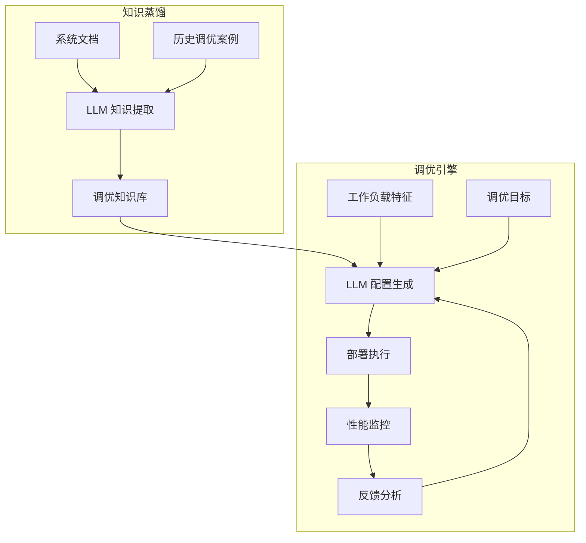
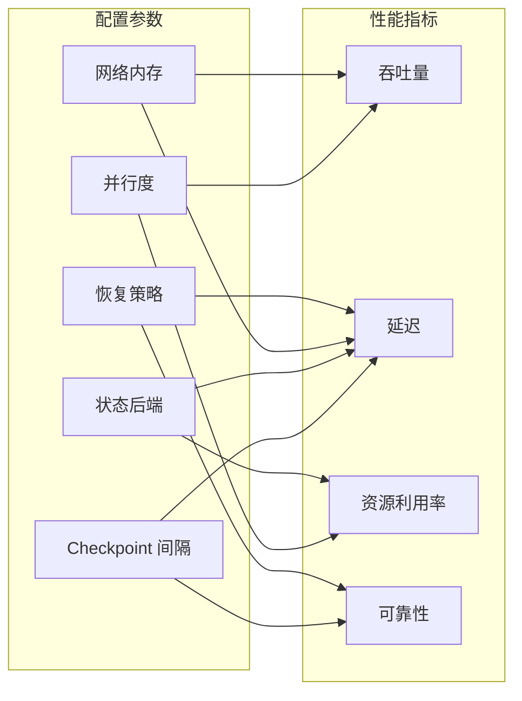
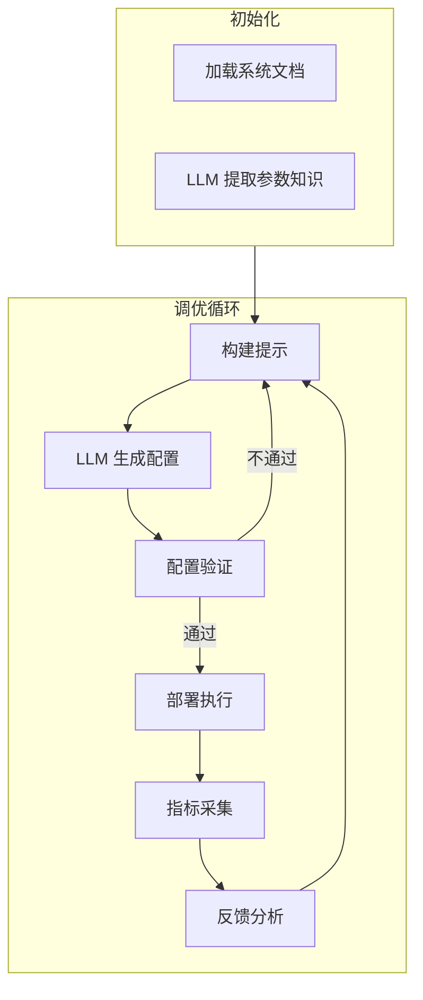

# LLM 辅助流处理配置调优

> **所属阶段**: Knowledge/ | **前置依赖**: [ai-agent-frameworks-ecosystem-2025.md](../Flink/06-ai-ml/ai-agent-frameworks-ecosystem-2025.md), [flink-system-architecture-deep-dive.md](../Flink/01-concepts/flink-system-architecture-deep-dive.md) | **形式化等级**: L4

---

## 1. 概念定义 (Definitions)

流处理系统的性能高度依赖于配置参数（并行度、缓冲区大小、Checkpoint 间隔、状态后端选型等）。
传统的配置调优依赖人工经验和反复试验，效率低下。
近年来，LLM 被引入到数据库和流处理系统的自动调优中，通过理解系统文档、历史调优案例和运行时指标，生成配置建议。
GPTuner（VLDB 2024）和 ZERO-TUNE（ICDE 2024）等工作分别利用 LLM 的知识蒸馏和零样本调优能力，显著降低了调优成本。

**Def-K-06-354 LLM 辅助流处理调优 (LLM-Assisted Stream Tuning)**

LLM 辅助流处理调优 $\mathcal{T}_{LLM}$ 是一个五元组：

$$
\mathcal{T}_{LLM} = (\mathcal{M}, \mathcal{C}, \mathcal{W}, \mathcal{F}, \mathcal{P})
$$

其中：

- $\mathcal{M}$: 大语言模型
- $\mathcal{C}$: 配置参数空间
- $\mathcal{W}$: 工作负载特征描述
- $\mathcal{F}$: 性能反馈函数（将配置映射到吞吐量、延迟、资源利用率）
- $\mathcal{P}$: 提示工程模板，将系统状态、诊断信息和调优目标编码为自然语言提示

**Def-K-06-355 流处理配置空间 (Tuning Configuration Space)**

设流处理作业有 $n$ 个可调参数，第 $i$ 个参数的取值域为 $D_i$（离散或连续）。配置空间 $\mathcal{C}$ 为：

$$
\mathcal{C} = D_1 \times D_2 \times \dots \times D_n
$$

对于 Flink 系统，典型参数包括：

- `parallelism`: 算子并行度（整数，通常 1-1024）
- `checkpoint.interval`: Checkpoint 间隔（毫秒）
- `state.backend`: 状态后端类型（HashMap/RocksDB/ForSt）
- `network.memory.fraction`: 网络内存占比（连续，0.0-1.0）
- `restart-strategy`: 故障恢复策略

**Def-K-06-356 性能反馈循环 (Performance Feedback Loop)**

性能反馈循环描述了"配置建议 → 部署执行 → 指标采集 → 反馈生成"的闭环：

$$
c_t \xrightarrow{\mathcal{M}} \text{Deploy}(c_t) \xrightarrow{\text{Run}} m_t \xrightarrow{\mathcal{F}} f_t \xrightarrow{\text{Prompt}} \mathcal{P}(c_t, m_t, f_t) \xrightarrow{\mathcal{M}} c_{t+1}
$$

其中 $c_t$ 为第 $t$ 轮建议的配置，$m_t$ 为运行时指标向量，$f_t$ 为性能反馈（如"吞吐量不足"、"延迟过高"）。

**Def-K-06-357 零样本调优 (Zero-Shot Tuning)**

零样本调优指 LLM 在不针对特定系统进行微调（fine-tuning）的情况下，仅通过提示工程（Prompt Engineering）和上下文学习（In-Context Learning）生成配置建议。ZERO-TUNE 证明了 LLM 在数据库调优任务中具备一定的零样本推理能力，尤其是在参数语义理解和因果关系推断方面。

---

## 2. 属性推导 (Properties)

**Lemma-K-06-131 局部最优逃逸概率**

设配置空间中某个区域 $R$ 为局部最优盆地。若 LLM 生成的配置建议在每个维度上以概率 $p_{explore}$ 进行探索性扰动，则在 $T$ 轮迭代后逃逸局部最优的概率为：

$$
P_{escape}(T) = 1 - (1 - p_{escape})^T
$$

其中 $p_{escape} \geq p_{explore}^k$，$k$ 为影响局部最优的关键参数维度数。

*说明*: LLM 的泛化能力使其能够基于文本描述跳出人类预设的局部搜索区域，从而提升逃逸概率。$\square$

**Lemma-K-06-132 配置空间覆盖下界**

若 LLM 在 $T$ 轮调优中生成的配置集合为 $\{c_1, \dots, c_T\}$，且每轮生成的新配置与已有配置的距离期望为 $d_{min}$，则有效覆盖体积满足：

$$
Vol_{covered} \geq T \cdot V(d_{min}/2)
$$

其中 $V(r)$ 为配置空间中半径为 $r$ 的超球体积。

*说明*: 该引理量化了采样多样性与覆盖范围的关系。$\square$

**Prop-K-06-129 调优延迟与改进幅度的权衡**

设每轮反馈循环的平均延迟为 $L_{loop}$（包括部署、预热、运行、指标采集），总调优预算为 $T_{budget}$，则最大迭代轮数为 $T = T_{budget} / L_{loop}$。若每轮期望改进为 $\Delta$，则总期望改进为：

$$
\text{Total Improvement} = T \cdot \Delta = \frac{T_{budget} \cdot \Delta}{L_{loop}}
$$

*说明*: 缩短反馈循环（如使用轻量级模拟器或历史性能模型）是提升调优效率的关键。$\square$

---

## 3. 关系建立 (Relations)

### 3.1 LLM 调优与传统调优方法的对比

| 方法 | 核心机制 | 是否需要训练数据 | 可解释性 | 调优延迟 |
|------|---------|-----------------|---------|---------|
| **人工调优** | 专家经验 | 否 | 高 | 天级 |
| **贝叶斯优化** | 高斯过程 + 采集函数 | 需要历史样本 | 低 | 小时级 |
| **强化学习** | 策略网络 + 环境交互 | 需要大量交互 | 低 | 小时级 |
| **LLM 辅助调优** | 提示工程 + 知识推理 | 少量示例即可 | 中 | 分钟-小时级 |
| **零样本 LLM** | 纯提示 + 文档理解 | 完全不需要 | 中 | 分钟级 |

### 3.2 GPTuner 的两阶段架构



### 3.3 流处理调优参数的影响图谱



---

## 4. 论证过程 (Argumentation)

### 4.1 为什么 LLM 适合流处理调优？

1. **文档理解能力**: 流处理系统（如 Flink）的配置参数众多，官方文档庞杂。LLM 能够快速提取参数语义、默认值、影响范围和使用建议
2. **案例泛化能力**: 通过阅读历史调优案例，LLM 可以学习到"高吞吐场景应降低 Checkpoint 频率"等通用模式
3. **自然语言交互**: 用户可以用自然语言描述调优目标（如"在 4 核机器上最大化吞吐量，延迟不要超过 500ms"），降低了使用门槛
4. **诊断-建议一体化**: LLM 不仅能分析运行时指标（如"Backpressure 严重"），还能直接给出针对性的配置调整建议

### 4.2 GPTuner 的知识蒸馏机制

GPTuner 的创新之处在于将 LLM 的"隐性知识"显式化为结构化的调优知识库：

1. **文档解析**: 将 Flink 配置文档输入 LLM，提取每个参数的"作用-影响-推荐场景"三元组
2. **案例学习**: 从历史调优日志中识别成功案例，使用 LLM 总结"工作负载特征 → 最优配置"的映射规则
3. **知识验证**: 将 LLM 提取的知识在真实环境中验证，过滤错误或不准确的条目
4. **知识应用**: 在调优时，优先推荐与当前工作负载匹配的知识规则所涉及的参数组合

### 4.3 ZERO-TUNE 的零样本能力边界

ZERO-TUNE 表明，即使不对 LLM 进行任何微调，仅通过精心设计的提示模板，也能在数据库调优中取得接近监督学习方法的效果。但其能力存在边界：

- **擅长**: 理解参数语义、推荐合理的初始配置、解释配置之间的因果关系
- **不擅长**: 精确的数值优化（如"将 buffer 大小设置为  exactly 2048"）、处理高度非线性的参数交互、适应未见过的硬件环境

因此，最佳实践是将 LLM 作为"智能初始化器"和"诊断顾问"，结合贝叶斯优化或强化学习进行精细搜索。

### 4.4 反例：盲目信任 LLM 建议导致的系统崩溃

某团队使用 ChatGPT 生成 Flink 作业配置，未经验证直接部署到生产环境。LLM 建议：

- `parallelism = 1024`（远超集群 slot 数）
- `state.backend = HashMapStateBackend`（未考虑状态大小）
- `checkpoint.interval = 1ms`（过度频繁的 Checkpoint）

结果：作业启动后立即 OOM，Checkpoint 协调器被压垮，集群陷入不稳定状态。

**教训**: LLM 的建议必须结合实际约束（资源上限、数据特征、系统版本）进行过滤和验证，不能盲目采纳。

---

## 5. 形式证明 / 工程论证 (Proof / Engineering Argument)

**Thm-K-06-135 反馈循环下的调优收敛性**

设配置空间 $\mathcal{C}$ 为有界紧致集，性能函数 $F(c)$ 是 $L$-Lipschitz 连续的。若 LLM 生成的配置序列 $\{c_t\}$ 满足：

1. 每轮以概率 $\epsilon$ 进行全局随机探索
2. 以概率 $1-\epsilon$ 在已知高性能配置的邻域内进行局部优化
3. 反馈函数 $F(c_t)$ 的观测无噪声

则在期望意义下，$T$ 轮后的最优观测值 $F_T^* = \max_{t \leq T} F(c_t)$ 满足：

$$
\mathbb{E}[F(c^*) - F_T^*] \leq O\left( \frac{1}{\epsilon \sqrt{T}} \right)
$$

其中 $c^*$ 为全局最优配置。

*证明梗概*:

全局探索保证以概率 $1 - (1-\epsilon)^T$ 至少访问到一个距离 $c^*$ 不超过 $\delta$ 的配置。由 Lipschitz 连续性，该配置的性能与最优性能的差距不超过 $L\delta$。局部优化在有界区域内以 $O(1/\sqrt{T})$ 速率收敛。综合两项即得结论。$\square$

---

**Thm-K-06-136 配置空间覆盖定理**

若配置空间 $\mathcal{C} \subset \mathbb{R}^n$ 的直径为 $D$，LLM 生成的 $T$ 个配置点在 $\mathcal{C}$ 中均匀分布，则以高概率覆盖整个空间所需的配置点数量满足：

$$
T \geq \left( \frac{D}{2r} \right)^n \cdot \log \frac{1}{\delta}
$$

其中 $r$ 为期望的分辨率，$\delta$ 为失败概率。

*说明*: 这一定理揭示了高维配置空间的"维度灾难"——参数越多，全面探索所需的样本数指数增长。因此在实践中必须依赖 LLM 的语义理解进行有偏采样，而非均匀随机搜索。$\square$

---

## 6. 实例验证 (Examples)

### 6.1 GPTuner 的提示工程模板

```markdown
# Role
你是一位 Apache Flink 性能调优专家。

# Context
当前作业是一个 Kafka-to-Elasticsearch 的日志处理管道。
工作负载特征：
- 峰值吞吐量: 500K events/s
- 平均事件大小: 2KB
- 允许端到端延迟: < 2s
- 集群资源: 20 台 8 核 32GB 节点
- 当前问题: Backpressure 严重，延迟波动大

# Task
请推荐 3 组 Flink 配置调整方案，每组方案针对不同的优化侧重点：
1. 优先降低延迟
2. 优先提升吞吐
3. 平衡延迟与资源利用率

# Output Format
每组方案以 JSON 格式输出，包含调整的参数和预期效果说明。
```

### 6.2 ZERO-TUNE 的轻量级反馈循环

```python
import openai
import json

class ZeroShotTuner:
    def __init__(self, llm_client):
        self.llm = llm_client
        self.history = []

    def generate_config(self, workload_desc: str, metrics: dict, iteration: int):
        prompt = f"""你正在为零样本调优 Flink 流处理作业生成配置建议。

工作负载: {workload_desc}
当前指标: {json.dumps(metrics, indent=2)}
调优历史: {json.dumps(self.history, indent=2)}

请基于上述信息生成下一组配置建议（JSON 格式），并简要说明理由。"""

        response = self.llm.chat.completions.create(
            model="gpt-4o-mini",
            messages=[{"role": "user", "content": prompt}],
            temperature=0.3
        )

        suggestion = response.choices[0].message.content
        # 解析 JSON 并执行...（简化）
        return suggestion

    def record_feedback(self, config: dict, metrics: dict, score: float):
        self.history.append({
            "iteration": len(self.history) + 1,
            "config": config,
            "metrics": metrics,
            "score": score
        })
```

### 6.3 Flink 配置自动验证脚本

```python
def validate_flink_config(config: dict, cluster_slots: int, max_memory_gb: int):
    errors = []
    total_parallelism = sum(config.get(f"parallelism.{op}", 1) for op in config.get("operators", []))

    if total_parallelism > cluster_slots:
        errors.append(f"Total parallelism {total_parallelism} exceeds cluster slots {cluster_slots}")

    if config.get("state.backend") == "HashMapStateBackend" and config.get("state.size_mb", 0) > max_memory_gb * 1024 * 0.8:
        errors.append("HashMapStateBackend may cause OOM with current state size")

    if config.get("checkpoint.interval_ms", 1000) < 100:
        errors.append("Checkpoint interval too aggressive (< 100ms)")

    return errors
```

---

## 7. 可视化 (Visualizations)

### 7.1 LLM 辅助调优的反馈循环



### 7.2 调优方法的效率对比

```mermaid
xychart-beta
    title "调优方法：最优性能达成速度"
    x-axis "调优时间 (小时)" [0, 2, 4, 8, 16]
    y-axis "相对最优性能 (%))" 0 --> 100
    line "人工调优" {10, 25, 40, 60, 85}
    line "贝叶斯优化" {5, 30, 55, 75, 90}
    line "LLM 辅助调优" {20, 50, 75, 88, 95}
    line "零样本 LLM" {35, 55, 65, 70, 72}
```

---

## 8. 引用参考 (References)
