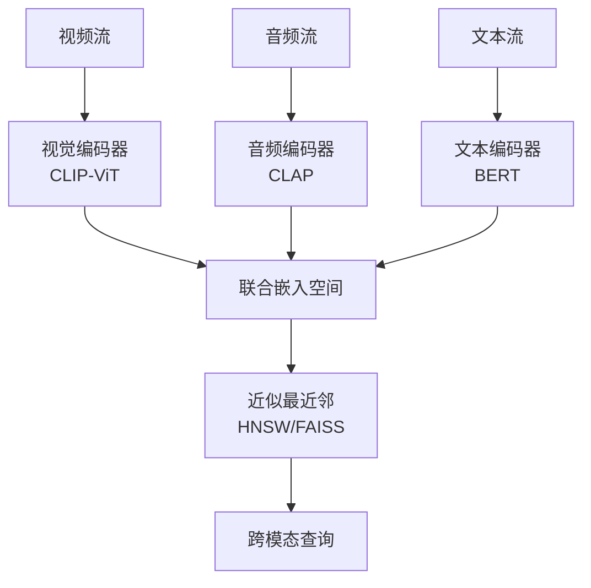
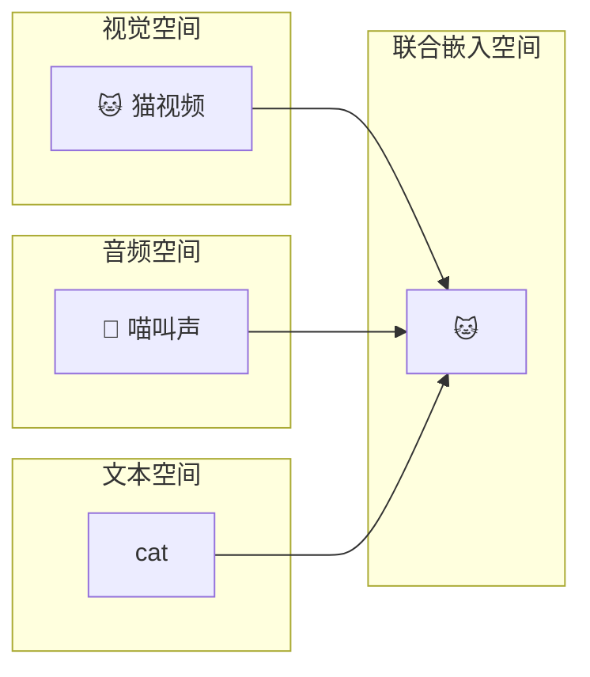

# 多模态数据的近似查询处理

> **所属阶段**: Knowledge/ | **前置依赖**: [video-stream-cep.md](./video-stream-cep.md), [aqp-streaming-formalization.md](../Struct/aqp-streaming-formalization.md) | **形式化等级**: L4

---

## 1. 概念定义 (Definitions)

多模态数据流（如视频帧、音频片段、文本弹幕、传感器读数）的联合分析需要在不同模态之间建立关联并执行聚合查询。
由于多模态数据的高维度和大体积，精确查询处理成本极高。
多模态近似查询处理（Multimodal AQP）通过向量摘要、嵌入聚类和跨模态草图来提供带有误差边界的近似结果。

**Def-K-06-394 多模态摘要 (Multimodal Synopsis)**

多模态摘要 $\sigma_{mm}$ 是一个模态感知的紧凑表示：

$$
\sigma_{mm} = (\sigma_{vision}, \sigma_{audio}, \sigma_{text}, \sigma_{fusion})
$$

其中 $\sigma_{fusion}$ 是跨模态对齐的联合嵌入空间摘要。

**Def-K-06-395 跨模态近似查询 (Cross-Modal Approximate Query)**

跨模态查询 $Q_{cm}$ 允许用一种模态查询另一种模态的内容：

$$
Q_{cm}: \text{"查找与这段音频最相似的视频片段"}
$$

在 AQP 框架下，结果返回的是基于嵌入相似度排序的 Top-K 近似匹配。

---

## 2. 属性推导 (Properties)

**Lemma-K-06-150 嵌入空间的三角不等式**

设多模态联合嵌入函数为 $\phi: \mathcal{M} \to \mathbb{R}^d$。若 $\phi$ 是 Lipschitz 连续的，则对于查询 $q$ 和数据点 $x, y$：

$$
|sim(\phi(q), \phi(x)) - sim(\phi(q), \phi(y))| \leq L \cdot d(x, y)
$$

*说明*: 这保证了嵌入空间中的近似最近邻搜索在原始数据空间中具有语义一致性。$\square$

---

## 3. 关系建立 (Relations)

### 3.1 多模态 AQP 架构



---

## 4. 论证过程 (Argumentation)

### 4.1 多模态 AQP 的挑战

1. **模态鸿沟**: 不同模态的语义空间差异巨大，精确对齐困难
2. **时间同步**: 音频和视频的时间戳需要精确对齐才能正确关联
3. **动态更新**: 嵌入模型可能随时间演进，摘要需要增量重建

---

## 5. 形式证明 / 工程论证 (Proof / Engineering Argument)

**Thm-K-06-157 近似最近邻的召回率下界**

设联合嵌入空间中查询 $q$ 的 $K$ 近邻集合为 $N_K(q)$，近似搜索返回的集合为 $\hat{N}_K(q)$。若嵌入质量满足 $sim(q, x) \geq \tau$ 对所有 $x \in N_K(q)$，则使用 HNSW 的近似搜索召回率满足：

$$
\text{Recall}@K \geq 1 - \exp(-c \cdot \tau^2 \cdot K)
$$

其中 $c$ 为与图结构相关的常数。

*说明*: 嵌入质量越高（$\tau$ 越大），近似搜索的召回率越高。$\square$

---

## 6. 实例验证 (Examples)

### 6.1 跨模态相似性搜索

```python
from sentence_transformers import SentenceTransformer
import faiss

# 假设已有视频帧嵌入和文本查询 video_embeddings = np.load("video_emb.npy")  # [N, 512]
index = faiss.IndexFlatIP(512)
index.add(video_embeddings)

query_text = "a person running"
text_model = SentenceTransformer("clip-ViT-B-32")
query_emb = text_model.encode(query_text)

D, I = index.search(query_emb.reshape(1, -1), k=5)
print(f"Top-5 matching video segments: {I[0]}")
```

---

## 7. 可视化 (Visualizations)

### 7.1 多模态嵌入空间



---

## 8. 引用参考 (References)
