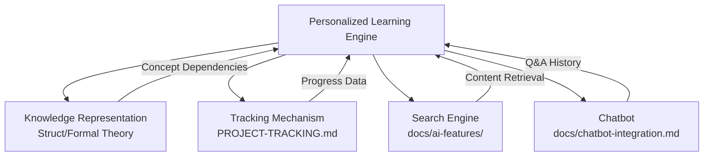
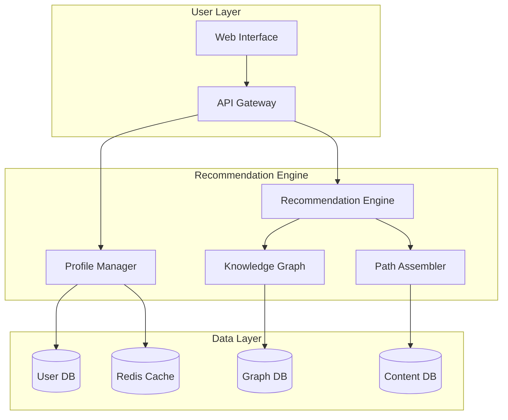
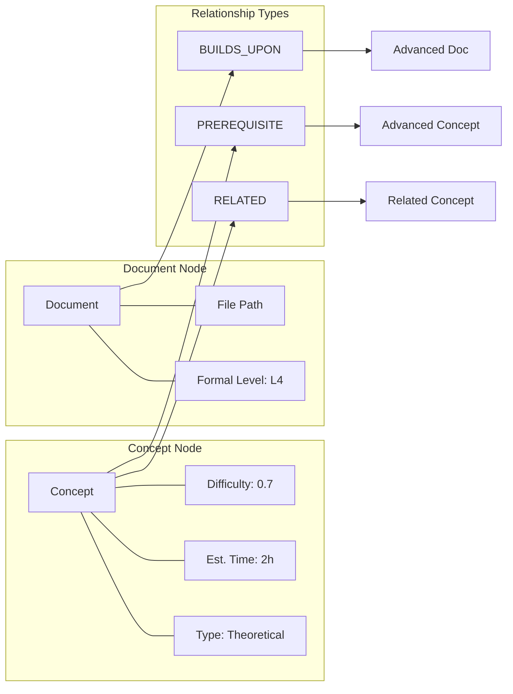
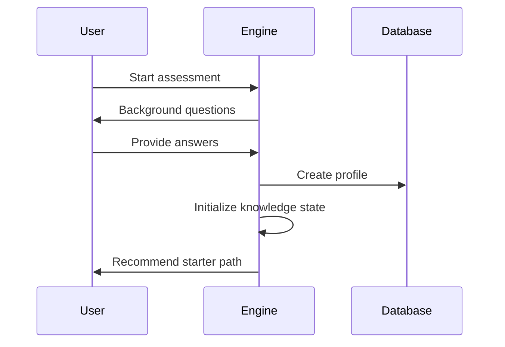
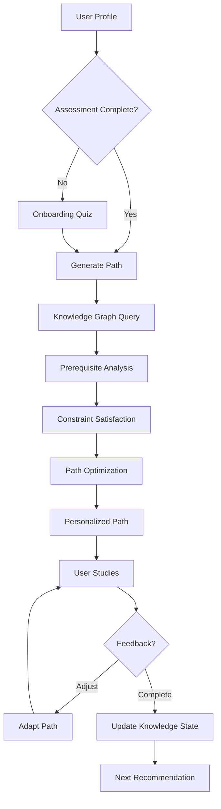

# Personalized Learning Path Recommendation Engine

> 所属阶段: Knowledge | 前置依赖: [相关文档] | 形式化等级: L3

> **Project**: P3-8 | **Type**: Technical Design | **Version**: v1.0 | **Date**: 2026-04-04
>
> **Formalization Level**: L4 (Engineering Design) | **Dependencies**: [LEARNING-PATHS-DYNAMIC.md](../LEARNING-PATHS/00-INDEX.md)

This document describes the design and implementation of a personalized learning path recommendation engine for the AnalysisDataFlow knowledge base.

---

## 1. 概念定义 (Definitions)

### Def-K-PLE-01: Personalized Learning Engine

A **Personalized Learning Engine (PLE)** is a recommendation system that generates adaptive learning paths based on:

- Learner's background knowledge
- Learning objectives
- Time constraints
- Preferred learning style
- Real-time progress feedback

**Formal Definition**:

```
PLE = ⟨𝒰, 𝒟, 𝒪, 𝒫, ℛ, ℳ, 𝒜⟩
```

Where:

- 𝒰 = Set of users/learners
- 𝒟 = Set of documents (learning materials)
- 𝒪 = Set of learning objectives
- 𝒫 = Progress tracking function
- ℛ = Recommendation function: 𝒰 × 𝒪 × 𝒫 → Sequence(𝒟)
- ℳ = Knowledge mastery model
- 𝒜 = Adaptation strategy

### Def-K-PLE-02: Knowledge State

A learner's **Knowledge State** at time t is a vector representing mastery levels across all concepts.

```
KS_t(u) = ⟨m₁, m₂, ..., mₙ⟩

where mᵢ ∈ [0, 1] represents mastery of concept cᵢ
```

### Def-K-PLE-03: Learning Path

A **Learning Path** is a partially ordered sequence of learning activities designed to achieve specific learning objectives.

```
LP = ⟨(d₁, t₁), (d₂, t₂), ..., (dₙ, tₙ)⟩, where tᵢ ≤ tᵢ₊₁
```

---

## 2. 属性推导 (Properties)

### Prop-K-PLE-01: Path Completeness

For any valid learning objective o ∈ 𝒪, there exists at least one learning path LP that achieves o.

**Proof Sketch**:

- The knowledge graph is connected (by construction)
- Each document covers specific concepts
- Breadth-first search from prerequisites to objective yields a valid path ∎

### Prop-K-PLE-02: Personalization Monotonicity

Given two learners u₁, u₂ with KS(u₁) ≥ KS(u₂) (component-wise), the recommended path for u₁ is no longer than for u₂.

```
∀u₁, u₂ ∈ 𝒰. KS(u₁) ≥ KS(u₂) ⇒ |LP(u₁, o)| ≤ |LP(u₂, o)|
```

### Prop-K-PLE-03: Progress Convergence

With consistent engagement, the learning path converges to the objective.

```
lim_{t→∞} distance(KS_t, KS_target) = 0
```

---

## 3. 关系建立 (Relations)

### 3.1 Connection to Existing Systems



### 3.2 Integration Points

| System | Integration Type | Data Exchange |
|--------|-----------------|---------------|
| Search Index | Read | Document embeddings, metadata |
| Progress Tracker | Read/Write | Completion status, quiz scores |
| Chatbot | Read | Question history, difficulty ratings |
| Content Index | Read | Document structure, prerequisites |

---

## 4. 论证过程 (Argumentation)

### 4.1 Recommendation Algorithm Selection

**Candidate Approaches**:

| Approach | Pros | Cons | Use Case |
|----------|------|------|----------|
| Content-Based | Interpretable, no cold start | Limited diversity | Domain-specific paths |
| Collaborative Filtering | Discovers patterns | Cold start, sparsity | Popular paths |
| Knowledge Graph | Structured, explainable | Complex construction | Prerequisite chains |
| Reinforcement Learning | Adaptive, optimizes long-term | Training complexity | Dynamic adaptation |

**Selected Hybrid Approach**:

```
Recommendation = α·ContentScore + β·GraphDistance + γ·CollaborativeScore + δ·RLValue
```

### 4.2 Constraint Satisfaction

Learning paths must satisfy:

1. **Prerequisite Constraints**: All prerequisites must be completed before dependent content
2. **Time Constraints**: Total estimated time ≤ available time budget
3. **Difficulty Constraints**: Difficulty progression should be smooth (no jumps > 0.3)
4. **Diversity Constraints**: Include multiple content types (theory, practice, case studies)

---

## 5. 形式证明 / 工程论证 (Proof / Engineering Argument)

### 5.1 System Architecture



### 5.2 Knowledge Graph Structure



### 5.3 User Model

```yaml
# User Profile Schema user_profile:
  id: string
  created_at: timestamp

  # Background assessment
  background:
    role: enum[student, engineer, researcher, architect]
    experience_level: enum[beginner, intermediate, advanced, expert]
    domains: list[string]  # Known domains
    languages: list[string]  # Programming languages

  # Learning preferences
  preferences:
    content_types: list[enum[theory, practice, video, interactive]]
    session_length: integer  # Preferred minutes per session
    difficulty_preference: enum[basic, challenging, mixed]

  # Current state
  knowledge_state:
    concept_mastery: map[concept_id, float]  # 0-1 mastery level
    completed_documents: list[document_id]
    quiz_scores: map[document_id, float]

  # Learning history
  history:
    sessions: list[session_record]
    bookmarks: list[document_id]
    questions_asked: list[question_record]
```

### 5.4 Recommendation Algorithm

```python
class PersonalizedLearningEngine:
    """Core recommendation engine."""

    def recommend_path(
        self,
        user_id: str,
        objective: str,
        constraints: LearningConstraints
    ) -> LearningPath:
        """
        Generate personalized learning path.

        Algorithm:
        1. Retrieve user profile and knowledge state
        2. Identify target concepts from objective
        3. Find prerequisite closure
        4. Filter by constraints
        5. Optimize path using scoring function
        6. Assemble final learning path
        """

        # Step 1: User context
        user = self.get_user_profile(user_id)
        knowledge_state = self.get_knowledge_state(user_id)

        # Step 2: Target concepts
        target_concepts = self.identify_concepts(objective)

        # Step 3: Prerequisite analysis
        required_concepts = self.prerequisite_closure(target_concepts)

        # Filter already mastered concepts
        to_learn = [
            c for c in required_concepts
            if knowledge_state.get_mastery(c) < 0.7
        ]

        # Step 4: Document mapping
        candidate_docs = self.map_concepts_to_documents(to_learn)

        # Step 5: Path optimization
        path = self.optimize_path(
            candidate_docs,
            knowledge_state,
            constraints,
            user.preferences
        )

        return path

    def score_document(
        self,
        document: Document,
        user: UserProfile,
        knowledge_state: KnowledgeState
    ) -> float:
        """
        Score document relevance for user.

        Scoring components:
        - Concept coverage (40%)
        - Difficulty match (20%)
        - Content type preference (15%)
        - Collaborative score (15%)
        - Recency/diversity (10%)
        """

        scores = {
            'concept_coverage': self._concept_coverage_score(document, user),
            'difficulty_match': self._difficulty_match_score(document, knowledge_state),
            'content_preference': self._content_preference_score(document, user),
            'collaborative': self._collaborative_score(document, user),
            'diversity': self._diversity_score(document, user),
        }

        weights = {
            'concept_coverage': 0.40,
            'difficulty_match': 0.20,
            'content_preference': 0.15,
            'collaborative': 0.15,
            'diversity': 0.10,
        }

        return sum(scores[k] * weights[k] for k in scores)
```

### 5.5 Learning Path Optimization

```python
def optimize_path(
    self,
    documents: List[Document],
    knowledge_state: KnowledgeState,
    constraints: LearningConstraints,
    preferences: UserPreferences
) -> LearningPath:
    """
    Optimize learning path using modified topological sort.

    Constraints:
    - Prerequisite ordering
    - Time budget
    - Difficulty progression
    - Content diversity
    """

    # Build dependency graph
    graph = self._build_dependency_graph(documents)

    # Initialize path
    path = []
    remaining = set(documents)
    current_time = 0

    while remaining:
        # Find candidates (all prerequisites met)
        candidates = [
            d for d in remaining
            if self._prerequisites_met(d, path, knowledge_state)
        ]

        if not candidates:
            break  # Should not happen with valid input

        # Score candidates
        scored = [
            (d, self.score_document(d, knowledge_state))
            for d in candidates
        ]

        # Select best candidate
        best_doc, score = max(scored, key=lambda x: x[1])

        # Check constraints
        doc_time = best_doc.estimated_time
        if current_time + doc_time > constraints.max_total_time:
            break

        # Add to path
        path.append(best_doc)
        remaining.remove(best_doc)
        current_time += doc_time

    return LearningPath(documents=path, total_time=current_time)
```

---

### 6. Implementation Details

#### 6.1 Database Schema

```sql
-- User profiles
CREATE TABLE user_profiles (
    id UUID PRIMARY KEY,
    created_at TIMESTAMP DEFAULT NOW(),
    role VARCHAR(50),
    experience_level VARCHAR(50),
    preferences JSONB
);

-- Knowledge states
CREATE TABLE knowledge_states (
    user_id UUID REFERENCES user_profiles(id),
    concept_id VARCHAR(100),
    mastery_level FLOAT CHECK (mastery_level BETWEEN 0 AND 1),
    updated_at TIMESTAMP DEFAULT NOW(),
    PRIMARY KEY (user_id, concept_id)
);

-- Learning progress
CREATE TABLE learning_progress (
    id UUID PRIMARY KEY,
    user_id UUID REFERENCES user_profiles(id),
    document_path VARCHAR(500),
    status VARCHAR(50),  -- not_started, in_progress, completed
    completion_percentage INTEGER,
    quiz_score FLOAT,
    time_spent INTEGER,  -- minutes
    completed_at TIMESTAMP
);

-- Knowledge graph edges
CREATE TABLE concept_edges (
    from_concept VARCHAR(100),
    to_concept VARCHAR(100),
    relationship_type VARCHAR(50),  -- prerequisite, related, builds_upon
    strength FLOAT,
    PRIMARY KEY (from_concept, to_concept)
);

-- Document-concept mapping
CREATE TABLE document_concepts (
    document_path VARCHAR(500),
    concept_id VARCHAR(100),
    coverage_weight FLOAT,  -- How central is this concept to the document
    PRIMARY KEY (document_path, concept_id)
);
```

#### 6.2 API Endpoints

```yaml
openapi: 3.0.0
info:
  title: Personalized Learning API
  version: 1.0.0

paths:
  /api/profile:
    get:
      summary: Get user profile
      responses:
        200:
          description: User profile and knowledge state

    post:
      summary: Create or update profile
      requestBody:
        content:
          application/json:
            schema:
              $ref: '#/components/schemas/UserProfile'

  /api/recommend:
    post:
      summary: Get personalized learning path
      requestBody:
        content:
          application/json:
            schema:
              type: object
              properties:
                objective:
                  type: string
                time_budget:
                  type: integer
                  description: Available time in minutes
                preferences:
                  type: object
      responses:
        200:
          description: Recommended learning path
          content:
            application/json:
              schema:
                $ref: '#/components/schemas/LearningPath'

  /api/progress:
    post:
      summary: Update learning progress
      requestBody:
        content:
          application/json:
            schema:
              type: object
              properties:
                document_path:
                  type: string
                status:
                  type: string
                quiz_score:
                  type: number
      responses:
        200:
          description: Progress updated

  /api/adapt:
    post:
      summary: Adapt current path based on feedback
      requestBody:
        content:
          application/json:
            schema:
              type: object
              properties:
                feedback:
                  type: string
                  enum: [too_easy, just_right, too_hard]
                current_document:
                  type: string
      responses:
        200:
          description: Path adaptation suggestions
```

#### 6.3 Configuration

```yaml
# personalized-learning-config.yaml learning_engine:
  # Scoring weights
  weights:
    concept_coverage: 0.40
    difficulty_match: 0.20
    content_preference: 0.15
    collaborative: 0.15
    diversity: 0.10

  # Difficulty progression
  difficulty:
    max_jump: 0.3  # Maximum difficulty increase between consecutive items
    min_mastery: 0.7  # Consider concept mastered above this threshold

  # Time estimation
  time_estimation:
    reading_speed_wpm: 200
    code_review_multiplier: 2.0
    exercise_time_minutes: 30

  # Adaptation triggers
  adaptation:
    quiz_threshold_low: 0.5
    quiz_threshold_high: 0.9
    time_variance_threshold: 0.3

  # Cache settings
  cache:
    path_ttl: 3600  # 1 hour
    user_state_ttl: 300  # 5 minutes
```

---

## 6. 实例验证 (Examples)

### 7.1 New Learner Onboarding



### 7.2 Goal-Directed Path Generation

**Input**:

- User: Mid-level engineer
- Goal: "Implement Flink Checkpoint for production"
- Time: 2 weeks (part-time)

**Generated Path**:

| Week | Day | Document | Estimated Time | Type |
|------|-----|----------|----------------|------|
| 1 | 1 | Checkpoint Fundamentals | 1h | Theory |
| 1 | 2 | State Backend Selection | 45m | Guide |
| 1 | 3 | Checkpoint Configuration | 1.5h | Practice |
| 1 | 4 | Failure Recovery Patterns | 1h | Patterns |
| 1 | 5 | Hands-on Exercise | 2h | Exercise |
| 2 | 1 | Production Checklist | 1h | Guide |
| 2 | 2 | Performance Tuning | 1.5h | Practice |
| 2 | 3 | Troubleshooting Guide | 1h | Reference |
| 2 | 4 | Case Study: Alibaba | 1h | Case |
| 2 | 5 | Final Assessment | 1h | Quiz |

### 7.3 Adaptive Path Adjustment

**Scenario**: User struggling with content

```python
# Detect struggle if quiz_score < 0.5 and time_spent > estimated_time * 1.5:
    # Insert prerequisite content
    prerequisites = find_prerequisites(current_doc)
    insert_before_next(prerequisites)

    # Suggest alternative resources
    alternatives = find_easier_alternatives(current_doc)
    suggest_supplementary(alternatives)
```

---

### 8. Evaluation

#### 8.1 Success Metrics

| Metric | Description | Target |
|--------|-------------|--------|
| **Path Completion Rate** | % of users completing recommended paths | > 70% |
| **Knowledge Gain** | Pre/post assessment score improvement | > 30% |
| **Time Efficiency** | Actual vs. estimated time ratio | 0.8 - 1.2 |
| **User Satisfaction** | Post-path rating | > 4.2/5 |
| **Path Diversity** | Unique paths generated per objective | > 5 |

#### 8.2 A/B Testing Framework

```python
class ABTestFramework:
    """A/B testing for recommendation algorithms."""

    def __init__(self):
        self.variants = {
            'control': BaselineRecommender(),
            'treatment': NewRecommender(),
        }

    def assign_variant(self, user_id: str) -> str:
        """Assign user to test variant."""
        hash_val = hash(user_id) % 100
        return 'treatment' if hash_val < 50 else 'control'

    def track_metrics(self, user_id: str, variant: str, outcome: dict):
        """Track experiment metrics."""
        # Log to analytics
        analytics.log({
            'user_id': user_id,
            'variant': variant,
            'completion_rate': outcome['completed'],
            'time_spent': outcome['time'],
            'satisfaction': outcome['rating'],
        })
```

---

## 7. 可视化 (Visualizations)

### 10.1 System Flow



### 10.2 Knowledge State Visualization

```mermaid
radarChart
    title Knowledge State Profile

    area Formal_Theory
    area Flink_Core
    area Design_Patterns
    area Production_Ops
    area AI_ML

    axis "Formal Theory"
    axis "Flink Core"
    axis "Design Patterns"
    axis "Production Ops"
    axis "AI/ML"

    point User_A, 0.3, 0.5, 0.7, 0.4, 0.2
    point Target, 0.8, 0.9, 0.8, 0.7, 0.6
```

---

**Document Version History**:

| Version | Date | Changes |
|---------|------|---------|
| v1.0 | 2026-04-04 | Initial version |

## 8. 引用参考 (References)

- [LEARNING-PATHS-DYNAMIC.md](../LEARNING-PATHS/00-INDEX.md) - Dynamic learning paths
- [LEARNING-PATH-GUIDE.md](../LEARNING-PATH-GUIDE.md) - Learning path guide
- [QUICK-START.md](../QUICK-START.md) - Quick start guide

---
