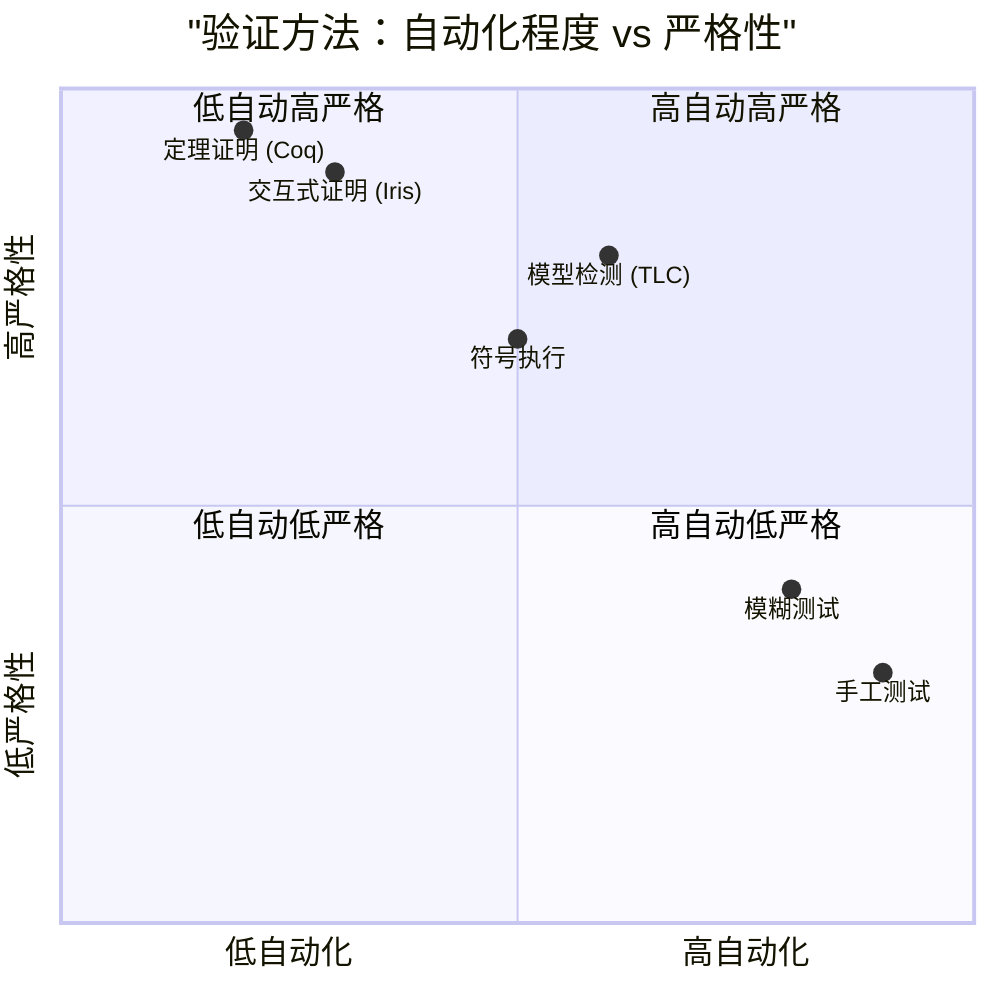
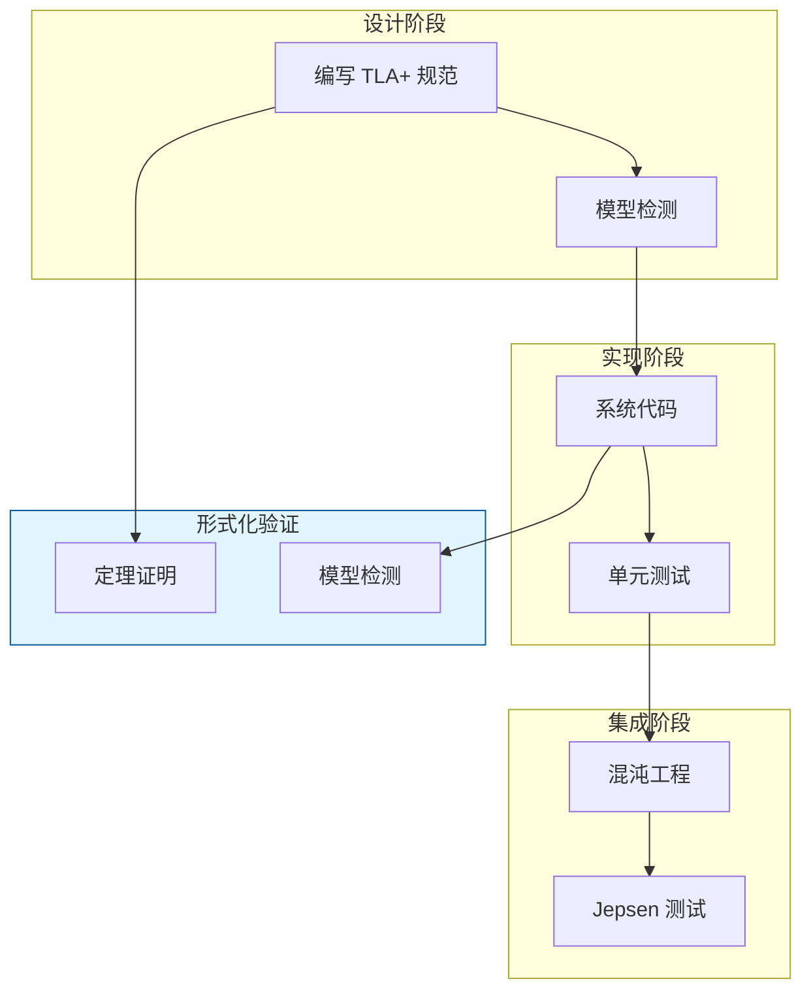

# 可靠性保证的验证方法

> **所属阶段**: Knowledge/ | **前置依赖**: [end-to-end-reliability.md](../Struct/end-to-end-reliability.md), [transactional-stream-semantics.md](../Struct/transactional-stream-semantics.md) | **形式化等级**: L4

---

## 1. 概念定义 (Definitions)

流处理系统的可靠性保证（如 Exactly-Once、Checkpoint 一致性、故障恢复正确性）不能仅通过测试来充分验证，因为分布式系统的状态空间和故障模式组合是天文数字。
形式化验证方法（如模型检测、定理证明、符号执行）为这些保证提供了数学上的严格证明。
近年来，将 TLA+、Coq、Iris 等形式化工具应用于流处理系统的可靠性验证成为研究热点。

**Def-K-06-368 可靠性验证 (Reliability Verification)**

可靠性验证 $V$ 是一个三元组：

$$
V = (\mathcal{S}_{spec}, \mathcal{S}_{impl}, \mathcal{V}_{method})
$$

其中 $\mathcal{S}_{spec}$ 为系统的形式化规范（如 TLA+ 规范），$\mathcal{S}_{impl}$ 为系统实现（或其抽象模型），$\mathcal{V}_{method}$ 为验证方法（模型检测 / 定理证明 / 符号执行）。验证的目标是证明：

$$
\mathcal{S}_{impl} \models \mathcal{S}_{spec}
$$

**Def-K-06-369 可靠性规范 (Reliability Specification)**

可靠性规范 $\mathcal{S}_{spec}$ 定义了系统在故障场景下必须满足的性质，通常包括：

- **安全性 (Safety)**: "坏事不会发生"，如"不会出现重复输出"、"不会丢失已确认的数据"
- **活性 (Liveness)**: "好事最终会发生"，如"Checkpoint 最终会完成"、"故障后系统最终会恢复"
- **公平性 (Fairness)**: 某些事件必须在无限频繁地发生，如"每个健康的 TaskManager 都会收到 Barrier"

**Def-K-06-370 验证覆盖度 (Verification Coverage)**

验证覆盖度 $Cov_V$ 量化了验证方法所覆盖的实现行为占所有可能行为的比例：

- **模型检测**: 覆盖度取决于状态空间遍历的完整性（若状态空间有限且可遍历，则覆盖度为 100%）
- **定理证明**: 覆盖度取决于抽象模型的保真度（抽象越精确，覆盖度越高）
- **测试**: 覆盖度取决于测试用例的充分性（通常远低于 100%）

形式化地，若 $\mathcal{B}_{impl}$ 为实现的所有行为，$\mathcal{B}_{verif}$ 为验证覆盖的行为：

$$
Cov_V = \frac{|\mathcal{B}_{verif}|}{|\mathcal{B}_{impl}|}
$$

*注意*: 对于无限状态系统，$|\mathcal{B}_{impl}|$ 可能无穷大，此时覆盖度需通过抽象精化来度量。

**Def-K-06-371 模型检测中的状态爆炸 (State Space Explosion)**

设系统有 $n$ 个独立组件，每个组件有 $k$ 个离散状态。则全局状态空间大小为 $k^n$。若还存在 $m$ 个并发事件和 $d$ 个时间步的时序约束，则状态空间进一步膨胀为 $O((k \cdot m)^n \cdot d)$。这种现象称为状态爆炸，是模型检测应用于大规模分布式系统时的核心挑战。

---

## 2. 属性推导 (Properties)

**Lemma-K-06-138 模型检测的收敛性**

对于有限状态系统，若验证性质为时序逻辑公式 $\phi$（如 LTL/CTL），则模型检测算法在有限步内必然终止，并给出 $\mathcal{S}_{impl} \models \phi$ 或 $\mathcal{S}_{impl} \not\models \phi$ 的确定结论。

*说明*: 这是模型检测相对于测试的核心优势——有限状态系统上的完备性。$\square$

**Lemma-K-06-139 抽象精化的可靠性保持**

设 $\mathcal{S}_{abstract}$ 是 $\mathcal{S}_{impl}$ 的一个安全抽象（即 $\mathcal{S}_{impl}$ 的所有可达行为都被 $\mathcal{S}_{abstract}$ 包含）。若 $\mathcal{S}_{abstract} \models \phi$，则 $\mathcal{S}_{impl} \models \phi$。

*说明*: 反之不成立。若抽象模型违反某个性质，可能是抽象过度导致的假阳性（Spurious Counterexample），需要进一步精化。$\square$

**Prop-K-06-133 状态空间与验证时间的关系**

设状态空间大小为 $N$，模型检测的时间复杂度通常为 $O(N \cdot |\phi|)$，其中 $|\phi|$ 为性质公式的长度。对于流处理系统，$N$ 可能达到 $10^{20}$ 甚至更大，直接导致验证时间在当前算力下不可行。

*说明*: 实践中必须通过状态压缩、对称性约简、偏序约简等技术来降低有效状态空间。$\square$

---

## 3. 关系建立 (Relations)

### 3.1 验证方法的能力对比



### 3.2 流处理可靠性验证的技术栈

| 验证层级 | 形式化工具 | 验证目标 | 复杂度 |
|---------|-----------|---------|--------|
| **协议层** | TLA+ / PlusCal | Checkpoint 协议、Barrier 对齐 | 中 |
| **状态管理层** | Coq / Isabelle | 状态后端一致性、快照正确性 | 高 |
| **网络层** | Spin / Promela | 消息传递可靠性、反压协议 | 中 |
| **端到端层** | TLA+ | Exactly-Once 语义、Sink 事务 | 高 |
| **并发层** | Iris / VST | 并发状态访问的安全性 | 极高 |

### 3.3 形式化验证与工程实践的结合



---

## 4. 论证过程 (Argumentation)

### 4.1 为什么流处理系统需要形式化验证？

1. **测试无法穷尽**: 分布式系统的并发执行路径和故障模式组合是指数级的，测试只能覆盖极小一部分
2. **故障代价高昂**: 金融交易、医疗监控、工业控制等领域的流处理系统一旦出错，可能导致灾难性后果
3. **规范漂移**: 随着系统迭代，新的优化可能不经意间破坏原有的可靠性保证。形式化规范可以作为回归测试的基准
4. **信任建立**: 对于开源项目（如 Apache Flink），形式化验证可以增强社区和用户对其核心机制正确性的信任

### 4.2 TLA+ 在 Flink Checkpoint 验证中的应用

Apache Flink 社区已经在 TLA+ 中形式化了 Checkpoint 协议（`Checkpoint.tla`）。验证的关键性质包括：

- **安全性**: "对于每个 Checkpoint，要么所有算子都成功确认，要么没有任何算子将其状态持久化为最终结果"
- **活性**: "如果一个 Checkpoint 被触发，那么在有限步内它要么成功完成，要么因超时失败"
- **一致性**: "所有成功完成的 Checkpoint 构成全局一致的时间切片"

通过 TLC 模型检测器，Flink 开发者能够在小规模的参数配置下（如 2 个 Source、2 个算子、2 个 Sink）穷举所有可能的执行路径，验证上述性质是否成立。

### 4.3 反例：未经验证的优化导致数据丢失

某流处理系统在一次性能优化中，将 Checkpoint Barrier 的同步等待改为了异步发送。开发者认为"异步不会影响正确性"，但未进行形式化验证。结果：

- 在特定的网络分区场景下，部分算子先收到 Barrier，另一部分后收到
- 由于异步机制缺乏全局协调，快照时间戳出现不一致
- 系统从该 Checkpoint 恢复后，部分窗口算子处理了本不该属于该快照的数据，导致重复计数

**教训**: 分布式协议中的微小改动可能引入隐蔽的 Bug。形式化验证是发现这类问题的最强武器。

---

## 5. 形式证明 / 工程论证 (Proof / Engineering Argument)

**Thm-K-06-143 形式化验证的 Soundness**

设 $\mathcal{S}_{abstract}$ 是系统实现 $\mathcal{S}_{impl}$ 的一个过近似抽象（over-approximation），即：

$$
\text{Behaviors}(\mathcal{S}_{impl}) \subseteq \text{Behaviors}(\mathcal{S}_{abstract})
$$

若模型检测证明 $\mathcal{S}_{abstract} \models \phi$（其中 $\phi$ 为安全性性质），则：

$$
\mathcal{S}_{impl} \models \phi
$$

*证明*:

安全性性质的违反表现为某个"坏状态"的可达性。由于 $\mathcal{S}_{abstract}$ 包含 $\mathcal{S}_{impl}$ 的所有行为，若抽象模型中不存在可达的坏状态，则实现模型中也不可能存在。因此安全性在实现中成立。$\square$

*说明*: 这一定理是形式化验证能够增强实际系统可信度的理论基础。$\square$

---

**Thm-K-06-144 有限状态系统上的验证完备性**

若 $\mathcal{S}_{impl}$ 的状态空间是有限的（通过抽象或参数限定），且性质 $\phi$ 为 LTL 公式，则模型检测算法在有限时间内必然终止，并给出正确的判断结果。

*证明*:

有限状态系统的行为可以用有限 Büchi 自动机表示。LTL 模型检测的核心是将系统和性质的否定转换为 Büchi 自动机，然后检查语言的空性。由于有限自动机的 emptiness 问题是可判定的，且存在多项式时间算法，因此模型检测必然在有限步内终止。$\square$

---

## 6. 实例验证 (Examples)

### 6.1 Flink Checkpoint 的 TLA+ 规范片段

```tla
\* Checkpoint.tla 概念性片段
VARIABLES checkpointId, confirmedOperators, aborted

Init ==
    /\ checkpointId = 0
    /\ confirmedOperators = {}
    /\ aborted = FALSE

TriggerCheckpoint ==
    /\ checkpointId' = checkpointId + 1
    /\ confirmedOperators' = {}
    /\ aborted' = FALSE

OperatorConfirm(op) ==
    /\ ~aborted
    /\ confirmedOperators' = confirmedOperators \union {op}
    /\ UNCHANGED <<checkpointId, aborted>>

CheckpointSuccess ==
    /\ confirmedOperators = AllOperators
    /\ UNCHANGED <<checkpointId, confirmedOperators, aborted>>

\* 安全性：成功 Checkpoint 必然所有算子都已确认
Safety ==
    [](CheckpointSuccess => confirmedOperators = AllOperators)
```

### 6.2 Coq 中的状态后端一致性证明

```coq
(* 概念性 Coq 证明：RocksDB 快照的一致性 *)
Theorem snapshot_consistency:
  forall (s : State) (keys : list Key),
  consistent_state s ->
  consistent_state (create_snapshot s keys).
Proof.
  intros s keys H_consistent.
  unfold create_snapshot.
  (* 证明快照创建操作保持一致性 *)
  apply consistent_snapshot_preserve.
  assumption.
Qed.
```

### 6.3 Python 中的轻量级模型检测模拟

```python
from collections import deque

def model_check(initial_states, transition_fn, property_fn, max_depth=10):
    """
    简单的 BFS 模型检测器（用于教学演示）
    """
    visited = set()
    queue = deque([(s, 0) for s in initial_states])
    counterexamples = []

    while queue:
        state, depth = queue.popleft()
        state_hash = hash(state)

        if state_hash in visited or depth > max_depth:
            continue
        visited.add(state_hash)

        # 检查性质
        if not property_fn(state):
            counterexamples.append((state, depth))
            continue

        # 扩展后继状态
        for next_state in transition_fn(state):
            queue.append((next_state, depth + 1))

    return len(counterexamples) == 0, counterexamples

# 示例：检查"confirmedOperators 数量从不超过总数" ALL_OPS = {"Source", "Map", "Sink"}

def safety_property(state):
    return len(state.get("confirmed", set())) <= len(ALL_OPS)

def transitions(state):
    confirmed = state.get("confirmed", set())
    results = []
    for op in ALL_OPS - confirmed:
        new_state = dict(state)
        new_state["confirmed"] = confirmed | {op}
        results.append(new_state)
    return results

initial = [{"confirmed": set()}]
passes, cex = model_check(initial, transitions, safety_property, max_depth=5)
print(f"安全性验证通过: {passes}")
```

---

## 7. 可视化 (Visualizations)

### 7.1 形式化验证在软件开发生命周期中的位置


### 7.2 状态空间随系统规模的增长

```mermaid
xychart-beta
    title "状态空间大小与组件数量的关系 (k=3 状态/组件)"
    x-axis [1, 2, 3, 4, 5, 6]
    y-axis "状态空间大小 (对数)" 0 --> 15
    line "全局状态空间" {0, 0.95, 1.9, 2.86, 3.81, 4.77}
    line "对称性约简后" {0, 0.48, 0.95, 1.43, 1.91, 2.39}
    line "偏序约简后" {0, 0.3, 0.6, 0.9, 1.2, 1.5}
```

*说明*: Y 轴为 $\log_{10}(k^n)$，即 $n \cdot \log_{10}(k)$。约简技术可将有效状态空间降低 1-2 个数量级。

---

## 8. 引用参考 (References)

---

*文档版本: v1.0 | 创建日期: 2026-04-18*
