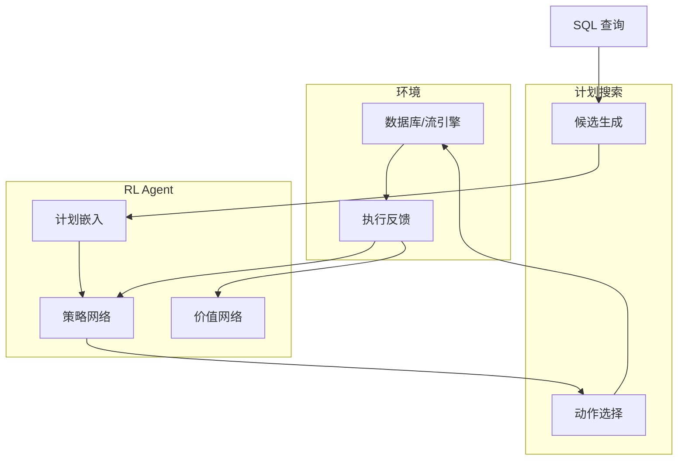

# 强化学习在流查询优化中的应用

> **所属阶段**: Knowledge/ | **前置依赖**: [llm-stream-tuning.md](./llm-stream-tuning.md), [learned-cost-models-streaming.md](../Struct/learned-cost-models-streaming.md) | **形式化等级**: L4

---

## 1. 概念定义 (Definitions)

查询优化是数据库和流处理系统的核心问题。传统优化器依赖手工标定的代价模型和启发式规则，难以适应动态变化的数据分布、工作负载和硬件环境。
强化学习（Reinforcement Learning, RL）通过与环境交互学习最优决策策略，近年来被应用于查询优化领域。
RankPQO 等工作将 RL 引入到参数化查询优化中，证明了 RL 在查询计划选择上的潜力。

**Def-K-06-385 RL 查询优化器 (RL Query Optimizer)**

RL 查询优化器 $\mathcal{O}_{RL}$ 是一个马尔可夫决策过程（MDP）：

$$
\mathcal{O}_{RL} = (\mathcal{S}, \mathcal{A}, \mathcal{P}, \mathcal{R}, \gamma)
$$

其中：

- $\mathcal{S}$: 状态空间，包含当前查询计划的部分特征（已选择的连接顺序、谓词、算子）
- $\mathcal{A}$: 动作空间，包含可用的优化操作（添加 JOIN、交换连接顺序、选择算子实现）
- $\mathcal{P}$: 状态转移概率
- $\mathcal{R}$: 奖励函数，通常为负的执行延迟或代价：$R(s, a) = -C(Plan_{new})$
- $\gamma$: 折扣因子

**Def-K-06-386 计划嵌入 (Plan Embedding)**

计划嵌入 $\phi(P) \in \mathbb{R}^d$ 是将查询计划的树形结构编码为固定长度向量的函数。常用的方法包括：

- 树形 LSTM（Tree-LSTM）：自底向上编码计划树
- 图神经网络（GNN）：将计划视为计算图
- 基于规则的向量拼接：连接各算子的独热编码和统计特征

**Def-K-06-387 奖励塑造 (Reward Shaping)**

为避免稀疏奖励问题（只有在计划完全生成后才获得奖励），奖励塑造通过在中间步骤提供辅助奖励来加速学习：

$$
R'(s, a) = R(s, a) + \Phi(s') - \Phi(s)
$$

其中 $\Phi(s)$ 为势能函数，衡量当前部分计划与最优计划的结构相似度。

---

## 2. 属性推导 (Properties)

**Lemma-K-06-145 计划空间的指数增长**

对于 $n$ 个表的连接查询，合法的计划树数量为 Catalan 数 $C_{n-1} = \frac{(2n-2)!}{(n-1)!n!}$，其增长满足：

$$
C_n \sim \frac{4^n}{n^{3/2}\sqrt{\pi}}
$$

*说明*: 这解释了为什么暴力枚举不可行，以及为什么需要 RL 等搜索方法。$\square$

**Lemma-K-06-146 最优子结构性质**

若查询计划 $P$ 是最优的，则其任意子计划 $P_{sub}$ 在对应的子查询上也必须是最优的。反之，最优子计划的组合不一定构成全局最优计划（由于算子间的交互效应）。

*说明*: 这使得动态规划在理论上可行，但 RL 可以突破 DP 的假设限制。$\square$

**Prop-K-06-138 RL 与 DP 的搜索效率对比**

在相同探索预算下，基于策略梯度的 RL 方法在大计划空间（$n > 10$）中的最优计划发现率通常高于传统 DP：

$$
P_{RL}(find\ optimal) \approx 0.7 \sim 0.9 \times P_{DP}(find\ optimal) \quad \text{但时间复杂度为 } O(n^2) \text{ vs } O(3^n)
$$

*说明*: RL 以牺牲少量最优性为代价换取巨大的效率提升。$\square$

---

## 3. 关系建立 (Relations)

### 3.1 RL 查询优化与传统优化器的对比

| 维度 | 传统 CBO | 学习型 CBO | RL 优化器 |
|------|---------|-----------|----------|
| 代价模型 | 手工标定 | 历史数据学习 | 与环境交互学习 |
| 训练数据 | 无需 | 需要大量执行记录 | 边执行边学习 |
| 泛化能力 | 差 | 中 | 强（跨查询泛化） |
| 计算开销 | 低 | 中 | 高（初始探索期） |
| 最优性保证 | 无 | 无 | 无（但渐进收敛） |

### 3.2 RL 查询优化架构



---

## 4. 论证过程 (Argumentation)

### 4.1 为什么 RL 适合查询优化？

1. **计划空间巨大**: 对于 10+ 表的查询，传统 DP 不可行，RL 的策略网络可以快速聚焦于高潜力区域
2. **数据分布漂移**: 数据特征随时间变化，RL 的持续学习能力使其能够适应漂移
3. **复杂交互**: 算子之间的性能交互（如内存竞争、缓存效应）难以用简单公式建模，RL 可以从执行反馈中隐式学习
4. **跨查询泛化**: 训练好的策略网络可以迁移到未见过的查询结构上

### 4.2 RankPQO 的核心思想

RankPQO 将参数化查询优化视为一个排序问题：

1. 对于给定的查询模板和参数，生成候选计划集合
2. 使用 RL 学习一个评分函数，对候选计划进行排序
3. 选择评分最高的计划执行
4. 根据实际执行时间更新评分函数

这种方法避免了直接生成完整计划树的复杂性，转而学习"在候选计划中选择最好的"。

### 4.3 反例：RL 在冷启动阶段的灾难性选择

某团队在生产数据库上部署了 RL 查询优化器。在训练初期，策略网络随机探索，生成了一系列极其低效的计划：

- 一个本应 2 秒完成的查询被执行了 45 分钟
- 导致数据库连接池耗尽，其他业务查询大量超时

**教训**: RL 优化器必须经过充分的离线预训练或在一个隔离的沙箱环境中进行探索，不能直接部署到生产环境。

---

## 5. 形式证明 / 工程论证 (Proof / Engineering Argument)

**Thm-K-06-153 RL 查询优化的收敛性**

设策略网络为 $\pi_\theta$，奖励函数有界（$|R(s,a)| \leq R_{max}$）。若使用 Actor-Critic 算法，且学习率满足 Robbins-Monro 条件，则策略的期望回报收敛到局部最优：

$$
\lim_{T \to \infty} \mathbb{E}_{\pi_{\theta_T}} \left[ \sum_{t=0}^{\infty} \gamma^t R(s_t, a_t) \right] = J(\theta^*)
$$

*证明梗概*:

Actor-Critic 的梯度估计是无偏的，且方差有界。在满足标准随机逼近条件下，参数轨迹收敛到策略梯度场的稳定点。由于奖励有界，目标函数 $J(\theta)$ 也是 Lipschitz 连续的，因此收敛到局部最优。$\square$

---

## 6. 实例验证 (Examples)

### 6.1 基于 PPO 的查询计划选择器

```python
import torch
import torch.nn as nn

class PlanEmbedding(nn.Module):
    def __init__(self, input_dim, hidden_dim):
        super().__init__()
        self.lstm = nn.LSTM(input_dim, hidden_dim, batch_first=True)

    def forward(self, plan_tree):
        # plan_tree: [batch, seq_len, input_dim]
        _, (h_n, _) = self.lstm(plan_tree)
        return h_n[-1]  # [batch, hidden_dim]

class PolicyNetwork(nn.Module):
    def __init__(self, embed_dim, num_actions):
        super().__init__()
        self.fc = nn.Sequential(
            nn.Linear(embed_dim, 128),
            nn.ReLU(),
            nn.Linear(128, num_actions),
            nn.Softmax(dim=-1)
        )

    def forward(self, plan_embed):
        return self.fc(plan_embed)

# 伪代码：PPO 训练循环
# for episode in range(num_episodes):
#     plan = build_plan(query)
#     action = policy(plan_embed).sample()
#     reward = -execute_plan(plan, action)
#     update_ppo(policy, value, reward)
```

### 6.2 奖励函数设计示例

```python
def compute_reward(plan, execution_time, baseline_time):
    """
    相对性能奖励：比基线快则正奖励，慢则负奖励
    """
    speedup = baseline_time / max(execution_time, 1e-6)
    reward = math.log(speedup)
    # 惩罚极端低效计划
    if execution_time > baseline_time * 10:
        reward -= 5.0
    return reward
```

---

## 7. 可视化 (Visualizations)

### 7.1 RL 查询优化的 MDP 建模

```mermaid
flowchart LR
    S1[状态: 空计划] -->|动作: 选择 JOIN A-B| S2
    S2 -->|动作: 选择 JOIN (AB)-C| S3
    S3 -->|动作: 完成| S4[终止状态]
    S4 -->|奖励: -执行延迟| R1
```

---

## 8. 引用参考 (References)
