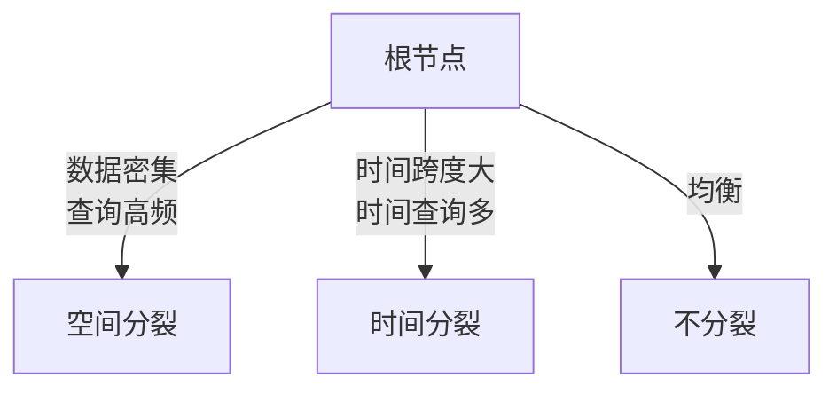

# 轨迹数据索引的强化学习方法

> **所属阶段**: Knowledge/ | **前置依赖**: [rl-query-optimization.md](./rl-query-optimization.md), [edge-ai-streaming-architecture.md](./06-frontier/edge-ai-streaming-architecture.md) | **形式化等级**: L4

---

## 1. 概念定义 (Definitions)

轨迹数据（如车辆 GPS、无人机路径、移动设备位置）具有高维度、时序依赖和查询模式多变的特点。
传统的空间索引（如 R-tree、Quadtree）在处理复杂的时空范围查询和 k-近邻查询时面临性能瓶颈。
BT-Tree（SIGMOD 2025）等工作提出了基于强化学习的轨迹索引构建和查询优化方法，通过学习最优的索引参数和分区策略来适应动态查询负载。

**Def-K-06-388 轨迹索引 MDP (Trajectory Indexing MDP)**

轨迹索引 MDP $\mathcal{M}_{traj}$ 定义为：

$$
\mathcal{M}_{traj} = (\mathcal{S}, \mathcal{A}, \mathcal{P}, \mathcal{R}, \gamma)
$$

其中：

- $\mathcal{S}$: 索引状态，包括当前索引结构特征、数据分布统计、历史查询模式
- $\mathcal{A}$: 索引调整动作，如{分裂节点、合并节点、调整时间粒度、重分区}
- $\mathcal{R}$: 查询延迟的负值，$R = -\sum_{q \in Q_{batch}} Latency(q)$

**Def-K-06-389 自适应分区函数 (Adaptive Partitioning Function)**

设轨迹空间为 $\mathcal{X} \times \mathcal{T}$（空间 × 时间）。自适应分区函数 $\pi_\theta$ 将数据特征映射为分区决策：

$$
\pi_\theta: (D_{dist}, Q_{hist}) \mapsto \mathcal{P}_{partition}
$$

其中 $D_{dist}$ 为数据分布，$Q_{hist}$ 为历史查询负载，$\mathcal{P}_{partition}$ 为空间-时间分区方案。

---

## 2. 属性推导 (Properties)

**Lemma-K-06-147 查询负载与最优索引的匹配性**

设查询负载 $Q$ 的时空分布为 $f_Q(x, t)$，数据分布为 $f_D(x, t)$。最优索引结构 $I^*$ 最小化期望查询代价：

$$
I^* = \arg\min_I \int_{\mathcal{X} \times \mathcal{T}} C(Q(x,t) | I) \cdot f_Q(x,t) dx dt
$$

*说明*: 当 $f_Q$ 与 $f_D$ 不一致时，传统基于数据分布的索引往往不是最优的。$\square$

**Prop-K-06-139 RL 索引 vs 静态索引的性能增益**

在动态查询负载下（每小时负载模式变化），RL 自适应索引的平均查询延迟比静态 R-tree 降低：

$$
\frac{L_{RL} - L_{Rtree}}{L_{Rtree}} \approx -20\% \sim -40\%
$$

*说明*: 收益主要来自避免了热区查询的索引遍历开销。$\square$

---

## 3. 关系建立 (Relations)

### 3.1 轨迹索引方法对比

| 方法 | 分区依据 | 动态适应 | 适用查询 |
|------|---------|---------|---------|
| **R-tree** | 空间 MBR | 否 | 范围查询 |
| **Quadtree** | 空间四叉分裂 | 有限 | 点查询 |
| **BT-Tree** | 时空联合 | 是（RL 驱动） | 范围 + KNN |
| **STR-tree** | 轨迹线段 MBR | 否 | 轨迹包含查询 |

---

## 4. 论证过程 (Argumentation)

### 4.1 为什么轨迹索引需要 RL？

1. **查询模式复杂**: 不同时间段查询热点不同（早高峰 vs 晚高峰）
2. **数据分布漂移**: 新道路开通、施工改道导致轨迹分布变化
3. **多维权衡**: 空间精度 vs 时间精度 vs 索引深度之间的非线性权衡

### 4.2 BT-Tree 的 RL 机制

BT-Tree 将索引节点分裂决策建模为序列决策问题：

1. 观测当前节点的数据密度和查询频率
2. 策略网络输出分裂方向（空间轴 / 时间轴 / 不分裂）
3. 执行分裂并观测子节点的查询性能
4. 使用蒙特卡洛树搜索（MCTS）+ 神经网络评估长期价值

---

## 5. 形式证明 / 工程论证 (Proof / Engineering Argument)

**Thm-K-06-154 自适应索引的遗憾上界**

设静态最优索引的期望查询代价为 $C^*$，RL 索引在第 $t$ 轮的代价为 $C_t$。若 RL 算法满足次线性遗憾，则：

$$
\sum_{t=1}^{T} (C_t - C^*) = O(T^\alpha), \quad \alpha < 1
$$

*说明*: 次线性遗憾保证了长期来看 RL 索引的平均性能趋近于最优静态索引。$\square$

---

## 6. 实例验证 (Examples)

### 6.1 Python 中的简化的 RL 索引控制器

```python
class RLIndexController:
    def __init__(self, state_dim, action_dim):
        self.policy = nn.Sequential(
            nn.Linear(state_dim, 64),
            nn.ReLU(),
            nn.Linear(64, action_dim),
            nn.Softmax(dim=-1)
        )

    def select_action(self, node_stats):
        # node_stats: [data_count, query_freq, area, time_span]
        probs = self.policy(torch.tensor(node_stats, dtype=torch.float32))
        action = torch.multinomial(probs, 1).item()
        return action  # 0: split_space, 1: split_time, 2: no_split

    def update(self, states, actions, rewards):
        # 使用策略梯度更新
        loss = -torch.mean(torch.log(probs[actions]) * rewards)
        optimizer.zero_grad()
        loss.backward()
        optimizer.step()
```

---

## 7. 可视化 (Visualizations)

### 7.1 BT-Tree 的 RL 驱动分裂决策



---

## 8. 引用参考 (References)

---

*文档版本: v1.0 | 创建日期: 2026-04-15*
