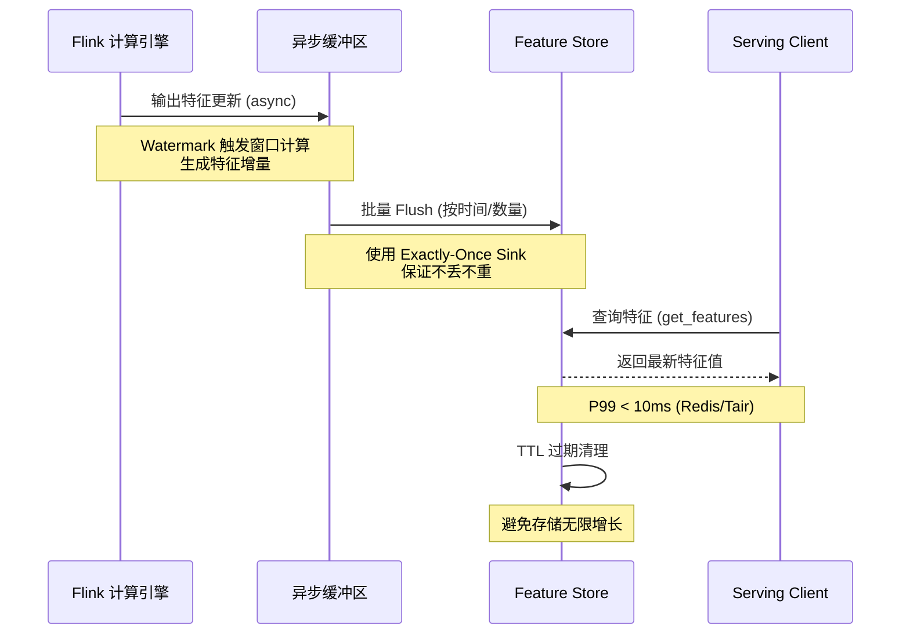
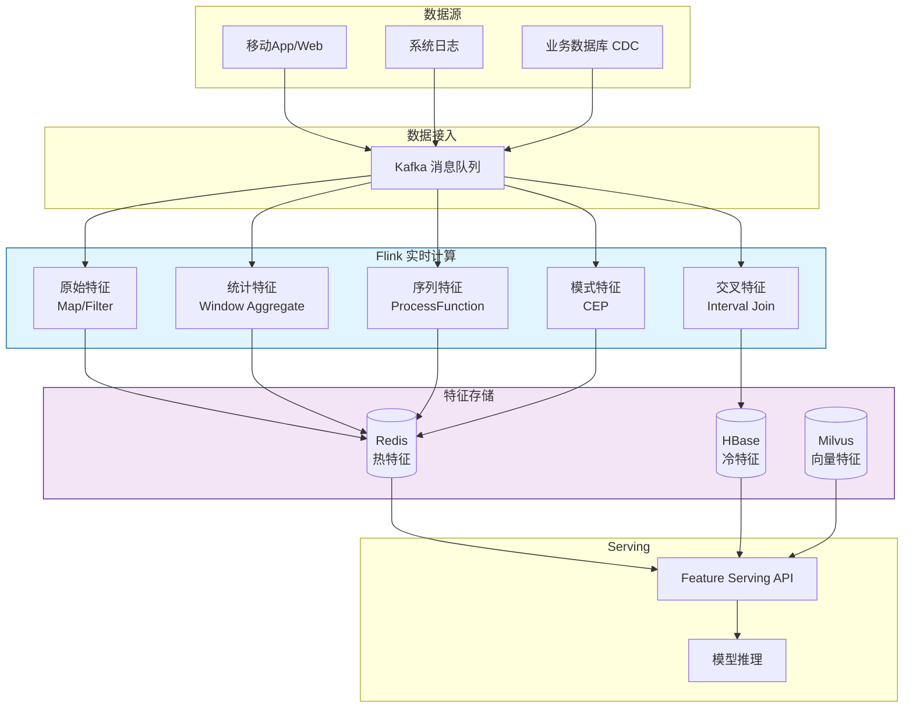
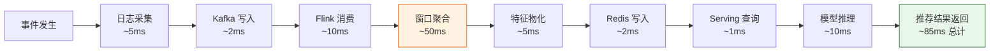

# 实时特征计算与流处理的集成

> **所属阶段**: Knowledge/ | **前置依赖**: [feature-store-architecture.md](./feature-store-architecture.md), [consistency-training-inference.md](../Struct/consistency-training-inference.md) | **形式化等级**: L4

---

## 1. 概念定义 (Definitions)

实时特征计算是特征存储系统的核心引擎，负责将原始事件流转换为模型可用的低延迟特征。流处理系统（如 Apache Flink）通过事件时间语义、状态管理和精确一次处理，为实时特征工程提供了可靠的基础设施。

**Def-K-06-311 实时特征计算 (Real-time Feature Computation)**

实时特征计算是指对无界事件流 $\mathcal{E} = \{e_1, e_2, \dots\}$ 进行持续处理，在事件时间 $t$ 产生特征值 $f(t)$ 的过程：

$$
\mathcal{RTC}(\mathcal{E}, \mathcal{Q}, t) \triangleq \{ f_i(t) \mid f_i = q_i(\mathcal{E}_{\leq t}), q_i \in \mathcal{Q} \}
$$

其中 $\mathcal{E}_{\leq t} = \{ e \in \mathcal{E} \mid \tau(e) \leq t \}$ 为事件时间 $t$ 之前到达的所有事件，$\mathcal{Q}$ 为特征查询/转换算子集合，$\tau(e)$ 为事件 $e$ 的事件时间戳。

**Def-K-06-312 特征计算图 (Feature Computation Graph)**

特征计算图 $\mathcal{G}_{fc}$ 是一个有向无环图：

$$
\mathcal{G}_{fc} = (V_{op}, E_{data}, \Omega)
$$

- $V_{op}$ 为算子节点集合，每个节点代表一个流处理算子（Source、Map、Filter、Window、Join、Sink）
- $E_{data} \subseteq V_{op} \times V_{op}$ 为数据流边
- $\Omega: V_{op} \to \{\text{Source}, \text{Transform}, \text{Window}, \text{Join}, \text{Sink}\}$ 为算子类型标注

**Def-K-06-313 特征延迟预算 (Feature Latency Budget)**

对于端到端特征 Serving 链路，设各阶段延迟为 $l_1, l_2, \dots, l_n$，则总延迟和延迟预算满足：

$$
L_{total} = \sum_{i=1}^{n} l_i \leq L_{budget}
$$

若 $L_{total} > L_{budget}$，则称特征计算链路存在**延迟赤字 (Latency Deficit)**。

**Def-K-06-314 特征物化策略 (Feature Materialization Strategy)**

特征物化策略 $M$ 定义了特征值从计算到存储的持久化方式：

$$
M \in \{ M_{sync}, M_{async}, M_{batch}, M_{lazy} \}
$$

- $M_{sync}$: 同步物化，特征计算完成后立即阻塞写入存储
- $M_{async}$: 异步物化，计算结果放入缓冲区后批量异步写入
- $M_{batch}$: 批量物化，按固定时间窗口或记录数批量写入
- $M_{lazy}$: 惰性物化，仅在查询时触发计算和存储

**Def-K-06-315 特征计算一致性级别 (Feature Computation Consistency)**

设特征计算引擎的一致性级别为 $C_{fc}$，则：

$$
C_{fc} \in \{ \text{At-Most-Once}, \text{At-Least-Once}, \text{Exactly-Once} \}
$$

对于计数、求和等聚合特征，$C_{fc} = \text{Exactly-Once}$ 是保证特征数值正确性的必要条件。

---

## 2. 属性推导 (Properties)

从实时特征计算的定义可直接推导流处理系统的若干关键工程性质。

**Lemma-K-06-104 窗口聚合的单调性**

设滑动窗口算子 $W$ 在事件时间 $t$ 的输出为 $W(t)$，对于 $t_1 \leq t_2$，若窗口函数为单调递增（如 COUNT、SUM），则：

$$
W(t_1) \leq W(t_2)
$$

*证明*: 由 Def-K-06-311，$\mathcal{E}_{\leq t_1} \subseteq \mathcal{E}_{\leq t_2}$。单调递增函数在扩大输入域时输出不减小。$\square$

**Lemma-K-06-105 双流 Join 的时序正确性条件**

设流 $A$ 和流 $B$ 的 Interval Join 窗口为 $[t - \delta_{left}, t + \delta_{right}]$，则对于事件时间 $t$ 的 Join 结果，必须满足：

$$
\forall (a, b) \in Join(A, B, t), \quad |\tau(a) - \tau(b)| \leq \max(\delta_{left}, \delta_{right})
$$

*证明*: 由 Interval Join 的语义定义，流 $A$ 中事件 $a$ 只能与流 $B$ 中满足 $\tau(b) \in [\tau(a) - \delta_{left}, \tau(a) + \delta_{right}]$ 的事件匹配。故时间差绝对值不超过 $\max(\delta_{left}, \delta_{right})$。$\square$

**Lemma-K-06-106 异步物化与同步物化的延迟关系**

设同步物化延迟为 $L_{sync}$，异步物化延迟为 $L_{async}$，则对于单次特征 Serving 请求：

$$
L_{sync} \leq L_{async} + L_{buffer}
$$

其中 $L_{buffer}$ 为异步缓冲区的最大驻留时间。

*说明*: 异步物化降低了写入吞吐量开销，但引入了缓冲延迟，需要在一致性与性能之间权衡。

**Prop-K-06-107 特征复杂度与计算延迟的正相关性**

设特征 $f$ 的计算图深度为 $d$（即最长算子链长度），平均算子处理延迟为 $\bar{l}$，则特征计算的理论最小延迟满足：

$$
L_{compute}(f) \geq d \cdot \bar{l}
$$

*说明*: 该命题解释了为什么深度嵌套的窗口 Join 和多层 CEP 模式匹配通常会导致特征延迟显著增加。

---

## 3. 关系建立 (Relations)

### 3.1 流处理算子与特征类型的映射

不同的实时特征类型对应不同的流处理算子模式：

| 特征类型 | 典型算子 | Flink API | 延迟级别 |
|---------|---------|-----------|---------|
| 原始特征 (Raw) | Map, Filter | DataStream.map() | < 1ms |
| 统计特征 (Statistical) | Window Aggregate | window.aggregate() | 10-100ms |
| 序列特征 (Sequential) | ProcessFunction + State | keyedProcessFunction | 1-10ms |
| 关联特征 (Relational) | Interval Join, CoGroup | intervalJoin() | 10-100ms |
| 模式特征 (Pattern) | CEP Pattern | CEP.pattern() | 100ms-1s |
| 图特征 (Graph) | Gelly / 自定义迭代 | DataSet/Iterative | 1-10s |

### 3.2 实时特征计算与特征存储的接口协议

流处理引擎（Flink）与特征存储之间的数据交换遵循以下接口协议：



### 3.3 与离线特征计算的互补关系

实时特征计算与离线特征计算并非替代关系，而是互补关系：

- **实时计算**: 处理高频率、短窗口、强时效性的特征（如最近 5 分钟点击数）
- **离线计算**: 处理大规模、长周期、复杂聚合的特征（如最近 90 天用户生命周期价值）
- **混合模式**: 实时特征增量更新 + 离线特征定期全量修正，形成 Lambda 或 Kappa 混合架构

---

## 4. 论证过程 (Argumentation)

### 4.1 为什么流处理是实时特征计算的最佳选择？

传统的数据库触发器（Trigger）或消息队列消费者可以实现简单的实时特征计算，但面对复杂场景存在明显局限：

1. **状态管理**: 数据库触发器难以高效管理大规模键控状态（如每个用户的 7 天行为序列）
2. **事件时间语义**: 消费者程序通常只支持处理时间，无法正确处理乱序数据和迟到事件
3. **容错与恢复**: 自定义消费者缺乏检查点和自动故障恢复机制
4. **复杂模式匹配**: CEP 类特征（如"浏览-加购-支付"转化漏斗）在通用编程语言中实现复杂且低效

流处理引擎（如 Flink）通过内置的状态后端、Watermark 机制、Checkpoint 和 CEP 库，系统性解决了上述问题。

### 4.2 实时特征计算中的主要工程挑战

**挑战 1: 状态膨胀 (State Explosion)**

用户级特征通常需要维护每个用户的状态。若平台有 2 亿 DAU，每个用户的状态为 1KB，则总状态量约为 200GB。若进一步维护用户-商品交叉特征，状态量可能达到 TB 级。

**应对策略**:

- 使用 RocksDB 状态后端将冷状态卸载到磁盘
- 设置 State TTL 自动清理过期状态
- 对稀疏特征采用压缩存储

**挑战 2: 热键倾斜 (Hot Key Skew)**

某些键（如热门商品 ID）会收到远超平均水平的流量，导致特定 TaskManager 负载过高，延迟飙升。

**应对策略**:

- 两阶段聚合（Local-Global Aggregate）
- 热键拆分（Salting）: `key + hash(key) % N`
- 动态负载均衡与自动扩缩容

**挑战 3: 迟到数据与特征修正**

对于已经触发窗口计算并输出到特征存储的结果，若后续收到迟到数据，是否需要修正已写入的特征值？

**策略对比**:

- **不修正**: 简单高效，但会牺牲一定准确性（适用于对近似值可容忍的场景）
- **修正+回撤**: 发送修正增量或负向更新（Retraction），保持最终一致性（适用于金融风控等强一致场景）

### 4.3 反例：无 Watermark 的实时特征系统

某电商平台使用 Kafka Consumer 自行实现"最近 1 小时商品点击数"特征。由于没有事件时间语义，系统按处理时间划分窗口。在大促期间，由于网络延迟和消息队列积压，消费者处理的数据实际时间戳可能落后真实时间数分钟甚至数小时。结果：

- 窗口中混入了"未来"的数据（相对于窗口边界）
- 不同消费者实例的窗口边界不一致
- 特征值在不同 Serving 节点上存在显著差异

这直接导致了推荐排序结果的抖动和用户体验的下降。

---

## 5. 形式证明 / 工程论证 (Proof / Engineering Argument)

**Thm-K-06-108 Exactly-Once 语义保证聚合特征数值正确性**

设流处理引擎执行聚合算子 $Agg$（如 SUM、COUNT），若引擎提供 Exactly-Once 语义（$C_{fc} = \text{Exactly-Once}$），则对于任意事件集合 $\mathcal{E}$，聚合结果满足：

$$
Agg_{exactly\text{-}once}(\mathcal{E}) = Agg_{ideal}(\mathcal{E})
$$

其中 $Agg_{ideal}$ 表示在理想无故障环境下的理论聚合值。

*证明*:

Exactly-Once 语义保证每个事件 $e \in \mathcal{E}$ 在聚合过程中被恰好处理一次，既不会遗漏也不会重复。设聚合函数为可结合、可交换的幺半群 $(S, \oplus, 0)$，则：

$$
Agg_{exactly\text{-}once}(\mathcal{E}) = \bigoplus_{e \in \mathcal{E}} val(e) = Agg_{ideal}(\mathcal{E})
$$

若语义降级为 At-Least-Once，则某些事件可能被重复处理：

$$
Agg_{at\text{-}least\text{-}once}(\mathcal{E}) = \bigoplus_{e \in \mathcal{E}} k_e \cdot val(e), \quad \exists e, k_e \geq 2
$$

导致结果偏离理想值。$\square$

---

**Thm-K-06-109 事件时间窗口保证特征值的因果单调性**

设特征 $f$ 由事件时间窗口 $W$ 计算得到，窗口算子在水印 $w(t)$ 推进到 $t$ 时触发并输出 $f(t)$。则对于任意 $t_1 < t_2$：

$$
f(t_1) \text{ 仅依赖于 } \mathcal{E}_{\leq t_1}, \quad f(t_2) \text{ 仅依赖于 } \mathcal{E}_{\leq t_2}
$$

且 $f(t_2)$ 可表示为 $f(t_1)$ 与增量事件的组合：

$$
f(t_2) = f(t_1) \oplus \Delta f(t_1, t_2)
$$

其中 $\Delta f(t_1, t_2) = Agg(\mathcal{E}_{t_1 < \tau \leq t_2})$。

*证明*:

由 Watermark 的定义，$w(t) \geq t$ 保证所有事件时间 $\leq t$ 的事件已到达窗口。因此 $f(t)$ 的计算域恰好为 $\mathcal{E}_{\leq t}$。对于 $t_1 < t_2$，有 $\mathcal{E}_{\leq t_2} = \mathcal{E}_{\leq t_1} \cup \mathcal{E}_{t_1 < \tau \leq t_2}$。由聚合函数的可分性：

$$
Agg(\mathcal{E}_{\leq t_2}) = Agg(\mathcal{E}_{\leq t_1}) \oplus Agg(\mathcal{E}_{t_1 < \tau \leq t_2})
$$

即 $f(t_2) = f(t_1) \oplus \Delta f(t_1, t_2)$。$\square$

---

**Thm-K-06-110 异步物化策略的延迟-吞吐量帕累托边界**

设特征计算产生率为 $\lambda$（特征更新/秒），同步写入吞吐量为 $\mu_{sync}$，异步批量写入吞吐量为 $\mu_{async}$（通常 $\mu_{async} \gg \mu_{sync}$）。若 $\lambda > \mu_{sync}$，则同步策略将导致排队延迟无限增长，而异步策略的稳态平均延迟为：

$$
\mathbb{E}[L_{async}] = \frac{B}{2 \mu_{async}} + \frac{\lambda}{2 \mu_{async} (\mu_{async} - \lambda)} \cdot \mathbb{E}[B^2]
$$

其中 $B$ 为批量大小。当 $\lambda < \mu_{async}$ 时，异步策略保持有限延迟。

*证明梗概*:

异步物化可建模为 M/G/1 排队系统，其中到达率为 $\lambda / B$，服务率为 $\mu_{async} / B$。由 Pollaczek-Khinchine 公式，稳态平均等待时间为：

$$
W = \frac{\lambda \mathbb{E}[S^2]}{2(1 - \rho)}
$$

其中 $\rho = \lambda / \mu_{async}$，$S$ 为服务时间。代入并加上批量内平均等待时间 $B / (2 \mu_{async})$ 即得结论。$\square$

---

## 6. 实例验证 (Examples)

### 6.1 Flink 实时用户行为特征计算

以下是一个典型的 Flink 实时特征计算作业，计算用户在最近 5 分钟、1 小时、24 小时内的点击、加购、下单统计：

```java
/**
 * 实时用户行为统计特征计算
 * 输出到 Redis 作为 Online Feature Store
 */
public class RealtimeUserFeatureJob {
    public static void main(String[] args) throws Exception {
        StreamExecutionEnvironment env =
            StreamExecutionEnvironment.getExecutionEnvironment();

        // 启用检查点与 Exactly-Once
        env.enableCheckpointing(30000);
        env.getCheckpointConfig().setCheckpointingMode(
            CheckpointingMode.EXACTLY_ONCE);

        // 读取用户行为事件流
        DataStream<UserBehaviorEvent> behaviorStream = env
            .fromSource(
                KafkaSource.<UserBehaviorEvent>builder()
                    .setBootstrapServers("kafka:9092")
                    .setTopics("user-behavior")
                    .setGroupId("feature-computation")
                    .setValueOnlyDeserializer(new BehaviorDeserializer())
                    .build(),
                WatermarkStrategy
                    .<UserBehaviorEvent>forBoundedOutOfOrderness(
                        Duration.ofSeconds(10))
                    .withTimestampAssigner((e, ts) -> e.getEventTime()),
                "Behavior Source"
            );

        // 多窗口聚合: 5分钟 / 1小时 / 24小时
        DataStream<UserFeature> features = behaviorStream
            .keyBy(UserBehaviorEvent::getUserId)
            .window(SlidingEventTimeWindows.of(
                Time.minutes(5), Time.minutes(1)))
            .aggregate(new BehaviorAggregateFunction("5m"))
            .union(
                behaviorStream
                    .keyBy(UserBehaviorEvent::getUserId)
                    .window(SlidingEventTimeWindows.of(
                        Time.hours(1), Time.minutes(5)))
                    .aggregate(new BehaviorAggregateFunction("1h")),
                behaviorStream
                    .keyBy(UserBehaviorEvent::getUserId)
                    .window(SlidingEventTimeWindows.of(
                        Time.hours(24), Time.hours(1)))
                    .aggregate(new BehaviorAggregateFunction("24h"))
            );

        // 写入 Feature Store (Redis)
        features.addSink(new RedisFeatureStoreSink());

        env.execute("Realtime User Feature Computation");
    }
}
```

### 6.2 基于 CEP 的实时模式特征

以下示例使用 Flink CEP 识别"浏览商品详情页后 30 分钟内加购"的购买意向特征：

```java
// [伪代码片段 - 不可直接运行] 仅展示核心逻辑
Pattern<UserBehaviorEvent, ?> purchaseIntent = Pattern
    .<UserBehaviorEvent>begin("detail_view")
    .where(evt -> "detail_enter".equals(evt.getEventType()))
    .followedBy("add_cart")
    .where(evt -> "cart_add".equals(evt.getEventType()))
    .within(Time.minutes(30));

DataStream<PurchaseIntentFeature> intentFeatures = CEP.pattern(
        behaviorStream.keyBy(UserBehaviorEvent::getUserId),
        purchaseIntent)
    .process(new PatternProcessFunction<UserBehaviorEvent, PurchaseIntentFeature>() {
        @Override
        public void processMatch(
                Map<String, List<UserBehaviorEvent>> match,
                Context ctx,
                Collector<PurchaseIntentFeature> out) {
            UserBehaviorEvent detail = match.get("detail_view").get(0);
            UserBehaviorEvent cart = match.get("add_cart").get(0);

            out.collect(new PurchaseIntentFeature(
                detail.getUserId(),
                detail.getItemId(),
                detail.getEventTime(),
                cart.getEventTime() - detail.getEventTime(),
                1  // 意向强度评分
            ));
        }
    });
```

### 6.3 双流 Join 构建实时交叉特征

将用户行为流与商品实时价格变动流进行 Interval Join，构建"用户对降价商品的点击意愿"特征：

```java
// [伪代码片段 - 不可直接运行] 仅展示核心逻辑
DataStream<PriceSensitiveFeature> priceSensitiveFeatures = behaviorStream
    .keyBy(UserBehaviorEvent::getItemId)
    .intervalJoin(priceStream.keyBy(PriceChangeEvent::getItemId))
    .between(Time.minutes(-10), Time.seconds(0))
    .process(new ProcessJoinFunction<UserBehaviorEvent, PriceChangeEvent, PriceSensitiveFeature>() {
        @Override
        public void processElement(
                UserBehaviorEvent behavior,
                PriceChangeEvent price,
                Context ctx,
                Collector<PriceSensitiveFeature> out) {
            if (price.getDiscountRate() > 0.1) { // 降价超过 10%
                out.collect(new PriceSensitiveFeature(
                    behavior.getUserId(),
                    behavior.getItemId(),
                    price.getDiscountRate(),
                    behavior.getEventType(),
                    behavior.getEventTime()
                ));
            }
        }
    });
```

---

## 7. 可视化 (Visualizations)

### 7.1 实时特征计算端到端架构



### 7.2 特征计算延迟预算分解



---

## 8. 引用参考 (References)
