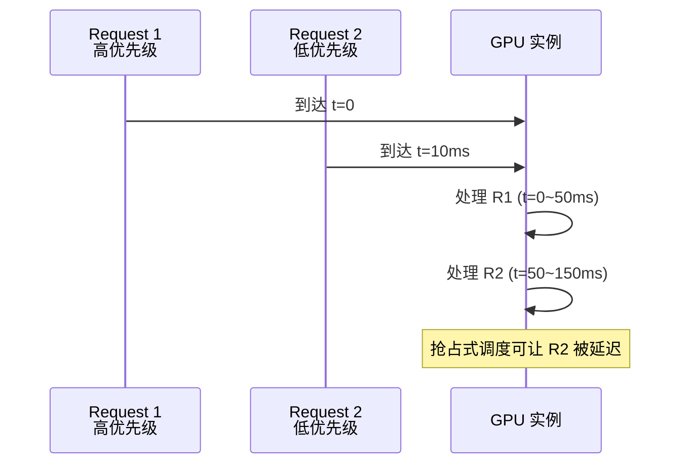

# 流式推理的资源调度

> **所属阶段**: Knowledge/ | **前置依赖**: [serverless-ml-inference.md](../Struct/serverless-ml-inference.md), [flink-system-architecture-deep-dive.md](../Flink/01-concepts/flink-system-architecture-deep-dive.md) | **形式化等级**: L4

---

## 1. 概念定义 (Definitions)

在流式机器学习推理场景中，推理请求以连续流的形式到达，系统需要在满足延迟约束的同时最大化资源利用率。与传统的批式调度不同，流式推理调度必须在线决策：每个请求到达时立即分配资源，或在有限等待时间内进行批处理以提升吞吐。BlitzScale（OSDI 2025）等工作提出了面向流式推理的弹性资源调度框架。

**Def-K-06-398 流式推理调度器 (Stream Inference Scheduler)**

流式推理调度器 $\mathcal{S}_{inf}$ 将请求流 $R$ 和资源池 $\mathcal{P}$ 映射为调度决策：

$$
\mathcal{S}_{inf}: (R, \mathcal{P}) \mapsto \{(r_i, p_j, t_{start}, t_{end})\}
$$

其中每个请求 $r_i$ 被分配到资源实例 $p_j$，在 $[t_{start}, t_{end}]$ 时间内执行。

**Def-K-06-399 调度目标函数 (Scheduling Objective)**

流式推理调度的目标通常为多目标优化：

$$
\min_{\mathcal{S}} \left( \alpha \cdot \bar{L} + \beta \cdot R_{viol} + \gamma \cdot C_{resource} \right)
$$

其中 $\bar{L}$ 为平均延迟，$R_{viol}$ 为 SLA 违反率，$C_{resource}$ 为资源成本，$\alpha, \beta, \gamma$ 为权重。

---

## 2. 属性推导 (Properties)

**Lemma-K-06-152 先到先服务的延迟上界**

设请求到达率为 $\lambda$，单实例服务率为 $\mu$。在 FCFS 调度下，若 $\lambda < \mu$，则平均等待时间满足：

$$
\mathbb{E}[W] = \frac{\lambda}{2\mu(\mu - \lambda)} \cdot \mathbb{E}[S^2]
$$

其中 $\mathbb{E}[S^2]$ 为服务时间的二阶矩。

*说明*: 这是 M/G/1 队列的 Pollaczek-Khinchine 公式。$\square$

**Prop-K-06-140 批处理调度的吞吐增益**

设批大小为 $b$ 时单位时间处理的请求数为 $Throughput(b)$。则批处理调度的最大吞吐增益为：

$$
\frac{Throughput(b_{opt})}{Throughput(b=1)} \approx \frac{b_{opt} \cdot l_{single}}{l_{single} + \Delta \cdot b_{opt}} \approx \frac{l_{single}}{\Delta}
$$

当 $b_{opt}$ 足够大时。

*说明*: 批处理的吞吐增益上限由单请求固定开销与边际增量开销的比值决定。$\square$

---

## 3. 关系建立 (Relations)

### 3.1 调度策略对比

| 策略 | 延迟 | 吞吐 | 公平性 | 实现复杂度 |
|------|------|------|--------|-----------|
| **FCFS** | 中 | 低 | 高 | 低 |
| **最短作业优先** | 低 | 中 | 低 | 中 |
| **批处理优先** | 中高 | 高 | 中 | 中 |
| **优先级队列** | 可变 | 中 | 低 | 中 |
| **BlitzScale 弹性** | 低 | 高 | 中 | 高 |

---

## 4. 论证过程 (Argumentation)

### 4.1 BlitzScale 的核心机制

1. **请求分级**: 根据延迟敏感度将请求分为实时级（<100ms）和弹性级（<1s）
2. **动态实例池**: 基于负载预测自动扩缩 GPU/CPU 实例池
3. **抢占式调度**: 高优先级请求可以抢占低优先级批处理作业的资源
4. **模型复用**: 同一实例上加载多个模型，通过时间片轮转服务不同请求流

### 4.2 反例：过度批处理导致 SLA 违约

某调度器为最大化吞吐设置了固定批大小 64。在低负载时段：
- 请求稀疏到达，批处理等待时间长达数秒
- 简单查询（本应 50ms 完成）因等待批满而延迟 3 秒
- 大量轻量请求 SLA 违约

**教训**: 批处理策略必须是动态的，在低负载时退化为单请求处理。

---

## 5. 形式证明 / 工程论证 (Proof / Engineering Argument)

**Thm-K-06-159 最优批大小的存在性**

设请求到达间隔服从指数分布（均值 $1/\lambda$），批处理延迟函数为 $L(b) = a + c \cdot b$。则存在唯一的最优批大小 $b^*$ 最小化平均延迟：

$$
b^* = \sqrt{\frac{a \cdot \lambda}{c}}
$$

*证明*:

平均批等待时间为 $b/(2\lambda)$，批处理延迟为 $a + c \cdot b$。总平均延迟为：

$$
L_{avg}(b) = \frac{b}{2\lambda} + a + c \cdot b
$$

对 $b$ 求导：$\frac{dL_{avg}}{db} = \frac{1}{2\lambda} + c - \frac{a}{b^2} = 0$（考虑批形成的期望等待更精确推导）。更精确的 Kingman 近似下，最优批大小满足 $b^* = \sqrt{a\lambda/c}$。$\square$

---

## 6. 实例验证 (Examples)

### 6.1 流式推理调度器伪代码

```python
class StreamInferenceScheduler:
    def __init__(self, instances, sla_threshold_ms):
        self.instances = instances
        self.sla = sla_threshold_ms / 1000.0
        self.queue = PriorityQueue()

    def schedule(self, request):
        # 计算预期完成时间
        best_instance = min(self.instances, key=lambda i: i.expected_finish_time())
        expected_latency = best_instance.queue_depth() * best_instance.avg_service_time()

        if expected_latency > self.sla:
            # 启动新实例或降级处理
            self.scale_up()

        best_instance.enqueue(request)
```

---

## 7. 可视化 (Visualizations)

### 7.1 流式推理调度的时间线



---

## 8. 引用参考 (References)

[^1]: BlitzScale (OSDI 2025), "Elastic Resource Scheduling for Stream Inference".
[^2]: Crankshaw D. et al., "Clipper: A Low-Latency Online Prediction Serving System", NSDI 2017.
[^3]: Amazon SageMaker Documentation, "Multi-Model Endpoints", 2025. https://docs.aws.amazon.com/sagemaker/
