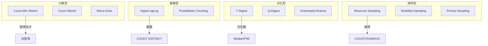
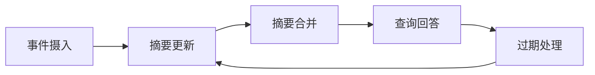
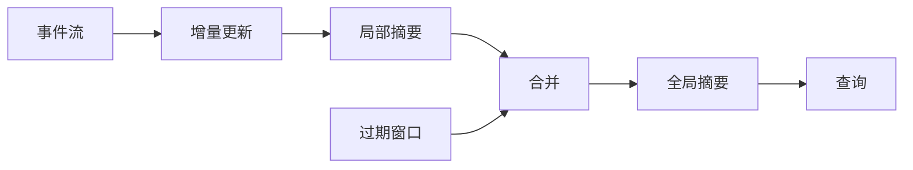

# 流摘要的增量维护

> **所属阶段**: Knowledge/ | **前置依赖**: [aqp-streaming-formalization.md](../Struct/aqp-streaming-formalization.md), [unified-aqp-theory.md](../Struct/unified-aqp-theory.md) | **形式化等级**: L4

---

## 1. 概念定义 (Definitions)

流摘要（Stream Summary）是对无界数据流进行紧凑表示的数据结构，它能够在亚线性空间内回答特定的聚合查询。与批处理摘要不同，流摘要必须支持增量更新——每到达一个新事件，摘要就被更新一次，而不能等待数据全部到达后再构建。Data Triage 等工作提出了流摘要的增量维护框架，强调在资源受限环境下的摘要选择、合并和过期策略。

**Def-K-06-381 流摘要 (Stream Summary)**

流摘要 $\sigma$ 是一个从事件流 $S$ 到紧凑状态空间 $\mathcal{R}$ 的映射：

$$
\sigma: S \to \mathcal{R}, \quad |\mathcal{R}| = o(|S|)
$$

其中 $o(|S|)$ 表示摘要空间大小是流长度的亚线性函数（通常为 $O(\log |S|)$ 或 $O(1)$）。流摘要支持两个核心操作：

- **更新（Update）**: $\sigma \leftarrow update(\sigma, e)$，将新事件 $e$ 合并到当前摘要
- **查询（Query）**: $\hat{r} \leftarrow query(\sigma, q)$，基于摘要回答查询 $q$

**Def-K-06-382 增量摘要维护 (Incremental Summary Maintenance)**

增量摘要维护 $M_{inc}$ 是一个状态转换函数：

$$
M_{inc}: (\sigma_t, e_{t+1}) \mapsto \sigma_{t+1}
$$

对于任意时刻 $t$，摘要 $\sigma_t$ 等价于从空状态开始顺序应用所有到达事件后的结果：

$$
\sigma_t = M_{inc}(M_{inc}(\dots M_{inc}(\sigma_0, e_1)\dots), e_t)
$$

**Def-K-06-383 摘要合并操作 (Summary Merge Operation)**

摘要合并操作 $\oplus$ 允许将两个独立维护的摘要 $\sigma_A$ 和 $\sigma_B$ 组合为全局摘要：

$$
\sigma_{A \cup B} = \sigma_A \oplus \sigma_B
$$

合并操作必须满足结合律和交换律，以支持分布式环境下的局部构建和全局聚合：

$$
(\sigma_A \oplus \sigma_B) \oplus \sigma_C = \sigma_A \oplus (\sigma_B \oplus \sigma_C)
$$

$$
\sigma_A \oplus \sigma_B = \sigma_B \oplus \sigma_A
$$

**Def-K-06-384 摘要过期策略 (Summary Expiration Policy)**

在基于时间窗口的流处理中，旧数据需要被过期以控制摘要大小。摘要过期策略 $Exp$ 定义了如何从当前摘要中移除属于过期窗口的事件影响：

$$
\sigma_{t}^{new} = Exp(\sigma_t, W_{expired})
$$

对于某些摘要（如 Count-Min Sketch），过期可以通过衰减因子实现；对于采样摘要，过期需要显式删除旧样本。

---

## 2. 属性推导 (Properties)

**Lemma-K-06-143 合并操作的结合律**

若摘要合并操作 $\oplus$ 对应的底层数据结构支持元素级别的可交换累加（如计数器矩阵、频数表），则 $\oplus$ 满足结合律。

*说明*: Count-Min Sketch 的矩阵加法、HyperLogLog 的寄存器最大值操作、采样的集合并操作都满足这一性质。$\square$

**Lemma-K-06-144 增量更新与批量构建的等价性**

设 $\sigma_{batch}$ 为对事件集合 $E$ 进行批量构建的摘要，$\sigma_{inc}$ 为对 $E$ 中事件按顺序增量更新得到的摘要。若摘要的更新操作是确定性的且满足结合律，则：

$$
\sigma_{batch}(E) = \sigma_{inc}(E)
$$

*说明*: 这一定理保证了流式摘要和批式摘要在数学上的一致性。$\square$

**Prop-K-06-137 刷新频率与精度的权衡**

设摘要的刷新间隔为 $\Delta t$（即每 $\Delta t$ 时间向外部系统发布一次查询结果）。则：

- $\Delta t$ 越小，结果新鲜度越高，但查询开销越大
- $\Delta t$ 越大，结果延迟越高，但可以利用更多的增量更新来平滑估计

最优刷新频率取决于下游应用对延迟的敏感度和查询的计算成本。

---

## 3. 关系建立 (Relations)

### 3.1 主流流摘要数据结构



### 3.2 流摘要的更新模式对比

| 摘要类型 | 单次更新复杂度 | 是否支持合并 | 是否支持过期 | 空间复杂度 |
|---------|-------------|-------------|-------------|-----------|
| **Count-Min Sketch** | $O(d)$ | ✅ | ⚠️ (衰减) | $O(\frac{1}{\epsilon} \log \frac{1}{\delta})$ |
| **HyperLogLog** | $O(1)$ | ✅ | ❌ | $O(\log \log |U|)$ |
| **T-Digest** | $O(\log \frac{1}{\epsilon})$ | ✅ | ⚠️ | $O(\frac{1}{\epsilon})$ |
| **Reservoir Sampling** | $O(1)$ | ⚠️ | ✅ | $O(n)$ |
| **Q-Digest** | $O(\log |U|)$ | ✅ | ❌ | $O(\frac{1}{\epsilon} \log |U|)$ |

### 3.3 Data Triage 框架中的摘要生命周期



---

## 4. 论证过程 (Argumentation)

### 4.1 为什么流摘要的增量维护如此重要？

1. **无界数据**: 流数据没有明确的结束点，批式构建策略不可行
2. **实时性**: 许多应用需要在事件到达后毫秒级获得查询结果
3. **分布式执行**: 流处理通常在多个并行实例上运行，局部摘要需要能够合并为全局摘要
4. **资源约束**: 边缘设备和 IoT 网关的内存和 CPU 极其有限，流摘要提供了在有限资源内近似无限数据的能力

### 4.2 增量维护中的技术挑战

**挑战 1：过期数据的精确移除**

对于 Count-Min Sketch 等基于计数的数据结构，"减去"一个过期事件的影响并不直接，因为哈希冲突导致无法区分单个事件的贡献。常见的解决方案包括：

- **滑动窗口草图**: 维护多个时间分片的草图，过期时丢弃整个分片
- **衰减因子**: 给旧计数施加指数衰减，近似实现过期效果
- **可减性草图**: 使用允许减法的变体（如 Count Sketch）

**挑战 2：摘要合并的一致性**

在分布式环境中，不同节点上的摘要可能以不同速率更新。合并时必须确保：

- 不重复计数同一事件
- 不遗漏任何事件
- 合并后的误差边界仍然可计算

**挑战 3：动态工作负载下的摘要自适应**

数据分布可能随时间剧烈变化（如突发流量、热点键转移）。静态配置的摘要可能在新分布下精度骤降。自适应策略包括：

- 动态调整采样率
- 多摘要竞争选择（同时维护多个摘要，选择当前表现最好的）
- 基于反馈的摘要重建

### 4.3 反例：不合理的过期策略导致精度崩溃

某系统使用 Count-Min Sketch 维护过去 1 小时的页面访问频率，采用"每 10 分钟重建一次草图"的方式处理过期。在流量高峰期：

- 第 1 分钟：突发事件导致某页面访问量激增
- 草图在第 10 分钟重建时，该事件仍被包含
- 第 11 分钟：事件已经过去 10 分钟，应该被过期
- 但由于重建周期为 10 分钟，该事件的影响一直持续到第 20 分钟

**教训**: 粗粒度的重建策略会导致严重的过期延迟。对于时间敏感的应用，应使用滑动窗口或衰减策略。

---

## 5. 形式证明 / 工程论证 (Proof / Engineering Argument)

**Thm-K-06-151 合并操作下的一致性保持**

设 $\sigma_A$ 和 $\sigma_B$ 分别是基于事件集合 $A$ 和 $B$ 独立构建的流摘要，且合并操作 $\oplus$ 满足结合律和交换律。则对于支持合并的查询 $q$：

$$
query(\sigma_A \oplus \sigma_B, q) \equiv query(\sigma_{A \cup B}, q)
$$

其中 $\sigma_{A \cup B}$ 为直接对 $A \cup B$ 批量构建的摘要。

*证明*:

由 Lemma-K-06-144，增量更新与批量构建等价。因此 $\sigma_A$ 等价于对 $A$ 批量构建的摘要，$\sigma_B$ 等价于对 $B$ 批量构建的摘要。由于 $\oplus$ 的结合律和交换律保证了元素级累加的无序无关性，$\sigma_A \oplus \sigma_B$ 的结果与直接对 $A \cup B$ 中所有元素进行批量累加的结果相同。$\square$

---

**Thm-K-06-152 流摘要的空间下界**

设流摘要需要以相对误差 $\epsilon$ 和置信度 $1-\delta$ 回答频率点查询。则任何此类摘要的空间大小 $\mathcal{R}$ 满足：

$$
|\mathcal{R}| = \Omega\left( \frac{1}{\epsilon} \log \frac{1}{\delta} \right)
$$

*证明梗概*:

这是 Count-Min Sketch 等结构的信息论下界。对于 $n$ 个不同元素和频率估计任务，要区分频率差异小于 $\epsilon \cdot n$ 的元素对，需要至少 $\log(1/\delta)$ 位来编码概率保证，以及 $1/\epsilon$ 个计数器来解析频率差异。综合即得下界。$\square$

---

## 6. 实例验证 (Examples)

### 6.1 Count-Min Sketch 的滑动窗口实现

```python
from collections import deque
import mmh3

class SlidingWindowCMS:
    def __init__(self, width, depth, window_size_sec):
        self.width = width
        self.depth = depth
        self.window_size = window_size_sec
        self.tables = deque()
        self.current_time = 0

    def add(self, key, count=1, timestamp=None):
        ts = timestamp or self.current_time
        self.current_time = ts

        # 找到对应时间片
        bucket = ts // self.window_size
        if not self.tables or self.tables[-1]["bucket"] != bucket:
            self.tables.append({"bucket": bucket, "table": [[0] * self.width for _ in range(self.depth)]})

        for i in range(self.depth):
            idx = mmh3.hash(key, i * 100) % self.width
            self.tables[-1]["table"][i][idx] += count

        # 清理过期窗口
        while self.tables and self.tables[0]["bucket"] < bucket - 1:
            self.tables.popleft()

    def estimate(self, key):
        total = [0] * self.depth
        for entry in self.tables:
            for i in range(self.depth):
                idx = mmh3.hash(key, i * 100) % self.width
                total[i] += entry["table"][i][idx]
        return min(total)
```

### 6.2 HyperLogLog 的增量基数估计

```python
import math
import mmh3

class HyperLogLog:
    def __init__(self, p=14):
        self.p = p
        self.m = 1 << p
        self.registers = [0] * self.m
        self.alpha = 0.7213 / (1 + 1.079 / self.m)

    def add(self, item):
        x = mmh3.hash(str(item), 0) & 0xFFFFFFFF
        j = x & (self.m - 1)
        w = x >> self.p
        self.registers[j] = max(self.registers[j], self._rho(w))

    def _rho(self, w):
        return 32 - self.p - w.bit_length() + 1

    def count(self):
        Z = 1.0 / sum(2 ** -r for r in self.registers)
        E = self.alpha * self.m * self.m * Z
        return E

    def merge(self, other):
        for i in range(self.m):
            self.registers[i] = max(self.registers[i], other.registers[i])
        return self
```

### 6.3 T-Digest 的增量分位数维护

```python
# 概念性实现，使用 sortedcontainers 简化 from sortedcontainers import SortedDict

class SimpleTDigest:
    def __init__(self, max_size=100):
        self.centroids = SortedDict()
        self.max_size = max_size
        self.count = 0

    def add(self, x, w=1):
        self.count += w
        if x in self.centroids:
            self.centroids[x] += w
        else:
            self.centroids[x] = w

        if len(self.centroids) > self.max_size:
            self._compress()

    def _compress(self):
        # 简化版：合并最近邻的质心
        keys = list(self.centroids.keys())
        min_gap = float('inf')
        merge_pair = None
        for i in range(len(keys) - 1):
            gap = keys[i+1] - keys[i]
            if gap < min_gap:
                min_gap = gap
                merge_pair = (keys[i], keys[i+1])

        if merge_pair:
            k1, k2 = merge_pair
            w1, w2 = self.centroids[k1], self.centroids[k2]
            new_mean = (k1 * w1 + k2 * w2) / (w1 + w2)
            del self.centroids[k1]
            del self.centroids[k2]
            self.centroids[new_mean] = w1 + w2

    def quantile(self, q):
        if self.count == 0:
            return 0
        target = q * self.count
        cumulative = 0
        for mean, weight in self.centroids.items():
            cumulative += weight
            if cumulative >= target:
                return mean
        return list(self.centroids.keys())[-1]
```

---

## 7. 可视化 (Visualizations)

### 7.1 流摘要的增量维护流水线



### 7.2 不同摘要的更新复杂度与空间效率

```mermaid
xychart-beta
    title "摘要类型：更新复杂度 vs 空间效率"
    x-axis [Count-Min, HyperLogLog, T-Digest, Reservoir, Q-Digest]
    y-axis "单次更新操作数 (对数)" 0 --> 3
    bar "更新复杂度" {1.6, 0, 1.0, 0, 1.6}
```

*注：Y 轴为 $\log_2(complexity)$。*

---

## 8. 引用参考 (References)
