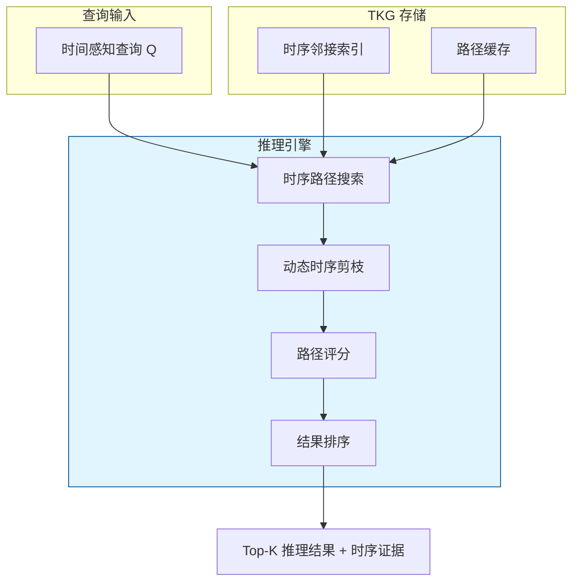
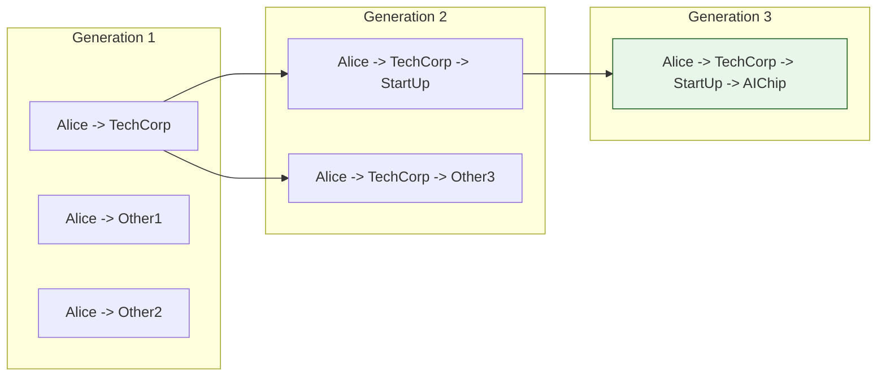

# 时间感知的知识图谱查询推理算法

> **所属阶段**: Knowledge/ | **前置依赖**: [tkg-stream-updates.md](./tkg-stream-updates.md), [ai-agent-frameworks-ecosystem-2025.md](../Flink/06-ai-ml/ai-agent-frameworks-ecosystem-2025.md) | **形式化等级**: L4

---

## 1. 概念定义 (Definitions)

时序知识图谱（TKG）的推理不仅要求判断两个实体之间是否存在关系，还需要回答"在什么时间范围内成立"以及"如何随时间演化"的问题。
时间感知查询推理算法（如 EVOREASONER 2025）通过引入时间约束、时序路径搜索和动态剪枝，使得 TKG 能够支持复杂的时序推理任务。

**Def-K-06-346 时间感知查询 (Time-Aware Query)**

时间感知查询 $Q$ 是一个五元组：

$$
Q = (s_q, p_q, ?, \tau_{start}, \tau_{end})
$$

其中 $s_q$ 为查询主体，$p_q$ 为查询关系，$?$ 表示待推断的客体实体，$[\tau_{start}, \tau_{end}]$ 为查询时间区间。
查询返回的是在指定时间区间内与 $s_q$ 通过关系 $p_q$ 关联的所有实体集合及其证据路径。

**Def-K-06-347 时序推理路径 (Temporal Reasoning Path)**

时序推理路径 $P$ 是一个带时间约束的三元组序列：

$$
P = \langle (s_0, p_1, s_1, [t_1^{start}, t_1^{end}]), (s_1, p_2, s_2, [t_2^{start}, t_2^{end}]), \dots, (s_{n-1}, p_n, s_n, [t_n^{start}, t_n^{end}]) \rangle
$$

路径的时间有效性要求相邻事实的时间区间存在非空交集：

$$
\forall i \in [1, n-1], \quad [t_i^{start}, t_i^{end}] \cap [t_{i+1}^{start}, t_{i+1}^{end}] \neq \emptyset
$$

**Def-K-06-348 时序路径有效性 (Temporal Path Validity)**

给定查询时间区间 $[\tau_{start}, \tau_{end}]$，路径 $P$ 是有效的当且仅当：

$$
\bigcap_{i=1}^{n} [t_i^{start}, t_i^{end}] \cap [\tau_{start}, \tau_{end}] \neq \emptyset
$$

即路径中所有事实的共同有效时间区间与查询区间存在交集。

**Def-K-06-349 动态时序剪枝 (Dynamic Temporal Pruning)**

在时序路径搜索中，若当前部分路径 $P_{prefix}$ 的累积时间交集已经为空（即：

$$
\bigcap_{i=1}^{k} [t_i^{start}, t_i^{end}] = \emptyset
$$

），则所有以 $P_{prefix}$ 为前缀的扩展路径都可以被剪枝，无需继续搜索。

---

## 2. 属性推导 (Properties)

**Lemma-K-06-127 时序路径的传递性**

若存在有效路径 $P_1$ 从 $s$ 到 $o_1$（时间区间 $T_1$），以及有效路径 $P_2$ 从 $o_1$ 到 $o_2$（时间区间 $T_2$），且 $T_1 \cap T_2 \neq \emptyset$，则存在从 $s$ 到 $o_2$ 的有效路径 $P = P_1 \circ P_2$，其时间区间为 $T_1 \cap T_2$。

*说明*: 这是时序推理中路径组合操作的基本合法性条件。$\square$

**Lemma-K-06-128 动态剪枝的完备性**

动态时序剪枝不会剪掉任何有效路径。

*证明*: 若部分路径 $P_{prefix}$ 已被剪枝，则其累积时间交集为空。
由于路径扩展只能进一步缩小时间交集（添加更多约束），任何扩展路径的累积交集必然也是空的。
由 Def-K-06-348，这些扩展路径都不可能有效。因此剪枝是安全的。$\square$

**Prop-K-06-127 时序查询复杂度**

设 TKG 中实体数为 $|\mathcal{E}|$，平均出度为 $d$，查询时间区间长度为 $L$（以离散时间步计），路径最大深度为 $K$。则：

- 无剪枝的暴力搜索复杂度为 $O(d^K \cdot L)$
- 引入动态时序剪枝后，实际复杂度降为 $O(d^{K'} \cdot L')$，其中 $K' \leq K$ 且 $L' \leq L$

*说明*: 剪枝效果取决于 TKG 中事实的时间分布密度。$\square$

---

## 3. 关系建立 (Relations)

### 3.1 时间感知推理与传统 KG 推理的区别

| 维度 | 传统 KG 推理 | 时间感知 TKG 推理 |
|------|-------------|------------------|
| 查询输出 | 实体 + 关系 | 实体 + 关系 + 时间区间 |
| 路径搜索 | 拓扑结构为主 | 拓扑 + 时间约束 |
| 证据解释 | 静态路径 | 动态时序路径 |
| 失效处理 | 无需处理 | 需识别事实过期和更新 |
| 典型任务 | 链接预测 | 时序链接预测、事件预测、因果推理 |

### 3.2 EVOREASONER 架构



### 3.3 时序推理算法谱系

| 算法 | 核心思想 | 时间模型 | 适用场景 |
|------|---------|---------|---------|
| **TComplEx** | 张量分解 + 时间嵌入 | 连续时间 | 链接预测 |
| **TeMP** | 时序消息传递 | 离散时间步 | 多跳推理 |
| **TLogic** | 时序逻辑规则学习 | 离散时间 | 可解释推理 |
| **EVOREASONER** | 进化式路径搜索 | 连续/离散混合 | 复杂时序查询 |
| **StreamE** | 流式更新 + 增量推理 | 事件时间 | 实时推理 |

---

## 4. 论证过程 (Argumentation)

### 4.1 为什么需要时间感知推理？

在现实世界中，关系是动态演化的。例如：

- **企业投资关系**: A 公司在 2020 年投资 B 公司，但在 2023 年撤资。查询"A 投资了哪些公司"时，回答必须限定在有效的时间区间内
- **人物职位**: 某人在 2019-2022 年任 CEO，2023 年起任董事长。若查询"2021 年该公司的 CEO 是谁"，不能返回 2023 年的董事长信息
- **疾病传播**: COVID-19 的传播路径在不同月份差异巨大，静态图谱无法反映这种动态性

时间感知推理使得 KG 能够准确反映这些动态关系。

### 4.2 EVOREASONER 的进化式搜索

EVOREASONER 的核心创新在于"进化式路径搜索"：

1. **初始化**: 从查询主体 $s_q$ 出发，搜索所有时间有效的 1-hop 邻居
2. **选择**: 根据路径与查询关系的语义相似度，选择最有潜力的路径扩展
3. **扩展**: 在选定的路径末端继续搜索下一跳，同时更新时间交集约束
4. **评估**: 计算完整路径的时序匹配度和拓扑相关性
5. **淘汰**: 移除低分路径，保留高分路径进入下一轮进化

这种机制类似于遗传算法，通过多轮迭代逐步逼近最优时序推理路径。

### 4.3 反例：忽略时间区间的错误推理

某金融风控系统使用静态 KG 推理查询"X 企业的实际控制人"。图谱中包含：

- (Person_A, controls, X_Corp, [2018, 2022])
- (Person_B, controls, X_Corp, [2023, now])

由于系统忽略了时间区间，返回了两个并列的实际控制人，导致风控模型将 Person_A 的信用风险错误地关联到 X 企业 2024 年的贷款申请上。

**教训**: 在涉及时间敏感关系的推理任务中，必须显式考虑时间有效性，否则会导致严重的业务决策错误。

---

## 5. 形式证明 / 工程论证 (Proof / Engineering Argument)

**Thm-K-06-131 时序推理路径的完备性**

设 TKG 为 $\mathcal{G}$，查询为 $Q = (s_q, p_q, ?, \tau_{start}, \tau_{end})$。若存在实体 $o$ 使得在查询时间区间内 $(s_q, p_q, o)$ 成立，则算法 EVOREASONER 在深度 $K \to \infty$ 时必然能找到至少一条从 $s_q$ 到 $o$ 的有效时序路径。

*证明梗概*:

由于 TKG 中的事实都是带时间戳的四元组，若 $(s_q, p_q, o)$ 在查询区间内成立，则要么存在直接关系四元组 $(s_q, p_q, o, [t_s, t_e])$ 满足 $[t_s, t_e] \cap [\tau_{start}, \tau_{end}] \neq \emptyset$（1-hop 路径），要么存在多跳路径通过中间实体连接 $s_q$ 和 $o$ 且时间交集非空。EVOREASONER 的搜索空间包含 TKG 中所有长度不超过 $K$ 的路径。当 $K$ 足够大（理论上 $K \to \infty$）时，任何存在的多跳路径都会被搜索到。动态剪枝（Lemma-K-06-128）保证不会剪掉有效路径。因此完备性成立。$\square$

---

**Thm-K-06-132 时间感知查询的 Soundness**

若 EVOREASONER 返回实体 $o$ 作为查询 $Q$ 的答案，且提供了时序路径 $P$ 作为证据，则 $P$ 必然满足：

1. $P$ 从 $s_q$ 开始，到 $o$ 结束
2. $P$ 中所有相邻事实的时间区间交集非空
3. $P$ 的累积时间交集与 $[\tau_{start}, \tau_{end}]$ 有非空交集

*证明*: 这三个条件分别是 Def-K-06-347（时序路径定义）、Def-K-06-348（时序路径有效性）的直接推论。EVOREASONER 在路径评分和结果输出前都会显式检查这些条件。因此任何被返回的结果都满足 Soundness 要求。$\square$

---

## 6. 实例验证 (Examples)

### 6.1 EVOREASONER 的时序路径搜索示例

假设 TKG 包含以下事实：

- (Alice, worksAt, TechCorp, [2020, 2023])
- (TechCorp, acquires, StartUp, [2021, 2025])
- (StartUp, produces, AIChip, [2022, now])

查询："Alice 在 2022 年与哪些产品有关联？"

EVOREASONER 的推理过程：

1. 从 Alice 出发，找到 1-hop: `(Alice, worksAt, TechCorp, [2020, 2023])`
2. 从 TechCorp 扩展，找到 `(TechCorp, acquires, StartUp, [2021, 2025])`
   - 时间交集: `[2020, 2023] \cap [2021, 2025] = [2021, 2023]`（非空）
3. 从 StartUp 扩展，找到 `(StartUp, produces, AIChip, [2022, now])`
   - 时间交集: `[2021, 2023] \cap [2022, now] = [2022, 2023]`（非空）
4. 与查询区间 `[2022, 2022]` 取交集: `[2022, 2023] \cap [2022, 2022] = [2022, 2022]`（非空）
5. 返回结果: `AIChip`，证据路径为 `Alice -> TechCorp -> StartUp -> AIChip`，有效时间 `[2022, 2023]`

### 6.2 Python 中的时序路径搜索实现

```python
from dataclasses import dataclass
from typing import List, Tuple
from collections import defaultdict
import heapq

@dataclass
class TemporalFact:
    subject: str
    predicate: str
    object: str
    start: int
    end: int

    def time_interval(self):
        return (self.start, self.end)

def intersect(t1: Tuple[int, int], t2: Tuple[int, int]) -> Tuple[int, int] | None:
    s = max(t1[0], t2[0])
    e = min(t1[1], t2[1])
    return (s, e) if s <= e else None

class TemporalReasoner:
    def __init__(self, facts: List[TemporalFact]):
        self.adj = defaultdict(list)
        for f in facts:
            self.adj[f.subject].append(f)

    def search_paths(self, source: str, query_interval: Tuple[int, int], max_depth=3, top_k=5):
        # Priority queue: (negative_score, depth, current_entity, path, current_interval)
        pq = [(0, 0, source, [], query_interval)]
        results = []
        visited = set()

        while pq and len(results) < top_k * 10:
            neg_score, depth, entity, path, interval = heapq.heappop(pq)

            if depth >= max_depth:
                continue

            for fact in self.adj[entity]:
                new_interval = intersect(interval, fact.time_interval())
                if new_interval is None:
                    continue  # 动态时序剪枝

                new_path = path + [fact]
                # 简单的路径评分：时间匹配度 + 路径长度惩罚
                score = -(new_interval[1] - new_interval[0] + 1) / (depth + 1)
                heapq.heappush(pq, (score, depth + 1, fact.object, new_path, new_interval))

                # 如果路径终点满足某种查询目标，可加入 results
                # 此处简化为收集所有 reachability 结果
                results.append((fact.object, new_path, new_interval))

        return results[:top_k]

# 示例使用
facts = [
    TemporalFact("Alice", "worksAt", "TechCorp", 2020, 2023),
    TemporalFact("TechCorp", "acquires", "StartUp", 2021, 2025),
    TemporalFact("StartUp", "produces", "AIChip", 2022, 2026),
]

reasoner = TemporalReasoner(facts)
results = reasoner.search_paths("Alice", (2022, 2022), max_depth=3)
for obj, path, interval in results:
    print(f"Target: {obj}, Interval: {interval}")
    for step in path:
        print(f"  {step.subject} --{step.predicate}--> {step.object} [{step.start}-{step.end}]")
```

### 6.3 基于 Flink 的流式时序推理流水线

```java
// 将 TKG 查询转换为 Flink DataStream 处理
DataStream<TemporalQuery> queries = env.addSource(new QuerySource());
DataStream<TemporalFact> facts = env.addSource(new KafkaSource<>());

// 使用 Interval Join 匹配时间有效的事实
facts.keyBy(TemporalFact::getSubject)
    .intervalJoin(queries.keyBy(TemporalQuery::getSubject))
    .between(Time.minutes(-10), Time.minutes(10))
    .process(new TemporalPathJoinFunction())
    .addSink(new ResultSink());
```

---

## 7. 可视化 (Visualizations)

### 7.1 时序路径搜索的进化过程



### 7.2 时间区间交集的动态计算

```mermaid
xychart-beta
    title "路径累积时间交集随深度的变化"
    x-axis [Step 1, Step 2, Step 3, Step 4]
    y-axis "时间区间长度 (月)" 0 --> 36
    bar "有效路径 A" [36, 24, 12, 6]
    bar "剪枝路径 B" [36, 18, 0, 0]
```



*说明*: 路径 B 在第 3 步时累积交集为空，触发动态时序剪枝。

---

## 8. 引用参考 (References)
