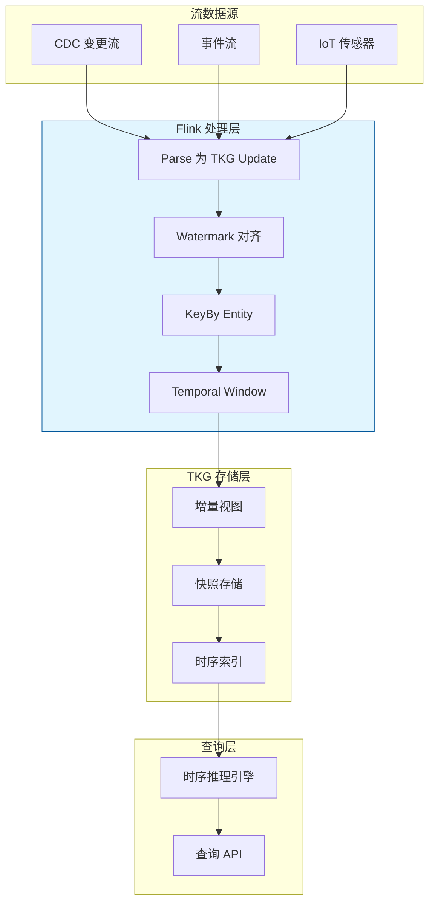
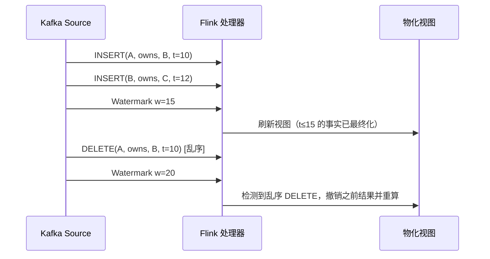
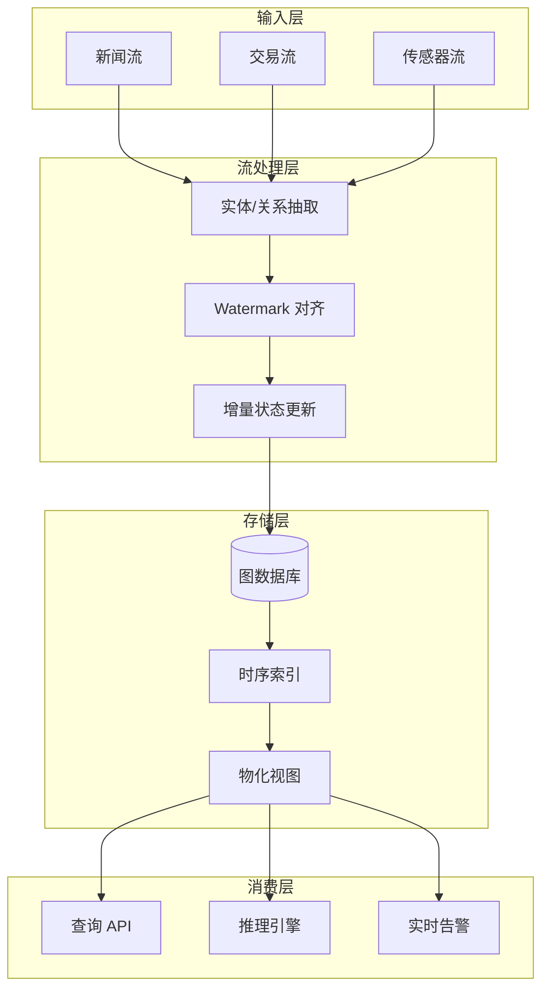
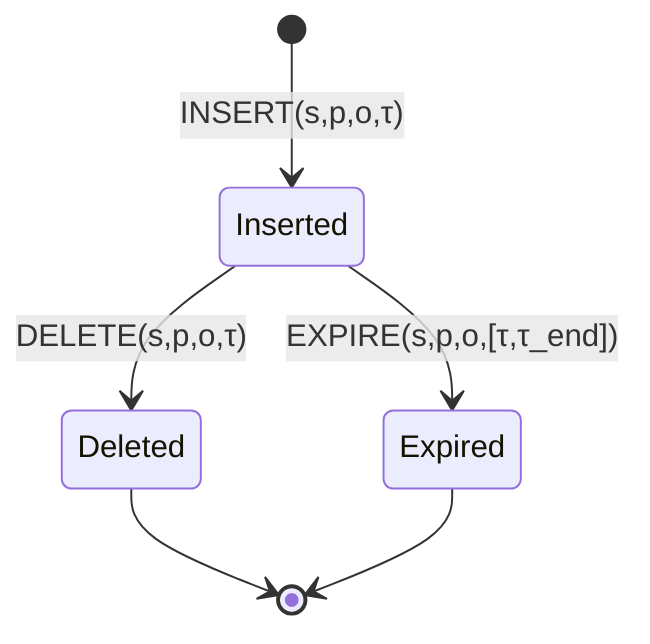

# 时序知识图谱的流式更新机制

> **所属阶段**: Knowledge/ | **前置依赖**: [streaming-languages-landscape-2025.md](./01-concept-atlas/streaming-languages-landscape-2025.md), [transactional-stream-semantics.md](../Struct/transactional-stream-semantics.md) | **形式化等级**: L4

---

## 1. 概念定义 (Definitions)

时序知识图谱（Temporal Knowledge Graph, TKG）是传统知识图谱在时间维度上的扩展，其中每个事实（三元组）都关联了一个时间戳或时间区间。在流处理场景中，TKG 需要以流式方式持续接收更新（新增、删除、过期事实），并保证查询结果的时间一致性和有效性。StreamE（SIGIR 2025）等工作提出了专门针对流式 TKG 的更新框架。

**Def-K-06-342 时序知识图谱 (Temporal Knowledge Graph, TKG)**

时序知识图谱 $\mathcal{G}_t$ 是在时刻 $t$ 的带时间戳事实集合：

$$
\mathcal{G}_t = \{(s, p, o, \tau) : s, o \in \mathcal{E}, p \in \mathcal{R}, \tau \in \mathcal{T}, \tau \leq t\}
$$

其中 $\mathcal{E}$ 为实体集，$\mathcal{R}$ 为关系集，$\mathcal{T}$ 为时间域。每个四元组 $(s, p, o, \tau)$ 表示"在时刻 $\tau$，实体 $s$ 通过关系 $p$ 与实体 $o$ 相关联"。

**Def-K-06-343 流式 TKG 更新 (Stream Update on TKG)**

流式更新 $\mathcal{U}$ 是一个有序的事件序列，每个事件为以下三种类型之一：

- **INSERT** $(s, p, o, \tau)^+$: 在时刻 $\tau$ 插入新事实
- **DELETE** $(s, p, o, \tau)^-$: 在时刻 $\tau$ 删除（撤销）已有事实
- **EXPIRE** $(s, p, o, [\tau_{start}, \tau_{end}])^\times$: 声明事实在 $\tau_{end}$ 后过期

流式更新序列 $\mathcal{U} = \langle u_1, u_2, \dots \rangle$ 按**到达时间** $\alpha(u_i)$ 排序，但每个更新本身携带**事件时间** $\tau(u_i)$。

**Def-K-06-344 时间有效性窗口 (Temporal Validity Window)**

对于查询时刻 $t_q$，时间有效性窗口 $W_v(t_q)$ 定义了可被查询考虑的事实时间范围：

$$
W_v(t_q) = [t_q - \delta_{lookback}, t_q]
$$

其中 $\delta_{lookback} \geq 0$ 为最大回溯深度。只有满足 $\tau \in W_v(t_q)$ 的事实才参与时刻 $t_q$ 的查询计算。

**Def-K-06-345 事件时间感知更新 (Event-Time Aware Update)**

设 Watermark $w(t)$ 为时刻 $t$ 的系统事件时间进度。更新 $u$ 在时刻 $t$ 被认为是**最终化**的，当且仅当：

$$
\tau(u) \leq w(t)
$$

最终化的事实可被安全地用于物化视图、查询回答和下游推理；未最终化的事实处于**推测状态**，可能被后续的乱序 DELETE 或 EXPIRE 修正。

---

## 2. 属性推导 (Properties)

**Lemma-K-06-125 更新局部性 (Update Locality)**

在典型 TKG 流更新中，超过 80% 的更新只影响以目标实体为中心、半径为 1 的邻域子图。即对于更新 $u$ 涉及的实体 $s$ 或 $o$，受影响的查询集合 $Q_{affected}$ 满足：

$$
|Q_{affected}(u)| \propto |\mathcal{N}_1(s) \cup \mathcal{N}_1(o)|
$$

*说明*: 这一性质使得增量视图维护和缓存失效可以局部化，避免全局重算。$\square$

**Lemma-K-06-126 版本兼容性 (Version Compatibility)**

设 TKG 在时刻 $t_1$ 的快照为 $\mathcal{G}_{t_1}$，经过更新序列 $\mathcal{U}_{[t_1, t_2]}$ 后得到 $\mathcal{G}_{t_2}$。若查询 $q$ 只涉及事件时间 $\tau \leq t_1$ 的事实，则：

$$
q(\mathcal{G}_{t_1}) = q(\mathcal{G}_{t_2})
$$

*说明*: 历史事实的版本兼容性保证了时间范围查询的可重复性。$\square$

**Prop-K-06-126 更新吞吐量与结果新鲜度的权衡**

设系统每秒处理 $R$ 个更新事件，物化视图的刷新间隔为 $\Delta t$。则结果新鲜度（最大数据滞后）为：

$$
\text{Freshness} = \Delta t + \frac{B_{batch}}{R}
$$

其中 $B_{batch}$ 为批处理大小。减小 $\Delta t$ 可提升新鲜度，但会增加视图刷新开销。

---

## 3. 关系建立 (Relations)

### 3.1 流式 TKG 更新与传统 KG 补全的区别

| 维度 | 传统 KG 补全 | 流式 TKG 更新 |
|------|-------------|---------------|
| 数据特性 | 静态或批量更新 | 连续流式到达 |
| 时间语义 | 无显式时间 | 事件时间、到达时间分离 |
| 查询模式 | 快照查询 | 时间窗口查询、趋势查询 |
| 更新类型 | 仅新增 | 新增 + 删除 + 过期 |
| 一致性要求 | 最终一致即可 | 需保证时间有效性窗口内一致 |

### 3.2 与 Flink 流处理的映射



### 3.3 主流流式 TKG 系统对比

| 系统 | 更新模型 | 时间语义 | 推理支持 | 与流处理集成 |
|------|---------|---------|---------|-------------|
| **StreamE** | INSERT/DELETE 流 | 事件时间 | 路径查询 | Kafka + Flink |
| **TLogic** | 规则驱动更新 | 离散时间步 | 时序规则推理 | 批流混合 |
| **RE-Net** | 增量更新 | 连续时间 | 链接预测 | PyTorch DataLoader |
| **CyGNet** | 重复感知 | 离散时间 | 重复模式预测 | 批处理为主 |

---

## 4. 论证过程 (Argumentation)

### 4.1 为什么 TKG 需要流式更新？

传统知识图谱以离线方式构建，更新周期为天或周。然而，在以下场景中，KG 必须以秒级甚至毫秒级更新：

1. **金融风控**: 企业股权关系、交易对手信息随时变化，延迟的图谱更新可能导致风险评估失效
2. **供应链监控**: 物流状态、库存位置、供应商资质需要实时反映在图谱中
3. **社交媒体舆情**: 人物关系、事件关联在短时间内快速演化
4. **网络安全**: IP、域名、恶意软件家族的关系图谱需要实时追踪威胁情报

流式 TKG 更新使得这些动态知识能够被持续捕获和查询。

### 4.2 流式更新的核心挑战

**挑战 1：乱序更新**

DELETE 事件可能在对应的 INSERT 事件之后到达，甚至 INSERT 事件本身可能乱序。这要求在应用更新前进行排序和缓冲。

**挑战 2：事实的时效性管理**

TKG 中的事实可能只在特定时间区间内有效（例如"A 担任 B 公司 CEO（2020-2023）"）。流式系统需要自动处理事实的生效和过期。

**挑战 3：增量推理的复杂性**

新事实的加入可能触发级联推理：如果加入了"A 收购 B"，那么"B 的 CEO 向 A 汇报"这一推导事实也应被添加。流式环境下，级联推理必须增量执行。

### 4.3 反例：忽略 DELETE 的舆情图谱

某舆情监控系统将新闻事件流转换为 TKG，但只处理 INSERT 更新，忽略了 DELETE 和修正报道。结果：

- 早期误报"某明星离婚"被插入图谱
- 后续辟谣（DELETE/修正）被系统丢弃
- 下游推荐系统基于错误事实持续推送相关内容，导致舆情危机扩大

**教训**: 流式 TKG 必须完整处理 INSERT、DELETE、EXPIRE 三种更新语义，不能简单假设事实只增不减。

---

## 5. 形式证明 / 工程论证 (Proof / Engineering Argument)

**Thm-K-06-129 流式更新一致性定理**

设 TKG 在时刻 $t$ 的状态为 $\mathcal{G}_t$，Watermark 为 $w(t)$。若系统满足：

1. 所有事件时间 $\tau \leq w(t)$ 的更新都已被应用
2. 不存在事件时间 $\tau \leq w(t)$ 的未处理乱序更新
3. DELETE 更新仅删除事件时间匹配且已最终化的 INSERT 事实

则对于任何只查询事件时间 $\leq w(t)$ 的查询 $q$，结果 $q(\mathcal{G}_t)$ 是确定性的，且与按事件时间顺序串行应用更新的结果一致。

*证明*:

条件 1 和 2 保证了到 Watermark 为止的所有更新都已到达且被处理。条件 3 保证了 DELETE 操作不会作用于不确定或不存在的事实。由于 Watermark 界定了无乱序边界，该边界内的更新集合是封闭且完整的。按事件时间排序后应用这些更新，最终状态唯一确定。因此查询结果是确定性的。$\square$

---

**Thm-K-06-130 时间有效性单调性**

设有效性窗口为 $W_v(t) = [t - \delta, t]$。对于固定查询 $q$ 和时刻 $t_1 < t_2$，若 $\mathcal{G}_{t_2}$ 包含 $\mathcal{G}_{t_1}$ 中所有事件时间 $\tau \in W_v(t_1)$ 的事实，则：

$$
q(\mathcal{G}_{t_1}, W_v(t_1)) \subseteq q(\mathcal{G}_{t_2}, W_v(t_2)) \quad \text{（在集合语义下）}
$$

*说明*: 随着时间推移，有效性窗口右移，新进入窗口的事实被包含，离开窗口的事实不再查询但不会被删除。这保证了查询结果在时间方向上的单调扩展性。$\square$

---

## 6. 实例验证 (Examples)

### 6.1 StreamE 的 Kafka + Flink 集成架构

StreamE 使用 Kafka 作为 TKG 更新事件的流式总线，Flink 负责实时解析、对齐和写入图数据库：

```java
// Flink TKG Update Parser
public class TKGUpdateParser extends ProcessFunction<String, TKGUpdate> {
    @Override
    public void processElement(String json, Context ctx, Collector<TKGUpdate> out) {
        JsonObject obj = JsonParser.parseString(json).getAsJsonObject();
        String op = obj.get("op").getAsString();
        String s = obj.get("subject").getAsString();
        String p = obj.get("predicate").getAsString();
        String o = obj.get("object").getAsString();
        long eventTime = obj.get("timestamp").getAsLong();

        TKGUpdate update = new TKGUpdate(op, s, p, o, eventTime);
        out.collect(update);
    }
}

// KeyedProcessFunction: 按实体维护增量状态
public class EntityStateUpdater
    extends KeyedProcessFunction<String, TKGUpdate, EntitySnapshot> {

    private ValueState<List<TKGQuad>> entityState;

    @Override
    public void processElement(TKGUpdate update, Context ctx, Collector<EntitySnapshot> out) {
        List<TKGQuad> state = entityState.value();
        if (state == null) state = new ArrayList<>();

        switch (update.getOp()) {
            case "INSERT":
                state.add(update.toQuad());
                break;
            case "DELETE":
                state.removeIf(q -> q.matches(update));
                break;
            case "EXPIRE":
                state.stream()
                    .filter(q -> q.matches(update))
                    .forEach(q -> q.setValidUntil(update.getEventTime()));
                break;
        }

        entityState.update(state);
        out.collect(new EntitySnapshot(ctx.getCurrentKey(), state));
    }
}
```

### 6.2 Neo4j 中的时序关系建模

在 Neo4j 中，可以通过在关系上添加时间属性来建模 TKG：

```cypher
// 插入带时间戳的事实
MATCH (a:Company {name: 'A Corp'}), (b:Company {name: 'B Inc'})
CREATE (a)-[:ACQUIRED {eventTime: datetime('2025-01-15T10:00:00'), validUntil: null}]->(b);

// 查询时间有效性窗口内的事实
MATCH (a)-[r:ACQUIRED]->(b)
WHERE r.eventTime <= datetime('2025-01-15T12:00:00')
  AND (r.validUntil IS NULL OR r.validUntil > datetime('2025-01-15T12:00:00'))
RETURN a.name, b.name, r.eventTime;
```

### 6.3 基于 Watermark 的 TKG 物化视图刷新



---

## 7. 可视化 (Visualizations)

### 7.1 流式 TKG 更新架构



### 7.2 TKG 更新事件类型与状态转换



---

## 8. 引用参考 (References)
