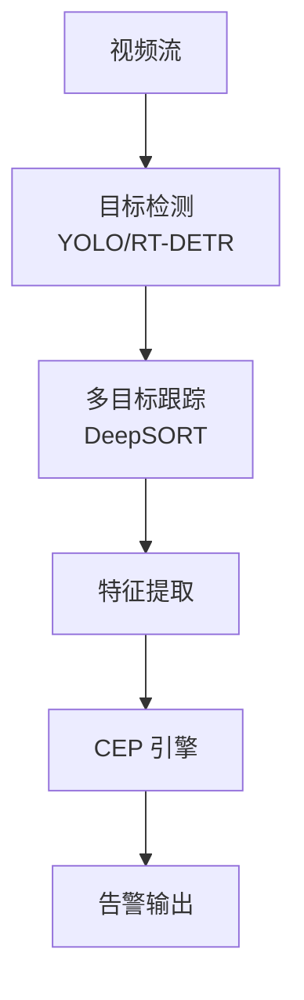
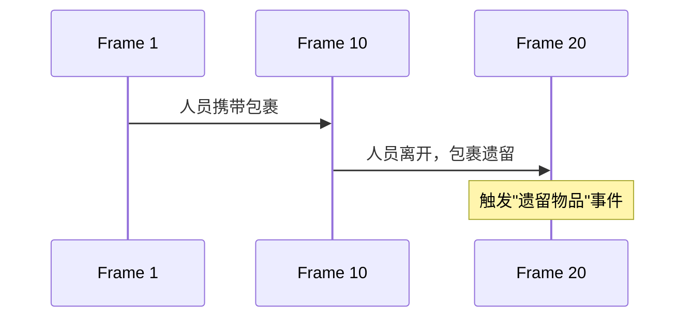

# 视频流复杂事件处理

> **所属阶段**: Knowledge/ | **前置依赖**: [edge-ai-streaming-architecture.md](./06-frontier/edge-ai-streaming-architecture.md), [llm-kg-stream-reasoning.md](./llm-kg-stream-reasoning.md) | **形式化等级**: L4

---

## 1. 概念定义 (Definitions)

视频流是一种高带宽、语义丰富的多模态数据流。
传统的复杂事件处理（CEP）主要处理结构化事件，而视频流 CEP 需要在连续的视频帧中检测低级视觉特征（如运动、颜色、形状），并将它们组合为高级语义事件（如"人员聚集"、"车辆逆行"、"物品遗留"）。
DEBS 2025 的相关工作将 CEP 模式匹配扩展到了时空视频特征序列上。

**Def-K-06-392 视频事件 (Video Event)**

视频事件 $v$ 是一个时空特征元组：

$$
v = (f, bbox, cls, conf, \tau)
$$

其中 $f$ 为帧编号，$bbox$ 为边界框坐标，$cls$ 为检测类别，$conf$ 为置信度，$\tau$ 为时间戳。

**Def-K-06-393 视频 CEP 模式 (Video CEP Pattern)**

视频 CEP 模式 $P$ 是一个带时空约束的事件序列模板：

$$
P = \langle (cls_1, \Delta t_1, spatial_1), (cls_2, \Delta t_2, spatial_2), \dots \rangle
$$

其中 $spatial_i$ 定义了相邻事件之间的空间关系（如"接近"、"远离"、"进入区域"）。

---

## 2. 属性推导 (Properties)

**Lemma-K-06-149 视频流的事件抽象损失**

设原始视频帧为 $V$，目标检测器输出的事件序列为 $E = \mathcal{D}(V)$。则信息损失满足：

$$
I(V) - I(E) \geq H_{detection\_error} + H_{tracking\_error}
$$

*说明*: 检测误差和跟踪误差是视频 CEP 中假阴性和假阳性的主要来源。$\square$

---

## 3. 关系建立 (Relations)

### 3.1 视频 CEP 流水线



---

## 4. 论证过程 (Argumentation)

### 4.1 视频流 CEP 的核心挑战

1. **高计算成本**: 每秒 30 帧的视频需要实时运行目标检测和跟踪
2. **检测不稳定性**: 同一目标在不同帧中可能被赋予不同 ID，导致模式匹配失败
3. **复杂空间关系**: "接近"、"遮挡"等关系需要精确的几何计算

---

## 5. 形式证明 / 工程论证 (Proof / Engineering Argument)

**Thm-K-06-156 视频 CEP 的实时性条件**

设视频帧率为 $FPS$，单帧处理延迟为 $L_{frame}$。系统能够实时处理的条件为：

$$
L_{frame} \leq \frac{1}{FPS}
$$

对于 30 FPS 的视频，$L_{frame} \leq 33.3$ ms。

*说明*: 这是边缘部署中硬件选型的基本约束。$\square$

---

## 6. 实例验证 (Examples)

### 6.1 Flink + OpenCV 的视频 CEP 概念架构

```python
# 概念性伪代码
class VideoCEPFunction(ProcessFunction):
    def process_element(self, frame_bytes):
        frame = cv2.imdecode(frame_bytes)
        detections = yolo_detector(frame)
        tracks = deep_sort.update(detections)
        events = self.extract_events(tracks)

        # CEP 模式匹配
        if self.matches_pattern(events, "person_abandons_package"):
            self.output_alert(events)
```

---

## 7. 可视化 (Visualizations)

### 7.1 视频 CEP 的时空模式



---

## 8. 引用参考 (References)
