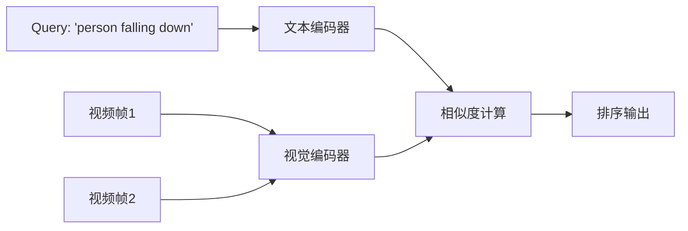

# 零样本视频查询

> **所属阶段**: Knowledge/ | **前置依赖**: [multimodal-stream-aqp.md](./multimodal-stream-aqp.md), [video-stream-cep.md](./video-stream-cep.md) | **形式化等级**: L4

---

## 1. 概念定义 (Definitions)

零样本视频查询允许用户在没有预先见过目标概念或训练数据的情况下，通过自然语言描述来检索视频内容。SketchQL 等工作利用大规模预训练的多模态模型（如 CLIP）的零样本泛化能力，将文本查询直接映射到视频内容的嵌入空间，实现无需标注的检索。

**Def-K-06-396 零样本视频检索 (Zero-Shot Video Retrieval)**

零样本视频检索 $R_{zs}$ 定义为：

$$
R_{zs}(q_{text}, V) = \arg\max_{v \in V} sim(\phi_{text}(q_{text}), \phi_{video}(v))
$$

其中 $\phi_{text}$ 和 $\phi_{video}$ 分别为文本和视频编码器，$sim$ 为余弦相似度。

**Def-K-06-397 查询扩展 (Query Expansion)**

为提升零样本检索的召回率，系统可以将原始查询 $q$ 扩展为一组语义相关的查询：

$$
Q_{expanded} = \{q\} \cup \{q'_i : q'_i = LLM_{expand}(q), i=1,\dots,k\}
$$

然后在扩展查询集合上进行聚合检索。

---

## 2. 属性推导 (Properties)

**Lemma-K-06-151 查询扩展的召回率提升**

设原始查询的召回率为 $R_0$，每个扩展查询独立提供额外召回的概率为 $p$。则扩展后的期望召回率为：

$$
\mathbb{E}[R_{expanded}] = 1 - (1 - R_0)(1 - p)^k
$$

*说明*: 查询扩展通过增加语义覆盖来提升零样本场景下的召回。$\square$

---

## 3. 关系建立 (Relations)

### 3.1 零样本 vs 有监督检索

| 维度 | 有监督检索 | 零样本检索 |
|------|-----------|-----------|
| 训练数据 | 需要标注 | 无需标注 |
| 新概念适应 | 需重新训练 | 即时支持 |
| 精度 | 高 | 中等 |
| 计算成本 | 低（推理时） | 中（依赖大模型） |

---

## 4. 论证过程 (Argumentation)

### 4.1 SketchQL 的工作流程

1. **视频编码**: 将视频帧和关键片段编码为 CLIP 视觉嵌入
2. **查询解析**: 使用 LLM 将自然语言查询解析为结构化语义图
3. **嵌入匹配**: 在联合嵌入空间中匹配文本嵌入与视频嵌入
4. **时序对齐**: 对于涉及时序关系的查询（如"先...后..."），使用时序注意力加权

---

## 5. 形式证明 / 工程论证 (Proof / Engineering Argument)

**Thm-K-06-158 零样本泛化的嵌入连续性**

设预训练多模态模型在训练数据中见过概念集合 $C_{train}$，查询概念为 $c_{query} \notin C_{train}$。若 $c_{query}$ 可以通过训练数据中的概念组合表示（即 $c_{query} = f(c_1, c_2, \dots)$，其中 $c_i \in C_{train}$），则零样本检索成功的概率下界为：

$$
P(success) \geq 1 - \exp(-\alpha \cdot |C_{train}| \cdot composability(c_{query}))
$$

*说明*: 预训练模型的组合泛化能力是零样本检索的理论基础。$\square$

---

## 6. 实例验证 (Examples)

### 6.1 零样本视频事件检索

```python
from transformers import CLIPProcessor, CLIPModel
import torch

model = CLIPModel.from_pretrained("openai/clip-vit-base-patch32")
processor = CLIPProcessor.from_pretrained("openai/clip-vit-base-patch32")

# 处理视频帧（示例：取关键帧）
frames = [frame1, frame2, frame3]  # PIL Images
inputs = processor(text=["a car accident"], images=frames, return_tensors="pt", padding=True)

outputs = model(**inputs)
logits_per_image = outputs.logits_per_image
probs = logits_per_image.softmax(dim=0)
print(f"Most relevant frame: {probs.argmax()}")
```

---

## 7. 可视化 (Visualizations)

### 7.1 零样本检索的嵌入匹配



---

## 8. 引用参考 (References)
