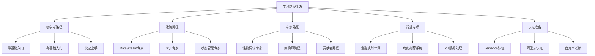
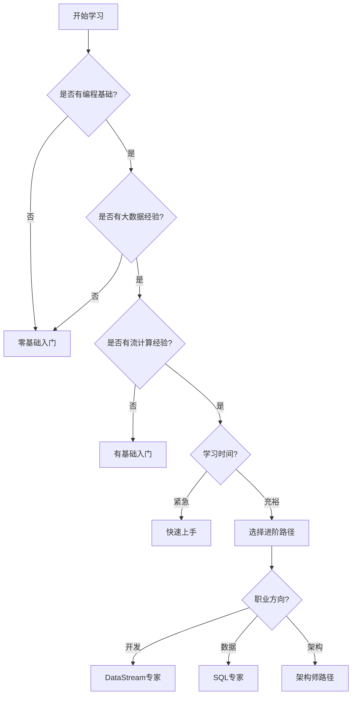

# AnalysisDataFlow 学习路径索引

> **版本**: v1.0 | **更新日期**: 2026-04-04 | **学习路径总数**: 15

---

## 学习路径总览



---

## 学习路径矩阵

| 路径 | 难度 | 时长 | 前置要求 | 目标人群 |
|------|------|------|----------|----------|
| [零基础入门](beginner-zero-foundation.md) | L1-L2 | 4周 | 编程基础 | 完全新手 |
| [有基础入门](beginner-with-foundation.md) | L2-L3 | 2周 | 大数据经验 | 有经验开发者 |
| [快速上手](beginner-quick-start.md) | L2 | 1周 | 流计算经验 | 紧急上手 |
| [DataStream专家](intermediate-datastream-expert.md) | L3-L4 | 3周 | Flink基础 | 开发工程师 |
| [SQL专家](intermediate-sql-expert.md) | L3-L4 | 2周 | SQL基础 | 数据工程师 |
| [状态管理专家](intermediate-state-management-expert.md) | L4-L5 | 2周 | 状态使用经验 | 高级开发 |
| [性能调优专家](expert-performance-tuning.md) | L4-L5 | 2周 | 生产经验 | 性能工程师 |
| [架构师路径](expert-architect-path.md) | L5-L6 | 4周 | 架构经验 | 架构师 |
| [贡献者路径](expert-contributor-path.md) | L5-L6 | 持续 | 源码理解 | 开源贡献者 |
| [金融实时计算](industry-finance-realtime.md) | L3-L5 | 4周 | Flink基础 | 金融工程师 |
| [电商推荐系统](industry-ecommerce-recommendation.md) | L3-L5 | 4周 | Flink+ML | 算法工程师 |
| [IoT数据处理](industry-iot-data-processing.md) | L3-L5 | 4周 | Flink基础 | IoT工程师 |
| [Ververica认证](certifications/ververica-certification.md) | L3-L5 | 3-4周 | 相应等级 | 考证人员 |
| [阿里云认证](certifications/alibaba-certification.md) | L3-L5 | 3-4周 | 相应等级 | 考证人员 |
| [自定义考核](certifications/custom-assessment.md) | L1-L6 | 自定 | 对应等级 | 内部评估 |

---

## 推荐学习路线

### 路线1：新手到专家（6个月）

```
Month 1-2: 零基础入门 (4周)
    ↓
Month 2-3: DataStream专家 (3周)
    ↓
Month 3-4: 状态管理专家 (2周)
    ↓
Month 4-5: 性能调优专家 (2周)
    ↓
Month 5-6: 架构师路径 (4周)
```

### 路线2：数据工程师（3个月）

```
Week 1-2: 有基础入门 (2周)
    ↓
Week 3-4: SQL专家 (2周)
    ↓
Week 5-8: 行业专项（任选）(4周)
    ↓
Week 9-12: 阿里云认证 (4周)
```

### 路线3：算法工程师（4个月）

```
Month 1: 快速上手 (1周) + DataStream专家 (3周)
    ↓
Month 2: SQL专家 (2周) + 状态管理专家 (2周)
    ↓
Month 3: 电商推荐系统 (4周)
    ↓
Month 4: 性能调优专家 (2周) + 项目实践
```

### 路线4：架构师（5个月）

```
Month 1: 有基础入门 (2周) + DataStream专家 (2周)
    ↓
Month 2: 状态管理专家 (2周) + 性能调优专家 (2周)
    ↓
Month 3: 行业专项 (4周)
    ↓
Month 4-5: 架构师路径 (4周)
```

---

## 路径使用指南

### 如何选择适合自己的路径



### 每个路径的标准结构

每个学习路径文档包含以下部分：

1. **路径概览**
   - 适合人群
   - 学习目标
   - 前置知识
   - 完成标准

2. **学习阶段时间线**
   - 甘特图展示
   - 阶段划分
   - 时间安排

3. **每周/阶段详细内容**
   - 学习主题
   - 推荐文档清单
   - 实践任务
   - 检查点

4. **实战项目**
   - 项目描述
   - 技术要求
   - 评估标准

5. **学习资源索引**
   - 核心参考文档
   - 推荐练习

---

## 学习进度跟踪

### 个人学习跟踪表

| 路径 | 开始日期 | 预计完成 | 实际完成 | 进度 | 检查点完成情况 |
|------|----------|----------|----------|------|----------------|
| 零基础入门 | | | | | |
| DataStream专家 | | | | | |
| ... | | | | | |

### 检查点标记示例

```markdown
- [x] 检查点1.1: 能够解释Event Time和Processing Time的区别
- [x] 检查点1.2: 成功启动本地Flink集群
- [ ] 检查点1.3: 完成WordCount程序
- [ ] 检查点1.4: 理解Checkpoint基本概念
```

---

## 学习资源汇总

### 核心理论文档

| 主题 | 文档路径 |
|------|----------|
| 一致性层次 | `Struct/02-properties/02.02-consistency-hierarchy.md` |
| Watermark理论 | `Struct/02-properties/02.03-watermark-monotonicity.md` |
| Checkpoint证明 | `Struct/04-proofs/04.01-flink-checkpoint-correctness.md` |

### 核心工程文档

| 主题 | 文档路径 |
|------|----------|
| Checkpoint机制 | `Flink/02-core-mechanisms/checkpoint-mechanism-deep-dive.md` |
| 状态管理 | `Flink/02-core-mechanisms/flink-state-management-complete-guide.md` |
| DataStream API | `Flink/09-language-foundations/flink-datastream-api-complete-guide.md` |
| SQL完整指南 | `Flink/03-sql-table-api/flink-table-sql-complete-guide.md` |

### 行业案例文档

| 行业 | 文档路径 |
|------|----------|
| 金融风控 | `Flink/07-case-studies/case-financial-realtime-risk-control.md` |
| 电商推荐 | `Flink/07-case-studies/case-ecommerce-realtime-recommendation.md` |
| IoT处理 | `Flink/07-case-studies/case-iot-stream-processing.md` |

---

## 常见问题

### Q1: 我可以同时学习多个路径吗？

建议按阶段学习，先完成基础路径再进入进阶。但同一阶段内的路径可以并行学习（如 DataStream 专家和 SQL 专家）。

### Q2: 每个路径必须全部完成吗？

可以根据自己的需求选择性学习。建议至少完成所有检查点，确保核心能力掌握。

### Q3: 如何验证学习效果？

- 完成每个路径的检查点
- 独立完成实战项目
- 参加自定义考核
- 准备职业认证考试

### Q4: 学习过程中遇到问题怎么办？

1. 查阅相关文档和教程
2. 参考 `TROUBLESHOOTING.md`
3. 查看 `Knowledge/09-anti-patterns/`
4. 参与社区讨论

---

## 贡献与反馈

### 如何贡献新的学习路径

1. 参考现有路径文档格式
2. 使用 `learning-path-template.md` 模板
3. 确保包含甘特图和检查点
4. 提交审核

### 如何报告问题

如果发现学习路径中的问题：

- 文档错误
- 链接失效
- 内容过时

请通过项目 Issue 反馈。

---

## 版本历史

| 版本 | 日期 | 更新内容 |
|------|------|----------|
| v1.0 | 2026-04-04 | 初始版本，包含15条学习路径 |

---

**开始您的流计算学习之旅！**
