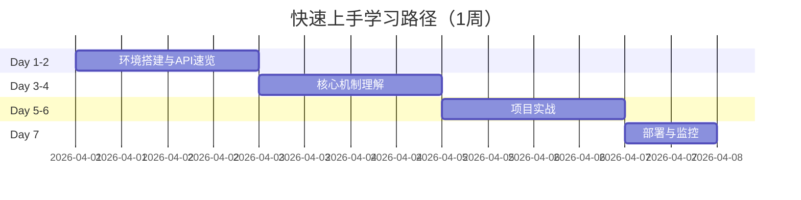

# 学习路径：快速上手（1周）

> **所属阶段**: 初学者路径 | **难度等级**: L2 | **预计时长**: 1周（每天6-8小时）

---

## 路径概览

### 适合人群

- 需要快速上手 Flink 进行项目开发
- 有丰富流计算经验（Storm、Kafka Streams、Spark Streaming 等）
- 熟悉 Java/Scala 和分布式系统
- 时间紧迫，需要快速产出

### 学习目标

完成本路径后，您将能够：

- 快速搭建 Flink 开发环境
- 掌握 DataStream API 核心操作
- 理解 Checkpoint 和状态管理基础
- 完成基本的功能开发
- 部署和监控简单作业

### 前置知识要求

- **流计算框架**: 精通至少一种流处理框架
- **分布式系统**: 深入理解分布式计算原理
- **编程能力**: 5年以上 Java/Scala 经验
- **大数据生态**: 熟悉 Kafka、Hadoop 等组件

---

## 学习阶段时间线



---

## Day 1-2：环境搭建与API速览

### 快速环境搭建

```bash
# 1. 下载 Flink (5分钟)
wget https://downloads.apache.org/flink/flink-1.20.0/flink-1.20.0-bin-scala_2.12.tgz
tar -xzf flink-1.20.0-bin-scala_2.12.tgz
cd flink-1.20.0 && ./bin/start-cluster.sh

# 2. 验证安装 (2分钟)
curl http://localhost:8081

# 3. 提交示例作业 (3分钟)
./bin/flink run examples/streaming/WordCount.jar
```

### API 快速映射

| 其他框架 | Flink DataStream |
|----------|------------------|
| Spark: `map()` | `map()` |
| Spark: `filter()` | `filter()` |
| Spark: `reduceByKey()` | `keyBy().reduce()` |
| Kafka: `KStream` | `DataStream` |
| Storm: `Bolt` | `ProcessFunction` |

### 关键文档速读

| 文档 | 时长 | 重点 |
|------|------|------|
| `QUICK-START.md` | 1h | 整体概览 |
| `Flink/09-language-foundations/flink-datastream-api-complete-guide.md` | 3h | API 详解（速读核心章节） |
| `Flink/05-vs-competitors/flink-vs-spark-streaming.md` | 1h | 差异对比 |

### 检查点

- [ ] 30分钟内完成环境搭建
- [ ] 理解 DataStream 与 RDD/KStream 的对应关系
- [ ] 完成基础转换操作练习

---

## Day 3-4：核心机制理解

### 必须掌握的核心概念

1. **时间语义** (2h)
   - Event Time vs Processing Time
   - Watermark 生成与传播
   - 乱序数据处理

2. **Checkpoint** (3h)
   - Barrier 机制
   - 异步快照
   - 状态后端选择

3. **状态管理** (2h)
   - Keyed State vs Operator State
   - TTL 配置
   - 状态清理

### 速查文档

| 文档 | 时长 | 重点章节 |
|------|------|----------|
| `Flink/02-core/time-semantics-and-watermark.md` | 2h | 1-3节 |
| `Flink/02-core/checkpoint-mechanism-deep-dive.md` | 2h | 概述和配置 |
| `Flink/02-core/flink-state-management-complete-guide.md` | 2h | 基础使用 |

### 快速实验

```java
// 实验1: 三种时间语义对比
env.setStreamTimeCharacteristic(TimeCharacteristic.EventTime);
// 对比输出结果差异

// 实验2: Checkpoint 配置
env.enableCheckpointing(60000);
env.getCheckpointConfig().setCheckpointingMode(CheckpointingMode.EXACTLY_ONCE);

// 实验3: 简单状态使用
ValueStateDescriptor<Integer> descriptor =
    new ValueStateDescriptor<>("counter", Types.INT);
ValueState<Integer> counter = getRuntimeContext().getState(descriptor);
```

### 检查点

- [ ] 能够选择合适的时间语义
- [ ] 配置基本的 Checkpoint 策略
- [ ] 使用 KeyedState 实现简单功能

---

## Day 5-6：项目实战

### 实战项目：实时数据管道

**目标**: 构建 Kafka → Flink → Elasticsearch 的数据管道

**要求**:

- 数据清洗和转换
- 窗口聚合统计
- 异常数据过滤
- Exactly-Once 保证

**代码模板**:

```java
public class QuickStartPipeline {
    public static void main(String[] args) throws Exception {
        StreamExecutionEnvironment env =
            StreamExecutionEnvironment.getExecutionEnvironment();

        // 启用 Checkpoint
        env.enableCheckpointing(60000);

        // 配置 Source
        KafkaSource<String> source = KafkaSource.<String>builder()
            .setBootstrapServers("localhost:9092")
            .setTopics("input-topic")
            .setGroupId("flink-group")
            .setValueOnlyDeserializer(new SimpleStringSchema())
            .build();

        // 数据处理
        env.fromSource(source, WatermarkStrategy.forBoundedOutOfOrderness(
            Duration.ofSeconds(5)), "Kafka Source")
            .map(new JsonParser())
            .filter(new DataValidator())
            .keyBy(Event::getCategory)
            .window(TumblingEventTimeWindows.of(Time.minutes(1)))
            .aggregate(new CountAggregate())
            .addSink(new ElasticsearchSink<>());

        env.execute("QuickStart Pipeline");
    }
}
```

### 检查点

- [ ] 完成端到端数据管道
- [ ] 配置 Exactly-Once Sink
- [ ] 实现基本的监控指标

---

## Day 7：部署与监控

### 部署模式速览

| 模式 | 适用场景 | 命令 |
|------|----------|------|
| Local | 开发测试 | 本地启动 |
| Standalone | 小集群 | `./bin/start-cluster.sh` |
| YARN | 大数据生态 | `flink run -m yarn-cluster` |
| Kubernetes | 云原生 | `kubectl apply -f flink-deployment.yaml` |

### 监控快速配置

```java
// 开启指标报告
env.getConfig().setAutoWatermarkInterval(200);

// 自定义指标
private transient Counter eventCounter;

@Override
public void open(Configuration parameters) {
    eventCounter = getRuntimeContext()
        .getMetricGroup()
        .counter("eventsProcessed");
}
```

### 关键监控指标

| 指标 | 含义 | 健康阈值 |
|------|------|----------|
| Checkpoint Duration | Checkpoint 耗时 | < 60s |
| Backpressure | 背压程度 | LOW |
| Records In/Out | 吞吐量 | 符合预期 |
| JVM Heap | 堆内存使用 | < 80% |

### 检查点

- [ ] 成功部署到目标环境
- [ ] 配置基本监控告警
- [ ] 能够查看作业状态

---

## 快速参考卡

### 常用代码片段

```java
// 1. 环境配置
StreamExecutionEnvironment env =
    StreamExecutionEnvironment.getExecutionEnvironment();
env.setParallelism(4);
env.enableCheckpointing(60000);

// 2. Watermark 配置
WatermarkStrategy.<MyEvent>forBoundedOutOfOrderness(
    Duration.ofSeconds(5))
    .withTimestampAssigner((event, timestamp) -> event.getEventTime());

// 3. 窗口配置
stream.keyBy(Event::getKey)
    .window(TumblingEventTimeWindows.of(Time.minutes(5)))
    .aggregate(new MyAggregate());

// 4. 状态声明
ValueStateDescriptor<Integer> descriptor =
    new ValueStateDescriptor<>("state", Types.INT);
ValueState<Integer> state = getRuntimeContext().getState(descriptor);
```

### 常见问题速查

| 问题 | 解决方案 |
|------|----------|
| 延迟数据过多 | 调整 Watermark 延迟 |
| OOM 错误 | 检查状态大小，使用 RocksDB |
| Checkpoint 超时 | 增加超时时间或优化状态 |
| 背压严重 | 增加并行度或优化处理逻辑 |

---

## 后续深化建议

快速上手后，建议按需深入学习：

- **性能问题**: `LEARNING-PATHS/expert-performance-tuning.md`
- **状态复杂场景**: `LEARNING-PATHS/intermediate-state-management-expert.md`
- **SQL 场景**: `LEARNING-PATHS/intermediate-sql-expert.md`
- **反模式**: `Knowledge/09-anti-patterns/`

---

## 版本历史

| 版本 | 日期 | 更新内容 |
|------|------|----------|
| v1.0 | 2026-04-04 | 初始版本，1周快速上手指南 |

