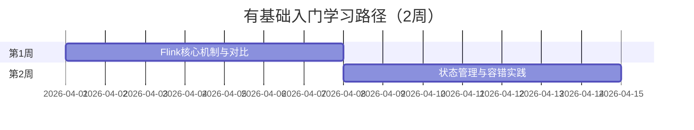

# 学习路径：有基础入门（2周）

> **所属阶段**: 初学者路径 | **难度等级**: L2-L3 | **预计时长**: 2周（每天3-4小时）

---

## 路径概览

### 适合人群

- 有大数据处理经验（Spark、Hadoop 等）
- 熟悉分布式系统基本概念
- 有实时计算基础（了解 Kafka、Storm 等）
- 希望快速上手 Flink 的开发者

### 学习目标

完成本路径后，您将能够：

- 快速理解 Flink 与 Spark Streaming 等框架的差异
- 掌握 Flink 核心机制（Checkpoint、状态管理）
- 编写生产级的 DataStream 作业
- 理解 Flink 的容错和一致性保证
- 完成中等复杂度的流处理项目

### 前置知识要求

- **分布式计算**: 了解 MapReduce、Spark 等框架
- **消息队列**: 熟悉 Kafka 基本概念和使用
- **流计算基础**: 了解流处理的基本模式
- **Java/Scala**: 熟练的编程能力

### 完成标准

- [ ] 能够对比 Flink 与其他流处理框架
- [ ] 理解 Checkpoint 和 Exactly-Once 语义
- [ ] 完成一个包含状态管理的作业
- [ ] 能够排查和解决常见生产问题

---

## 学习阶段时间线



---

## 第1周：Flink核心机制与框架对比

### 学习主题

- Flink 架构与 Spark Streaming 对比
- Checkpoint 机制详解
- 时间语义与 Watermark
- 背压与流量控制

### 推荐文档清单

| 序号 | 文档 | 类型 | 预计时长 | 重点内容 |
|------|------|------|----------|----------|
| 1.1 | `Flink/05-vs-competitors/flink-vs-spark-streaming.md` | 对比 | 2h | 框架对比分析 |
| 1.2 | `Flink/02-core/checkpoint-mechanism-deep-dive.md` | 核心 | 3h | Checkpoint 深度解析 |
| 1.3 | `Flink/02-core/exactly-once-semantics-deep-dive.md` | 核心 | 2h | Exactly-Once 语义 |
| 1.4 | `Flink/02-core/backpressure-and-flow-control.md` | 核心 | 2h | 背压机制 |
| 1.5 | `Knowledge/05-mapping-guides/migration-guides/05.1-spark-streaming-to-flink-migration.md` | 迁移 | 2h | 迁移指南 |

### 实践任务

1. **框架对比实验**

   ```java
   // 实现同一功能：
   // 1. 使用 Spark Streaming 实现 WordCount
   // 2. 使用 Flink DataStream 实现 WordCount
   // 3. 对比延迟、吞吐量、语义保证

```

2. **Checkpoint 配置实验**
   - 配置不同 Checkpoint 间隔
   - 测试作业恢复过程
   - 观察 Checkpoint 对性能的影响

3. **背压观察**
   - 模拟慢速 Sink
   - 观察背压传播过程
   - 理解反压对上游的影响

### 检查点 1.1

- [ ] 能够列出 Flink 与 Spark Streaming 的 5+ 个关键差异
- [ ] 解释 Checkpoint 的工作原理和配置要点
- [ ] 理解 Exactly-Once 与 At-Least-Once 的区别
- [ ] 能够诊断和应对背压问题

---

## 第2周：状态管理与容错实践

### 学习主题

- 状态类型与状态后端
- 状态 TTL 与清理策略
- 端到端 Exactly-Once
- 故障恢复与重启策略

### 推荐文档清单

| 序号 | 文档 | 类型 | 预计时长 | 重点内容 |
|------|------|------|----------|----------|
| 2.1 | `Flink/02-core/flink-state-management-complete-guide.md` | 核心 | 3h | 状态管理完整指南 |
| 2.2 | `Flink/02-core/flink-state-ttl-best-practices.md` | 实践 | 2h | TTL 最佳实践 |
| 2.3 | `Flink/02-core/exactly-once-end-to-end.md` | 核心 | 2h | 端到端一致性 |
| 2.4 | `Knowledge/07-best-practices/07.01-flink-production-checklist.md` | 清单 | 2h | 生产检查清单 |

### 实践任务

1. **状态管理实验**

   ```java
   // 实验目标：
   // 1. 实现 ValueState、ListState、MapState
   // 2. 测试状态恢复
   // 3. 对比 RocksDB 和 Heap 状态后端
```

1. **端到端一致性项目**
   - Kafka → Flink → Kafka 管道
   - 配置两阶段提交
   - 模拟故障并验证数据一致性

2. **故障恢复演练**
   - 配置不同重启策略
   - 模拟 TaskManager 故障
   - 观察自动恢复过程

### 检查点 2.1

- [ ] 熟练使用 ValueState、ListState、MapState
- [ ] 能够配置端到端 Exactly-Once 管道
- [ ] 理解不同重启策略的适用场景
- [ ] 能够设计容错的生产级作业

---

## 综合实践项目

### 项目：实时用户行为分析

**项目描述**: 构建电商平台用户行为实时分析系统。

**功能需求**:

- 实时计算 PV、UV、跳出率
- 用户会话分析（使用会话窗口）
- 热门商品统计（使用滑动窗口）
- 异常行为检测

**技术栈**:

- Kafka 作为数据源
- Flink DataStream API
- Redis 作为状态存储
- MySQL 作为结果存储

**评估标准**:

- 代码质量和可维护性
- 容错能力（Checkpoint 配置）
- 状态管理合理性
- 文档完整性

---

## 快速参考

### 关键概念对比表

| 特性 | Flink | Spark Streaming |
|------|-------|-----------------|
| 处理模型 | 原生流处理 | 微批处理 |
| 延迟 | 毫秒级 | 秒级 |
| 语义保证 | Exactly-Once | Exactly-Once |
| 状态管理 | 内置，强大 | 需外部存储 |
| 事件时间支持 | 原生 | Structured Streaming |
| Watermark | 原生 | 有限支持 |

### 常用配置速查

```java

import org.apache.flink.streaming.api.CheckpointingMode;

// Checkpoint 配置
env.enableCheckpointing(60000);
env.getCheckpointConfig().setCheckpointingMode(CheckpointingMode.EXACTLY_ONCE);
env.getCheckpointConfig().setMinPauseBetweenCheckpoints(30000);

// 状态后端配置
env.setStateBackend(new HashMapStateBackend());
env.getCheckpointConfig().setCheckpointStorage("file:///checkpoint-dir");

// 重启策略
env.setRestartStrategy(RestartStrategies.fixedDelayRestart(
    3,                    // 重启次数
    Time.of(10, TimeUnit.SECONDS)  // 延迟
));
```

---

## 进阶路径推荐

完成本路径后，建议继续：

- **性能调优专家**: `LEARNING-PATHS/expert-performance-tuning.md`
- **状态管理专家**: `LEARNING-PATHS/intermediate-state-management-expert.md`
- **SQL 专家**: `LEARNING-PATHS/intermediate-sql-expert.md`
- **行业专项**: 根据工作需求选择

---

## 版本历史

| 版本 | 日期 | 更新内容 |
|------|------|----------|
| v1.0 | 2026-04-04 | 初始版本，针对有基础开发者快速入门 |
