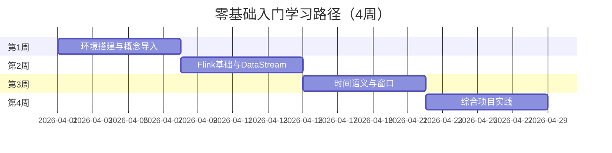

# 学习路径：零基础入门（4周）

> **所属阶段**: 初学者路径 | **难度等级**: L1-L2 | **预计时长**: 4周（每天2-3小时）

---

## 路径概览

### 学习目标

完成本路径后，您将能够：

- 理解流计算的基本概念和与批处理的差异
- 掌握 Flink 的基本架构和核心组件
- 编写简单的 DataStream 和 SQL 程序
- 理解时间语义和窗口概念
- 搭建本地 Flink 开发环境并运行作业

### 前置知识要求

- **编程基础**: 掌握至少一门编程语言（Java、Python 或 Scala）
- **数据库基础**: 了解 SQL 基本语法和关系型数据库概念
- **Linux 基础**: 熟悉基本命令行操作
- **开发环境**: 已安装 JDK 11+、Maven/Gradle、IDE（IntelliJ IDEA 推荐）

### 完成标准

- [ ] 能够独立搭建 Flink 本地开发环境
- [ ] 完成至少 3 个实践项目
- [ ] 通过所有阶段检查点测试
- [ ] 能够向他人解释流计算的核心概念

---

## 学习阶段时间线



---

## 第1周：环境搭建与概念导入

### 学习主题

- 流计算基本概念与历史发展
- 流处理 vs 批处理的核心差异
- Flink 简介与生态系统概览
- 本地开发环境搭建

### 推荐文档清单

| 序号 | 文档 | 类型 | 预计时长 | 重点内容 |
|------|------|------|----------|----------|
| 1.1 | `QUICK-START.md` | 指南 | 2h | 项目整体概览 |
| 1.2 | `Knowledge/01-concept-atlas/streaming-models-mindmap.md` | 概念图 | 1h | 流计算模型全景 |
| 1.3 | `Flink/00-INDEX.md` | 索引 | 30min | Flink 文档体系 |
| 1.4 | `Flink/01-architecture/deployment-architectures.md` | 架构 | 2h | 部署模式介绍 |
| 1.5 | `tutorials/README.md` | 教程 | 1h | 入门教程导航 |

### 实践任务

1. **环境搭建**

   ```bash
   # 下载并启动 Flink 本地集群
   wget https://downloads.apache.org/flink/flink-1.20.0/flink-1.20.0-bin-scala_2.12.tgz
   tar -xzf flink-1.20.0-bin-scala_2.12.tgz
   cd flink-1.20.0
   ./bin/start-cluster.sh
   ```

2. **运行 WordCount 示例**
   - 在本地集群提交 WordCount 作业
   - 通过 Web UI 观察作业执行情况
   - 查看作业日志和指标

3. **IDE 配置**
   - 创建 Maven 项目
   - 添加 Flink 依赖
   - 配置运行环境

### 检查点 1.1

- [ ] 能够解释 Event Time 和 Processing Time 的区别
- [ ] 成功启动本地 Flink 集群并访问 Web UI
- [ ] 运行官方 WordCount 示例并查看结果
- [ ] 在 IDE 中成功运行简单的 Flink 程序

---

## 第2周：Flink基础与DataStream

### 学习主题

- DataStream API 核心概念
- 数据源（Source）与数据汇（Sink）
- 基本转换操作（map、filter、flatMap）
- KeyedStream 与简单聚合

### 推荐文档清单

| 序号 | 文档 | 类型 | 预计时长 | 重点内容 |
|------|------|------|----------|----------|
| 2.1 | `Flink/09-language-foundations/flink-datastream-api-complete-guide.md` | API指南 | 3h | DataStream 完整指南 |
| 2.2 | `Knowledge/02-design-patterns/pattern-stateful-computation.md` | 设计模式 | 2h | 有状态计算入门 |
| 2.3 | `Flink/04-connectors/kafka-integration-patterns.md` | 连接器 | 2h | Kafka 基础集成 |
| 2.4 | `Flink/02-core/streaming-etl-best-practices.md` | 实践 | 1h | ETL 基础实践 |

### 实践任务

1. **基础转换练习**

   ```java
   // 实现以下功能：
   // 1. 从 Socket 读取数据
   // 2. 使用 map 转换数据格式
   // 3. 使用 filter 过滤无效数据
   // 4. 使用 keyBy 和 sum 进行聚合
   ```

2. **简单的 ETL 作业**
   - 读取模拟的日志数据
   - 解析 JSON 格式
   - 过滤错误级别日志
   - 按服务名统计错误数量

3. **Kafka 集成入门**
   - 搭建本地 Kafka 环境（使用 Docker）
   - 编写 Kafka Source 和 Sink
   - 实现数据流转

### 检查点 2.1

- [ ] 熟练使用 map、filter、flatMap、keyBy、sum 等操作
- [ ] 能够编写从 Socket/Kafka 读取数据的程序
- [ ] 理解 KeyedStream 的概念和作用
- [ ] 完成基础 ETL 作业并验证结果

---

## 第3周：时间语义与窗口

### 学习主题

- 时间语义详解（Event Time / Processing Time / Ingestion Time）
- Watermark 机制与生成策略
- 窗口类型（滚动窗口、滑动窗口、会话窗口）
- 窗口函数与聚合

### 推荐文档清单

| 序号 | 文档 | 类型 | 预计时长 | 重点内容 |
|------|------|------|----------|----------|
| 3.1 | `Flink/02-core/time-semantics-and-watermark.md` | 核心机制 | 3h | 时间语义详解 |
| 3.2 | `Struct/02-properties/02.03-watermark-monotonicity.md` | 理论 | 2h | Watermark 理论基础 |
| 3.3 | `Flink/03-sql-table-api/flink-sql-window-functions-deep-dive.md` | SQL | 2h | 窗口函数详解 |
| 3.4 | `Knowledge/02-design-patterns/pattern-windowed-aggregation.md` | 设计模式 | 1h | 窗口聚合模式 |

### 实践任务

1. **时间语义实验**

   ```java
   // 实验目标：
   // 1. 分别使用三种时间语义运行同一作业
   // 2. 观察输出结果的差异
   // 3. 理解乱序数据的影响
   ```

2. **Watermark 实践**
   - 实现自定义 Watermark 生成策略
   - 处理乱序数据和延迟数据
   - 观察 Watermark 推进过程

3. **窗口聚合项目**
   - 模拟网站访问日志
   - 使用滚动窗口统计每分钟 PV/UV
   - 使用会话窗口分析用户行为

### 检查点 3.1

- [ ] 能够清晰解释三种时间语义的区别和适用场景
- [ ] 理解 Watermark 的作用和原理
- [ ] 熟练使用三种窗口类型进行数据分析
- [ ] 能够处理乱序数据和延迟数据

---

## 第4周：综合项目实践

### 学习主题

- 端到端项目开发流程
- 调试与问题排查基础
- 作业监控与指标查看
- 项目文档编写

### 推荐文档清单

| 序号 | 文档 | 类型 | 预计时长 | 重点内容 |
|------|------|------|----------|----------|
| 4.1 | `Flink/15-observability/flink-observability-complete-guide.md` | 可观测性 | 2h | 监控与调试入门 |
| 4.2 | `Knowledge/07-best-practices/07.03-troubleshooting-guide.md` | 最佳实践 | 2h | 问题排查指南 |
| 4.3 | `Knowledge/98-exercises/exercise-02-flink-basics.md` | 练习 | 2h | 基础练习题 |

### 实践项目：实时日志分析系统

**项目描述**: 构建一个实时日志分析系统，处理应用日志并生成统计报表。

**技术要求**:

- 使用 Kafka 作为数据源
- 解析结构化日志（JSON 格式）
- 按日志级别、服务名进行统计
- 使用窗口计算每分钟错误率
- 输出到控制台和文件

**项目步骤**:

1. 设计数据 schema 和日志格式
2. 实现 Kafka Producer 模拟日志数据
3. 编写 Flink 作业进行数据处理
4. 添加窗口聚合和统计分析
5. 配置输出目标
6. 编写项目文档

### 检查点 4.1

- [ ] 完成端到端的日志分析系统
- [ ] 能够使用 Web UI 查看作业指标
- [ ] 能够排查常见的作业问题
- [ ] 编写完整的项目文档

---

## 学习资源索引

### 核心参考文档

| 主题 | 推荐文档 |
|------|----------|
| 快速开始 | `QUICK-START.md` |
| 概念图谱 | `Knowledge/01-concept-atlas/streaming-models-mindmap.md` |
| DataStream API | `Flink/09-language-foundations/flink-datastream-api-complete-guide.md` |
| 时间语义 | `Flink/02-core/time-semantics-and-watermark.md` |
| 窗口函数 | `Flink/03-sql-table-api/flink-sql-window-functions-deep-dive.md` |
| 可观测性 | `Flink/15-observability/flink-observability-complete-guide.md` |

### 推荐练习

- `Knowledge/98-exercises/exercise-02-flink-basics.md`
- `Knowledge/98-exercises/exercise-03-checkpoint-analysis.md`（基础部分）

---

## 常见问题与解决建议

### Q1: 环境搭建遇到问题？

- 确保 JDK 版本为 11 或更高
- 检查端口是否被占用（8081 等）
- 查看 Flink 日志排查问题

### Q2: 代码运行报错？

- 检查依赖版本是否匹配
- 确认 Scala 版本与 Flink 编译版本一致
- 使用本地模式测试排除环境问题

### Q3: 概念理解困难？

- 先动手实践，再回头理解理论
- 查阅 `Knowledge/01-concept-atlas/` 中的可视化材料
- 参考官方文档和社区教程

---

## 下一步学习建议

完成本路径后，建议继续：

- **进阶 DataStream**: `LEARNING-PATHS/intermediate-datastream-expert.md`
- **SQL 专项**: `LEARNING-PATHS/intermediate-sql-expert.md`
- **行业应用**: 根据兴趣选择行业专项路径

---

## 版本历史

| 版本 | 日期 | 更新内容 |
|------|------|----------|
| v1.0 | 2026-04-04 | 初始版本，覆盖零基础入门完整路径 |

---

**祝您学习顺利！**

