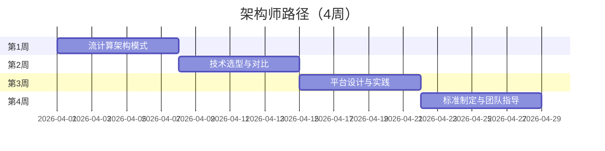

# 学习路径：架构师路径（4周）

> **所属阶段**: 专家路径 | **难度等级**: L5-L6 | **预计时长**: 4周（每天3-4小时）

---

## 路径概览

### 适合人群

- 系统架构师、技术负责人
- 需要设计流处理平台
- 负责技术选型和架构决策
- 需要指导团队进行流计算开发

### 学习目标

完成本路径后，您将能够：

- 设计企业级流处理架构
- 进行技术选型和方案评估
- 制定流计算技术标准和规范
- 设计高可用、可扩展的流处理平台
- 指导团队进行流计算开发

### 前置知识要求

- 丰富的分布式系统架构经验
- 深入理解流计算理论和实践
- 有大型项目架构设计经验
- 了解企业级系统设计原则

### 完成标准

- [ ] 能够设计完整的流处理平台架构
- [ ] 掌握流计算技术选型方法论
- [ ] 能够制定技术标准和规范
- [ ] 具备指导团队的能力

---

## 学习阶段时间线



---

## 第1周：流计算架构模式

### 学习主题

- Lambda 架构与 Kappa 架构
- 流批一体架构设计
- 实时数仓架构
- 事件驱动架构（EDA）

### 推荐文档清单

| 序号 | 文档 | 类型 | 预计时长 | 重点内容 |
|------|------|------|----------|----------|
| 1.1 | `DEPLOYMENT-ARCHITECTURES.md` | 架构 | 3h | 部署架构 |
| 1.2 | `Knowledge/03-business-patterns/data-mesh-streaming-architecture-2026.md` | 架构 | 3h | Data Mesh |
| 1.3 | `Knowledge/06-frontier/streaming-data-mesh-architecture.md` | 架构 | 2h | 流式 Data Mesh |
| 1.4 | `Knowledge/06-frontier/serverless-stream-processing-architecture.md` | 架构 | 2h | Serverless |
| 1.5 | `Flink/01-architecture/deployment-architectures.md` | 架构 | 2h | Flink 部署架构 |

### 实践任务

1. **架构模式对比分析**
   - 对比 Lambda 和 Kappa 架构
   - 分析各自的优缺点
   - 确定适用场景

2. **实时数仓架构设计**

   ```
   设计一个实时数仓架构：
   - ODS、DWD、DWS、ADS 层设计
   - 数据流向和存储选型
   - 实时与离线统一方案
   ```

3. **事件驱动架构设计**
   - 设计基于 Kafka + Flink 的 EDA 系统
   - 事件 schema 设计
   - 服务间通信模式

### 检查点 1.1

- [ ] 理解主流流计算架构模式
- [ ] 能够设计实时数仓架构
- [ ] 掌握事件驱动架构设计
- [ ] 能够根据场景选择架构模式

---

## 第2周：技术选型与对比

### 学习主题

- 流处理引擎选型
- 存储系统选型
- 消息队列选型
- 云原生与混合云架构

### 推荐文档清单

| 序号 | 文档 | 类型 | 预计时长 | 重点内容 |
|------|------|------|----------|----------|
| 2.1 | `Knowledge/04-technology-selection/engine-selection-guide.md` | 选型 | 3h | 引擎选型指南 |
| 2.2 | `Knowledge/04-technology-selection/storage-selection-guide.md` | 选型 | 2h | 存储选型 |
| 2.3 | `Flink/05-vs-competitors/flink-vs-spark-streaming.md` | 对比 | 2h | Flink vs Spark |
| 2.4 | `Flink/05-vs-competitors/flink-vs-kafka-streams.md` | 对比 | 2h | Flink vs Kafka Streams |
| 2.5 | `Knowledge/04-technology-selection/flink-vs-risingwave.md` | 对比 | 2h | Flink vs RisingWave |
| 2.6 | `Knowledge/06-frontier/multi-cloud-streaming-architecture.md` | 架构 | 2h | 多云架构 |

### 实践任务

1. **技术选型决策矩阵**

   | 维度 | Flink | Spark Streaming | Kafka Streams | RisingWave |
   |------|-------|-----------------|---------------|------------|
   | 延迟 | 毫秒级 | 秒级 | 毫秒级 | 毫秒级 |
   | 语义 | Exactly-Once | Exactly-Once | Exactly-Once | Exactly-Once |
   | 状态管理 | 内置 | 外部 | 内置 | 内置 |
   | SQL 支持 | 完善 | 完善 | 有限 | 原生 |
   | 运维复杂度 | 中 | 中 | 低 | 低 |

2. **存储系统选型**
   - 消息存储：Kafka vs Pulsar
   - 状态存储：RocksDB vs 远程存储
   - 结果存储：ClickHouse vs Druid vs PostgreSQL

3. **多云架构设计**
   - 设计跨云部署方案
   - 数据同步和容灾策略
   - 成本控制方案

### 检查点 2.1

- [ ] 能够进行流处理引擎选型
- [ ] 掌握存储系统选型方法
- [ ] 能够设计多云架构
- [ ] 具备技术选型决策能力

---

## 第3周：平台设计与实践

### 学习主题

- 流计算平台总体设计
- 多租户和资源隔离
- 安全与合规设计
- 可观测性平台

### 推荐文档清单

| 序号 | 文档 | 类型 | 预计时长 | 重点内容 |
|------|------|------|----------|----------|
| 3.1 | `Flink/10-deployment/flink-deployment-ops-complete-guide.md` | 运维 | 3h | 部署运维 |
| 3.2 | `Flink/10-deployment/flink-kubernetes-operator-deep-dive.md` | K8s | 3h | K8s Operator |
| 3.3 | `Flink/13-security/flink-security-complete-guide.md` | 安全 | 2h | 安全设计 |
| 3.4 | `Flink/15-observability/flink-observability-complete-guide.md` | 可观测 | 2h | 可观测平台 |
| 3.5 | `Knowledge/07-best-practices/07.05-security-hardening-guide.md` | 安全 | 2h | 安全加固 |

### 实践任务

1. **流计算平台架构设计**

   ```
   设计一个企业级流计算平台：

   ┌─────────────────────────────────────────────────────┐
   │                   平台门户层                          │
   │  (作业管理、监控告警、资源管理、权限控制)              │
   ├─────────────────────────────────────────────────────┤
   │                   调度管理层                          │
   │  (Kubernetes Operator、多租户隔离、资源调度)          │
   ├─────────────────────────────────────────────────────┤
   │                   计算引擎层                          │
   │  (Flink Cluster、SQL Gateway、JobManager)            │
   ├─────────────────────────────────────────────────────┤
   │                   数据集成层                          │
   │  (Kafka、CDC、Connector Ecosystem)                   │
   ├─────────────────────────────────────────────────────┤
   │                   存储资源层                          │
   │  (状态存储、Checkpoint、结果存储)                     │
   └─────────────────────────────────────────────────────┘
   ```

2. **安全架构设计**
   - 身份认证与授权（RBAC）
   - 数据加密（传输加密、静态加密）
   - 网络隔离和安全组
   - 审计日志

3. **可观测性平台设计**
   - 指标收集与存储（Prometheus + Thanos）
   - 日志收集（Fluentd + Elasticsearch）
   - 链路追踪（OpenTelemetry + Jaeger）
   - 告警系统（Alertmanager + PagerDuty）

### 检查点 3.1

- [ ] 完成流计算平台架构设计
- [ ] 设计多租户和资源隔离方案
- [ ] 完成安全架构设计
- [ ] 设计可观测性平台

---

## 第4周：标准制定与团队指导

### 学习主题

- 技术标准和规范制定
- 开发流程和最佳实践
- 团队能力模型
- 知识分享和培训

### 推荐文档清单

| 序号 | 文档 | 类型 | 预计时长 | 重点内容 |
|------|------|------|----------|----------|
| 4.1 | `Knowledge/07-best-practices/07.01-flink-production-checklist.md` | 清单 | 2h | 生产检查清单 |
| 4.2 | `Knowledge/09-anti-patterns/anti-pattern-checklist.md` | 反模式 | 2h | 反模式清单 |
| 4.3 | `AGENTS.md` | 规范 | 1h | 项目规范 |
| 4.4 | `BEST-PRACTICES.md` | 实践 | 3h | 最佳实践 |
| 4.5 | `MAINTENANCE-GUIDE.md` | 维护 | 2h | 维护指南 |

### 实践任务

1. **制定开发规范**

   ```markdown
   # Flink 作业开发规范

   ## 1. 命名规范
   - 作业名：`业务域_功能_环境`，如 `payment_order_stat_prod`
   - CheckPoint 路径：`/checkpoints/{jobName}/{jobId}`

   ## 2. 配置规范
   - Checkpoint 间隔：生产环境 60s
   - 并行度：根据 Kafka Partition 数设置
   - 重启策略：固定延迟重启，最多 10 次

   ## 3. 代码规范
   - 必须设置 UID
   - 必须配置状态 TTL
   - 必须使用 Event Time

   ## 4. 监控规范
   - 必须配置延迟监控
   - 必须配置 Checkpoint 监控
   - 必须配置业务指标
   ```

2. **设计能力模型**

   ```
   流计算工程师能力模型：

   L1 初级：
   - 能够开发简单 DataStream 作业
   - 理解基本概念

   L2 中级：
   - 熟练使用 DataStream/SQL API
   - 理解 Checkpoint 和状态管理

   L3 高级：
   - 能够进行性能调优
   - 处理复杂业务场景

   L4 专家：
   - 架构设计能力
   - 解决疑难问题

   L5 架构师：
   - 平台设计能力
   - 技术规划和选型
   ```

3. **制定培训计划**
   - 新员工入职培训
   - 定期技术分享
   - 实战训练营

### 检查点 4.1

- [ ] 制定完整的开发规范
- [ ] 设计团队能力模型
- [ ] 制定培训计划
- [ ] 建立知识库

---

## 架构决策记录（ADR）模板

```markdown
# ADR-001: 流处理引擎选型

## 状态
Accepted

## 背景
需要选择一款流处理引擎作为公司实时计算平台的基础。

## 决策
选择 Apache Flink 作为主力流处理引擎。

## 理由
1. 原生流处理，延迟更低
2. 强大的状态管理能力
3. 活跃的社区和生态
4. 完善的 SQL 支持

## 替代方案
- Spark Streaming：微批处理，延迟较高
- Kafka Streams：功能相对简单
- RisingWave：新兴项目，生态尚不成熟

## 影响
- 需要团队学习 Flink
- 需要建设 Flink 运维平台

## 相关决策
- 状态后端选择 RocksDB
- 部署模式选择 Kubernetes
```

---

## 实战项目：企业级流计算平台建设

### 项目描述

为公司设计并建设企业级流计算平台。

### 架构设计

```
┌────────────────────────────────────────────────────────────┐
│                        用户层                               │
│    数据分析师    数据工程师    算法工程师    平台运维        │
└────────────────────────────────────────────────────────────┘
                            ↓
┌────────────────────────────────────────────────────────────┐
│                        平台层                               │
│  ┌──────────┐  ┌──────────┐  ┌──────────┐  ┌──────────┐   │
│  │ SQL IDE   │  │ 作业管理  │  │ 监控告警  │  │ 权限管理  │   │
│  └──────────┘  └──────────┘  └──────────┘  └──────────┘   │
└────────────────────────────────────────────────────────────┘
                            ↓
┌────────────────────────────────────────────────────────────┐
│                        调度层                               │
│              Apache Flink Kubernetes Operator              │
└────────────────────────────────────────────────────────────┘
                            ↓
┌────────────────────────────────────────────────────────────┐
│                        计算层                               │
│     Flink Session Cluster    │    Flink Application        │
└────────────────────────────────────────────────────────────┘
                            ↓
┌────────────────────────────────────────────────────────────┐
│                        存储层                               │
│    Kafka    │    S3/OSS    │    ClickHouse    │    Redis   │
└────────────────────────────────────────────────────────────┘
```

### 交付物

1. 架构设计文档
2. 技术选型报告
3. 开发规范手册
4. 运维手册
5. 培训材料

---

## 版本历史

| 版本 | 日期 | 更新内容 |
|------|------|----------|
| v1.0 | 2026-04-04 | 初始版本，架构师路径 |
