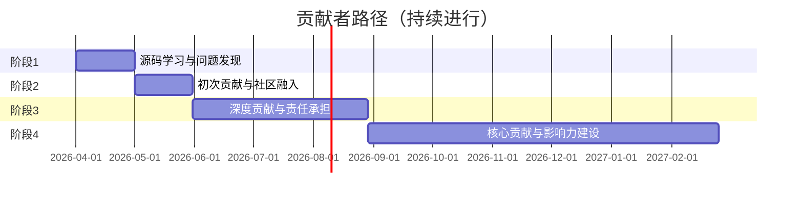

# 学习路径：贡献者路径（持续）

> **所属阶段**: 专家路径 | **难度等级**: L5-L6 | **预计时长**: 持续进行

---

## 路径概览

### 适合人群

- 希望为 Flink 社区做出贡献
- 希望深入理解 Flink 源码
- 准备参与开源项目开发
- 希望提升技术影响力

### 贡献方式

1. **代码贡献**
   - 提交 Bug Fix
   - 实现新特性
   - 性能优化
   - 测试用例

2. **文档贡献**
   - 改进文档
   - 翻译文档
   - 编写教程
   - 分享案例

3. **社区贡献**
   - 回答问题
   - Review PR
   - 组织活动
   - 推广宣传

4. **生态贡献**
   - 开发连接器
   - 开发工具
   - 集成框架

### 前置知识要求

- 深入理解 Flink 架构和源码
- 熟练使用 Git 和 GitHub
- 具备良好的沟通能力
- 有持续投入的时间和精力

---

## 学习阶段



---

## 阶段1：源码学习与问题发现（1个月）

### 学习目标

- 深入理解 Flink 源码结构
- 学习社区协作流程
- 发现并记录问题
- 参与社区讨论

### 推荐文档清单

| 序号 | 文档 | 类型 | 预计时长 | 重点内容 |
|------|------|------|----------|----------|
| 1.1 | `CONTRIBUTING.md` | 贡献指南 | 2h | 贡献流程 |
| 1.2 | `Flink/00-INDEX.md` | 索引 | 1h | Flink 文档体系 |
| 1.3 | `ARCHITECTURE.md` | 架构 | 4h | 项目架构 |
| 1.4 | `Flink/01-architecture/flink-1.x-vs-2.0-comparison.md` | 对比 | 2h | 版本演进 |
| 1.5 | `Flink/08-roadmap/flink-2.3-2.4-roadmap.md` | 路线图 | 2h | 发展方向 |

### 实践任务

1. **源码阅读**

   ```
   重点模块：
   - flink-core: 核心 API
   - flink-runtime: 运行时
   - flink-streaming-java: DataStream API
   - flink-table: SQL/Table API
   ```

2. **问题发现**
   - 浏览 JIRA 上的 Issue
   - 在本地测试中发现问题
   - 在文档中发现错误

3. **社区参与**
   - 订阅 <dev@flink.apache.org>
   - 加入 Slack 频道
   - 关注 GitHub Discussions

### 检查点

- [ ] 理解 Flink 源码结构
- [ ] 发现至少 3 个可改进点
- [ ] 参与社区讨论

---

## 阶段2：初次贡献与社区融入（1个月）

### 学习目标

- 提交第一个 PR
- 熟悉代码审查流程
- 建立社区联系
- 积累贡献经验

### 推荐任务

1. **Good First Issues**
   - 标签：`good-first-issue`
   - 类型：文档改进、简单 Bug Fix
   - 难度：低

2. **文档贡献**

   ```markdown
   # 文档改进示例

   ## 问题
   某 API 的文档描述不清楚，缺少示例代码。

   ## 改进
   - 补充详细说明
   - 添加代码示例
   - 增加注意事项
   ```

3. **测试贡献**
   - 补充缺失的测试用例
   - 提高代码覆盖率
   - 添加集成测试

### 贡献流程

```
1. Fork 仓库
2. 创建分支 (git checkout -b fix-issue-123)
3. 编写代码
4. 添加测试
5. 提交 PR (遵循模板)
6. 响应 Review 意见
7. 合并到主分支
```

### 检查点

- [ ] 提交第一个 PR
- [ ] 通过代码审查
- [ ] PR 被合并

---

## 阶段3：深度贡献与责任承担（3个月）

### 学习目标

- 承担复杂任务
- 参与设计讨论
- Review 他人代码
- 指导新贡献者

### 推荐任务

1. **特性开发**
   - 选择感兴趣的特性
   - 参与 FLIP 讨论
   - 实现新功能

2. **Bug 修复**
   - 修复复杂 Bug
   - 优化性能问题
   - 解决兼容性问题

3. **代码审查**
   - Review 社区 PR
   - 提供建设性意见
   - 帮助改进代码质量

### 推荐文档

- [formal-methods/08-ai-formal-methods/agent-behavior-contract-verification.md](../../formal-methods/08-ai-formal-methods/agent-behavior-contract-verification.md) — AI Agent 行为契约验证：多 Agent 协作安全的形式化框架

### FLIP 参与流程

```
FLIP (Flink Improvement Proposal)

1. 发现需求或问题
2. 起草 FLIP 文档
3. 在社区讨论
4. 根据反馈修改
5. 投票通过
6. 开始实现
```

### 检查点

- [ ] 完成至少 1 个中等复杂度任务
- [ ] Review 至少 5 个 PR
- [ ] 参与设计讨论

---

## 阶段4：核心贡献与影响力建设（6个月+）

### 学习目标

- 成为模块负责人
- 推动重大特性
- 建立技术影响力
- 培养新贡献者

### 发展方向

1. **Committer**
   - 持续高质量贡献
   - 深入理解多个模块
   - 获得 PMC 提名

2. **技术布道**
   - 撰写技术博客
   - 在会议演讲
   - 制作教程视频

3. **生态建设**
   - 开发连接器
   - 创建工具库
   - 维护周边项目

### 推荐文档

- [Knowledge/06-frontier/nist-caisi-agent-standards.md](../../Knowledge/06-frontier/nist-caisi-agent-standards.md) — NIST CAISI：AI Agent 标准化政策解读与合规框架

### 影响力建设

```markdown
# 技术博客主题建议

1. 源码分析系列
   - Flink Checkpoint 机制详解
   - Flink State 后端实现分析
   - Flink SQL 优化器解析

2. 最佳实践系列
   - 生产环境调优经验
   - 大规模作业设计
   - 问题排查案例

3. 前沿探索系列
   - 流计算新特性解读
   - 与其他技术集成
   - 未来趋势分析
```

---

## 贡献资源

### 官方资源

| 资源 | 链接 | 说明 |
|------|------|------|
| GitHub | <https://github.com/apache/flink> | 源码仓库 |
| JIRA | <https://issues.apache.org/jira/browse/FLINK> | 问题跟踪 |
| 邮件列表 | <dev@flink.apache.org> | 开发讨论 |
| Slack | <https://apache-flink.slack.com> | 即时沟通 |
| 文档 | <https://nightlies.apache.org/flink/> | 官方文档 |

### 贡献指南

1. **代码规范**
   - 遵循 Google Java Style
   - 添加适当的注释
   - 编写单元测试
   - 保持向后兼容

2. **提交规范**

   ```
   [FLINK-12345][component] Brief description

   Detailed description of the change.

   - Change 1
   - Change 2
   ```

3. **PR 模板**

   ```markdown
   ## What is the purpose of the change

   ## Brief change log

   ## Verifying this change

   ## Does this pull request potentially affect one of the following parts:
   - Dependencies (does it add or upgrade a dependency)
   - The public API
   -

   ## Documentation
   - Does this pull request introduce a new feature?
   ```

---

## 贡献者成长路径

```
Contributor (贡献者)
    │
    ├── 提交 PR
    ├── 修复 Bug
    └── 改进文档
    ↓
Active Contributor (活跃贡献者)
    │
    ├── 定期贡献
    ├── Review PR
    └── 回答问题
    ↓
Committer (提交者)
    │
    ├── 代码审查权限
    ├── 合并 PR
    └── 指导新贡献者
    ↓
PMC Member (PMC 成员)
    │
    ├── 项目决策权
    ├── 版本发布
    └── 社区治理
```

---

## 成功故事

### 案例1：从用户到 Committer

```
背景：某工程师在使用 Flink 时发现多个 Bug

历程：
- 第1个月：提交 Bug Fix PR
- 第3个月：参与新特性开发
- 第6个月：成为活跃贡献者
- 第12个月：被提名为 Committer

经验：
- 从实际问题出发
- 持续高质量贡献
- 积极参与社区
```

### 案例2：技术影响力建设

```
背景：某架构师希望建立流计算领域影响力

行动：
- 撰写 Flink 源码分析系列博客
- 在行业会议演讲
- 制作 Flink 视频教程
- 出版技术书籍

成果：
- 成为知名 Flink 布道者
- 获得 Apache Flink Committer 身份
- 被邀请为会议讲师
```

---

## 检查清单

### 初期贡献

- [ ] 阅读贡献指南
- [ ] 设置开发环境
- [ ] 找到第一个 Good First Issue
- [ ] 提交第一个 PR

### 持续贡献

- [ ] 每月至少 1 个贡献
- [ ] 参与代码审查
- [ ] 回答社区问题
- [ ] 撰写技术文章

### 深度参与

- [ ] 参与 FLIP 讨论
- [ ] 承担复杂特性开发
- [ ] 指导新贡献者
- [ ] 组织社区活动

---

## 版本历史

| 版本 | 日期 | 更新内容 |
|------|------|----------|
| v1.1 | 2026-04-18 | 纳入 v4.3 前沿文档：Agent 行为契约验证、NIST CAISI 标准化政策 |
| v1.0 | 2026-04-04 | 初始版本，贡献者路径 |
