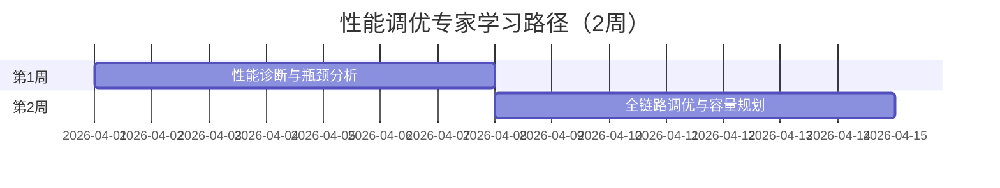

# 学习路径：性能调优专家（2周）

> **所属阶段**: 专家路径 | **难度等级**: L4-L5 | **预计时长**: 2周（每天3-4小时）

---

## 路径概览

### 适合人群

- 有 Flink 生产环境经验
- 面临性能瓶颈需要优化
- 需要支撑大规模流处理作业
- 准备进行容量规划和成本控制

### 学习目标

完成本路径后，您将能够：

- 系统诊断流处理性能问题
- 掌握全链路调优技巧
- 优化资源使用和成本
- 设计高性能流处理架构
- 进行容量规划和扩缩容

### 前置知识要求

- 深入理解 Flink 架构和机制
- 有丰富的生产问题排查经验
- 熟悉 JVM 调优和 Linux 性能分析
- 了解分布式系统性能原理

### 完成标准

- [ ] 能够系统诊断和解决性能问题
- [ ] 掌握网络、CPU、内存、磁盘全链路调优
- [ ] 能够进行容量规划和成本优化
- [ ] 设计高性能的流处理架构

---

## 学习阶段时间线



---

## 第1周：性能诊断与瓶颈分析

### 学习主题

- 性能指标体系和监控
- 背压诊断与分析
- Checkpoint 性能优化
- GC 和内存分析

### 推荐文档清单

| 序号 | 文档 | 类型 | 预计时长 | 重点内容 |
|------|------|------|----------|----------|
| 1.1 | `Flink/02-core/backpressure-and-flow-control.md` | 核心 | 3h | 背压机制深度 |
| 1.2 | `Flink/06-engineering/performance-tuning-guide.md` | 工程 | 4h | 性能调优指南 |
| 1.3 | `Flink/15-observability/flink-observability-complete-guide.md` | 可观测 | 3h | 监控指标 |
| 1.4 | `Knowledge/07-best-practices/07.02-performance-tuning-patterns.md` | 实践 | 3h | 调优模式 |
| 1.5 | `Knowledge/09-anti-patterns/anti-pattern-08-ignoring-backpressure.md` | 反模式 | 1h | 背压反模式 |

### 实践任务

1. **背压诊断实验**

   ```java
   // 模拟慢速 Sink 产生背压
   env.addSource(new FastSource())
      .map(new NormalMap())
      .addSink(new SlowSink());  // 故意降低处理速度
```

   - 使用 Web UI 观察背压传播
   - 分析背压对吞吐量的影响
   - 定位瓶颈算子

2. **Checkpoint 性能分析**
   - 配置不同 Checkpoint 参数
   - 分析同步/异步阶段耗时
   - 优化大状态 Checkpoint

3. **GC 调优实验**

   ```bash
   # 配置 G1 GC
   -XX:+UseG1GC
   -XX:MaxGCPauseMillis=100
   -XX:+PrintGCDetails
   -XX:+PrintGCDateStamps
```

   - 分析 GC 日志
   - 调整堆内存大小
   - 优化对象分配

### 检查点 1.1

- [ ] 熟练使用 Web UI 诊断背压
- [ ] 能够分析 Checkpoint 性能瓶颈
- [ ] 掌握 JVM 调优基本技巧
- [ ] 理解各项监控指标含义

---

## 第2周：全链路调优与容量规划

### 学习主题

- 网络优化（缓冲区、序列化）
- 并行度和资源分配
- 状态后端调优
- 成本优化策略
- 容量规划方法

### 推荐文档清单

| 序号 | 文档 | 类型 | 预计时长 | 重点内容 |
|------|------|------|----------|----------|
| 2.1 | `Flink/06-engineering/stream-processing-cost-optimization.md` | 成本 | 2h | 成本优化 |
| 2.2 | `Flink/06-engineering/flink-tco-cost-optimization-guide.md` | TCO | 2h | TCO 优化指南 |
| 2.3 | `Knowledge/07-best-practices/07.04-cost-optimization-patterns.md` | 实践 | 2h | 成本优化模式 |
| 2.4 | `Flink/11-benchmarking/performance-benchmark-suite.md` | 基准 | 2h | 性能基准测试 |
| 2.5 | `Flink/10-deployment/flink-kubernetes-autoscaler-deep-dive.md` | 自动扩缩 | 2h | 自动扩缩容 |

### 实践任务

1. **网络优化配置**

   ```java
   // 缓冲区配置
   env.getConfig().setBufferTimeout(0);  // 零缓冲延迟

   // 网络内存配置
   // taskmanager.memory.network.fraction: 0.15
   // taskmanager.memory.network.min: 128mb
   // taskmanager.memory.network.max: 512mb
```

2. **并行度调优**
   - 分析数据倾斜问题
   - 调整全局和算子并行度
   - 测试不同并行度下的性能

3. **自动扩缩容配置**

   ```yaml
   # Kubernetes Autoscaler 配置
   kubernetes.operator.job.autoscaler.enabled: true
   kubernetes.operator.job.autoscaler.scaleUp.delay: 5m
   kubernetes.operator.job.autoscaler.scaleDown.delay: 10m
   kubernetes.operator.job.autoscaler.target.utilization: 0.6
```

### 检查点 2.1

- [ ] 能够进行网络层优化
- [ ] 掌握并行度调优方法
- [ ] 理解自动扩缩容原理
- [ ] 能够进行容量规划

---

## 性能调优方法论

### 诊断流程

```
1. 收集指标
   └── 吞吐量、延迟、CPU、内存、GC、Checkpoint

2. 识别瓶颈
   └── 背压分析、热点识别、资源瓶颈

3. 根因分析
   └── 代码层面、配置层面、资源层面

4. 优化实施
   └── 调整参数、优化代码、扩容资源

5. 验证效果
   └── 对比优化前后指标、确认问题解决
```

### 关键指标基准

| 指标 | 健康值 | 警告值 | 危险值 |
|------|--------|--------|--------|
| Checkpoint Duration | < 60s | 60-120s | > 120s |
| Backpressure Ratio | < 10% | 10-50% | > 50% |
| GC Pause | < 100ms | 100-500ms | > 500ms |
| CPU Utilization | 40-70% | 70-85% | > 85% |
| Memory Usage | < 70% | 70-85% | > 85% |

### 调优检查清单

#### 网络层

- [ ] 调整缓冲区大小和超时
- [ ] 优化序列化方式
- [ ] 启用压缩传输
- [ ] 配置网络内存比例

#### 计算层

- [ ] 设置合理的并行度
- [ ] 解决数据倾斜问题
- [ ] 优化复杂计算逻辑
- [ ] 使用异步 IO

#### 状态层

- [ ] 选择合适的状态后端
- [ ] 配置增量 Checkpoint
- [ ] 优化状态访问模式
- [ ] 设置合理 TTL

#### JVM 层

- [ ] 选择合适的 GC 算法
- [ ] 调整堆内存大小
- [ ] 配置 Off-Heap 内存
- [ ] 优化对象分配

---

## 成本优化策略

### 1. 资源利用率优化

```java
// 合理设置资源
// 避免过度配置
// 使用 Spot/Preemptible 实例
```

### 2. 存储成本优化

```java
// 增量 Checkpoint
env.getCheckpointConfig().enableUnalignedCheckpoints();

// 配置 Checkpoint 保留策略
env.getCheckpointConfig().setExternalizedCheckpointCleanup(
    ExternalizedCheckpointCleanup.RETAIN_ON_CANCELLATION
);
```

### 3. 计算成本优化

```yaml
# 自动扩缩容
kubernetes.operator.job.autoscaler.enabled: true
kubernetes.operator.job.autoscaler.target.utilization: 0.7
```

---

## 实战项目：高吞吐量日志处理系统优化

### 项目背景

现有日志处理系统面临以下问题：

- 吞吐量仅 100K events/s，目标 500K+
- Checkpoint 经常超时（> 2分钟）
- 频繁 Full GC
- 成本过高

### 优化方案

1. **诊断分析**

   ```text
   - 背压分析：发现 Sink 算子瓶颈
   - GC 分析：发现内存不足，频繁 GC
   - Checkpoint 分析：状态过大，同步阶段耗时
```

2. **优化措施**

   ```java
   // 1. 优化 Sink - 使用批量写入
   ElasticsearchSink.Builder<LogEvent> builder =
       new ElasticsearchSink.Builder<>(
           httpHosts,
           new ElasticsearchSinkFunction<>() {
               private List<LogEvent> buffer = new ArrayList<>();

               @Override
               public void process(LogEvent event, RuntimeContext ctx) {
                   buffer.add(event);
                   if (buffer.size() >= 1000) {
                       bulkWrite(buffer);
                       buffer.clear();
                   }
               }
           }
       );
   builder.setBulkFlushMaxActions(1000);

   // 2. 优化 Checkpoint
   env.enableCheckpointing(30000);  // 缩短间隔
   env.getCheckpointConfig().setMaxConcurrentCheckpoints(1);
   env.getCheckpointConfig().setMinPauseBetweenCheckpoints(10000);
   env.setStateBackend(new EmbeddedRocksDBStateBackend());

   // 3. JVM 调优
   // -Xms4g -Xmx4g
   // -XX:+UseG1GC
   // -XX:MaxGCPauseMillis=100
```

3. **优化效果**
   - 吞吐量：100K → 600K events/s
   - Checkpoint：120s → 25s
   - GC 暂停：500ms → 50ms
   - 成本降低 40%

### 检查点

- [ ] 完成性能诊断报告
- [ ] 实施优化措施
- [ ] 验证优化效果
- [ ] 编写优化总结

---

## 进阶路径推荐

完成本路径后，建议继续：

- **架构师路径**: `LEARNING-PATHS/expert-architect-path.md`
- **贡献者路径**: `LEARNING-PATHS/expert-contributor-path.md`

---

## 版本历史

| 版本 | 日期 | 更新内容 |
|------|------|----------|
| v1.0 | 2026-04-04 | 初始版本，性能调优专家路径 |

