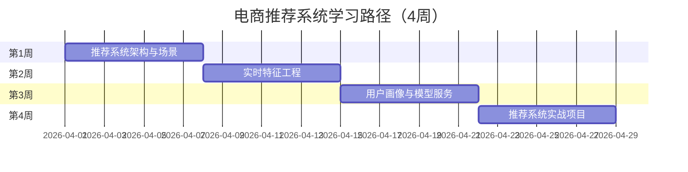

# 学习路径：电商推荐系统

> **所属阶段**: 行业专项 | **难度等级**: L3-L5 | **预计时长**: 4周（每天3-4小时）

---

## 路径概览

### 适合人群

- 电商行业算法工程师
- 推荐系统开发者
- 实时特征工程师
- 用户画像开发者

### 学习目标

完成本路径后，您将能够：

- 理解电商推荐系统的架构
- 实现实时特征工程
- 构建实时用户画像
- 部署在线推荐服务
- 优化推荐系统性能

### 前置知识要求

- 掌握 Flink 基础和 SQL
- 了解机器学习基础
- 熟悉推荐系统原理
- 有数据工程经验

### 完成标准

- [ ] 理解电商推荐系统架构
- [ ] 能够构建实时特征管道
- [ ] 掌握实时用户画像技术
- [ ] 能够部署在线推荐服务

---

## 学习阶段时间线



---

## 第1周：推荐系统架构与场景

### 学习主题

- 电商推荐系统概述
- 推荐算法类型
- 实时推荐架构
- 推荐系统评估指标

### 推荐文档清单

| 序号 | 文档 | 类型 | 预计时长 | 重点内容 |
|------|------|------|----------|----------|
| 1.1 | `Knowledge/03-business-patterns/alibaba-double11-flink.md` | 案例 | 3h | 双11实践 |
| 1.2 | `Flink/07-case-studies/case-ecommerce-realtime-recommendation.md` | 案例 | 3h | 推荐案例 |
| 1.3 | `Knowledge/03-business-patterns/real-time-recommendation.md` | 业务 | 2h | 实时推荐 |
| 1.4 | `Flink/12-ai-ml/realtime-feature-engineering-feature-store.md` | ML | 3h | 特征工程 |

### 推荐系统架构

```
┌─────────────────────────────────────────────────────────────┐
│                        数据采集层                            │
│    点击流    │    订单数据    │    商品数据    │    用户数据   │
└─────────────────────────────────────────────────────────────┘
                            ↓
┌─────────────────────────────────────────────────────────────┐
│                        实时特征层                            │
│  ┌──────────┐  ┌──────────┐  ┌──────────┐  ┌──────────┐    │
│  │ 行为特征  │  │ 上下文特征│  │ 统计特征  │  │ 序列特征  │    │
│  └──────────┘  └──────────┘  └──────────┘  └──────────┘    │
└─────────────────────────────────────────────────────────────┘
                            ↓
┌─────────────────────────────────────────────────────────────┐
│                        模型服务层                            │
│    召回模型    │    排序模型    │    重排策略    │            │
└─────────────────────────────────────────────────────────────┘
                            ↓
┌─────────────────────────────────────────────────────────────┐
│                        推荐结果层                            │
│                     个性化推荐列表                            │
└─────────────────────────────────────────────────────────────┘
```

### 实践任务

1. **场景分析**
   - 分析不同推荐场景（首页、详情页、购物车）
   - 确定实时性要求
   - 设计推荐策略

2. **架构设计**
   - 设计数据流架构
   - 选择存储方案
   - 确定计算框架

### 检查点 1.1

- [ ] 理解电商推荐系统的核心场景
- [ ] 掌握推荐系统的主要架构模式
- [ ] 了解推荐算法的分类

---

## 第2周：实时特征工程

### 学习主题

- 实时特征类型
- 特征计算方法
- 特征存储（Feature Store）
- 特征一致性保证

### 推荐文档清单

| 序号 | 文档 | 类型 | 预计时长 | 重点内容 |
|------|------|------|----------|----------|
| 2.1 | `Knowledge/02-design-patterns/pattern-realtime-feature-engineering.md` | 模式 | 3h | 特征工程模式 |
| 2.2 | `Flink/12-ai-ml/realtime-feature-engineering-feature-store.md` | ML | 3h | 特征存储 |
| 2.3 | `Knowledge/06-frontier/realtime-feature-store-architecture.md` | 架构 | 2h | 特征存储架构 |
| 2.4 | `Flink/03-sql-table-api/flink-vector-search-rag.md` | AI | 2h | 向量搜索 |

### 特征类型与计算

| 特征类型 | 示例 | 计算方法 | 实时性 |
|----------|------|----------|--------|
| 用户画像 | 性别、年龄 | 聚合计算 | 小时级 |
| 行为特征 | 最近点击商品 | 滑动窗口 | 秒级 |
| 统计特征 | 商品点击率 | 滚动窗口 | 分钟级 |
| 序列特征 | 浏览序列 | Session窗口 | 实时 |
| 上下文 | 位置、时间 | 直接获取 | 实时 |

### 实践任务

1. **特征计算实现**

   ```sql
   -- 用户实时行为特征
   CREATE TABLE user_behavior_features AS
   SELECT
     user_id,
     HOP_START(event_time, INTERVAL '5' MINUTE, INTERVAL '1' HOUR) as window_start,
     COUNT(*) as view_count,
     COUNT(DISTINCT item_id) as unique_items,
     COLLECT_LIST(item_id) as item_sequence
   FROM user_behavior
   GROUP BY
     user_id,
     HOP(event_time, INTERVAL '5' MINUTE, INTERVAL '1' HOUR);

   -- 商品实时统计特征
   CREATE TABLE item_realtime_features AS
   SELECT
     item_id,
     COUNT(*) as click_count_1h,
     SUM(CASE WHEN action = 'buy' THEN 1 ELSE 0 END) as buy_count_1h,
     click_count_1h * 1.0 / NULLIF(buy_count_1h, 0) as ctr_1h
   FROM user_behavior
   GROUP BY item_id;
```

2. **特征存储设计**
   - 设计 Feature Store Schema
   - 实现特征写入和读取
   - 保证在线/离线特征一致性

### 检查点 2.1

- [ ] 掌握各类特征的实时计算方法
- [ ] 能够设计 Feature Store
- [ ] 理解特征一致性保证机制

---

## 第3周：用户画像与模型服务

### 学习主题

- 实时用户画像构建
- 在线模型服务
- 向量检索
- A/B 测试框架

### 推荐文档清单

| 序号 | 文档 | 类型 | 预计时长 | 重点内容 |
|------|------|------|----------|----------|
| 3.1 | `Flink/12-ai-ml/flink-realtime-ml-inference.md` | ML | 2h | 实时推理 |
| 3.2 | `Flink/12-ai-ml/model-serving-streaming.md` | 服务 | 2h | 模型服务 |
| 3.3 | `Flink/12-ai-ml/vector-database-integration.md` | 向量 | 2h | 向量数据库 |
| 3.4 | `Flink/12-ai-ml/online-learning-production.md` | ML | 2h | 在线学习 |

### 实时用户画像

```
用户画像维度：
├── 基础属性（性别、年龄、地域）
├── 兴趣标签（品类偏好、价格敏感度）
├── 行为特征（活跃时段、购买力）
├── 实时意图（当前浏览、搜索关键词）
└── 社交关系（相似用户、影响力）
```

### 实践任务

1. **用户画像更新**

   ```java
   // 实时更新用户画像
   public class UserProfileUpdater extends KeyedProcessFunction<String,
       BehaviorEvent, UserProfile> {
     private ValueState<UserProfile> profileState;

     @Override
     public void processElement(BehaviorEvent event, Context ctx,
                               Collector<UserProfile> out) {
       UserProfile profile = profileState.value();
       if (profile == null) {
         profile = new UserProfile(event.getUserId());
       }

       // 更新画像
       profile.updateWithBehavior(event);

       // 实时兴趣计算
       profile.updateInterests(event, ctx.timestamp());

       profileState.update(profile);
       out.collect(profile);
     }
   }
```

2. **向量检索集成**
   - 集成 Milvus/Pinecone
   - 实现近似最近邻搜索
   - 优化检索性能

### 检查点 3.1

- [ ] 实现实时用户画像更新
- [ ] 掌握在线模型服务
- [ ] 能够集成向量检索

---

## 第4周：推荐系统实战项目

### 项目：实时个性化推荐系统

**项目描述**: 为电商平台构建实时推荐系统。

**功能模块**:

1. **实时特征管道**

   ```sql
   -- 用户行为特征
   CREATE TABLE user_realtime_features AS
   SELECT
     user_id,
     TUMBLE_START(event_time, INTERVAL '5' MINUTE) as window_start,
     COUNT(*) as event_count_5m,
     COLLECT_SET(category_id) as interested_categories
   FROM user_behavior
   GROUP BY user_id, TUMBLE(event_time, INTERVAL '5' MINUTE);

   -- 商品热度特征
   CREATE TABLE item_hot_features AS
   SELECT
     item_id,
     COUNT(*) as click_count_10m,
     ROW_NUMBER() OVER (ORDER BY click_count_10m DESC) as hot_rank
   FROM user_behavior
   WHERE event_type = 'click'
   GROUP BY item_id;
```

2. **召回服务**
   - 基于协同过滤的召回
   - 基于内容的召回
   - 热门商品召回
   - 向量相似度召回

3. **排序服务**

   ```python
   # Flink ML 集成
   class RankingModel:
     def predict(self, user_features, item_features):
       # 特征拼接
       features = concat(user_features, item_features)
       # 模型推理
       score = model.predict(features)
       return score
```

4. **推荐 API**

   ```java
   @RestController
   public class RecommendationController {
     @GetMapping("/recommend")
     public List<Item> recommend(@RequestParam String userId) {
       // 1. 获取用户画像
       UserProfile profile = featureService.getProfile(userId);

       // 2. 多路召回
       List<Item> candidates = recallService.recall(profile);

       // 3. 精排
       List<Item> ranked = rankingService.rank(candidates, profile);

       // 4. 重排
       return rerankService.rerank(ranked);
     }
   }
```

**评估指标**:

- CTR（点击率）：> 5%
- CVR（转化率）：> 2%
- 覆盖率：> 80%
- 新鲜度：实时更新

### 检查点 4.1

- [ ] 完成实时特征管道
- [ ] 实现召回和排序服务
- [ ] 达到业务指标要求

---

## 推荐系统优化技巧

### 特征优化

- 使用 Feature Store 统一管理
- 在线/离线特征一致性校验
- 特征重要性分析

### 模型优化

- 模型量化压缩
- 推理加速（TensorRT/ONNX）
- 缓存热点预测结果

### 系统优化

- 多级缓存（Redis + Local Cache）
- 异步特征获取
- 批量推理

---

## 进阶学习

完成本路径后，建议继续：

- **SQL 专家**: 优化特征计算 SQL
- **AI/ML 集成**: 深入学习 Flink ML
- **性能调优专家**: 优化推荐服务性能

---

## 版本历史

| 版本 | 日期 | 更新内容 |
|------|------|----------|
| v1.0 | 2026-04-04 | 初始版本，电商推荐系统路径 |
