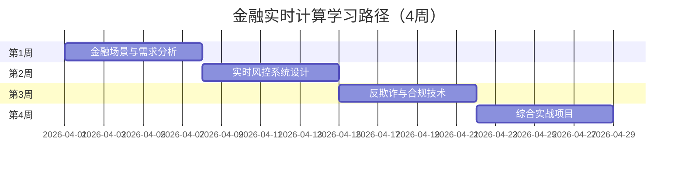

# 学习路径：金融实时计算

> **所属阶段**: 行业专项 | **难度等级**: L3-L5 | **预计时长**: 4周（每天3-4小时）

---

## 路径概览

### 适合人群

- 金融行业数据工程师
- 风控系统开发者
- 实时交易分析工程师
- 金融监管科技从业者

### 学习目标

完成本路径后，您将能够：

- 理解金融实时计算的特殊需求
- 设计金融级风控系统架构
- 实现实时反欺诈检测
- 满足金融监管合规要求
- 处理高频交易数据

### 前置知识要求

- 掌握 Flink 基础和进阶知识
- 了解金融业务基础知识
- 熟悉数据安全和合规要求
- 有实时计算项目经验

### 完成标准

- [ ] 理解金融实时计算的核心挑战
- [ ] 能够设计金融风控系统
- [ ] 掌握反欺诈检测技术
- [ ] 了解金融监管合规要求

---

## 学习阶段时间线



---

## 第1周：金融场景与需求分析

### 学习主题

- 金融实时计算场景概览
- 数据安全与隐私保护
- 高可用与一致性要求
- 监管合规框架

### 推荐文档清单

| 序号 | 文档 | 类型 | 预计时长 | 重点内容 |
|------|------|------|----------|----------|
| 1.1 | `Knowledge/03-business-patterns/fintech-realtime-risk-control.md` | 业务 | 3h | 金融风控 |
| 1.2 | `Flink/07-case-studies/case-financial-realtime-risk-control.md` | 案例 | 2h | 风控案例 |
| 1.3 | `Flink/07-case-studies/case-fraud-detection-advanced.md` | 案例 | 2h | 反欺诈案例 |
| 1.4 | `Flink/13-security/flink-security-complete-guide.md` | 安全 | 2h | 安全指南 |
| 1.5 | `Knowledge/08-standards/streaming-security-compliance.md` | 合规 | 2h | 安全合规 |

### 金融场景概览

| 场景 | 延迟要求 | 一致性要求 | 主要挑战 |
|------|----------|------------|----------|
| 实时风控 | < 100ms | Exactly-Once | 复杂规则引擎 |
| 反欺诈检测 | < 500ms | Exactly-Once | 模式识别 |
| 交易监控 | < 1s | At-Least-Once | 海量数据 |
| 监管报送 | 分钟级 | Exactly-Once | 数据准确性 |
| 实时定价 | < 50ms | Exactly-Once | 低延迟计算 |

### 实践任务

1. **需求分析**
   - 分析某金融业务场景
   - 梳理功能需求
   - 确定非功能需求（性能、安全、合规）

2. **安全评估**
   - 识别敏感数据
   - 设计数据加密方案
   - 制定访问控制策略

### 检查点 1.1

- [ ] 理解金融实时计算的主要场景
- [ ] 掌握金融数据安全要求
- [ ] 了解金融监管合规框架

---

## 第2周：实时风控系统设计

### 学习主题

- 风控系统架构设计
- 规则引擎实现
- 实时决策流程
- 风险评分模型

### 推荐文档清单

| 序号 | 文档 | 类型 | 预计时长 | 重点内容 |
|------|------|------|----------|----------|
| 2.1 | `Knowledge/02-design-patterns/pattern-cep-complex-event.md` | 模式 | 2h | CEP 模式 |
| 2.2 | `Flink/14-graph/flink-gelly-streaming-graph-processing.md` | 图计算 | 2h | 图风控 |
| 2.3 | `Flink/12-ai-ml/flink-ml-architecture.md` | ML | 2h | 实时 ML |
| 2.4 | `Knowledge/06-frontier/realtime-graph-streaming-tgnn.md` | 前沿 | 2h | 图神经网络 |

### 风控系统架构

```
┌─────────────────────────────────────────────────────────────┐
│                        数据采集层                            │
│    交易数据    │    行为数据    │    外部数据    │    名单库   │
└─────────────────────────────────────────────────────────────┘
                            ↓
┌─────────────────────────────────────────────────────────────┐
│                        实时计算层                            │
│  ┌──────────┐  ┌──────────┐  ┌──────────┐  ┌──────────┐    │
│  │ 特征计算  │  │ 规则引擎  │  │ 模型推理  │  │ 风险评分  │    │
│  └──────────┘  └──────────┘  └──────────┘  └──────────┘    │
└─────────────────────────────────────────────────────────────┘
                            ↓
┌─────────────────────────────────────────────────────────────┐
│                        决策执行层                            │
│    实时拦截    │    异步审核    │    强化监控    │    放行    │
└─────────────────────────────────────────────────────────────┘
```

### 实践任务

1. **规则引擎实现**

   ```java
   // 使用 Broadcast State 实现动态规则
   public class DynamicRuleEngine extends BroadcastProcessFunction<
       Transaction, Rule, Alert> {

     @Override
     public void processElement(Transaction tx, ReadOnlyContext ctx,
                                Collector<Alert> out) {
       ReadOnlyBroadcastState<String, Rule> rules = ctx.getBroadcastState(RULES);

       for (Map.Entry<String, Rule> entry : rules.immutableEntries()) {
         if (entry.getValue().matches(tx)) {
           out.collect(new Alert(tx, entry.getValue()));
         }
       }
     }

     @Override
     public void processBroadcastElement(Rule rule, Context ctx,
                                        Collector<Alert> out) {
       BroadcastState<String, Rule> rules = ctx.getBroadcastState(RULES);
       rules.put(rule.getId(), rule);
     }
   }

```

2. **特征计算**
   - 实现滑动窗口统计特征
   - 设计用户画像特征
   - 计算关联网络特征

### 检查点 2.1

- [ ] 设计完整的风控系统架构
- [ ] 实现动态规则引擎
- [ ] 掌握实时特征计算方法

---

## 第3周：反欺诈与合规技术

### 学习主题

- 复杂事件处理（CEP）
- 图计算与关系分析
- 实时机器学习
- 监管合规技术

### 推荐文档清单

| 序号 | 文档 | 类型 | 预计时长 | 重点内容 |
|------|------|------|----------|----------|
| 3.1 | `Flink/12-ai-ml/flink-realtime-ml-inference.md` | ML | 2h | 实时推理 |
| 3.2 | `Flink/13-security/trusted-execution-flink.md` | 安全 | 2h | 可信执行 |
| 3.3 | `Knowledge/03-business-patterns/stripe-payment-processing.md` | 业务 | 2h | 支付处理 |
| 3.4 | `Struct/02-properties/02.07-encrypted-stream-processing.md` | 理论 | 2h | 加密流处理 |

### 反欺诈技术栈

| 技术 | 应用场景 | 实现方式 |
|------|----------|----------|
| CEP | 序列模式检测 | Flink CEP |
| 图计算 | 关系网络分析 | Flink Gelly |
| ML 推理 | 异常检测 | Flink ML |
| 规则引擎 | 专家规则 | Broadcast State |

### 实践任务

1. **CEP 反欺诈模式**

   ```java

// [伪代码片段 - 不可直接运行] 仅展示核心逻辑
import org.apache.flink.streaming.api.windowing.time.Time;

   // 盗刷检测：短时间内多地点交易
   Pattern<Transaction, ?> fraudPattern = Pattern.<Transaction>begin("start")
     .where(tx -> tx.getAmount() > 1000)
     .next("middle")
     .where(tx -> tx.getLocation() != start.getLocation())
     .within(Time.minutes(10));
```

1. **合规数据处理**
   - 数据脱敏和加密
   - 审计日志记录
   - 数据血缘追踪

### 检查点 3.1

- [ ] 掌握 CEP 反欺诈模式
- [ ] 了解图计算在风控中的应用
- [ ] 理解监管合规技术要求

---

## 第4周：综合实战项目

### 项目：实时支付风控系统

**项目描述**: 为支付平台构建实时风控系统。

**功能需求**:

1. **实时交易评估**
   - 毫秒级响应
   - 多维度特征计算
   - 综合风险评分

2. **反欺诈检测**
   - 盗刷检测（CEP）
   - 关联分析（图计算）
   - 异常检测（ML）

3. **风险决策**
   - 实时拦截高风险交易
   - 异步审核中风险交易
   - 放行低风险交易

4. **合规要求**
   - 数据加密存储
   - 完整审计日志
   - 监管报表生成

**技术架构**:

```
Kafka (交易数据)
  → Flink (特征计算 + 规则引擎 + 模型推理)
  → Redis (决策缓存)
  → API Gateway (决策服务)
  → MySQL (审计日志)
```

**评估标准**:

- 延迟：< 100ms (P99)
- 吞吐量：> 10K TPS
- 准确率：误杀率 < 0.1%，漏杀率 < 0.01%

### 检查点 4.1

- [ ] 完成实时风控系统开发
- [ ] 满足性能和准确率要求
- [ ] 通过安全合规审查

---

## 金融行业最佳实践

### 数据安全

- 敏感数据加密（AES-256）
- 传输层 TLS 加密
- 访问控制和审计
- 数据脱敏和掩码

### 高可用设计

- 多活部署
- 自动故障转移
- 数据备份和恢复
- 灾难恢复计划

### 监管合规

- 完整审计日志
- 数据保留策略
- 合规报表生成
- 定期合规审查

---

## 进阶学习

完成本路径后，建议继续：

- **DataStream 专家**: 深入学习复杂逻辑实现
- **性能调优专家**: 优化低延迟场景
- **架构师路径**: 设计金融级平台

---

## 版本历史

| 版本 | 日期 | 更新内容 |
|------|------|----------|
| v1.0 | 2026-04-04 | 初始版本，金融实时计算路径 |
