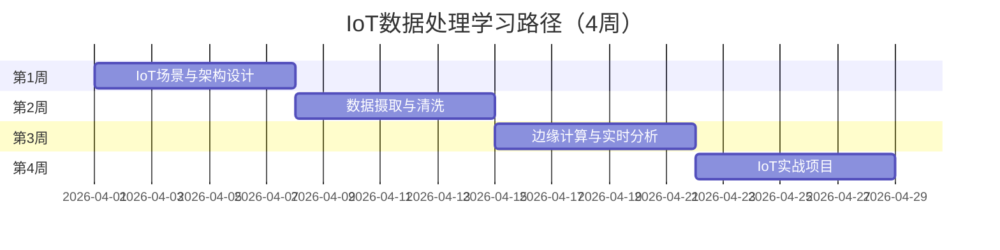

# 学习路径：IoT数据处理

> **所属阶段**: 行业专项 | **难度等级**: L3-L5 | **预计时长**: 4周（每天3-4小时）

---

## 路径概览

### 适合人群

- IoT 平台开发者
- 边缘计算工程师
- 时序数据处理工程师
- 智能制造数据工程师

### 学习目标

完成本路径后，您将能够：

- 理解 IoT 数据处理的特点和挑战
- 设计 IoT 数据摄取和处理架构
- 实现边缘-云协同计算
- 构建实时设备监控和告警系统
- 处理海量时序数据

### 前置知识要求

- 掌握 Flink 基础开发
- 了解 IoT 协议（MQTT、CoAP）
- 熟悉时序数据库
- 了解边缘计算概念

### 完成标准

- [ ] 理解 IoT 数据处理架构
- [ ] 能够处理海量设备数据
- [ ] 掌握边缘计算集成
- [ ] 能够构建实时监控系统

---

## 学习阶段时间线



---

## 第1周：IoT场景与架构设计

### 学习主题

- IoT 数据处理场景
- 边缘-云架构设计
- 协议适配与数据格式
- 设备管理和安全

### 推荐文档清单

| 序号 | 文档 | 类型 | 预计时长 | 重点内容 |
|------|------|------|----------|----------|
| 1.1 | `Knowledge/03-business-patterns/iot-stream-processing.md` | 业务 | 2h | IoT 流处理 |
| 1.2 | `Flink/07-case-studies/case-iot-stream-processing.md` | 案例 | 2h | IoT 案例 |
| 1.3 | `Flink/07-case-studies/case-smart-city-iot.md` | 案例 | 2h | 智慧城市 |
| 1.4 | `Knowledge/06-frontier/edge-streaming-architecture.md` | 架构 | 3h | 边缘架构 |
| 1.5 | `Knowledge/06-frontier/cloud-edge-continuum.md` | 前沿 | 2h | 云边协同 |

### IoT 数据处理挑战

| 挑战 | 描述 | 解决方案 |
|------|------|----------|
| 海量设备 | 百万级设备同时在线 | 分区处理、弹性扩缩 |
| 乱序数据 | 网络延迟导致乱序 | Watermark + 窗口 |
| 数据质量 | 设备故障产生脏数据 | 数据清洗和过滤 |
| 实时性 | 告警需要秒级响应 | 边缘计算 + 流处理 |
| 存储成本 | 海量时序数据存储 | 分层存储、压缩 |

### 架构模式

```
┌─────────────────────────────────────────────────────────────┐
│                        设备层                                │
│    传感器    │    网关    │    边缘设备    │    终端         │
└─────────────────────────────────────────────────────────────┘
                            ↓
┌─────────────────────────────────────────────────────────────┐
│                        边缘层                                │
│    数据聚合    │    本地计算    │    实时告警    │            │
└─────────────────────────────────────────────────────────────┘
                            ↓
┌─────────────────────────────────────────────────────────────┐
│                        云层                                  │
│    流处理    │    数据湖    │    分析平台    │    应用       │
└─────────────────────────────────────────────────────────────┘
```

### 实践任务

1. **架构设计**
   - 设计某场景的 IoT 架构
   - 确定边缘计算边界
   - 选择通信协议

2. **协议调研**
   - MQTT 协议特性
   - CoAP 协议对比
   - 自定义协议设计

### 检查点 1.1

- [ ] 理解 IoT 数据处理的核心挑战
- [ ] 掌握边缘-云架构设计
- [ ] 了解主要 IoT 协议

---

## 第2周：数据摄取与清洗

### 学习主题

- IoT 数据摄取架构
- 数据解析和标准化
- 数据质量处理
- 设备元数据管理

### 推荐文档清单

| 序号 | 文档 | 类型 | 预计时长 | 重点内容 |
|------|------|------|----------|----------|
| 2.1 | `Flink/04-connectors/flink-connectors-ecosystem-complete-guide.md` | 连接器 | 3h | 连接器生态 |
| 2.2 | `Knowledge/07-best-practices/07.03-troubleshooting-guide.md` | 实践 | 2h | 问题排查 |
| 2.3 | `Knowledge/09-anti-patterns/anti-pattern-05-blocking-io-processfunction.md` | 反模式 | 1h | 阻塞 IO 反模式 |

### 数据摄取流程

```java
// MQTT 数据源
MQTTSource.builder()
  .setBrokerUrl("tcp://mqtt.broker:1883")
  .setTopics("sensors/+/data")
  .setDeserializer(new SensorDataDeserializer())
  .build();

// 数据解析和清洗
stream
  .map(this::parsePayload)
  .filter(this::validateData)
  .map(this::enrichMetadata)
  .assignTimestampsAndWatermarks(
    WatermarkStrategy.<SensorData>forBoundedOutOfOrderness(
      Duration.ofSeconds(30)
    )
  );
```

### 实践任务

1. **数据解析实现**

   ```java
   public class SensorDataParser implements MapFunction<MQTTMessage, SensorData> {
     @Override
     public SensorData map(MQTTMessage message) throws Exception {
       try {
         JsonNode json = objectMapper.readTree(message.getPayload());

         SensorData data = new SensorData();
         data.setDeviceId(json.get("device_id").asText());
         data.setTimestamp(json.get("ts").asLong());
         data.setTemperature(json.get("temp").asDouble());
         data.setHumidity(json.get("humidity").asDouble());

         // 数据验证
         if (!isValid(data)) {
           return null; // 过滤脏数据
         }

         return data;
       } catch (Exception e) {
         // 记录解析错误
         return null;
       }
     }
   }
   ```

2. **数据质量处理**
   - 异常值检测
   - 缺失值处理
   - 数据平滑

### 检查点 2.1

- [ ] 实现 IoT 数据摄取
- [ ] 掌握数据清洗方法
- [ ] 能够处理数据质量问题

---

## 第3周：边缘计算与实时分析

### 学习主题

- 边缘计算架构
- 实时告警和监控
- 时序数据分析
- 设备状态管理

### 推荐文档清单

| 序号 | 文档 | 类型 | 预计时长 | 重点内容 |
|------|------|------|----------|----------|
| 3.1 | `Knowledge/06-frontier/edge-streaming-patterns.md` | 模式 | 2h | 边缘模式 |
| 3.2 | `Knowledge/06-frontier/edge-llm-realtime-inference.md` | AI | 2h | 边缘 AI |
| 3.3 | `Flink/07-case-studies/case-smart-manufacturing-iot.md` | 案例 | 2h | 智能制造 |
| 3.4 | `Flink/02-core-mechanisms/time-semantics-and-watermark.md` | 核心 | 2h | 乱序处理 |

### 边缘计算模式

| 模式 | 描述 | 适用场景 |
|------|------|----------|
| 边缘过滤 | 边缘端过滤无用数据 | 节省带宽 |
| 边缘聚合 | 边缘端预聚合 | 减少传输量 |
| 边缘告警 | 边缘端实时告警 | 低延迟响应 |
| 边缘缓存 | 边缘端缓存 | 离线支持 |

### 实践任务

1. **实时告警系统**

   ```java
   public class AlertDetector extends KeyedProcessFunction<String,
       SensorData, Alert> {
     private ValueState<AlertState> alertState;

     @Override
     public void processElement(SensorData data, Context ctx,
                               Collector<Alert> out) {
       AlertState state = alertState.value();

       // 温度告警检测
       if (data.getTemperature() > 80.0) {
         if (state == null || !state.isTemperatureAlert()) {
           out.collect(new Alert(data.getDeviceId(), "HIGH_TEMP",
               data.getTemperature()));
           state = new AlertState(true);
           alertState.update(state);
         }
       }

       // 恢复检测
       if (data.getTemperature() < 75.0 && state != null) {
         state.setTemperatureAlert(false);
         alertState.update(state);
       }
     }
   }
   ```

2. **时序数据分析**

   ```sql
   -- 设备状态统计
   CREATE TABLE device_stats AS
   SELECT
     device_id,
     TUMBLE_START(event_time, INTERVAL '1' MINUTE) as window_start,
     AVG(temperature) as avg_temp,
     MAX(temperature) as max_temp,
     COUNT(*) as sample_count,
     STDDEV(temperature) as temp_stddev
   FROM sensor_data
   GROUP BY device_id, TUMBLE(event_time, INTERVAL '1' MINUTE);

   -- 异常检测（3-sigma 原则）
   SELECT device_id, window_start, avg_temp
   FROM device_stats
   WHERE ABS(avg_temp - 25.0) > 3 * 2.0;  -- 均值25，标准差2
   ```

### 检查点 3.1

- [ ] 实现边缘计算逻辑
- [ ] 构建实时告警系统
- [ ] 掌握时序分析方法

---

## 第4周：IoT实战项目

### 项目：智能制造设备监控系统

**项目描述**: 为智能工厂构建设备监控和预测性维护系统。

**功能需求**:

1. **数据采集**
   - 支持多种工业协议（Modbus、OPC UA）
   - 百万级设备并发接入
   - 数据缓存和断点续传

2. **实时处理**

   ```java
   // 设备状态机
   public class EquipmentStateMachine extends KeyedProcessFunction<String,
       EquipmentData, EquipmentStatus> {
     private ValueState<EquipmentState> state;

     @Override
     public void processElement(EquipmentData data, Context ctx,
                               Collector<EquipmentStatus> out) {
       EquipmentState current = state.value();

       // 状态转移
       EquipmentStatus newStatus = evaluateStatus(data, current);

       // 告警检测
       if (newStatus.isWarning()) {
         out.collect(newStatus);
       }

       // 预测性维护
       if (shouldPredictMaintenance(data)) {
         ctx.output(maintenanceTag,
           new MaintenancePrediction(data.getEquipmentId()));
       }

       state.update(new EquipmentState(newStatus));
     }
   }
   ```

3. **预测性维护**
   - 设备健康度评分
   - 故障预测模型
   - 维护计划生成

4. **可视化大屏**
   - 实时设备地图
   - 告警看板
   - 趋势分析

**技术架构**:

```
设备 → 边缘网关 → Kafka → Flink →
                                    ├── 实时告警 → 钉钉/短信
                                    ├── 时序存储 → TDengine
                                    └── 分析平台 → ClickHouse
```

**评估指标**:

- 数据延迟：< 1s
- 告警延迟：< 3s
- 数据准确率：> 99.9%
- 系统可用性：99.99%

### 检查点 4.1

- [ ] 完成设备监控系统开发
- [ ] 实现预测性维护功能
- [ ] 满足性能和可靠性要求

---

## IoT 最佳实践

### 数据质量

- 数据校验规则配置
- 异常数据隔离
- 数据修复机制

### 性能优化

- 批量数据摄取
- 异步处理
- 多级缓存

### 可靠性保障

- 断点续传
- 数据重放
- 多副本存储

### 安全性

- 设备认证
- 传输加密
- 访问控制

---

## 进阶学习

完成本路径后，建议继续：

- **状态管理专家**: 处理复杂设备状态
- **性能调优专家**: 优化海量数据处理
- **架构师路径**: 设计企业级 IoT 平台

---

## 版本历史

| 版本 | 日期 | 更新内容 |
|------|------|----------|
| v1.0 | 2026-04-04 | 初始版本，IoT数据处理路径 |
