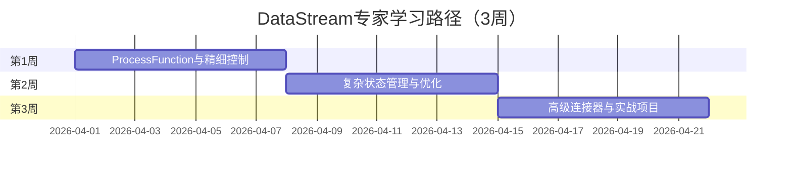

# 学习路径：DataStream专家（3周）

> **所属阶段**: 进阶路径 | **难度等级**: L3-L4 | **预计时长**: 3周（每天3-4小时）

---

## 路径概览

### 适合人群

- 已完成入门学习，熟悉 Flink 基础
- 希望深入掌握 DataStream API
- 需要开发复杂流处理应用的工程师
- 准备承担核心开发任务的开发者

### 学习目标

完成本路径后，您将能够：

- 精通 DataStream API 所有核心操作
- 熟练使用 ProcessFunction 进行精细控制
- 掌握复杂状态管理和优化技巧
- 实现自定义 Source 和 Sink
- 处理复杂的乱序和延迟数据场景

### 前置知识要求

- 完成 `beginner-zero-foundation.md` 或 `beginner-with-foundation.md`
- 熟练使用 Java/Scala 进行开发
- 理解 Checkpoint 和状态管理基础
- 有实际的流处理项目经验

### 完成标准

- [ ] 能够独立完成复杂流处理作业开发
- [ ] 熟练使用 ProcessFunction 和 Timers
- [ ] 掌握多种状态优化技巧
- [ ] 能够设计和实现自定义连接器

---

## 学习阶段时间线



---

## 第1周：ProcessFunction与精细控制

### 学习主题

- ProcessFunction 家族详解（ProcessFunction、KeyedProcessFunction）
- Timer 机制和定时器使用
- Side Output 侧输出流
- AsyncFunction 异步IO

### 推荐文档清单

| 序号 | 文档 | 类型 | 预计时长 | 重点内容 |
|------|------|------|----------|----------|
| 1.1 | `Flink/09-language-foundations/flink-datastream-api-complete-guide.md` | API | 4h | ProcessFunction 章节 |
| 1.2 | `Flink/02-core/async-execution-model.md` | 核心 | 3h | 异步执行模型 |
| 1.3 | `Knowledge/02-design-patterns/pattern-async-io-enrichment.md` | 模式 | 2h | 异步IO模式 |
| 1.4 | `Knowledge/02-design-patterns/pattern-side-output.md` | 模式 | 2h | 侧输出流模式 |
| 1.5 | `Flink/02-core/time-semantics-and-watermark.md` | 核心 | 2h | Timer 机制 |

### 实践任务

1. **基于 Timer 的超时检测**

   ```java
   // 实现订单超时检测
   // - 注册 30 分钟 Timer
   // - 收到支付消息后取消 Timer
   // - Timer 触发时输出超时订单

```

2. **复杂事件处理（CEP）基础**
   - 使用 Pattern API 检测登录异常
   - 实现连续失败登录检测
   - 输出可疑账号警报

3. **异步数据丰富**
   - 使用 AsyncFunction 查询外部服务
   - 配置异步超时和重试
   - 处理异步异常

### 检查点 1.1

- [ ] 熟练使用 ProcessFunction 处理复杂逻辑
- [ ] 能够使用 Timer 实现定时任务
- [ ] 掌握 Side Output 进行数据分流
- [ ] 熟练使用 AsyncFunction 进行异步操作

---

## 第2周：复杂状态管理与优化

### 学习主题

- State 类型深入（Broadcast State、Union State）
- State TTL 高级配置
- 状态查询（Queryable State）
- 状态优化技巧

### 推荐文档清单

| 序号 | 文档 | 类型 | 预计时长 | 重点内容 |
|------|------|------|----------|----------|
| 2.1 | `Flink/02-core/flink-state-management-complete-guide.md` | 核心 | 4h | 高级状态管理 |
| 2.2 | `Flink/02-core/flink-state-ttl-best-practices.md` | 实践 | 2h | TTL 最佳实践 |
| 2.3 | `Flink/06-engineering/state-backend-selection.md` | 工程 | 2h | 状态后端选择 |
| 2.4 | `Knowledge/07-best-practices/07.02-performance-tuning-patterns.md` | 实践 | 2h | 性能调优模式 |
| 2.5 | `Knowledge/09-anti-patterns/anti-pattern-07-window-state-explosion.md` | 反模式 | 1h | 状态爆炸问题 |

### 实践任务

1. **Broadcast State 模式**

   ```java
   // 实现动态规则更新
   // - 广播流接收规则更新
   // - 数据流应用最新规则
   // - 实现规则热更新
```

1. **状态优化实验**
   - 对比不同状态后端的性能
   - 实现状态增量清理
   - 优化大状态访问模式

2. **Queryable State 实践**
   - 配置 Queryable State
   - 实现状态查询服务
   - 监控查询性能

### 检查点 2.1

- [ ] 熟练使用 Broadcast State 实现动态配置
- [ ] 能够根据场景选择合适的状态后端
- [ ] 掌握状态优化和清理技巧
- [ ] 理解 Queryable State 的使用场景和限制

---

## 第3周：高级连接器与实战项目

### 学习主题

- 自定义 Source 实现
- 自定义 Sink 实现
- 两阶段提交 Sink
- 端到端一致性保证

### 推荐文档清单

| 序号 | 文档 | 类型 | 预计时长 | 重点内容 |
|------|------|------|----------|----------|
| 3.1 | `Flink/04-connectors/flink-connectors-ecosystem-complete-guide.md` | 连接器 | 3h | 连接器完整指南 |
| 3.2 | `Flink/02-core/exactly-once-end-to-end.md` | 核心 | 3h | 端到端一致性 |
| 3.3 | `Flink/04-connectors/flink-cdc-3.0-data-integration.md` | CDC | 2h | CDC 集成 |
| 3.4 | `Knowledge/07-best-practices/07.04-cost-optimization-patterns.md` | 实践 | 2h | 成本优化 |

### 实战项目：实时风控系统

**项目描述**: 构建金融交易实时风控系统。

**功能需求**:

1. **实时规则引擎**
   - 使用 Broadcast State 动态更新风控规则
   - 支持多种规则类型（金额限制、频率限制、地理位置等）

2. **复杂事件检测**
   - 使用 CEP 检测可疑交易模式
   - 识别盗刷、洗钱等行为

3. **风险评分**
   - 基于历史行为计算风险分数
   - 使用 Keyed State 维护用户画像

4. **实时决策**
   - 高风险交易实时拦截
   - 中风险交易异步审核
   - 低风险交易快速通过

**技术要求**:

- 自定义 Kafka Source（支持指定 Offset 消费）
- 使用 ProcessFunction 实现复杂逻辑
- 使用 AsyncFunction 调用外部风控服务
- 实现自定义 Sink 输出到多个下游系统
- 保证 Exactly-Once 语义

**项目评估**:

- 代码设计和可维护性
- 状态管理合理性
- 性能优化程度
- 容错能力
- 文档完整性

### 检查点 3.1

- [ ] 实现自定义 Source 和 Sink
- [ ] 保证端到端 Exactly-Once 语义
- [ ] 完成实时风控系统项目
- [ ] 能够进行性能调优和问题排查

---

## 高级技巧与模式

### 性能优化技巧

```java

// [伪代码片段 - 不可直接运行] 仅展示核心逻辑
import org.apache.flink.api.common.state.ValueState;
import org.apache.flink.streaming.api.windowing.time.Time;

// 1. 批量处理减少状态访问
public void processElement(List<Element> elements, Context ctx) {
    // 批量读取状态，减少访问次数
    Map<Key, State> batchState = batchGetState(elements);
    // 批量处理
    for (Element e : elements) {
        processWithState(e, batchState.get(e.getKey()));
    }
    // 批量更新状态
    batchUpdateState(batchState);
}

// 2. 使用 MapState 替代 ValueState<List>
// 避免大 ValueState 导致的序列化开销
MapState<Key, Value> mapState;  // 推荐
ValueState<Map<Key, Value>> valueState;  // 避免

// 3. 合理设置 State TTL
StateTtlConfig ttlConfig = StateTtlConfig
    .newBuilder(Time.hours(24))
    .setUpdateType(StateTtlConfig.UpdateType.OnCreateAndWrite)
    .setStateVisibility(StateTtlConfig.StateVisibility.NeverReturnExpired)
    .build();
```

### 常见问题与解决方案

| 问题 | 原因 | 解决方案 |
|------|------|----------|
| 状态过大导致 OOM | 状态增长无限制 | 配置 TTL，定期清理 |
| Checkpoint 超时 | 状态过大或网络慢 | 增量 Checkpoint，调整超时 |
| 状态访问慢 | 状态后端选择不当 | 根据场景选择 RocksDB/Heap |
| 反压严重 | 处理能力不足 | 优化逻辑，增加并行度 |

---

## 进阶路径推荐

完成本路径后，建议继续：

- **状态管理专家**: `LEARNING-PATHS/intermediate-state-management-expert.md`
- **性能调优专家**: `LEARNING-PATHS/expert-performance-tuning.md`
- **架构师路径**: `LEARNING-PATHS/expert-architect-path.md`

---

## 版本历史

| 版本 | 日期 | 更新内容 |
|------|------|----------|
| v1.0 | 2026-04-04 | 初始版本，DataStream 专家路径 |
