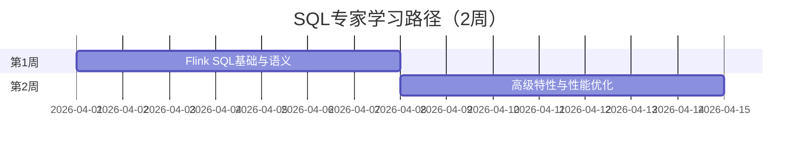

# 学习路径：SQL专家（2周）

> **所属阶段**: 进阶路径 | **难度等级**: L3-L4 | **预计时长**: 2周（每天3-4小时）

---

## 路径概览

### 适合人群

- 熟悉 SQL，希望使用 SQL 进行流处理开发
- 数据分析师、BI 工程师
- 希望快速构建流处理应用的开发者
- 需要从批处理 SQL 迁移到流处理 SQL

### 学习目标

完成本路径后，您将能够：

- 精通 Flink SQL 语法和语义
- 理解流处理 SQL 与批处理 SQL 的差异
- 熟练使用窗口函数和聚合
- 掌握物化表和持续查询
- 优化 SQL 查询性能

### 前置知识要求

- 熟练掌握标准 SQL
- 了解 Flink 基础概念
- 理解时间语义和窗口
- 有数据分析或 ETL 经验

### 完成标准

- [ ] 能够编写复杂的流处理 SQL
- [ ] 理解流 SQL 的语义差异
- [ ] 掌握 SQL 优化技巧
- [ ] 能够设计基于 SQL 的流处理应用

---

## 学习阶段时间线



---

## 第1周：Flink SQL基础与语义

### 学习主题

- Flink SQL 基础语法
- 流处理 SQL 语义（更新模式、Changelog）
- 时间属性和窗口函数
- 表连接器配置

### 推荐文档清单

| 序号 | 文档 | 类型 | 预计时长 | 重点内容 |
|------|------|------|----------|----------|
| 1.1 | `Flink/03-sql-table-api/flink-table-sql-complete-guide.md` | SQL | 4h | SQL 完整指南 |
| 1.2 | `Flink/03-sql-table-api/sql-vs-datastream-comparison.md` | 对比 | 2h | SQL vs DataStream |
| 1.3 | `Flink/03-sql-table-api/flink-sql-window-functions-deep-dive.md` | SQL | 3h | 窗口函数详解 |
| 1.4 | `Flink/03-sql-table-api/flink-sql-calcite-optimizer-deep-dive.md` | 优化 | 2h | 查询优化器 |
| 1.5 | `Struct/08-standards/streaming-sql-standard.md` | 标准 | 2h | 流 SQL 标准 |

### 实践任务

1. **基础 SQL 练习**

   ```sql
   -- 创建表
   CREATE TABLE user_events (
     user_id STRING,
     event_type STRING,
     event_time TIMESTAMP(3),
     WATERMARK FOR event_time AS event_time - INTERVAL '5' SECOND
   ) WITH (
     'connector' = 'kafka',
     'topic' = 'user_events',
     'properties.bootstrap.servers' = 'localhost:9092',
     'format' = 'json'
   );

   -- 窗口聚合
   SELECT
     TUMBLE_START(event_time, INTERVAL '1' HOUR) as window_start,
     event_type,
     COUNT(*) as event_count
   FROM user_events
   GROUP BY
     TUMBLE(event_time, INTERVAL '1' HOUR),
     event_type;
   ```

2. **更新模式理解**
   - 对比 Append-only 和 Retract 模式
   - 理解 Upsert 和 Changelog
   - 测试不同聚合的输出模式

3. **时间属性实验**
   - 配置 Event Time 和 Processing Time
   - 测试 Watermark 对窗口的影响
   - 处理延迟数据

### 检查点 1.1

- [ ] 熟练使用 CREATE TABLE 定义流表
- [ ] 理解 Append/Retract/Upsert 三种更新模式
- [ ] 掌握 TUMBLE、HOP、SESSION 窗口
- [ ] 能够处理时间属性和 Watermark

---

## 第2周：高级特性与性能优化

### 学习主题

- 物化表（Materialized Table）
- 临时表和视图
- SQL 优化与 Hint
- 向量搜索集成
- 与 DataStream 集成

### 推荐文档清单

| 序号 | 文档 | 类型 | 预计时长 | 重点内容 |
|------|------|------|----------|----------|
| 2.1 | `Flink/03-sql-table-api/materialized-tables.md` | SQL | 2h | 物化表 |
| 2.2 | `Flink/03-sql-table-api/flink-materialized-table-deep-dive.md` | SQL | 3h | 物化表深度 |
| 2.3 | `Flink/03-sql-table-api/flink-sql-hints-optimization.md` | 优化 | 2h | Hint 优化 |
| 2.4 | `Flink/03-sql-table-api/flink-vector-search-rag.md` | AI | 2h | 向量搜索 |
| 2.5 | `Flink/03-sql-table-api/model-ddl-and-ml-predict.md` | ML | 2h | ML 预测 |

### 实践任务

1. **物化表实践**

   ```sql
   -- 创建物化表
   CREATE MATERIALIZED TABLE hourly_stats
   WITH (
     'format' = 'parquet',
     'partitioning' = 'hour'
   )
   AS
   SELECT
     TUMBLE_START(event_time, INTERVAL '1' HOUR) as hour,
     COUNT(*) as cnt
   FROM user_events
   GROUP BY TUMBLE(event_time, INTERVAL '1' HOUR);
   ```

2. **SQL 优化实验**
   - 使用 EXPLAIN 分析执行计划
   - 应用 Hint 优化 Join
   - 优化聚合性能

3. **向量搜索集成**
   - 配置向量存储连接
   - 实现 RAG 查询
   - 集成 LLM 推理

### 检查点 2.1

- [ ] 理解物化表的使用场景
- [ ] 能够使用 EXPLAIN 分析和优化 SQL
- [ ] 掌握常见 SQL 性能优化技巧
- [ ] 了解 SQL 与 AI/ML 的集成

---

## 实战项目：实时数仓建设

### 项目描述

构建基于 Flink SQL 的实时数据仓库。

### 架构设计

```
Kafka (ODS) → Flink SQL (DWD) → Flink SQL (DWS) → ClickHouse (ADS)
                    ↓
               Hudi/Iceberg (DIM)
```

### 开发任务

1. **ODS 层（原始数据）**

   ```sql
   -- 创建 Kafka 源表
   CREATE TABLE ods_events (
     `data` STRING,
     `ts` TIMESTAMP(3) METADATA FROM 'timestamp'
   ) WITH (
     'connector' = 'kafka',
     'topic' = 'raw_events',
     'properties.bootstrap.servers' = 'kafka:9092',
     'format' = 'raw'
   );
   ```

2. **DWD 层（明细数据）**

   ```sql
   -- 数据清洗和标准化
   CREATE TABLE dwd_events WITH (...) AS
   SELECT
     JSON_VALUE(`data`, '$.user_id') as user_id,
     JSON_VALUE(`data`, '$.event_type') as event_type,
     JSON_VALUE(`data`, '$.properties') as properties,
     `ts` as event_time
   FROM ods_events
   WHERE JSON_VALUE(`data`, '$.user_id') IS NOT NULL;
   ```

3. **DWS 层（汇总数据）**

   ```sql
   -- 小时级聚合
   CREATE TABLE dws_event_stats WITH (...) AS
   SELECT
     DATE_FORMAT(event_time, 'yyyy-MM-dd HH:00:00') as hour,
     event_type,
     COUNT(*) as pv,
     COUNT(DISTINCT user_id) as uv
   FROM dwd_events
   GROUP BY
     DATE_FORMAT(event_time, 'yyyy-MM-dd HH:00:00'),
     event_type;
   ```

4. **维度表 Join**

   ```sql
   -- 用户维度关联
   CREATE TABLE dim_users (...) WITH (...);

   CREATE TABLE dwd_events_with_user WITH (...) AS
   SELECT
     e.*,
     u.user_name,
     u.user_level
   FROM dwd_events e
   LEFT JOIN dim_users FOR SYSTEM_TIME AS OF e.event_time AS u
   ON e.user_id = u.user_id;
   ```

### 检查点

- [ ] 完成 ODS-DWD-DWS 三层建设
- [ ] 实现维度表实时关联
- [ ] 配置合理的 Watermark 和窗口
- [ ] 完成性能调优

---

## SQL 与 DataStream 对比

| 场景 | 推荐方案 | 理由 |
|------|----------|------|
| ETL 数据管道 | SQL | 开发效率高，易于维护 |
| 复杂业务逻辑 | DataStream | 灵活性更强 |
| 实时数仓 | SQL | 与离线数仓统一 |
| 复杂事件处理 | DataStream | CEP 支持更完善 |
| 机器学习集成 | SQL + DataStream | 结合两者优势 |

---

## 常见 SQL 优化技巧

```sql
-- 1. 使用 Mini-Batch 优化聚合
SET table.exec.mini-batch.enabled = 'true';
SET table.exec.mini-batch.allow-latency = '1s';
SET table.exec.mini-batch.size = '1000';

-- 2. 使用 Local-Global 优化
SET table.optimizer.agg-phase-strategy = 'TWO_PHASE';

-- 3. Join Hint
SELECT /*+ JOIN_ORDER(orders, products) */ *
FROM orders
JOIN products ON orders.product_id = products.id;

-- 4. 分区裁剪
SELECT * FROM events
WHERE dt = '2026-04-01'  -- 利用分区过滤
  AND event_time > '2026-04-01 10:00:00';
```

---

## 进阶路径推荐

完成本路径后，建议继续：

- **状态管理专家**: `LEARNING-PATHS/intermediate-state-management-expert.md`
- **性能调优专家**: `LEARNING-PATHS/expert-performance-tuning.md`
- **架构师路径**: `LEARNING-PATHS/expert-architect-path.md`

---

## 版本历史

| 版本 | 日期 | 更新内容 |
|------|------|----------|
| v1.0 | 2026-04-04 | 初始版本，SQL 专家路径 |
