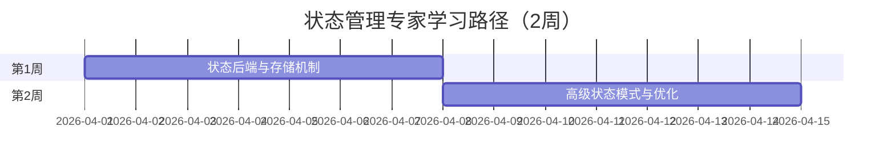

# 学习路径：状态管理专家（2周）

> **所属阶段**: 进阶路径 | **难度等级**: L4-L5 | **预计时长**: 2周（每天3-4小时）

---

## 路径概览

### 适合人群

- 已掌握 Flink 基础开发
- 需要处理复杂状态场景
- 面临状态性能或一致性问题
- 准备优化大规模作业状态

### 学习目标

完成本路径后，您将能够：

- 深入理解 Flink 状态内部机制
- 掌握各种状态类型的适用场景
- 优化大规模状态作业性能
- 设计和实现复杂状态模式
- 解决状态相关的生产问题

### 前置知识要求

- 熟练使用 DataStream API
- 理解 Checkpoint 机制
- 有实际的状态使用经验
- 了解 JVM 内存管理基础

### 完成标准

- [ ] 深入理解状态后端实现原理
- [ ] 能够优化大规模状态作业
- [ ] 掌握复杂状态模式设计
- [ ] 能够诊断和解决状态问题

---

## 学习阶段时间线



---

## 第1周：状态后端与存储机制

### 学习主题

- 状态后端架构对比（HashMap vs RocksDB）
- Checkpoint 存储机制
- 状态序列化与反序列化
- 增量 Checkpoint 原理

### 推荐文档清单

| 序号 | 文档 | 类型 | 预计时长 | 重点内容 |
|------|------|------|----------|----------|
| 1.1 | `Flink/02-core-mechanisms/flink-state-management-complete-guide.md` | 核心 | 4h | 状态管理完整指南 |
| 1.2 | `Flink/06-engineering/state-backend-selection.md` | 工程 | 3h | 状态后端选择 |
| 1.3 | `Flink/02-core-mechanisms/forst-state-backend.md` | 核心 | 2h | ForSt 状态后端 |
| 1.4 | `Flink/01-architecture/disaggregated-state-analysis.md` | 架构 | 3h | 分离状态分析 |
| 1.5 | `Flink/02-core-mechanisms/checkpoint-mechanism-deep-dive.md` | 核心 | 2h | Checkpoint 深度 |

### 实践任务

1. **状态后端对比实验**

   ```java
   // 1. HashMapStateBackend
   env.setStateBackend(new HashMapStateBackend());
   env.getCheckpointConfig().setCheckpointStorage("file:///checkpoints");

   // 2. EmbeddedRocksDBStateBackend
   env.setStateBackend(new EmbeddedRocksDBStateBackend());
   env.getCheckpointConfig().setCheckpointStorage("file:///checkpoints");

   // 3. ForStStateBackend (Flink 2.0+)
   env.setStateBackend(new ForStStateBackend());
   ```

   - 对比内存使用、CPU 占用、Checkpoint 时间
   - 测试大规模状态场景

2. **增量 Checkpoint 测试**
   - 配置增量 Checkpoint
   - 对比全量和增量 Checkpoint 时间
     - 观察状态恢复过程

3. **序列化优化**
   - 对比不同序列化器性能
   - 使用 Avro/Protobuf 优化
   - 测试自定义序列化器

### 检查点 1.1

- [ ] 理解 HashMap 和 RocksDB 状态后端的实现差异
- [ ] 能够根据场景选择合适的状态后端
- [ ] 掌握增量 Checkpoint 配置和优化
- [ ] 理解状态序列化对性能的影响

---

## 第2周：高级状态模式与优化

### 学习主题

- 复杂状态模式（状态机、会话状态）
- State TTL 高级策略
- 大状态优化技巧
- 状态监控与诊断

### 推荐文档清单

| 序号 | 文档 | 类型 | 预计时长 | 重点内容 |
|------|------|------|----------|----------|
| 2.1 | `Flink/02-core-mechanisms/flink-state-ttl-best-practices.md` | 实践 | 2h | TTL 最佳实践 |
| 2.2 | `Knowledge/02-design-patterns/pattern-stateful-computation.md` | 模式 | 2h | 有状态计算模式 |
| 2.3 | `Knowledge/09-anti-patterns/anti-pattern-07-window-state-explosion.md` | 反模式 | 1h | 状态爆炸问题 |
| 2.4 | `Flink/15-observability/flink-observability-complete-guide.md` | 可观测 | 2h | 状态监控 |
| 2.5 | `Flink/06-engineering/performance-tuning-guide.md` | 调优 | 3h | 性能调优指南 |

### 实践任务

1. **状态机实现**

   ```java
   // 实现订单状态机
   public class OrderStateMachine extends KeyedProcessFunction<String, Order, Alert> {
     private ValueState<OrderState> state;
     private MapState<String, Long> timerState;

     @Override
     public void processElement(Order order, Context ctx, Collector<Alert> out) {
       OrderState current = state.value();
       // 状态转移逻辑
       switch (current) {
         case CREATED:
           if (order.getEvent().equals("PAY")) {
             state.update(OrderState.PAID);
             setPaymentTimer(ctx);
           }
           break;
         case PAID:
           // ...
       }
     }
   }
   ```

2. **大状态优化**
   - 实现状态分区策略
   - 配置 RocksDB 内存和线程
   - 使用状态异步快照

3. **状态监控配置**
   - 配置状态指标收集
   - 设置状态大小告警
   - 分析状态访问模式

### 检查点 2.1

- [ ] 能够实现复杂状态机
- [ ] 掌握大状态优化技巧
- [ ] 能够监控和诊断状态问题
- [ ] 理解 TTL 的各种策略和适用场景

---

## 实战项目：大规模会话分析

### 项目描述

构建支撑亿级用户的实时会话分析系统。

### 技术挑战

1. **状态规模**
   - 亿级用户同时在线
   - 每个用户维护会话状态
   - 会话超时时间 30 分钟

2. **性能要求**
   - 毫秒级延迟
   - 每秒处理百万事件
   - Checkpoint 在 1 分钟内完成

### 解决方案

```java
public class SessionAnalyzer extends KeyedProcessFunction<String, Event, Session> {
  // 使用 MapState 存储会话事件，避免 ValueState 过大
  private MapState<Long, Event> sessionEvents;
  private ValueState<SessionInfo> sessionInfo;

  @Override
  public void open(Configuration parameters) {
    // 配置 State TTL - 会话超时后自动清理
    StateTtlConfig ttlConfig = StateTtlConfig
      .newBuilder(Time.minutes(30))
      .setUpdateType(OnCreateAndWrite)
      .setStateVisibility(NeverReturnExpired)
      .cleanupIncrementally(10, true)
      .build();

    MapStateDescriptor<Long, Event> eventsDescriptor =
      new MapStateDescriptor<>("events", Long.class, Event.class);
    eventsDescriptor.enableTimeToLive(ttlConfig);
    sessionEvents = getRuntimeContext().getMapState(eventsDescriptor);

    // 使用 RocksDB 状态后端
    // 配置大状态优化参数
  }

  @Override
  public void processElement(Event event, Context ctx, Collector<Session> out) {
    // 获取或创建会话
    SessionInfo info = sessionInfo.value();
    if (info == null) {
      info = new SessionInfo(event.getTimestamp());
      sessionInfo.update(info);
    }

    // 存储事件
    sessionEvents.put(event.getTimestamp(), event);

    // 注册会话超时 Timer
    ctx.timerService().registerEventTimeTimer(
      event.getTimestamp() + TimeUnit.MINUTES.toMillis(30)
    );
  }

  @Override
  public void onTimer(long timestamp, OnTimerContext ctx, Collector<Session> out) {
    // 会话超时，输出会话统计
    Session session = buildSession(ctx.getCurrentKey(), sessionEvents);
    out.collect(session);

    // 清理状态
    sessionInfo.clear();
    for (Long key : sessionEvents.keys()) {
      sessionEvents.remove(key);
    }
  }
}
```

### 优化策略

1. **状态分区**

   ```java
   // 使用 keyBy 进行自然分区
   stream.keyBy(event -> event.getUserId() % 1000)
   ```

2. **RocksDB 调优**

   ```java
   // 配置 RocksDB 参数
   DefaultConfigurableStateBackend stateBackend =
     new EmbeddedRocksDBStateBackend();
   stateBackend.setPredefinedOptions(
     PredefinedOptions.FLASH_SSD_OPTIMIZED
   );
   ```

3. **增量 Checkpoint**

   ```java
   env.getCheckpointConfig().setCheckpointStorage(
     new FileSystemCheckpointStorage("hdfs:///checkpoints")
   );
   // 启用增量 Checkpoint
   env.getCheckpointConfig().enableUnalignedCheckpoints();
   ```

### 检查点

- [ ] 完成亿级会话分析系统设计
- [ ] 状态大小控制在合理范围
- [ ] Checkpoint 性能满足要求
- [ ] 实现状态自动清理

---

## 状态优化最佳实践

### 1. 状态类型选择

| 场景 | 推荐状态类型 | 理由 |
|------|-------------|------|
| 单值计数 | ValueState | 简单高效 |
| 列表累积 | ListState | 有序存储 |
| 键值查找 | MapState | 避免大 ValueState |
| 动态配置 | BroadcastState | 热更新支持 |
| 窗口聚合 | ReducingState | 增量聚合 |

### 2. 内存优化

```java
// 避免存储大对象
// ❌ 不推荐
ValueState<List<LargeObject>> largeListState;

// ✅ 推荐
MapState<Key, LargeObject> partitionedState;

// 使用状态压缩
env.getConfig().setUseSnapshotCompression(true);
```

### 3. 访问优化

```java
// 批量操作减少状态访问
public void processBatch(List<Event> events) {
  MapState<Key, Value> state = ...;
  Map<Key, Value> cache = new HashMap<>();

  // 批量读取
  for (Event e : events) {
    Value v = cache.get(e.getKey());
    if (v == null) {
      v = state.get(e.getKey());
      cache.put(e.getKey(), v);
    }
    // 处理...
  }

  // 批量写入
  for (Map.Entry<Key, Value> entry : cache.entrySet()) {
    state.put(entry.getKey(), entry.getValue());
  }
}
```

---

## 常见问题诊断

| 问题 | 诊断方法 | 解决方案 |
|------|----------|----------|
| OOM | 监控 state size 和 heap usage | 使用 RocksDB，配置 TTL |
| Checkpoint 超时 | 查看 checkpoint duration | 增量 checkpoint，优化序列化 |
| 状态访问慢 | 记录 state access latency | 批量操作，本地缓存 |
| 状态膨胀 | 监控 state growth rate | 及时清理，压缩合并 |

---

## 进阶路径推荐

完成本路径后，建议继续：

- **性能调优专家**: `LEARNING-PATHS/expert-performance-tuning.md`
- **架构师路径**: `LEARNING-PATHS/expert-architect-path.md`

---

## 版本历史

| 版本 | 日期 | 更新内容 |
|------|------|----------|
| v1.0 | 2026-04-04 | 初始版本，状态管理专家路径 |
