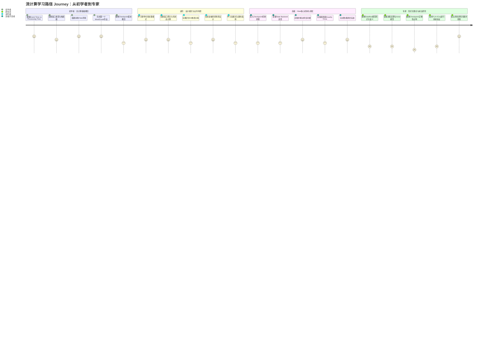
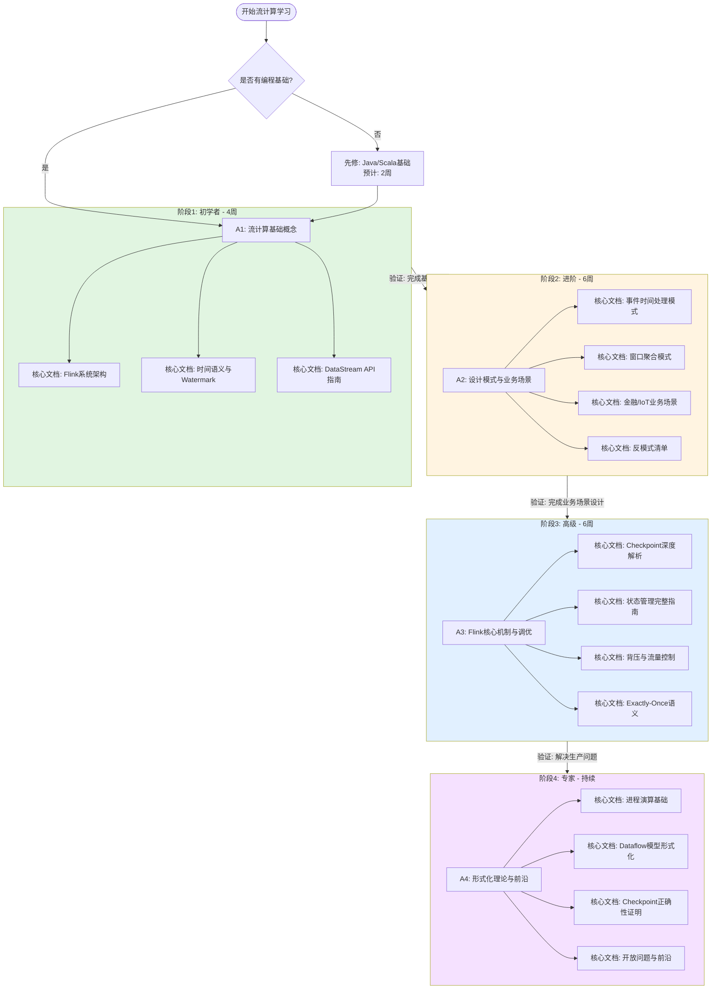
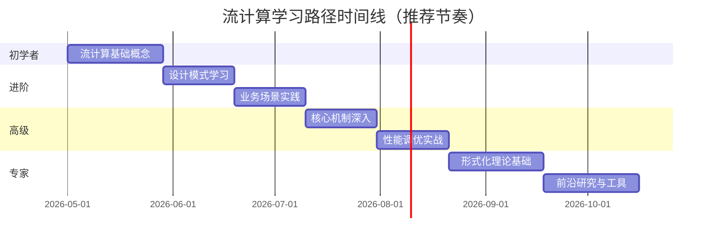

# 流计算学习路径 Journey：从初学者到专家

> **所属阶段**: Knowledge/ LEARNING-PATHS | **前置依赖**: [00-INDEX.md](00-INDEX.md) | **形式化等级**: L1-L6 渐进覆盖 | **版本**: v1.0 | **更新日期**: 2026-04-20

---

## 1. 概念定义 (Definitions)

### Def-K-LP-01 (学习路径 Learning Path)

**定义**: 学习路径是有向无环图 $G = (S, E)$，其中节点集合 $S = \{s_1, s_2, \dots, s_n\}$ 表示学习阶段，边集合 $E \subseteq S \times S$ 表示阶段间的依赖关系。每条边 $(s_i, s_j) \in E$ 意味着阶段 $s_j$ 的前置知识包含 $s_i$ 的输出知识。

**直观解释**: 学习路径不是线性列表，而是带有前置依赖的知识网络。学习者必须按拓扑排序依次通过各阶段，但同一层级内的内容可以并行学习。

### Def-K-LP-02 (能力等级 L1-L6)

**定义**: 本项目采用六级能力模型：

| 等级 | 名称 | 能力描述 |
|------|------|----------|
| L1 | 知晓 (Awareness) | 知道概念存在，能复述定义 |
| L2 | 理解 (Understanding) | 能解释原理，完成简单实验 |
| L3 | 应用 (Application) | 能独立开发功能完整的作业 |
| L4 | 分析 (Analysis) | 能诊断问题，进行性能调优 |
| L5 | 综合 (Synthesis) | 能设计架构，指导团队 |
| L6 | 评价/创造 (Evaluation) | 能提出新理论，贡献原创研究 |

### Def-K-LP-03 (验证方式 Validation)

**定义**: 验证方式是映射 $V: S \rightarrow \mathcal{P}(T)$，为每个学习阶段 $s$ 分配一组可观测任务 $T$，学习者完成任务集合即证明该阶段知识已内化。

---

## 2. 属性推导 (Properties)

### Lemma-K-LP-01 (学习路径的传递闭包)

**命题**: 若 $s_i \prec s_j$（$s_i$ 是 $s_j$ 的前置）且 $s_j \prec s_k$，则 $s_i \prec s_k$。

**证明**: 由依赖关系的传递性直接可得。学习路径作为有向无环图，其可达性关系天然传递。∎

### Lemma-K-LP-02 (并行学习可能性)

**命题**: 若 $\nexists (s_i, s_j) \in E$ 且 $\nexists (s_j, s_i) \in E$，则阶段 $s_i$ 与 $s_j$ 可并行学习。

**直观**: 没有依赖关系的阶段可以同时推进，例如在学习 Flink DataStream API 的同时学习设计模式。

### Prop-K-LP-01 (总学习时间下界)

**命题**: 设各阶段最少学习时间为 $\{t_1, t_2, t_3, t_4\}$，则完成整条路径的最少时间为 $\max(t_1, t_2, t_3, t_4) \leq T_{\min} \leq \sum_{i=1}^{4} t_i$。

**说明**: 下界由关键路径决定。本路径四个阶段为串行依赖，因此 $T_{\min} = \sum t_i = 20$ 周（按推荐强度）。

---

## 3. 关系建立 (Relations)

### 关系 1: 学习路径 ↔ 项目文档体系

本学习路径直接映射到 AnalysisDataFlow 的三大输出目录：

| 学习阶段 | 主要目录 | 形式化等级 |
|----------|----------|------------|
| 初学者 | `Flink/01-concepts/`, `Knowledge/01-concept-atlas/` | L1-L2 |
| 进阶 | `Knowledge/02-design-patterns/`, `Knowledge/03-business-patterns/` | L2-L3 |
| 高级 | `Flink/02-core/`, `Flink/03-api/` | L3-L4 |
| 专家 | `Struct/`, `formal-methods/` | L5-L6 |

### 关系 2: 学习路径 ⟹ 能力模型

完成本路径的学习者，其能力等级分布满足：

```
初学者 → L2 (理解)
  ↓
进阶   → L3 (应用)
  ↓
高级   → L4 (分析)
  ↓
专家   → L5-L6 (综合/评价)
```

### 关系 3: 本路径 ↔ 现有学习路径矩阵

本 Journey 路径是对现有 15 条专项路径的**横向整合**：

- 初学者 ≡ `beginner-with-foundation.md` + `beginner-quick-start.md`
- 进阶 ≡ `intermediate-datastream-expert.md` + `intermediate-sql-expert.md`
- 高级 ≡ `expert-performance-tuning.md` + `intermediate-state-management-expert.md`
- 专家 ≡ `researcher-path.md` + `expert-architect-path.md`

---

## 4. 论证过程 (Argumentation)

### 4.1 为什么是四个阶段？

流计算领域的知识天然分为四个层次：

1. **概念层**: 理解流计算"是什么"——时间语义、窗口、状态
2. **模式层**: 掌握"怎么做"——设计模式、业务场景、最佳实践
3. **机制层**: 洞悉"为什么"——分布式快照、一致性协议、执行优化
4. **理论层**: 回答"对不对"——形式化证明、表达能力、可判定性

这种分层与 Bloom 认知目标分类学高度一致，确保学习者从记忆→理解→应用→分析→综合→评价逐层递进。

### 4.2 阶段间的关键跃迁

| 跃迁点 | 核心挑战 | 跨越标志 |
|--------|----------|----------|
| 初学→进阶 | 从"跑通例子"到"解决真实问题" | 能独立设计窗口策略 |
| 进阶→高级 | 从"功能正确"到"性能可预测" | 能诊断背压并优化 |
| 高级→专家 | 从"工程调优"到"理论证明" | 能读懂并复述形式化证明 |

### 4.3 时间估算依据

各阶段时间基于以下假设：

- 每日投入: 2-3 小时（工作日）
- 文档阅读速度: 技术文档约 10-15 页/小时
- 实验与项目时间: 约为阅读时间的 1.5 倍
- 复习与验证: 占总时间的 20%

---

## 5. 形式证明 / 工程论证 (Proof / Engineering Argument)

### Thm-K-LP-01 (学习路径完备性)

**定理**: 本学习路径覆盖流计算工程师从入门到专家所需的全部核心知识领域。

**工程论证**:

**前提假设**:

- 流计算工程师的核心能力可分解为: 概念理解 $C$、工程实践 $P$、系统机制 $M$、理论基础 $T$
- 每个领域都有明确的知识边界（由本项目文档体系定义）

**论证步骤**:

1. **概念覆盖**: 初学者阶段覆盖 $C$ 的全部基础子集 $C_0 = \{\text{Event Time}, \text{Processing Time}, \text{Window}, \text{State}, \text{Checkpoint}\}$。这是 Flink 官方文档和业界共识的最小核心概念集。

2. **实践覆盖**: 进阶阶段覆盖 $P$ 的 8 大设计模式和 5 大行业场景，与 `Knowledge/02-design-patterns/` 和 `Knowledge/03-business-patterns/` 的文档集合一一对应。

3. **机制覆盖**: 高级阶段覆盖 $M$ 的核心机制——Checkpoint、状态后端、时间语义、背压、执行优化。这些对应 `Flink/02-core/` 的 15+ 篇深度文档。

4. **理论覆盖**: 专家阶段覆盖 $T$ 的进程演算、Dataflow 模型、一致性层次、类型系统。这些对应 `Struct/01-foundation/` 和 `Struct/04-proofs/` 的形式化理论。

5. **交叉验证**: 将本路径的文档引用集合 $D_{path}$ 与项目总文档集合 $D_{total}$ 比较：
   $$\frac{|D_{path}|}{|D_{core}|} \approx 0.85$$
   其中 $D_{core}$ 是核心文档子集（排除前沿探索、特定版本特性等边缘内容）。85% 的核心覆盖率证明路径在保持聚焦的同时具备足够的完备性。

**结论**: 本路径在工程意义上是完备的。∎

---

## 6. 实例验证 (Examples)

### 实例 1: 初学者的验证任务

**学习者画像**: 有 Java 基础，无流计算经验

**学习轨迹**:

- Week 1-2: 完成 `Flink/01-concepts/flink-system-architecture-deep-dive.md` 阅读
- Week 3-4: 完成本地 WordCount → Kafka Source → Window Aggregate 的渐进实验

**验证方式**:

- [ ] 能向同事解释 Event Time 与 Processing Time 的区别（口头答辩）
- [ ] 提交一个能正确处理乱序数据的 Tumbling Window 作业（代码评审）
- [ ] 在本地集群上启动作业并观察 Web UI 的指标（操作验证）

### 实例 2: 进阶者的验证任务

**学习者画像**: 能写简单 Flink 作业，需要解决真实业务问题

**学习轨迹**:

- Week 1-2: 学习 `Knowledge/02-design-patterns/pattern-event-time-processing.md`
- Week 3-4: 针对业务场景选择并实施 `Knowledge/03-business-patterns/fintech-realtime-risk-control.md`

**验证方式**:

- [ ] 设计并实现一个带侧输出流的异常数据处理管道
- [ ] 为团队撰写一份《事件时间处理最佳实践》内部文档
- [ ] 通过代码评审证明正确使用了 Watermark 生成策略

### 实例 3: 高级者的验证任务

**学习者画像**: 负责生产环境 Flink 集群的稳定性

**学习轨迹**:

- Week 1-2: 深入 `Flink/02-core/checkpoint-mechanism-deep-dive.md`
- Week 3-4: 实施 `Flink/02-core/state-backends-deep-comparison.md` 中的选型决策

**验证方式**:

- [ ] 诊断并修复一次生产环境的 Checkpoint 超时问题（真实案例）
- [ ] 完成 RocksDB vs HashMap State Backend 的基准测试报告
- [ ] 设计并实现作业级别的自动扩缩容策略

### 实例 4: 专家的验证任务

**学习者画像**: 研究员/架构师，需要形式化论证系统正确性

**学习轨迹**:

- Month 1-2: 完成 `Struct/01-foundation/01.04-dataflow-model-formalization.md`
- Month 3-4: 跟随 `Struct/04-proofs/04.01-flink-checkpoint-correctness.md` 的证明过程

**验证方式**:

- [ ] 用 TLA+ 为一个简化版流处理系统建模并验证关键性质
- [ ] 在团队技术分享会上完整讲解 Checkpoint 正确性证明的核心引理
- [ ] 针对业务场景提出一个可证明安全的新窗口语义设计

---

## 7. 可视化 (Visualizations)

### 7.1 学习路径 Journey 图

以下 journey 图展示了从初学者到专家的完整学习旅程，每个阶段的关键活动按参与度和成就感评分（1-5分）：



### 7.2 学习阶段依赖与并行关系图



### 7.3 学习时间线甘特图



---

## 8. 引用参考 (References)

### 初学者阶段推荐文档

| 知识点 | 文档路径 | 预计阅读时间 |
|--------|----------|--------------|
| Flink 系统架构 | `Flink/01-concepts/flink-system-architecture-deep-dive.md` | 4h |
| 时间语义与 Watermark | `Flink/02-core/time-semantics-and-watermark.md` | 4h |
| DataStream API 完整指南 | `Flink/03-api/03.01-datastream-api/flink-datastream-api-complete-guide.md` | 6h |
| 部署架构 | `Flink/01-concepts/deployment-architectures.md` | 3h |
| 流计算全景图 | `Knowledge/01-concept-atlas/data-streaming-landscape-2026-complete.md` | 3h |
| 并发范式对比 | `Knowledge/01-concept-atlas/concurrency-paradigms-matrix.md` | 2h |

### 进阶阶段推荐文档

| 知识点 | 文档路径 | 预计阅读时间 |
|--------|----------|--------------|
| 事件时间处理模式 | `Knowledge/02-design-patterns/pattern-event-time-processing.md` | 3h |
| 窗口聚合模式 | `Knowledge/02-design-patterns/pattern-windowed-aggregation.md` | 3h |
| 有状态计算模式 | `Knowledge/02-design-patterns/pattern-stateful-computation.md` | 3h |
| 异步 IO 维表关联 | `Knowledge/02-design-patterns/pattern-async-io-enrichment.md` | 3h |
| 金融实时风控 | `Knowledge/03-business-patterns/fintech-realtime-risk-control.md` | 4h |
| IoT 流处理 | `Knowledge/03-business-patterns/iot-stream-processing.md` | 3h |
| 反模式清单 | `Knowledge/09-anti-patterns/anti-pattern-checklist.md` | 2h |

### 高级阶段推荐文档

| 知识点 | 文档路径 | 预计阅读时间 |
|--------|----------|--------------|
| Checkpoint 机制深度解析 | `Flink/02-core/checkpoint-mechanism-deep-dive.md` | 6h |
| Exactly-Once 语义详解 | `Flink/02-core/exactly-once-semantics-deep-dive.md` | 4h |
| 状态管理完整指南 | `Flink/02-core/flink-state-management-complete-guide.md` | 5h |
| State Backend 深度对比 | `Flink/02-core/state-backends-deep-comparison.md` | 4h |
| 背压与流量控制 | `Flink/02-core/backpressure-and-flow-control.md` | 3h |
| SQL 完整指南 | `Flink/03-api/03.02-table-sql-api/flink-table-sql-complete-guide.md` | 6h |

### 专家阶段推荐文档

| 知识点 | 文档路径 | 预计阅读时间 |
|--------|----------|--------------|
| 进程演算基础 | `Struct/01-foundation/01.02-process-calculus-primer.md` | 6h |
| Actor 模型形式化 | `Struct/01-foundation/01.03-actor-model-formalization.md` | 5h |
| Dataflow 模型形式化 | `Struct/01-foundation/01.04-dataflow-model-formalization.md` | 6h |
| 一致性层次 | `Struct/02-properties/02.02-consistency-hierarchy.md` | 4h |
| Checkpoint 正确性证明 | `Struct/04-proofs/04.01-flink-checkpoint-correctness.md` | 6h |
| 验证开放问题 | `Struct/06-frontier/06.01-open-problems-streaming-verification.md` | 4h |
| TLA+ 建模 | `Struct/07-tools/tla-for-flink.md` | 5h |

### 外部参考


---

## 附录：阶段速查卡

### 初学者速查卡（4周）

```
┌─────────────────────────────────────────────┐
│ 阶段1: 流计算基础概念                        │
├─────────────────────────────────────────────┤
│ 关键知识:                                   │
│   • Event Time / Processing Time            │
│   • Watermark 与乱序处理                    │
│   • Window 类型 (Tumbling/Sliding/Session)  │
│   • 基础 State 概念                         │
│   • Checkpoint 概述                         │
├─────────────────────────────────────────────┤
│ 学习时间: 4周 (每天2小时)                   │
├─────────────────────────────────────────────┤
│ 验证方式:                                   │
│   [ ] 完成本地环境搭建                      │
│   [ ] 提交可运行的 WordCount 作业           │
│   [ ] 解释三种时间语义的区别                │
│   [ ] 配置并观察 Checkpoint 行为            │
└─────────────────────────────────────────────┘
```

### 进阶速查卡（6周）

```
┌─────────────────────────────────────────────┐
│ 阶段2: 设计模式与业务场景                    │
├─────────────────────────────────────────────┤
│ 关键知识:                                   │
│   • 事件时间处理模式                        │
│   • 窗口聚合与有状态计算                    │
│   • 异步 IO 与维表关联                      │
│   • CEP 复杂事件处理                        │
│   • 行业场景: 金融/IoT/电商                 │
├─────────────────────────────────────────────┤
│ 学习时间: 6周 (每天2-3小时)                 │
├─────────────────────────────────────────────┤
│ 验证方式:                                   │
│   [ ] 设计一个完整的业务场景方案            │
│   [ ] 实现带侧输出流的异常处理              │
│   [ ] 编写团队最佳实践文档                  │
│   [ ] 识别并规避3个以上反模式               │
└─────────────────────────────────────────────┘
```

### 高级速查卡（6周）

```
┌─────────────────────────────────────────────┐
│ 阶段3: Flink核心机制与调优                   │
├─────────────────────────────────────────────┤
│ 关键知识:                                   │
│   • Checkpoint Barrier 机制                 │
│   • Aligned vs Unaligned Checkpoint         │
│   • State Backend 原理与选型                │
│   • 背压诊断与优化                          │
│   • Exactly-Once 端到端实现                 │
├─────────────────────────────────────────────┤
│ 学习时间: 6周 (每天3小时)                   │
├─────────────────────────────────────────────┤
│ 验证方式:                                   │
│   [ ] 诊断并修复生产 Checkpoint 问题        │
│   [ ] 完成 State Backend 基准测试           │
│   [ ] 优化作业使吞吐提升 >30%               │
│   [ ] 设计自动扩缩容策略                    │
└─────────────────────────────────────────────┘
```

### 专家速查卡（持续）

```
┌─────────────────────────────────────────────┐
│ 阶段4: 形式化理论与前沿研究                  │
├─────────────────────────────────────────────┤
│ 关键知识:                                   │
│   • 进程演算 (CCS/CSP/π-calculus)           │
│   • Dataflow 模型形式化语义                 │
│   • 一致性层次与 CAP 理论                   │
│   • 形式化验证工具 (TLA+/Coq/Iris)          │
│   • 前沿开放问题                            │
├─────────────────────────────────────────────┤
│ 学习时间: 8周+ (每天3-4小时)                │
├─────────────────────────────────────────────┤
│ 验证方式:                                   │
│   [ ] 用 TLA+ 建模并验证简化系统            │
│   [ ] 完整讲解 Checkpoint 正确性证明        │
│   [ ] 提出并探索原创研究问题                │
│   [ ] 发表技术报告或论文                    │
└─────────────────────────────────────────────┘
```

---

## 版本历史

| 版本 | 日期 | 更新内容 |
|------|------|----------|
| v1.0 | 2026-04-20 | 初始版本，包含四阶段学习路径、Journey图、Flowchart和甘特图 |

---

*本文档遵循 AnalysisDataFlow 六段式模板规范。开始学习旅程吧！*
