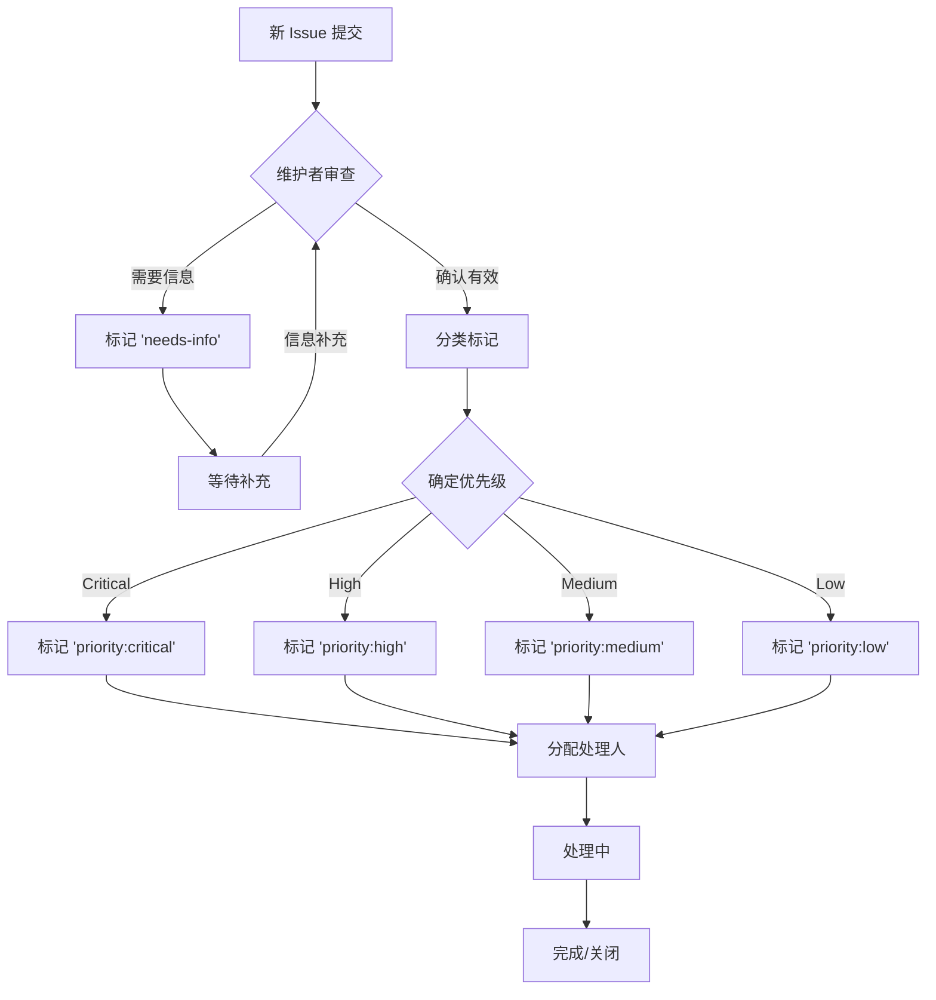
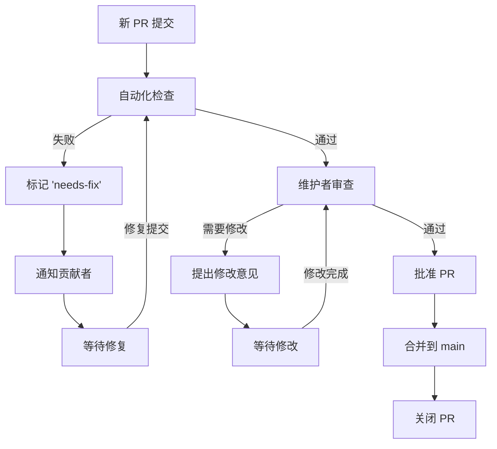

# 项目维护者指南 (Maintainers Guide)

> **版本**: v1.0 | **最后更新**: 2026-04-12 | **状态**: 生效

---

## 维护者团队

### 核心维护者

| 用户名 | 主要职责 | 联系方式 | 加入时间 |
|-------|---------|---------|---------|
| @luyanruyr | 项目创始人、架构设计、最终决策 | luyanruyr@github | 2024 |

### 领域维护者

| 领域 | 负责人 | 职责范围 |
|-----|-------|---------|
| Struct/ (形式理论) | @luyanruyr | 定理验证、形式化证明、数学严谨性 |
| Knowledge/ (知识结构) | @luyanruyr | 设计模式、业务建模、知识体系 |
| Flink/ (Flink专项) | @luyanruyr | Flink架构、源码分析、版本跟进 |
| 工具与自动化 | @luyanruyr | CI/CD、验证脚本、文档生成 |
| 社区运营 | @luyanruyr | Issue管理、讨论引导、新人指导 |

---

## 维护者职责

### 日常职责

| 职责 | 频率 | 说明 |
|-----|------|------|
| **Issue 审查** | 每日 | 分类、标记、回复新提交的 Issue |
| **PR 审查** | 每日 | 审查提交的 Pull Request |
| **讨论参与** | 每周 | 参与 GitHub Discussions 的讨论 |
| **文档更新** | 持续 | 维护 PROJECT-TRACKING.md 等状态文件 |
| **发布管理** | 按需 | 执行版本发布流程 |

### 审查职责

#### Issue 审查清单

- [ ] 分类标记（type:bug, type:feature, type:documentation, type:question）
- [ ] 优先级标记（priority:critical, priority:high, priority:medium, priority:low）
- [ ] 关联里程碑（如适用）
- [ ] 回复确认（24小时内给予初步回复）
- [ ] 分配处理人（如明确处理者）

#### PR 审查清单

**内容审查**:

- [ ] 技术内容准确性
- [ ] 六段式模板符合度
- [ ] 定理/定义编号规范性
- [ ] 引用来源权威性
- [ ] Mermaid 图表正确性

**格式审查**:

- [ ] Markdown 语法
- [ ] 文件命名规范
- [ ] 中英文混排规范
- [ ] 术语使用一致性

**流程审查**:

- [ ] 关联 Issue 已处理
- [ ] THEOREM-REGISTRY.md 已更新（如适用）
- [ ] PROJECT-TRACKING.md 已更新（如适用）
- [ ] 提交信息规范性

### 决策职责

| 决策类型 | 决策权限 | 决策时限 |
|---------|---------|---------|
| 内容合并 | 维护者 | 3-5 个工作日 |
| 架构变更 | 核心维护者 | 1-2 周讨论 |
| 规范修改 | 社区讨论后核心维护者决定 | 2-4 周 |
| 贡献者晋升 | 核心维护者 | 按需 |

---

## 社区管理

### Issue 管理流程

### PR 管理流程

### 冲突处理

当社区出现争议时，维护者应按以下流程处理：

1. **了解情况** - 收集相关方的观点和证据
2. **促进对话** - 鼓励当事人直接沟通解决
3. **提出建议** - 基于项目最佳利益提出解决方案
4. **做出决定** - 如无法达成一致，维护者做出最终决定
5. **记录总结** - 记录决策过程和结果

---

## 发布管理

### 发布职责

维护者负责执行发布流程，详见 [RELEASE_PROCESS.md](./RELEASE_PROCESS.md)。

### 发布周期

| 发布类型 | 频率 | 负责人 |
|---------|------|-------|
| 补丁版本 | 按需 | 维护者 |
| 次要版本 | 每月 | 核心维护者 |
| 主要版本 | 每季度 | 核心维护者 |

---

## 维护者晋升

### 成为维护者的条件

| 条件 | 说明 |
|-----|------|
| 持续贡献 | 至少 3 个月的活跃贡献 |
| 质量认可 | 提交的 PR 质量获得认可 |
| 社区参与 | 积极参与 Issue 和讨论 |
| 领域专长 | 在特定领域展现专业能力 |
| 价值观一致 | 认同项目理念和社区准则 |

### 晋升流程

1. **提名** - 现有维护者提名候选人
2. **评估** - 核心维护者评估贡献记录
3. **邀请** - 向候选人发出邀请
4. **确认** - 候选人接受邀请
5. **公告** - 在社区公告新维护者

---

## 维护者行为准则

作为维护者，除了遵守 [CODE_OF_CONDUCT.md](./CODE_OF_CONDUCT.md) 外，还需：

### 必须做到

- ✅ 以身作则，遵守项目规范
- ✅ 及时响应社区问题和 PR
- ✅ 公正客观地审查贡献
- ✅ 耐心指导新贡献者
- ✅ 保护社区多元性和包容性
- ✅ 及时更新项目状态文档

### 禁止行为

- ❌ 滥用维护者权限
- ❌ 未经讨论擅自修改核心规范
- ❌ 歧视或排斥特定贡献者
- ❌ 忽视社区反馈
- ❌ 拖延审查无正当理由

---

## 联系方式

维护者团队联系方式：

| 渠道 | 地址 | 用途 |
|-----|------|------|
| GitHub | @luyanruyr | 日常协作 |
| 项目邮箱 | <maintainers@analysisdataflow.org> | 正式沟通 |
| 安全报告 | <security@analysisdataflow.org> | 安全漏洞 |

---

## 更新记录

| 版本 | 日期 | 变更内容 |
|-----|------|---------|
| v1.0 | 2026-04-12 | 初始版本 |

---

*感谢所有维护者为 AnalysisDataFlow 项目的付出！* 🙏
