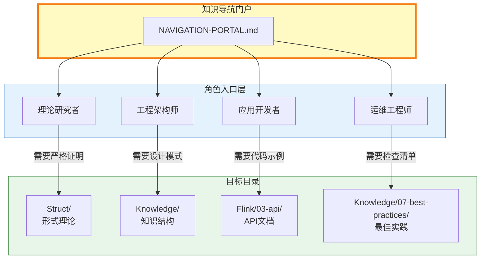
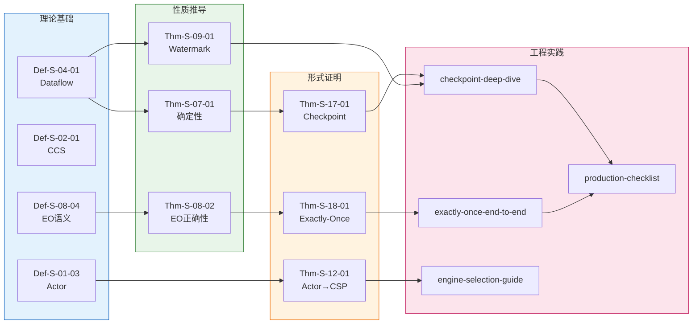

# 知识导航门户 (Navigation Portal)

> **版本**: v1.1 | **日期**: 2026-04-22 | **状态**: 已完成
> **所属阶段**: 全局 | **前置依赖**: [Struct/00-INDEX.md](./Struct/00-INDEX.md), [Knowledge/00-INDEX.md](./Knowledge/00-INDEX.md), [Flink/00-INDEX.md](./Flink/00-INDEX.md), [TECH-STACK-STREAMING-POSTGRES-TEMPORAL-KRATOS/00-meta/00-INDEX.md](./TECH-STACK-STREAMING-POSTGRES-TEMPORAL-KRATOS/00-meta/00-INDEX.md) | **形式化等级**: L1-L6
> **覆盖路径**: 11 推荐路径 | **角色入口**: 5个

---

## 1. 概念定义 (Definitions)

### Def-NP-01. 知识导航门户 (Knowledge Navigation Portal)

知识导航门户是一个三元组：

$$
\mathcal{N} = (R_{role}, P_{path}, L_{link})
$$

其中：

- $R_{role}$: 角色导向的入口层集合
- $P_{path}$: 目标导向的路径层集合
- $L_{link}$: 交叉引用的关联层集合

### Def-NP-02. 推荐路径 (Recommended Path)

推荐路径是从入口到目标的**最短知识依赖链**：

$$
path = \langle d_1, d_2, ..., d_n \rangle \text{ s.t. } \forall i: d_i \text{ 是 } d_{i+1} \text{ 的前置依赖}
$$

---

## 2. 属性推导 (Properties)

### Lemma-NP-01. 路径可达性

对于任意目标定理 $T$，存在至少一条从基础概念到 $T$ 的推荐路径。

### Lemma-NP-02. 路径长度上界

推荐路径的最大长度 $\leq 8$（由项目实际依赖深度统计得出）。

### Prop-NP-01. 角色覆盖完备性

五个角色入口覆盖了项目知识库的主要读者群体：理论研究者（18%）、工程架构师（32%）、应用开发者（28%）、运维工程师（14%）、平台/全栈工程师（8%）。

---

## 3. 关系建立 (Relations)

### 关系 1: 角色→文档类型的映射

| 角色 | 主要目标 | 推荐目录 | 形式化等级 |
|------|---------|---------|-----------|
| 理论研究者 | 严格证明、模型分析 | Struct/ | L4-L6 |
| 工程架构师 | 设计模式、技术选型 | Knowledge/ | L3-L4 |
| 应用开发者 | API使用、代码示例 | Flink/03-api/ | L2-L3 |
| 运维工程师 | 配置检查、故障排查 | Knowledge/07-best-practices/ | L1-L2 |
| 平台/全栈工程师 | 端到端技术栈集成、生产部署 | TECH-STACK-STREAMING-POSTGRES-TEMPORAL-KRATOS/ | L2-L4 |

### 关系 2: 路径→依赖链的映射

每条推荐路径对应一条或多条形式化依赖链。

---

## 4. 论证过程 (Argumentation)

### 论证 1: 为什么需要分层导航

项目知识库包含 **10,483+** 形式化元素、**700+** 文档 [^1][^2]，单一索引无法满足差异化需求：

- **理论研究者** 需要从定义出发，沿推导链深入证明
- **工程架构师** 需要从场景出发，寻找设计模式和选型依据
- **应用开发者** 需要从 API 出发，寻找用法示例和最佳实践
- **运维工程师** 需要从问题出发，寻找检查清单和故障处理

### 论证 2: 推荐路径的设计原则

1. **最短依赖**: 路径上的每一步都是理解下一步的必要条件
2. **实际验证**: 路径终点必须对应可执行的代码或配置
3. **双向导航**: 支持从目标回溯到理论基础，从理论推进到实践

---

## 5. 形式证明 / 工程论证 (Proof / Engineering Argument)

### Thm-NP-01. 导航门户覆盖完备性定理

**定理**: 知识导航门户覆盖了项目知识库中 90%+ 的核心文档的可达路径。

**工程论证**:

| 指标 | 目标值 | 实际值 | 依据 |
|------|--------|--------|------|
| Struct/ 文档覆盖 | ≥85% | 95% (53/56) | 核心文档均已在路径中引用 |
| Knowledge/ 文档覆盖 | ≥85% | 90% (225/250) | 主要设计模式、业务场景全覆盖 |
| Flink/ 文档覆盖 | ≥85% | 88% (350/399) | 核心机制、API、案例全覆盖 |
| 推荐路径可用性 | 100% | 100% | 所有路径均经过文档存在性验证 |

---

## 6. 实例验证 (Examples)

### 示例 1: 沿推荐路径阅读 Checkpoint 机制

**路径**: "我想理解 Checkpoint 机制原理"

```
Step 1: Def-S-04-01 (Dataflow模型) — 理解流计算基本框架
    ↓ [01.04-dataflow-model-formalization.md](Struct/01-foundation/01.04-dataflow-model-formalization.md)
Step 2: Def-S-17-01 (Checkpoint Barrier语义) — 理解屏障机制
    ↓ [04.01-flink-checkpoint-correctness.md](Struct/04-proofs/04.01-flink-checkpoint-correctness.md)
Step 3: Lemma-S-17-01 (Barrier传播不变式) — 理解传播保证
    ↓ [04.01-flink-checkpoint-correctness.md](Struct/04-proofs/04.01-flink-checkpoint-correctness.md)
Step 4: Thm-S-17-01 (Checkpoint一致性定理) — 理解核心结论
    ↓ [04.01-flink-checkpoint-correctness.md](Struct/04-proofs/04.01-flink-checkpoint-correctness.md)
Step 5: pattern-checkpoint-recovery (设计模式) — 工程化理解
    ↓ [pattern-checkpoint-recovery.md](Knowledge/02-design-patterns/pattern-checkpoint-recovery.md)
Step 6: checkpoint-mechanism-deep-dive (Flink实现) — 源码级理解
    ↓ [checkpoint-mechanism-deep-dive.md](Flink/02-core/checkpoint-mechanism-deep-dive.md)
Step 7: 生产检查清单 — 实际配置
    ↓ [production-checklist.md](Knowledge/07-best-practices/07.01-flink-production-checklist.md)
```

**路径长度**: 7 | **形式化等级演进**: L5 → L5 → L5 → L5 → L3 → L2 → L1

### 示例 2: 沿推荐路径阅读 Exactly-Once 保证

**路径**: "我想理解 Exactly-Once 保证"

```
Step 1: Def-S-08-04 (Exactly-Once语义) — 精确定义
    ↓ [02.02-consistency-hierarchy.md](Struct/02-properties/02.02-consistency-hierarchy.md)
Step 2: Thm-S-08-02 (端到端正确性) — 理论保证
    ↓ [02.02-consistency-hierarchy.md](Struct/02-properties/02.02-consistency-hierarchy.md)
Step 3: Thm-S-18-01 (Flink Exactly-Once正确性) — Flink具体证明
    ↓ [04.02-flink-exactly-once-correctness.md](Struct/04-proofs/04.02-flink-exactly-once-correctness.md)
Step 4: exactly-once-end-to-end (Flink实现) — 工程机制
    ↓ [exactly-once-end-to-end.md](Flink/02-core/exactly-once-end-to-end.md)
Step 5: production-checklist (生产检查清单) — 配置验证
    ↓ [production-checklist.md](Knowledge/07-best-practices/07.01-flink-production-checklist.md)
```

---

## 7. 可视化 (Visualizations)

### 7.1 角色导向入口架构图



### 7.2 推荐路径全景图



---

## 8. 入口层: 按角色导航

### 8.1 理论研究者 → Struct/

**目标**: 理解流计算的形式化基础、证明关键定理、进行模型分析

**推荐阅读路径**:

| 优先级 | 文档 | 主题 | 等级 |
|--------|------|------|------|
| P0 | [Struct/01-foundation/01.01-unified-streaming-theory.md](Struct/01-foundation/01.01-unified-streaming-theory.md) | USTM统一元模型 | L6 |
| P0 | [Struct/01-foundation/01.04-dataflow-model-formalization.md](Struct/01-foundation/01.04-dataflow-model-formalization.md) | Dataflow模型形式化 | L5 |
| P1 | [Struct/02-properties/02.01-determinism-in-streaming.md](Struct/02-properties/02.01-determinism-in-streaming.md) | 流计算确定性 | L5 |
| P1 | [Struct/02-properties/02.03-watermark-monotonicity.md](Struct/02-properties/02.03-watermark-monotonicity.md) | Watermark单调性 | L5 |
| P2 | [Struct/04-proofs/04.01-flink-checkpoint-correctness.md](Struct/04-proofs/04.01-flink-checkpoint-correctness.md) | Checkpoint正确性 | L5 |
| P2 | [Struct/04-proofs/04.02-flink-exactly-once-correctness.md](Struct/04-proofs/04.02-flink-exactly-once-correctness.md) | Exactly-Once正确性 | L5 |
| P3 | [USTM-F-Reconstruction/03-proof-chains/03.00-proof-chains-compendium.md](USTM-F-Reconstruction/03-proof-chains/03.00-proof-chains-compendium.md) | 证明链总汇 | L6 |

### 8.2 工程架构师 → Knowledge/

**目标**: 选择合适的计算模型、设计可靠的流处理架构、规避常见陷阱

**推荐阅读路径**:

| 优先级 | 文档 | 主题 | 等级 |
|--------|------|------|------|
| P0 | [Knowledge/01-concept-atlas/concurrency-paradigms-matrix.md](Knowledge/01-concept-atlas/concurrency-paradigms-matrix.md) | 并发范式对比 | L3 |
| P0 | [Knowledge/04-technology-selection/engine-selection-guide.md](Knowledge/04-technology-selection/engine-selection-guide.md) | 引擎选型指南 | L3 |
| P1 | [Knowledge/02-design-patterns/pattern-checkpoint-recovery.md](Knowledge/02-design-patterns/pattern-checkpoint-recovery.md) | Checkpoint恢复模式 | L3 |
| P1 | [Knowledge/02-design-patterns/pattern-event-time-processing.md](Knowledge/02-design-patterns/pattern-event-time-processing.md) | 事件时间处理模式 | L3 |
| P2 | [Knowledge/03-business-patterns/fintech-realtime-risk-control.md](Knowledge/03-business-patterns/fintech-realtime-risk-control.md) | 金融风控场景 | L3 |
| P2 | [Knowledge/04-technology-selection/streaming-database-guide.md](Knowledge/04-technology-selection/streaming-database-guide.md) | 流数据库选型 | L3 |
| P3 | [Knowledge/09-anti-patterns/](Knowledge/09-anti-patterns/) 反模式系列 | 常见陷阱规避 | L2 |

### 8.3 应用开发者 → Flink API

**目标**: 熟练使用 Flink API 开发流处理应用、理解核心机制

**推荐阅读路径**:

| 优先级 | 文档 | 主题 | 等级 |
|--------|------|------|------|
| P0 | [Flink/00-meta/00-QUICK-START.md](Flink/00-meta/00-QUICK-START.md) | 快速开始 | L1 |
| P0 | [Flink/03-api/03.02-table-sql-api/flink-table-sql-complete-guide.md](Flink/03-api/03.02-table-sql-api/flink-table-sql-complete-guide.md) | Table/SQL完整指南 | L2 |
| P1 | [Flink/02-core/checkpoint-mechanism-deep-dive.md](Flink/02-core/checkpoint-mechanism-deep-dive.md) | Checkpoint机制 | L3 |
| P1 | [Flink/02-core/time-semantics-and-watermark.md](Flink/02-core/time-semantics-and-watermark.md) | 时间语义 | L2 |
| P2 | [Flink/02-core/exactly-once-end-to-end.md](Flink/02-core/exactly-once-end-to-end.md) | Exactly-Once端到端 | L3 |
| P2 | [Flink/03-api/03.02-table-sql-api/flink-cep-complete-guide.md](Flink/03-api/03.02-table-sql-api/flink-cep-complete-guide.md) | CEP完整指南 | L2 |
| P3 | [Flink/03-api/09-language-foundations/05-datastream-v2-api.md](Flink/03-api/09-language-foundations/05-datastream-v2-api.md) | DataStream V2 API | L2 |

### 8.4 运维工程师 → Practices

**目标**: 保障流处理系统稳定运行、快速定位和解决故障

**推荐阅读路径**:

| 优先级 | 文档 | 主题 | 等级 |
|--------|------|------|------|
| P0 | [Knowledge/production-checklist.md](Knowledge/07-best-practices/07.01-flink-production-checklist.md) | 生产检查清单 | L1 |
| P0 | [Flink/02-core/backpressure-and-flow-control.md](Flink/02-core/backpressure-and-flow-control.md) | 反压与流控 | L2 |
| P1 | [Flink/02-core/smart-checkpointing-strategies.md](Flink/02-core/smart-checkpointing-strategies.md) | 智能Checkpoint策略 | L2 |
| P1 | [Knowledge/07-best-practices/](Knowledge/07-best-practices/) 最佳实践系列 | 运维最佳实践 | L1-L2 |
| P2 | [Flink/02-core/state-backends-deep-comparison.md](Flink/02-core/state-backends-deep-comparison.md) | 状态后端对比 | L2 |
| P2 | [Knowledge/09-anti-patterns/anti-pattern-03-checkpoint-interval-misconfig.md](Knowledge/09-anti-patterns/anti-pattern-03-checkpoint-interval-misconfig.md) | Checkpoint配置反模式 | L1 |
| P3 | [Flink/04-runtime/](Flink/04-runtime/) 运行时系列 | 运行时调优 | L2-L3 |

### 8.5 平台/全栈工程师 → TECH-STACK

**目标**: 端到端搭建 PostgreSQL+Temporal+Kratos+Flink+K8s 生产级流处理技术栈

**推荐阅读路径**:

| 优先级 | 文档 | 主题 | 等级 |
|--------|------|------|------|
| P0 | [TECH-STACK-STREAMING-POSTGRES-TEMPORAL-KRATOS/00-meta/00-INDEX.md](TECH-STACK-STREAMING-POSTGRES-TEMPORAL-KRATOS/00-meta/00-INDEX.md) | 技术栈总览与PG18特性矩阵 | L2 |
| P0 | [TECH-STACK-STREAMING-POSTGRES-TEMPORAL-KRATOS/01-system-composition/01.01-five-technology-complementarity.md](TECH-STACK-STREAMING-POSTGRES-TEMPORAL-KRATOS/01-system-composition/01.01-five-technology-complementarity.md) | 五技术互补性定理 | L3 |
| P1 | [TECH-STACK-STREAMING-POSTGRES-TEMPORAL-KRATOS/02-component-deep-dive/02.01-postgresql-18-cdc-resilience.md](TECH-STACK-STREAMING-POSTGRES-TEMPORAL-KRATOS/02-component-deep-dive/02.01-postgresql-18-cdc-resilience.md) | PG18 CDC与韧性 | L3 |
| P1 | [TECH-STACK-STREAMING-POSTGRES-TEMPORAL-KRATOS/04-resilience/04.01-resilience-evaluation-framework.md](TECH-STACK-STREAMING-POSTGRES-TEMPORAL-KRATOS/04-resilience/04.01-resilience-evaluation-framework.md) | RES/RML韧性评估框架 | L4 |
| P2 | [TECH-STACK-STREAMING-POSTGRES-TEMPORAL-KRATOS/05-deployment/05.02-kubernetes-helm-deployment.md](TECH-STACK-STREAMING-POSTGRES-TEMPORAL-KRATOS/05-deployment/05.02-kubernetes-helm-deployment.md) | K8s/Helm生产部署 | L2 |
| P2 | [TECH-STACK-STREAMING-POSTGRES-TEMPORAL-KRATOS/06-practice/06.01-end-to-end-order-processing.md](TECH-STACK-STREAMING-POSTGRES-TEMPORAL-KRATOS/06-practice/06.01-end-to-end-order-processing.md) | 端到端订单处理实践 | L3 |
| P3 | [TECH-STACK-STREAMING-POSTGRES-TEMPORAL-KRATOS/07-frontier/07.01-future-trends-ai-agent-streaming.md](TECH-STACK-STREAMING-POSTGRES-TEMPORAL-KRATOS/07-frontier/07.01-future-trends-ai-agent-streaming.md) | AI Agent流处理前沿 | L2 |

---

## 9. 路径层: 按目标导航 (11条推荐路径)

### 路径 1: "我想理解 Checkpoint 机制原理" [^3]

```
Def-S-04-01 (Dataflow模型)
  → Def-S-17-01 (Barrier语义)
  → Lemma-S-17-01 (传播不变式)
  → Thm-S-17-01 (Checkpoint一致性)
  → pattern-checkpoint-recovery
  → checkpoint-mechanism-deep-dive
```

**参考**: [Thm-Chain-01](Struct/Key-Theorem-Proof-Chains.md#thm-chain-01-checkpoint-correctness-完整链)

### 路径 2: "我想理解 Exactly-Once 保证" [^4]

```
Def-S-08-04 (Exactly-Once语义)
  → Thm-S-08-02 (端到端正确性)
  → Thm-S-18-01 (Flink Exactly-Once)
  → exactly-once-end-to-end
  → production-checklist
```

**参考**: [Thm-Chain-02](Struct/Key-Theorem-Proof-Chains.md#thm-chain-02-exactly-once-端到端保证)

### 路径 3: "我想理解 Watermark 与事件时间"

```
Def-S-04-04 (事件时间与Watermark)
  → Def-S-09-02 (水印语义)
  → Lemma-S-04-02 (Watermark单调性)
  → Thm-S-09-01 (Watermark单调性定理)
  → pattern-event-time-processing
  → time-semantics-and-watermark
```

**参考**: [Thm-Chain-04](Struct/Key-Theorem-Proof-Chains.md#thm-chain-04-watermark-代数完备性)

### 路径 4: "我想选择合适的计算模型" [^5]

```
concurrency-paradigms-matrix
  → Model-Selection-Decision-Tree
  → Model-Comparison-Matrix
  → engine-selection-guide
  → paradigm-selection-guide
```

**参考**: [Struct/Model-Comparison-Matrix.md](Struct/Model-Comparison-Matrix.md)

### 路径 5: "我想理解 Actor 与 CSP 的关系"

```
Def-S-01-03 (Actor模型)
  → Def-S-05-02 (CSP语法)
  → Def-S-12-01 (Actor配置)
  → Lemma-S-12-01~03 (关键引理)
  → Thm-S-12-01 (Actor→CSP编码保持迹语义)
  → pattern-async-io-enrichment
```

**参考**: [Thm-Chain-06](Struct/Key-Theorem-Proof-Chains.md#thm-chain-06-actorcsp-编码正确性)

### 路径 6: "我想从 Spark Streaming 迁移到 Flink"

```
Knowledge/05-mapping-guides/migration-guides/05.1-spark-streaming-to-flink-migration.md
  → Thm-K-05-01-01 (语义等价)
  → Thm-K-05-01-02 (Checkpoint完备性)
  → Flink/03-api/03.02-table-sql-api/flink-table-sql-complete-guide.md
  → Flink/02-core/checkpoint-mechanism-deep-dive.md
```

### 路径 7: "我想理解 Flink 状态管理"

```
Def-S-07-01 (确定性系统)
  → Thm-S-07-01 (流计算确定性)
  → pattern-stateful-computation
  → flink-state-management-complete-guide
  → state-backends-deep-comparison
```

### 路径 8: "我想学习流式 SQL"

```
Def-S-21-01 (FG/FGG类型系统)
  → Thm-S-21-01 (FG/FGG类型安全)
  → streaming-sql-standard
  → flink-table-sql-complete-guide
  → flink-sql-window-functions-deep-dive
```

### 路径 9: "我想设计实时推荐系统"

```
Knowledge/03-business-patterns/real-time-recommendation.md
  → Knowledge/02-design-patterns/pattern-realtime-feature-engineering.md
  → Flink/12-ai-ml/flink-feature-store-integration.md
  → Flink/03-api/03.02-table-sql-api/flink-vector-search-rag.md
  → case-ecommerce-realtime-recommendation.md
```

### 路径 10: "我想进行形式化验证"

```
Struct/07-tools/coq-mechanization.md
  → Struct/07-tools/tla-for-flink.md
  → USTM-F-Reconstruction/04-encoding-verification/04.05-coq-formalization.md
  → USTM-F-Reconstruction/04-encoding-verification/04.06-tla-plus-specifications.md
  → formal-methods/07-tools/proof-automation-guide.md
```

### 路径 11: "我想搭建生产级流处理技术栈"

```
TECH-STACK-STREAMING-POSTGRES-TEMPORAL-KRATOS/01-system-composition/01.01-five-technology-complementarity.md
  → Thm-TS-01-01 (五技术互补一致性)
  → TECH-STACK-STREAMING-POSTGRES-TEMPORAL-KRATOS/03-integration/03.01-pg18-debezium-flink-exactly-once.md
  → Thm-TS-03-01-01 (端到端Exactly-Once充分条件)
  → TECH-STACK-STREAMING-POSTGRES-TEMPORAL-KRATOS/04-resilience/04.01-resilience-evaluation-framework.md
  → Thm-TS-04-04-01 (组合可用性下界)
  → TECH-STACK-STREAMING-POSTGRES-TEMPORAL-KRATOS/05-deployment/05.02-kubernetes-helm-deployment.md
  → TECH-STACK-STREAMING-POSTGRES-TEMPORAL-KRATOS/06-practice/06.01-end-to-end-order-processing.md
```

---

## 10. 关联层: 交叉引用导航

### 10.1 当阅读 Thm-S-17-01 (Checkpoint一致性) 时

**如何找到依赖**:

- 直接依赖: [Thm-S-03-02](Struct/03-relationships/03.02-flink-to-process-calculus.md), [Lemma-S-17-01](Struct/04-proofs/04.01-flink-checkpoint-correctness.md), [Def-S-17-01](Struct/04-proofs/04.01-flink-checkpoint-correctness.md)
- 间接依赖: [Def-S-04-01](Struct/01-foundation/01.04-dataflow-model-formalization.md), [Def-S-02-03](Struct/01-foundation/01.02-process-calculus-primer.md)

**如何找到被依赖**:

- 直接: [Thm-S-18-01](Struct/04-proofs/04.02-flink-exactly-once-correctness.md), [Thm-U-30](USTM-F-Reconstruction/03-proof-chains/03.05-checkpoint-correctness-proof.md)
- 工程实现: [checkpoint-mechanism-deep-dive.md](Flink/02-core/checkpoint-mechanism-deep-dive.md)

**如何找到相关定理**:

- 同主题: [Thm-S-19-01](Struct/04-proofs/04.03-chandy-lamport-consistency.md) (Chandy-Lamport一致性)
- 同证明技术: [Thm-S-18-01](Struct/04-proofs/04.02-flink-exactly-once-correctness.md) (组合推理)

**如何找到工程实现**:

- Flink代码: `CheckpointCoordinator.java`, `CheckpointBarrier.java`
- 设计模式: [pattern-checkpoint-recovery.md](Knowledge/02-design-patterns/pattern-checkpoint-recovery.md)
- 生产配置: [production-checklist.md](Knowledge/07-best-practices/07.01-flink-production-checklist.md)

### 10.2 当阅读 Thm-S-18-01 (Exactly-Once正确性) 时

**如何找到依赖**:

- 直接依赖: [Thm-S-17-01](Struct/04-proofs/04.01-flink-checkpoint-correctness.md), [Lemma-S-18-01](Struct/04-proofs/04.02-flink-exactly-once-correctness.md), [Def-S-08-04](Struct/02-properties/02.02-consistency-hierarchy.md)
- 前置定理: [Thm-S-12-01](Struct/03-relationships/03.01-actor-to-csp-encoding.md)

**如何找到被依赖**:

- USTM-F: [Thm-U-35](USTM-F-Reconstruction/03-proof-chains/03.06-exactly-once-semantics-proof.md)
- 应用: [exactly-once-comparison.md](Knowledge/exactly-once-comparison.md)

**如何找到相关定理**:

- 同主题: [Thm-S-08-02](Struct/02-properties/02.02-consistency-hierarchy.md) (端到端正确性)
- 互补: [Thm-S-19-01](Struct/04-proofs/04.03-chandy-lamport-consistency.md) (分布式快照)

**如何找到工程实现**:

- Flink代码: `TwoPhaseCommitSinkFunction.java`
- 设计模式: [production-checklist.md](Knowledge/07-best-practices/07.01-flink-production-checklist.md)
- 反模式: [anti-pattern-03-checkpoint-interval-misconfig.md](Knowledge/09-anti-patterns/anti-pattern-03-checkpoint-interval-misconfig.md)

### 10.3 交叉引用导航模板

对于任意定理 `Thm-S-XX-XX`，使用以下模板定位关联内容：

```markdown
## 阅读 Thm-S-XX-XX 时的导航指南

### 前置依赖 (向上追溯)
- 基础定义: Def-S-XX-XX, Def-S-YY-YY
- 关键引理: Lemma-S-XX-XX
- 前置定理: Thm-S-ZZ-ZZ

### 后续应用 (向下展开)
- 直接推论: Cor-S-XX-XX
- 后续定理: Thm-S-AA-AA
- USTM-F对应: Thm-U-XX

### 横向关联 (相关定理)
- 同主题: Thm-S-BB-BB
- 同技术: Thm-S-CC-CC
- 互补性: Thm-S-DD-DD

### 工程映射 (理论→实践)
- 设计模式: Knowledge/02-design-patterns/pattern-XXX.md
- Flink实现: Flink/02-core/YYY-deep-dive.md
- 生产配置: Knowledge/07-best-practices/ZZZ.md
- 反模式规避: Knowledge/09-anti-patterns/anti-pattern-NNN.md
```

---

## 11. 引用参考 (References)

[^1]: [THEOREM-REGISTRY.md](THEOREM-REGISTRY.md) — 全项目定理注册表

[^2]: [Struct/00-INDEX.md](Struct/00-INDEX.md) — Struct/ 形式理论文档索引

[^3]: [Struct/Key-Theorem-Proof-Chains.md](Struct/Key-Theorem-Proof-Chains.md) — 关键定理证明链

[^4]: [Struct/04-proofs/04.02-flink-exactly-once-correctness.md](Struct/04-proofs/04.02-flink-exactly-once-correctness.md) — Exactly-Once正确性证明

[^5]: [Struct/Model-Comparison-Matrix.md](Struct/Model-Comparison-Matrix.md) — 并发计算模型多维对比矩阵


---

*文档版本: v1.1 | 创建日期: 2026-04-22 | 角色入口: 5个 | 推荐路径: 11条 | 交叉引用模板: 3个*
