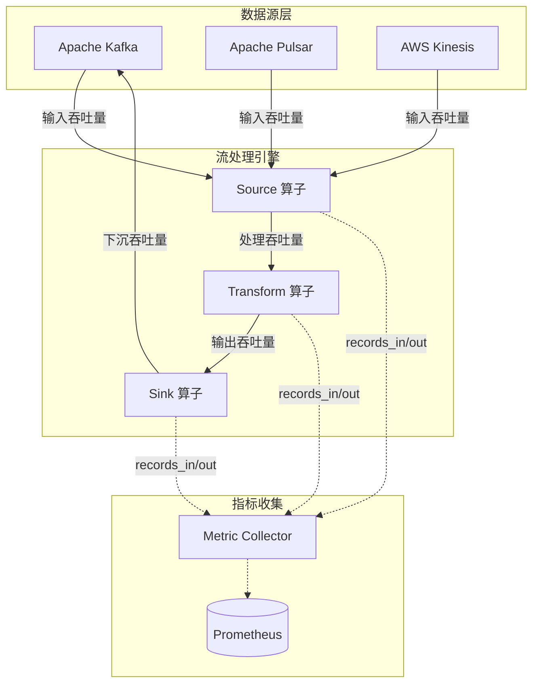
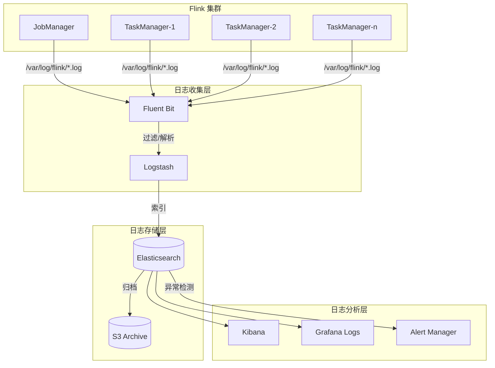
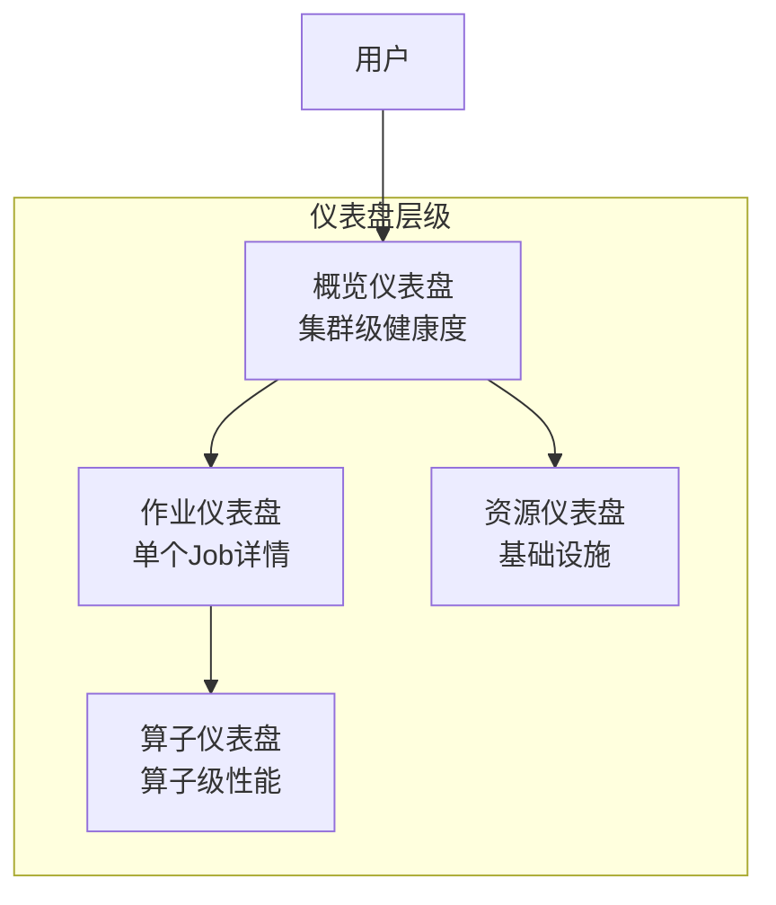
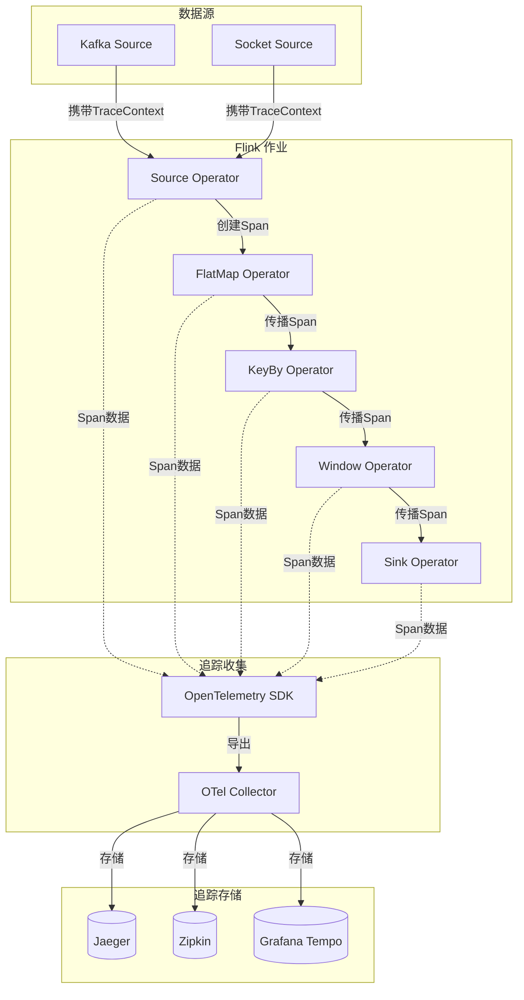
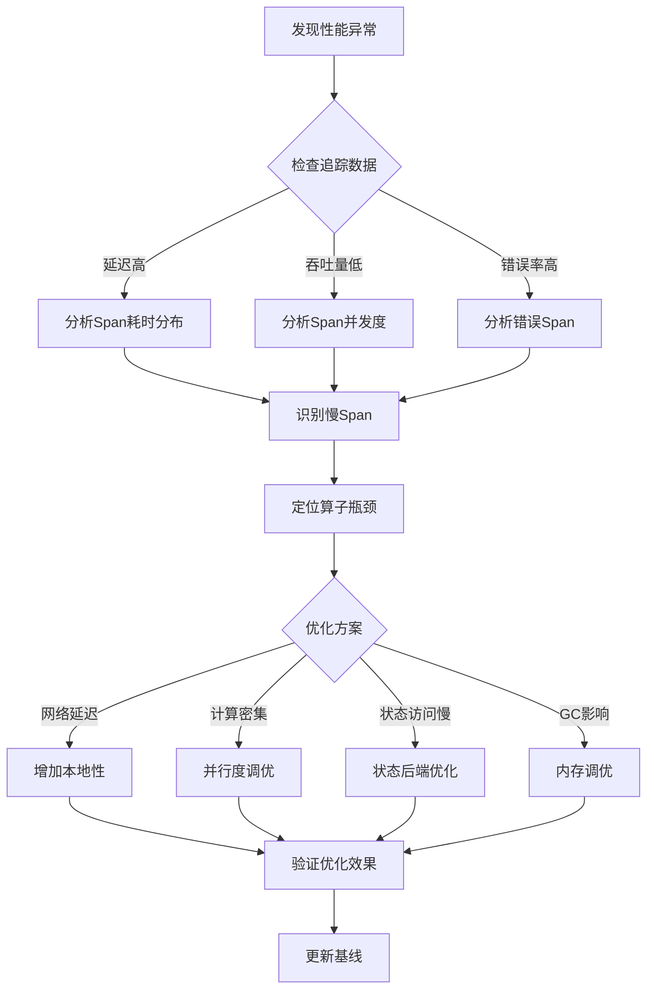
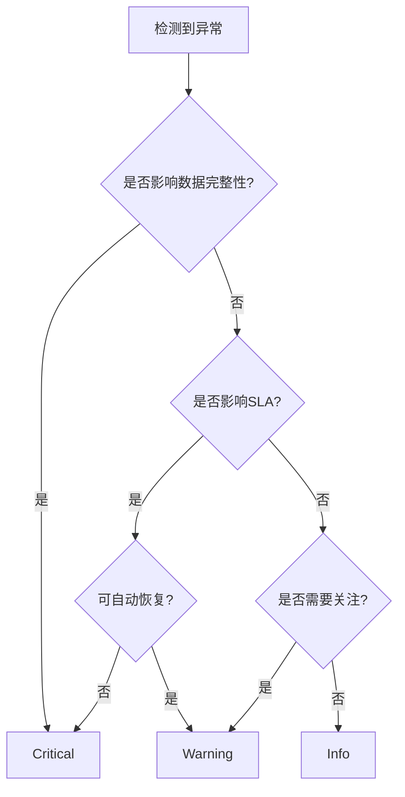
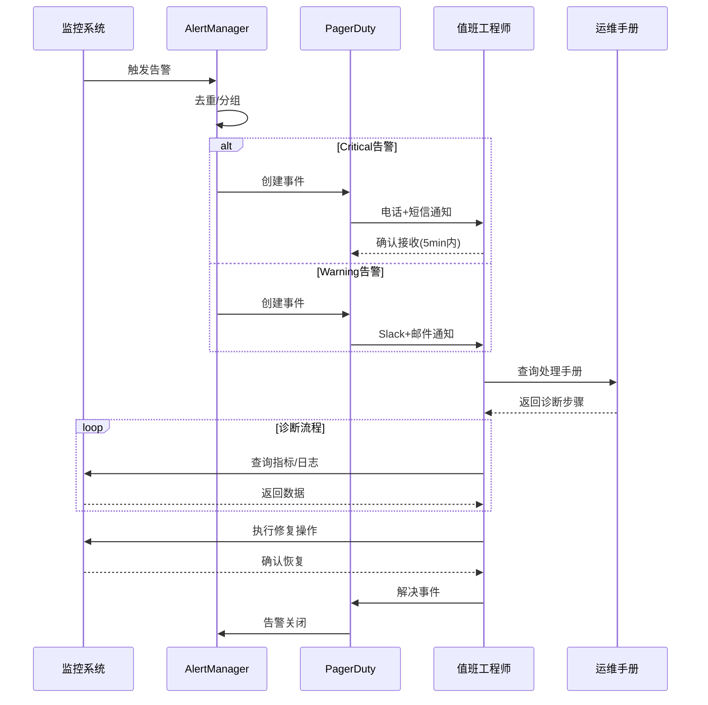
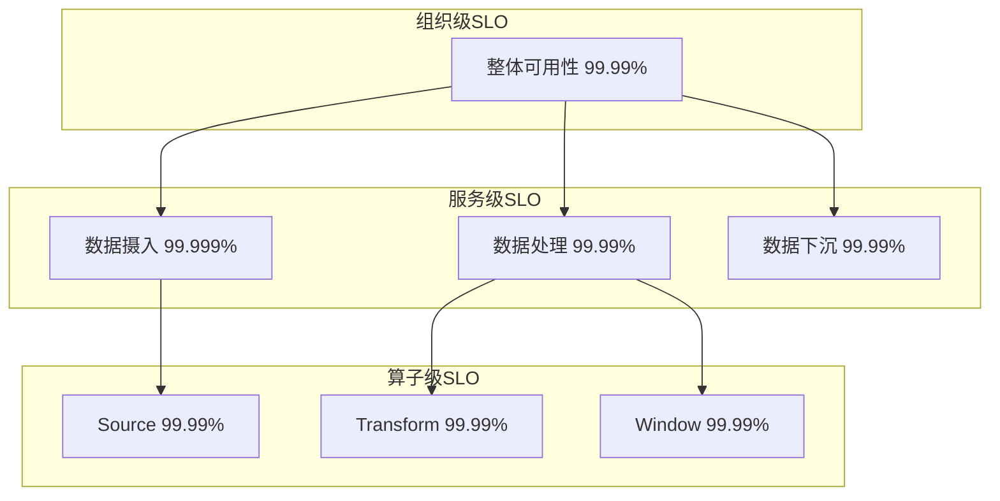
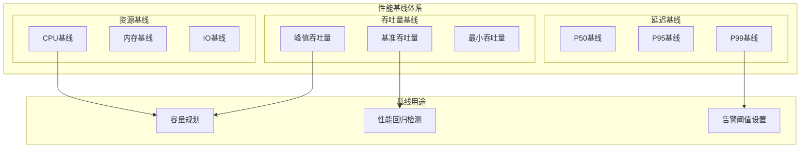
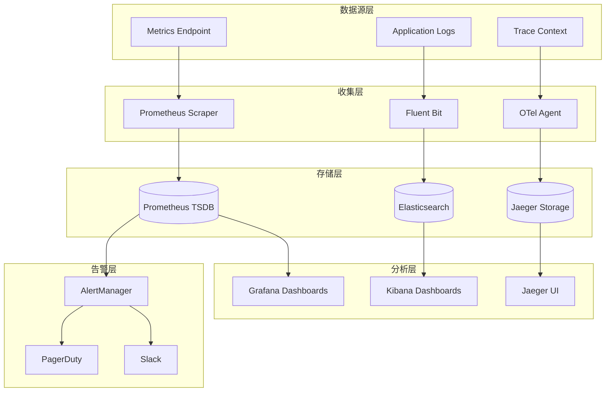

# AnalysisDataFlow 监控与可观测性指南

> 所属阶段: Knowledge | 前置依赖: [Flink运维部署指南] | 形式化等级: L3 (工程实践)

---

## 1. 监控指标体系 (Monitoring Metrics)

### 1.1 延迟指标 (Latency Metrics)

| 指标名称 | 类型 | 描述 | 采集方式 | 典型阈值 |
|---------|------|------|---------|---------|
| `latency_e2e_ms` | Gauge | 端到端延迟 (事件时间到处理完成) | Prometheus | P99 < 500ms |
| `latency_processing_ms` | Gauge | 处理延迟 (算子处理耗时) | Prometheus | P99 < 100ms |
| `latency_ingress_ms` | Gauge | 摄入延迟 (数据到达Source) | Prometheus | P99 < 50ms |
| `latency_checkpoint_ms` | Gauge | Checkpoint完成耗时 | Prometheus | < 60s |
| `latency_watermark_lag_ms` | Gauge | Watermark滞后于系统时间 | Prometheus | < 5min |

**计算公式:**

```
端到端延迟 = 当前系统时间 - 事件时间戳
处理延迟 = 处理完成时间 - 处理开始时间
Watermark滞后 = 当前系统时间 - 当前Watermark值
```

### 1.2 吞吐量指标 (Throughput Metrics)

| 指标名称 | 类型 | 描述 | 单位 | 采集频率 |
|---------|------|------|------|---------|
| `throughput_events_per_sec` | Counter | 每秒处理事件数 | events/s | 15s |
| `throughput_bytes_per_sec` | Counter | 每秒处理字节数 | bytes/s | 15s |
| `throughput_records_in` | Counter | 算子输入记录数 | records | 实时 |
| `throughput_records_out` | Counter | 算子输出记录数 | records | 实时 |
| `throughput_partitions_active` | Gauge | 活跃分区数 | partitions | 30s |

**吞吐量监控架构:**



### 1.3 错误率指标 (Error Rate Metrics)

| 指标名称 | 类型 | 描述 | 告警阈值 |
|---------|------|------|---------|
| `error_rate_total` | Counter | 总错误计数 | - |
| `error_rate_per_sec` | Gauge | 每秒错误率 | > 0.1% |
| `error_deserialization_count` | Counter | 反序列化错误 | > 10/min |
| `error_processing_count` | Counter | 处理逻辑错误 | > 5/min |
| `error_sink_count` | Counter | 下游写入错误 | > 5/min |
| `error_checkpoint_failed` | Counter | Checkpoint失败次数 | > 0 |

**错误率计算:**

```promql
# 错误率百分比
rate(error_rate_total[5m]) / rate(throughput_events_per_sec[5m]) * 100

# 5分钟错误趋势
increase(error_rate_total[5m])
```

### 1.4 资源使用指标 (Resource Metrics)

| 指标名称 | 类型 | 描述 | 告警阈值 | 严重性 |
|---------|------|------|---------|-------|
| `cpu_usage_percent` | Gauge | CPU使用率 | > 80% | Warning |
| `cpu_usage_percent` | Gauge | CPU使用率 | > 95% | Critical |
| `memory_heap_used_bytes` | Gauge | JVM堆内存使用 | > 80% | Warning |
| `memory_heap_used_bytes` | Gauge | JVM堆内存使用 | > 90% | Critical |
| `memory_nonheap_used_bytes` | Gauge | 非堆内存使用 | > 85% | Warning |
| `network_io_bytes_total` | Counter | 网络IO总量 | - | Info |
| `disk_io_bytes_total` | Counter | 磁盘IO总量 | - | Info |
| `gc_pause_time_ms` | Summary | GC暂停时间 | > 200ms | Warning |
| `thread_count` | Gauge | 线程数 | > 500 | Warning |

---

## 2. 日志系统 (Logging System)

### 2.1 日志格式规范

**结构化日志格式 (JSON):**

```json
{
  "timestamp": "2026-04-03T11:10:58.114Z",
  "level": "ERROR",
  "logger": "org.apache.flink.runtime.checkpoint.CheckpointCoordinator",
  "message": "Checkpoint 12345 failed",
  "context": {
    "job_id": "job-abc-123",
    "checkpoint_id": 12345,
    "operator_id": "op-xyz-789",
    "attempt_number": 3
  },
  "exception": {
    "type": "java.io.IOException",
    "message": "Connection timeout",
    "stacktrace": "..."
  },
  "metadata": {
    "host": "flink-taskmanager-2",
    "pod": "flink-tm-2-abc",
    "namespace": "streaming"
  },
  "trace_id": "4f6d9c8e7a5b2c1d",
  "span_id": "3e8f5a9b6c2d1e4f"
}
```

**日志级别定义:**

| 级别 | 用途 | 示例场景 | 保留策略 |
|------|------|---------|---------|
| `DEBUG` | 开发调试 | 变量值、执行路径 | 7天 |
| `INFO` | 正常运行信息 | 启动完成、配置加载 | 30天 |
| `WARN` | 潜在问题 | 配置弃用、性能降级 | 90天 |
| `ERROR` | 可恢复错误 | 网络超时、重试失败 | 180天 |
| `FATAL` | 系统级故障 | OOM、Checkpoint持续失败 | 365天 |

### 2.2 日志收集架构



**日志收集配置 (Fluent Bit):**

```ini
[INPUT]
    Name              tail
    Path              /var/log/flink/*.log
    Parser            json
    Tag               flink.logs
    Refresh_Interval  5

[FILTER]
    Name              modify
    Match             flink.logs
    Add               cluster production
    Add               environment flink-1.18

[OUTPUT]
    Name              elasticsearch
    Match             flink.logs
    Host              elasticsearch.default.svc
    Port              9200
    Index             flink-logs-%Y.%m.%d
    Type              _doc
```

### 2.3 日志分析查询

**常用KQL查询模板:**

```kql
-- 查询特定Job的错误日志
source = flink-logs
| where level == "ERROR"
| where context.job_id == "job-abc-123"
| summarize count() by bin(timestamp, 5m), logger
| render timechart

-- 异常模式检测
source = flink-logs
| where message contains "TimeoutException"
| extend error_type = extract(@"(\w+Exception)", 1, message)
| summarize count() by error_type, bin(timestamp, 1h)
| where count_ > 10

-- Checkpoint失败分析
source = flink-logs
| where logger contains "CheckpointCoordinator"
| where message contains "failed"
| extend checkpoint_id = tostring(context.checkpoint_id)
| project timestamp, checkpoint_id, message, metadata.host
| order by timestamp desc
```

---

## 3. 指标收集 (Metrics Collection)

### 3.1 Prometheus集成

**Flink Prometheus Reporter 配置:**

```yaml
# flink-conf.yaml
metrics.reporters: prometheus
metrics.reporter.prometheus.factory.class: org.apache.flink.metrics.prometheus.PrometheusReporterFactory
metrics.reporter.prometheus.port: 9249
metrics.reporter.prometheus.filter.includes: "*"

# 额外标签
metrics.reporter.prometheus.labels: env:production,team:platform
```

**关键指标抓取配置 (prometheus.yml):**

```yaml
global:
  scrape_interval: 15s
  evaluation_interval: 15s

scrape_configs:
  - job_name: 'flink-jobmanager'
    kubernetes_sd_configs:
      - role: pod
        namespaces:
          names:
            - flink
    relabel_configs:
      - source_labels: [__meta_kubernetes_pod_label_app]
        action: keep
        regex: flink-jobmanager
      - source_labels: [__meta_kubernetes_pod_ip]
        target_label: __address__
        regex: (.+)
        replacement: ${1}:9249

  - job_name: 'flink-taskmanager'
    kubernetes_sd_configs:
      - role: pod
        namespaces:
          names:
            - flink
    relabel_configs:
      - source_labels: [__meta_kubernetes_pod_label_app]
        action: keep
        regex: flink-taskmanager
      - source_labels: [__meta_kubernetes_pod_ip]
        target_label: __address__
        regex: (.+)
        replacement: ${1}:9249
```

**Prometheus指标类型映射:**

| Flink指标类型 | Prometheus类型 | 示例 | 说明 |
|--------------|---------------|------|------|
| Counter | Counter | `flink_taskmanager_job_task_numRecordsIn` | 单调递增 |
| Gauge | Gauge | `flink_taskmanager_Status_JVM_Memory_Heap_Used` | 瞬时值 |
| Meter | Counter + rate() | `flink_taskmanager_job_task_numRecordsInPerSecond` | 速率计算 |
| Histogram | Histogram | `flink_taskmanager_job_task_latency` | 分位统计 |

### 3.2 Grafana仪表盘

**仪表盘设计层次:**



**概览仪表盘关键面板:**

| 面板名称 | 数据源 | 查询示例 | 刷新频率 |
|---------|-------|---------|---------|
| 作业健康状态 | Prometheus | `flink_jobmanager_job_status` | 5s |
| 集群吞吐量 | Prometheus | `sum(rate(flink_taskmanager_job_task_numRecordsIn[1m]))` | 10s |
| 端到端延迟 | Prometheus | `flink_jobmanager_job_latency` | 10s |
| Checkpoint状态 | Prometheus | `flink_jobmanager_job_checkpoint` | 30s |
| 资源利用率 | Prometheus | `flink_taskmanager_Status_JVM_CPU_Load` | 15s |

**Grafana面板配置示例:**

```json
{
  "title": "端到端延迟",
  "type": "stat",
  "targets": [
    {
      "expr": "histogram_quantile(0.99, sum(rate(flink_taskmanager_job_task_latency[5m])) by (le))",
      "legendFormat": "P99"
    },
    {
      "expr": "histogram_quantile(0.95, sum(rate(flink_taskmanager_job_task_latency[5m])) by (le))",
      "legendFormat": "P95"
    }
  ],
  "fieldConfig": {
    "defaults": {
      "unit": "ms",
      "thresholds": {
        "steps": [
          {"color": "green", "value": null},
          {"color": "yellow", "value": 500},
          {"color": "red", "value": 1000}
        ]
      }
    }
  }
}
```

### 3.3 自定义指标

**Flink自定义指标代码示例 (Java):**

```java
import org.apache.flink.metrics.Counter;
import org.apache.flink.metrics.Gauge;
import org.apache.flink.metrics.Histogram;
import org.apache.flink.metrics.MetricGroup;
import org.apache.flink.runtime.metrics.DescriptiveStatisticsHistogram;

public class CustomMetricRichFunction extends RichMapFunction<Event, Result> {

    private transient Counter eventCounter;
    private transient Counter errorCounter;
    private transient Histogram processingTimeHistogram;
    private transient Gauge<Integer> queueSizeGauge;

    @Override
    public void open(Configuration parameters) {
        MetricGroup metricGroup = getRuntimeContext()
            .getMetricGroup()
            .addGroup("custom")
            .addGroup("myProcessor");

        // 计数器
        eventCounter = metricGroup.counter("eventsProcessed");
        errorCounter = metricGroup.counter("errors");

        // 直方图 - 处理时间分布
        processingTimeHistogram = metricGroup.histogram(
            "processingTimeMs",
            new DescriptiveStatisticsHistogram(1000)
        );

        // 仪表盘 - 队列大小
        queueSizeGauge = metricGroup.gauge("queueSize",
            () -> internalQueue.size());
    }

    @Override
    public Result map(Event event) {
        long startTime = System.currentTimeMillis();
        try {
            Result result = process(event);
            eventCounter.inc();
            return result;
        } catch (Exception e) {
            errorCounter.inc();
            throw e;
        } finally {
            processingTimeHistogram.update(System.currentTimeMillis() - startTime);
        }
    }
}
```

**自定义指标命名规范:**

| 指标类型 | 命名模式 | 示例 |
|---------|---------|------|
| 业务计数器 | `{domain}_{entity}_{action}_total` | `payment_order_created_total` |
| 业务仪表盘 | `{domain}_{entity}_{attribute}` | `payment_queue_pending_size` |
| 业务直方图 | `{domain}_{entity}_{action}_duration_ms` | `payment_processing_duration_ms` |
| 业务计量器 | `{domain}_{entity}_{action}_per_sec` | `payment_events_consumed_per_sec` |

---

## 4. 分布式追踪 (Distributed Tracing)

### 4.1 OpenTelemetry集成

**架构图:**



**OpenTelemetry配置:**

```yaml
# flink-conf.yaml
# OpenTelemetry Reporter配置
tracing.exporter: opentelemetry
tracing.opentelemetry.endpoint: http://otel-collector:4317
tracing.opentelemetry.timeout: 30000
tracing.opentelemetry.headers: api-key=${OTEL_API_KEY}

# Span采样配置
tracing.sampling.rate: 0.1
tracing.sampling.strategy: parent_based
```

**OTel Collector配置:**

```yaml
receivers:
  otlp:
    protocols:
      grpc:
        endpoint: 0.0.0.0:4317
      http:
        endpoint: 0.0.0.0:4318

processors:
  batch:
    timeout: 1s
    send_batch_size: 1024
  resource:
    attributes:
      - key: environment
        value: production
        action: upsert

exporters:
  jaeger:
    endpoint: jaeger:14250
    tls:
      insecure: true
  prometheusremotewrite:
    endpoint: http://prometheus:9090/api/v1/write

service:
  pipelines:
    traces:
      receivers: [otlp]
      processors: [batch, resource]
      exporters: [jaeger]
    metrics:
      receivers: [otlp]
      processors: [batch]
      exporters: [prometheusremotewrite]
```

### 4.2 追踪数据分析

**关键追踪指标:**

| 指标名称 | 描述 | 计算公式 | 健康阈值 |
|---------|------|---------|---------|
| 追踪覆盖率 | 被追踪的请求占比 | `带trace_id的请求数 / 总请求数` | > 90% |
| 平均Span数 | 每个追踪的Span数量 | `总Span数 / 总追踪数` | < 50 |
| 追踪深度 | 调用链最大深度 | `max(span.depth)` | < 10 |
| 采样命中率 | 采样策略命中比例 | `采样Span数 / 总Span数` | 符合配置 |

**追踪数据分析查询 (Jaeger):**

```sql
-- 查找最慢的追踪
SELECT trace_id, duration_ms, service_name
FROM traces
WHERE service_name = 'flink-taskmanager'
  AND duration_ms > 1000
ORDER BY duration_ms DESC
LIMIT 100;

-- 错误追踪分析
SELECT trace_id, error_message, count(*) as error_count
FROM traces
WHERE tags['error'] = 'true'
  AND timestamp > now() - interval '1 hour'
GROUP BY trace_id, error_message;

-- 服务依赖分析
SELECT upstream_service, downstream_service, count(*) as call_count
FROM spans
WHERE span_kind = 'client'
GROUP BY upstream_service, downstream_service;
```

### 4.3 性能瓶颈定位

**追踪驱动的性能分析流程:**



**性能瓶颈识别表:**

| 症状 | 追踪特征 | 可能原因 | 诊断方法 |
|------|---------|---------|---------|
| 端到端延迟高 | Root Span耗时分散 | 网络传输开销 | 检查跨网络Span比例 |
| 特定算子慢 | 某Span耗时占比>50% | 计算资源不足 | 查看该算子并行度 |
| 延迟波动大 | Span耗时标准差大 | GC或资源竞争 | 关联GC日志分析 |
| Checkpoint慢 | Barrier传播Span长 | 状态过大 | 检查状态大小指标 |
| Sink端慢 | Sink Span耗时高 | 下游背压 | 检查反压指标 |

---

## 5. 告警系统 (Alerting System)

### 5.1 告警规则配置

**Prometheus Alerting Rules:**

```yaml
# flink-alerts.yml
groups:
  - name: flink-critical
    interval: 30s
    rules:
      # Checkpoint失败告警
      - alert: FlinkCheckpointFailure
        expr: |
          rate(flink_jobmanager_job_checkpointFailures[5m]) > 0
        for: 1m
        labels:
          severity: critical
          team: platform
        annotations:
          summary: "Flink Checkpoint失败"
          description: "Job {{ $labels.job_name }} 的Checkpoint连续失败"
          runbook_url: "https://wiki/runbooks/flink-checkpoint"

      # 作业失败告警
      - alert: FlinkJobFailed
        expr: |
          flink_jobmanager_job_status == 2
        for: 0s
        labels:
          severity: critical
          team: platform
        annotations:
          summary: "Flink作业失败"
          description: "Job {{ $labels.job_name }} 状态为FAILED"

  - name: flink-warning
    interval: 1m
    rules:
      # 延迟告警
      - alert: FlinkLatencyHigh
        expr: |
          histogram_quantile(0.99,
            sum(rate(flink_taskmanager_job_task_latency[5m])) by (le, job_name)
          ) > 1000
        for: 5m
        labels:
          severity: warning
          team: platform
        annotations:
          summary: "Flink延迟过高"
          description: "Job {{ $labels.job_name }} P99延迟超过1秒"

      # 反压告警
      - alert: FlinkBackpressure
        expr: |
          flink_taskmanager_job_task_backPressuredTimePerSecond > 0.2
        for: 5m
        labels:
          severity: warning
          team: platform
        annotations:
          summary: "Flink出现反压"
          description: "Task {{ $labels.task_name }} 存在反压"

      # 内存使用率告警
      - alert: FlinkMemoryHigh
        expr: |
          flink_taskmanager_Status_JVM_Memory_Heap_Used /
          flink_taskmanager_Status_JVM_Memory_Heap_Committed > 0.85
        for: 10m
        labels:
          severity: warning
          team: platform
        annotations:
          summary: "Flink堆内存使用率过高"
          description: "TaskManager {{ $labels.instance }} 堆内存使用超过85%"

  - name: flink-info
    interval: 5m
    rules:
      # 版本升级提示
      - alert: FlinkVersionOutdated
        expr: |
          flink_jobmanager_info_version != "1.18.0"
        for: 1h
        labels:
          severity: info
          team: platform
        annotations:
          summary: "Flink版本可升级"
          description: "当前版本 {{ $labels.version }}，建议升级到1.18.0"
```

### 5.2 告警级别定义

| 级别 | 颜色 | 响应时间 | 通知渠道 | 升级条件 |
|------|------|---------|---------|---------|
| **Critical** | 🔴 红色 | 5分钟内 | PagerDuty + 电话 + 邮件 | 15分钟未解决升级至TL |
| **Warning** | 🟡 黄色 | 30分钟内 | Slack + 邮件 | 1小时未解决升级至Critical |
| **Info** | 🔵 蓝色 | 4小时内 | 邮件 | 不升级 |

**告警级别决策树:**



### 5.3 告警响应流程

**标准操作流程 (SOP):**



**告警处理清单:**

| 步骤 | 操作 | 检查点 | 时限 |
|------|------|-------|------|
| 1 | 确认告警 | 在PagerDuty确认 | < 5min |
| 2 | 初步评估 | 判断影响范围 | < 10min |
| 3 | 查询上下文 | 查看相关指标/日志 | < 15min |
| 4 | 执行修复 | 按Runbook操作 | 视情况而定 |
| 5 | 验证恢复 | 确认指标恢复正常 | 修复后立即 |
| 6 | 记录事件 | 填写事后分析 | < 24h |

---

## 6. SLO定义 (Service Level Objectives)

### 6.1 服务水平目标

**核心SLO定义表:**

| SLO名称 | 目标值 | 测量窗口 | 测量方法 | 业务影响 |
|--------|-------|---------|---------|---------|
| **可用性** | 99.99% | 30天 | `正常运行时间 / 总时间` | 数据丢失风险 |
| **端到端延迟 (P99)** | < 500ms | 7天滑动窗口 | `histogram_quantile(0.99, latency)` | 实时性体验 |
| **端到端延迟 (P95)** | < 200ms | 7天滑动窗口 | `histogram_quantile(0.95, latency)` | 实时性体验 |
| **吞吐量稳定性** | > 99.9% | 1天 | `实际吞吐量 / 预期吞吐量` | 处理能力保障 |
| **数据准确性** | 99.999% | 30天 | `1 - (错误记录数 / 总记录数)` | 数据质量 |
| **Checkpoint成功率** | > 99.5% | 7天 | `成功Checkpoint数 / 总尝试数` | 容错能力 |
| **恢复时间 (RTO)** | < 5min | 每次故障 | `故障恢复时刻 - 故障发生时刻` | 业务连续性 |
| **恢复点 (RPO)** | < 1min | 每次故障 | `最后成功Checkpoint时间 - 故障时间` | 数据丢失量 |

**SLO层级结构:**



### 6.2 错误预算

**错误预算计算:**

```
错误预算 = (1 - SLO目标) × 测量周期总请求数
```

**错误预算表:**

| SLO | 目标 | 测量周期 | 总请求数估算 | 错误预算 | 消耗速率警报 |
|-----|------|---------|------------|---------|-------------|
| 可用性 | 99.99% | 30天 | 43,200分钟 | 4.32分钟 | 2天内用完 |
| 延迟P99 | 500ms | 7天 | 10亿次 | 100万次超标 | 1天内用完50% |
| Checkpoint成功率 | 99.5% | 7天 | 10,080次 | 50次失败 | 3天内用完 |

**错误预算消耗监控:**

```promql
# 可用性错误预算消耗
(
  1 -
  (
    sum(increase(flink_uptime_seconds[30d]))
    /
    sum(increase(flink_total_time_seconds[30d]))
  )
) / (1 - 0.9999)

# 延迟错误预算消耗
(
  sum(
    rate(flink_latency_bucket{le="+Inf"}[7d])
    - rate(flink_latency_bucket{le="500"}[7d])
  )
  /
  sum(rate(flink_latency_count[7d]))
) / (1 - 0.99)
```

**错误预算政策:**

| 预算消耗阶段 | 政策 | 行动 |
|-------------|------|------|
| < 50% | 正常运营 | 按计划发布 |
| 50% - 75% | 谨慎发布 | 需额外评审，禁止实验性功能 |
| 75% - 90% | 冻结发布 | 仅允许紧急修复，所有变更需审批 |
| > 90% | 紧急模式 | 停止所有非紧急变更，启动事故复盘 |

### 6.3 性能基线

**基线指标定义:**



**基线数据表 (示例):**

| 指标类别 | 指标名称 | 基线值 | 允许波动 | 采集周期 | 更新频率 |
|---------|---------|-------|---------|---------|---------|
| 吞吐量 | events/sec | 100,000 | ±10% | 每小时 | 每周 |
| 延迟P99 | end-to-end | 300ms | +50ms | 每分钟 | 每周 |
| 延迟P95 | end-to-end | 150ms | +30ms | 每分钟 | 每周 |
| CPU使用率 | average | 60% | ±15% | 每5分钟 | 每月 |
| 堆内存 | used/committed | 70% | ±10% | 每5分钟 | 每月 |
| GC暂停 | max pause | 100ms | +50ms | 每次GC | 每周 |

**基线偏差检测:**

```promql
# 吞吐量偏差检测
abs(
  rate(flink_throughput_events[1h])
  - flink_throughput_baseline
) / flink_throughput_baseline > 0.15

# 延迟回归检测
histogram_quantile(0.99,
  sum(rate(flink_latency_bucket[1h])) by (le)
) > flink_latency_p99_baseline * 1.2
```

---

## 7. 可视化 (Visualizations)

### 整体可观测性架构



---

## 8. 引用参考 (References)


---

*文档版本: v1.0 | 最后更新: 2026-04-03 | 维护团队: Platform Engineering*
