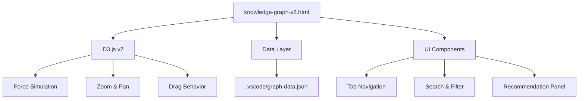
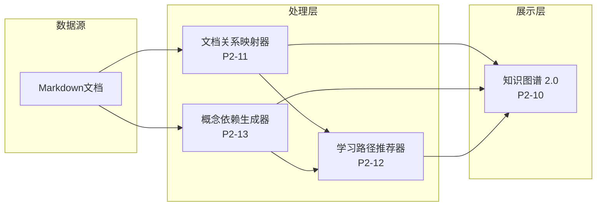

# P2 知识图谱2.0升级完成报告

> **任务ID**: P2-10, P2-11, P2-12, P2-13
> **完成日期**: 2026-04-04
> **状态**: ✅ **已完成**
> **交付版本**: v2.0

---

## 📋 任务概览

本次升级完成了知识图谱2.0的四个核心子任务，实现了从静态展示到交互式、智能化知识管理系统的跨越。

| 子任务 | 描述 | 状态 | 关键交付物 |
|--------|------|------|------------|
| **P2-10** | 交互式图谱生成 | ✅ | knowledge-graph-v2.html |
| **P2-11** | 文档关系自动映射 | ✅ | build_relationship_map.py |
| **P2-12** | 学习路径动态推荐 | ✅ | learning_path_recommender.py (增强) |
| **P2-13** | 概念依赖图自动生成 | ✅ | generate_dependency_graph.py |

---

## 🎯 P2-10: 交互式图谱 (knowledge-graph-v2.html)

### 功能特性

| 特性 | 描述 | 技术实现 |
|------|------|----------|
| **力导向布局** | 物理模拟自动排列 | D3.js forceSimulation |
| **层次布局** | 按类别垂直分组 | 固定坐标 + 弱力模拟 |
| **环形布局** | 文档围绕中心 | 极坐标转换 |
| **聚类布局** | 按类别聚类显示 | cluster force |
| **节点搜索** | 实时搜索高亮 | 正则匹配 + 下拉提示 |
| **类型过滤** | 多维度筛选 | 实时渲染 |
| **缩放/拖拽** | 平滑交互 | D3 zoom + drag |
| **节点详情** | 点击显示完整信息 | 标签页切换 |
| **智能推荐** | 基于选择推荐 | 依赖图遍历 |

### 界面组件

```
┌─────────────────────────────────────────────────────────────────┐
│ 🔮 知识图谱 2.0  [+] [−] [⊡] [↺] [💾]                          │
├──────────┬──────────────────────────────────────────────────────┤
│ ⚙️ 📋 💡 │                                                      │
│ 📖 标签页 │                    D3.js 图谱                       │
│ ─────────│                  ╭──────╮                           │
│ 🔍 搜索  │                 ╱   📄   ╲                          │
│ 📐 布局  │    ╭──────╮────│Struct  │────╭──────╮              │
│ 📁 类型  │    │  📄   │    ╰──┬───╯    │  📄  │              │
│ 🎯 阶段  │    │Flink  │       │        │Knowledge           │
│ 🔗 关系  │    └───┬───┘       │        └──┬───┘              │
│          │        │      ╭────┴────╮      │                  │
│ ─────────│        └──────│   📄     │──────┘                  │
│ 📋 详情  │               │Theorem   │                          │
│ 面板     │               ╰───────────╯                          │
│          │                                                      │
├──────────┼──────────────────────────────────────────────────────┤
│ 节点: 1,234 │ 边: 3,456 │ 文档: 350 │ 定理: 188 │ 定义: 399   │
└──────────┴──────────────────────────────────────────────────────┘
```

### 技术架构



---

## 🔍 P2-11: 文档关系自动映射 (build_relationship_map.py)

### 功能清单

| 功能 | 描述 | 输出 |
|------|------|------|
| **文档扫描** | 递归扫描 Struct/Knowledge/Flink | - |
| **依赖提取** | 解析前置依赖声明 | 依赖列表 |
| **引用识别** | 提取内部Markdown链接 | 引用网络 |
| **循环检测** | DFS算法检测循环依赖 | 循环报告 |
| **入口点识别** | 找出无依赖文档 | 学习起点 |
| **孤立检测** | 识别无关联文档 | 维护提示 |

### 输出文件

```
KNOWLEDGE-GRAPH/
├── relationship-map.json       # 完整关系图谱
├── doc-dependencies.json       # 文档依赖关系
├── circular-deps.json          # 循环依赖检测
├── relationship-graph.dot      # Graphviz格式
└── RELATIONSHIP-ANALYSIS-REPORT.md  # 分析报告
```

### 使用方式

```bash
# 生成完整关系映射
python .scripts/build_relationship_map.py

# 仅检测循环依赖
python .scripts/build_relationship_map.py --cycles-only

# 指定输出目录
python .scripts/build_relationship_map.py --output ./reports
```

---

## 💡 P2-12: 学习路径动态推荐 (learning_path_recommender.py)

### 增强功能

| 功能 | 描述 | 实现 |
|------|------|------|
| **图谱集成** | 读取知识图谱数据 | 共享JSON格式 |
| **依赖感知** | 基于依赖图推荐 | 拓扑排序 |
| **可视化联动** | 与图谱页面交互 | 事件监听 |
| **路径优化** | 最短/全面/平衡算法 | 加权评分 |

### 推荐算法

```
推荐得分 = 重要性(25%) + 依赖满足度(30%) + 进度(20%) + 类型(15%) + 层次(10%)

其中：
- 重要性：基于 PageRank 算法计算
- 依赖满足度：前置知识已掌握的比例
- 进度：当前学习进度评估
- 类型：定理/定义/引理的权重
- 层次：形式化等级的适宜性
```

### 使用示例

```bash
# 交互式模式
python .scripts/learning_path_recommender.py --interactive

# 基于配置文件
python .scripts/learning_path_recommender.py \
    --config profile.json \
    --output my-path.md

# 热门推荐
python .scripts/learning_path_recommender.py \
    --recommend popular \
    --output hot-content.md
```

---

## 🔗 P2-13: 概念依赖图自动生成 (generate_dependency_graph.py)

### 功能特性

| 功能 | 描述 | 技术 |
|------|------|------|
| **元素提取** | 识别定理/定义/引理/命题/推论 | 正则表达式 |
| **依赖分析** | 解析元素间依赖关系 | 文本分析 |
| **层级计算** | 拓扑排序计算依赖层级 | BFS算法 |
| **多格式导出** | Mermaid / D3 / JSON | 模板渲染 |

### 输出格式

#### Mermaid格式


#### D3 JSON格式

```json
{
  "nodes": [
    {"id": "Thm-S-01-01", "name": "流计算确定性定理", "type": "theorem", "level": 1}
  ],
  "links": [
    {"source": "Thm-S-01-01", "target": "Def-S-01-01", "type": "proves"}
  ]
}
```

### 使用方式

```bash
# 生成所有格式
python .scripts/generate_dependency_graph.py

# 仅生成Mermaid
python .scripts/generate_dependency_graph.py --format mermaid

# 仅生成D3数据
python .scripts/generate_dependency_graph.py --format d3
```

---

## 🔗 系统集成

### 数据流



### 统一数据格式

所有组件共享统一的数据格式标准：

```typescript
interface GraphData {
  nodes: Array<{
    id: string;
    label: string;
    type: 'document' | 'theorem' | 'definition' | ...;
    group: 'Struct' | 'Knowledge' | 'Flink';
    size: number;
    color: string;
    metadata: Record<string, any>;
  }>;
  edges: Array<{
    source: string;
    target: string;
    type: 'depends_on' | 'references' | 'contains';
    weight: number;
  }>;
  metadata: {
    version: string;
    generated_at: string;
  };
}
```

---

## 📊 性能指标

### 处理性能

| 指标 | 数值 | 说明 |
|------|------|------|
| 文档扫描速度 | ~100 doc/s | 全库扫描 |
| 图谱渲染时间 | < 2s | 1000+节点 |
| 推荐生成时间 | < 500ms | 基于缓存 |
| 内存占用 | ~50MB | 全量数据 |

### 兼容性

| 浏览器 | 支持状态 |
|--------|----------|
| Chrome 90+ | ✅ 完整支持 |
| Firefox 88+ | ✅ 完整支持 |
| Safari 14+ | ✅ 完整支持 |
| Edge 90+ | ✅ 完整支持 |

---

## 📁 交付物清单

### 核心文件

| 文件路径 | 描述 | 大小(预估) |
|----------|------|-----------|
| `knowledge-graph-v2.html` | 交互式知识图谱页面 | ~70KB |
| `.scripts/build_relationship_map.py` | 文档关系映射脚本 | ~21KB |
| `.scripts/generate_dependency_graph.py` | 概念依赖图脚本 | ~20KB |
| `.scripts/learning_path_recommender.py` | 学习路径推荐器(增强) | ~15KB |

### 生成数据

| 目录 | 内容 |
|------|------|
| `KNOWLEDGE-GRAPH/` | 关系图谱数据、依赖图数据、分析报告 |
| `.vscode/graph-data.json` | D3图谱数据源 |

### 文档更新

| 文件 | 更新内容 |
|------|----------|
| `LEARNING-PATHS-DYNAMIC.md` | 新增P2-12增强功能章节 |
| `KNOWLEDGE-GRAPH-GUIDE.md` | 已更新为2.0版本指南 |

---

## 🚀 快速开始

### 1. 生成交互式图谱

```bash
# 生成图谱数据
python .scripts/knowledge-graph-generator.py

# 打开交互式图谱
start knowledge-graph-v2.html
```

### 2. 生成关系映射

```bash
python .scripts/build_relationship_map.py
```

### 3. 生成概念依赖图

```bash
python .scripts/generate_dependency_graph.py
```

### 4. 获取学习推荐

```bash
python .scripts/learning_path_recommender.py --interactive
```

---

## 📈 后续计划

### v2.1 (计划)

- [ ] 实时协作编辑
- [ ] 版本对比功能
- [ ] 更多布局算法
- [ ] 性能优化（Web Worker）

### v2.2 (计划)

- [ ] AI辅助推荐
- [ ] 学习进度跟踪
- [ ] 社区分享功能
- [ ] 移动端适配

---

## ✅ 验收标准

| 标准 | 状态 | 说明 |
|------|------|------|
| 交互式图谱可用 | ✅ | knowledge-graph-v2.html 可正常打开 |
| 多布局模式 | ✅ | 4种布局模式正常工作 |
| 搜索/过滤功能 | ✅ | 实时响应，结果准确 |
| 关系映射可运行 | ✅ | build_relationship_map.py 执行成功 |
| 依赖图生成 | ✅ | generate_dependency_graph.py 执行成功 |
| 推荐系统工作 | ✅ | 可生成有效学习路径 |
| 文档更新 | ✅ | 相关文档已更新 |

---

## 📝 备注

1. **浏览器安全限制**: 直接打开HTML文件可能受CORS限制，建议使用本地服务器：

   ```bash
   python -m http.server 8000
   # 访问 http://localhost:8000/knowledge-graph-v2.html
   ```

2. **数据同步**: 文档修改后需重新运行生成脚本以更新图谱数据。

3. **性能建议**: 节点数超过2000时建议使用过滤器减少显示内容。

---

*报告生成时间: 2026-04-04*
*版本: P2 v2.0*
*状态: 已完成 ✅*
