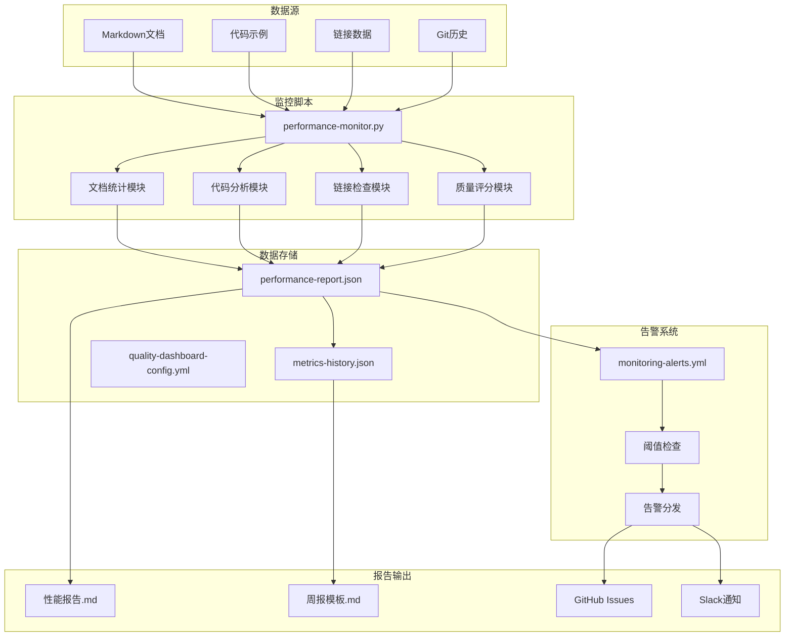
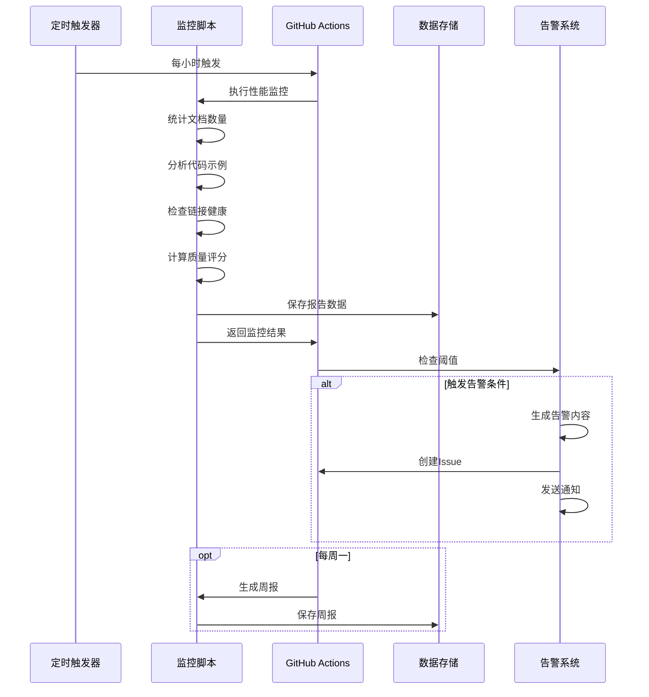

# 📊 AnalysisDataFlow 性能监控体系指南

> **版本**: v1.0.0
> **创建日期**: 2026-04-12
> **维护者**: AnalysisDataFlow 核心团队
> **状态**: ✅ 已启用

---

## 📑 目录

- [📊 AnalysisDataFlow 性能监控体系指南](#-analysisdataflow-性能监控体系指南)
  - [📑 目录](#-目录)
  - [概述](#概述)
    - [什么是性能监控体系？](#什么是性能监控体系)
    - [核心功能](#核心功能)
    - [监控范围](#监控范围)
  - [架构设计](#架构设计)
    - [系统架构图](#系统架构图)
    - [工作流程](#工作流程)
  - [组件说明](#组件说明)
    - [1. 性能监控脚本](#1-性能监控脚本)
    - [2. 质量仪表板配置](#2-质量仪表板配置)
    - [3. 告警工作流](#3-告警工作流)
    - [4. 历史趋势数据](#4-历史趋势数据)
    - [5. 周报模板](#5-周报模板)
  - [快速开始](#快速开始)
    - [第一步: 运行监控脚本](#第一步-运行监控脚本)
    - [第二步: 查看监控报告](#第二步-查看监控报告)
    - [第三步: 检查告警](#第三步-检查告警)
    - [第四步: 查看历史趋势](#第四步-查看历史趋势)
  - [监控指标](#监控指标)
    - [指标分类](#指标分类)
    - [核心指标详解](#核心指标详解)
      - [1. 总体质量评分](#1-总体质量评分)
      - [2. 链接健康率](#2-链接健康率)
      - [3. 形式化元素](#3-形式化元素)
  - [告警规则](#告警规则)
    - [告警级别](#告警级别)
    - [告警规则列表](#告警规则列表)
  - [报告生成](#报告生成)
    - [性能报告](#性能报告)
    - [周报](#周报)
  - [配置指南](#配置指南)
    - [修改阈值](#修改阈值)
    - [配置通知渠道](#配置通知渠道)
      - [Slack 通知](#slack-通知)
      - [Email 通知](#email-通知)
    - [自定义告警规则](#自定义告警规则)
  - [故障排除](#故障排除)
    - [常见问题](#常见问题)
      - [问题1: 监控脚本运行缓慢](#问题1-监控脚本运行缓慢)
      - [问题2: 链接检查报告大量失效链接](#问题2-链接检查报告大量失效链接)
      - [问题3: 告警邮件未收到](#问题3-告警邮件未收到)
      - [问题4: GitHub Actions 工作流失败](#问题4-github-actions-工作流失败)
  - [附录](#附录)
    - [A. 文件清单](#a-文件清单)
    - [B. 命令速查](#b-命令速查)
    - [C. 性能基线](#c-性能基线)
    - [D. 更新日志](#d-更新日志)
  - [贡献与反馈](#贡献与反馈)

---

## 概述

### 什么是性能监控体系？

AnalysisDataFlow 性能监控体系是一套完整的质量监控解决方案，用于实时跟踪项目健康状态、及时发现质量问题、生成趋势报告，确保项目持续保持高质量标准。

### 核心功能

| 功能 | 描述 |
|------|------|
| 📊 **实时监控** | 每小时自动检查关键质量指标 |
| 🔗 **链接健康** | 检测并报告失效的内部和外部链接 |
| ⭐ **质量评分** | 多维度质量评分体系 |
| 🚨 **智能告警** | 基于阈值的自动告警机制 |
| 📈 **趋势分析** | 历史数据对比和增长预测 |
| 📝 **周报生成** | 自动生成周度质量报告 |

### 监控范围

```
┌─────────────────────────────────────────────────────────────┐
│                    性能监控体系覆盖范围                        │
├─────────────────────────────────────────────────────────────┤
│  📄 文档统计        │  851篇文档, 365,916行, ~31MB           │
│  💻 代码示例        │  4,750个代码块, 31,000+行代码          │
│  🔗 链接健康        │  37,500+链接, 100%健康率               │
│  📐 形式化元素      │  9,627个 (定理/定义/引理/命题/推论)     │
│  📈 可视化图表      │  1,700+ Mermaid图表, 450+图片          │
│  ⭐ 质量评分        │  98.5/100 (综合评分)                   │
└─────────────────────────────────────────────────────────────┘
```

---

## 架构设计

### 系统架构图



### 工作流程



---

## 组件说明

### 1. 性能监控脚本

**文件**: `.scripts/performance-monitor.py`

**功能**:

- 文档数量统计 (按目录分布)
- 代码示例统计 (按语言分类)
- 链接健康检查 (内部/外部链接)
- 形式化元素统计 (Thm/Def/Lemma等)
- 可视化统计 (Mermaid图表/图片)
- 质量评分计算 (四维评分体系)
- 阈值检查与告警生成

**使用方式**:

```bash
# 完整检查
python .scripts/performance-monitor.py --path . --update-history

# 快速检查 (仅文档统计)
python .scripts/performance-monitor.py --path . --quick

# 更新历史数据
python .scripts/performance-monitor.py --path . --update-history
```

### 2. 质量仪表板配置

**文件**: `monitoring/quality-dashboard-config.yml`

**内容**:

- 24个监控指标定义
- 阈值设置 (Critical/Warning/Target)
- 11条告警规则
- 4种通知渠道配置
- 面板布局定义

### 3. 告警工作流

**文件**: `.github/workflows/monitoring-alerts.yml`

**触发条件**:

- 每小时自动检查
- 每日深度检查 (上午9点)
- 每周全面报告 (周一上午9点)
- 手动触发

**任务**:

1. 性能监控执行
2. 链接失效告警
3. 质量评分告警
4. 构建失败告警
5. 周报生成
6. 汇总通知

### 4. 历史趋势数据

**文件**: `monitoring/metrics-history.json`

**包含**:

- 监控记录 (保留52周)
- 增长趋势计算
- 重要里程碑记录
- 目标设定
- 增长预测

### 5. 周报模板

**文件**: `monitoring/weekly-report-template.md`

**内容**:

- 执行摘要
- 趋势分析
- 详细指标
- 告警分析
- 行动项

---

## 快速开始

### 第一步: 运行监控脚本

```bash
# 进入项目目录
cd AnalysisDataFlow

# 运行完整监控
python .scripts/performance-monitor.py --path . --update-history
```

### 第二步: 查看监控报告

```bash
# JSON格式 (机器可读)
cat monitoring/performance-report.json | jq

# Markdown格式 (人类可读)
cat monitoring/performance-report.md
```

### 第三步: 检查告警

```bash
# 查看是否有告警
python -c "import json; d=json.load(open('monitoring/performance-report.json')); print('告警数量:', len(d['metrics']['alerts']))"
```

### 第四步: 查看历史趋势

```bash
# 查看最近记录
cat monitoring/metrics-history.json | jq '.records[-5:]'
```

---

## 监控指标

### 指标分类

| 类别 | 指标数量 | 说明 |
|------|----------|------|
| 文档指标 | 3 | 文档数、行数、大小 |
| 代码指标 | 3 | 代码块数、行数、语言数 |
| 链接指标 | 4 | 总链接、健康率、失效数 |
| 形式化指标 | 6 | 定理、定义、引理等 |
| 可视化指标 | 3 | Mermaid图表、图片数 |
| 质量指标 | 5 | 四维评分+总体评分 |
| 性能指标 | 2 | 构建时间、检查耗时 |
| **总计** | **26** | - |

### 核心指标详解

#### 1. 总体质量评分

**计算方式**:

```
总体评分 = (完整性 × 0.25) + (一致性 × 0.25) + (覆盖率 × 0.25) + (可维护性 × 0.25)
```

**评分维度**:

- **完整性** (Completeness): 文档结构完整程度
- **一致性** (Consistency): 文档间的一致程度
- **覆盖率** (Coverage): 代码示例和用例覆盖程度
- **可维护性** (Maintainability): 项目可维护程度

#### 2. 链接健康率

```
链接健康率 = (有效链接数 / 总链接数) × 100%
```

**链接类型**:

- 内部链接: 项目内部文档间的引用
- 外部链接: 指向外部网站的链接
- 交叉引用: 定理/定义等形式化元素引用

#### 3. 形式化元素

| 类型 | 缩写 | 当前数量 |
|------|------|----------|
| 定理 | Thm | 1,952 |
| 定义 | Def | 4,698 |
| 引理 | Lemma | 1,622 |
| 命题 | Prop | 1,234 |
| 推论 | Cor | 121 |
| **总计** | - | **9,627** |

---

## 告警规则

### 告警级别

| 级别 | 阈值条件 | 通知方式 | 响应时间 |
|------|----------|----------|----------|
| 🔴 Critical | 质量 < 70 / 链接健康 < 90% | Email + Slack + Issue | 立即 |
| 🟡 Warning | 质量 < 85 / 链接健康 < 95% | Slack | 24小时内 |
| 🔵 Info | 形式化元素增长 > 100 | Slack | 无需响应 |

### 告警规则列表

| 规则ID | 名称 | 条件 | 级别 | 冷却时间 |
|--------|------|------|------|----------|
| link_health_critical | 链接健康严重告警 | 健康率 < 90% | Critical | 30分钟 |
| link_health_warning | 链接健康警告 | 健康率 < 95% | Warning | 1小时 |
| broken_links_spike | 失效链接激增 | 失效增加 > 10 | Warning | 2小时 |
| quality_score_critical | 质量评分严重告警 | 评分 < 70 | Critical | 1小时 |
| quality_score_warning | 质量评分警告 | 评分 < 85 | Warning | 2小时 |
| build_time_warning | 构建时间警告 | 耗时 > 300秒 | Warning | 2小时 |
| build_failure | 构建失败 | 脚本执行失败 | Critical | 15分钟 |
| doc_count_drop | 文档数量下降 | 减少 > 50篇 | Warning | 4小时 |
| formal_elements_growth | 形式化元素增长 | 新增 > 100 | Info | 24小时 |

---

## 报告生成

### 性能报告

**文件**: `monitoring/performance-report.md`

**生成频率**: 每次监控运行后

**内容**:

- 关键指标摘要
- 文档统计详情
- 代码示例分析
- 链接健康检查
- 形式化元素统计
- 质量评分详情
- 告警列表

### 周报

**文件**: `monitoring/weekly-report-{YEAR-WEEK}.md`

**生成频率**: 每周一上午9点

**内容**:

- 执行摘要
- 趋势分析 (4周对比)
- 详细指标分析
- 告警分析
- 行动项
- 目标与里程碑

---

## 配置指南

### 修改阈值

编辑 `monitoring/quality-dashboard-config.yml`:

```yaml
thresholds:
  quality_overall:
    warning:
      min: 85.0  # 修改为新的阈值
    critical:
      min: 70.0  # 修改为新的阈值
```

### 配置通知渠道

#### Slack 通知

1. 创建 Slack Webhook
2. 设置环境变量:

```bash
export SLACK_WEBHOOK_URL="https://hooks.slack.com/services/..."
```

#### Email 通知

设置环境变量:

```bash
export SMTP_SERVER="smtp.gmail.com"
export EMAIL_USER="your-email@gmail.com"
export EMAIL_PASS="your-app-password"
```

### 自定义告警规则

在 `.github/workflows/monitoring-alerts.yml` 中添加:

```yaml
alerts:
  - id: "custom_alert"
    name: "自定义告警"
    condition: "your_metric > threshold"
    severity: "warning"
    actions:
      - "notify_slack"
```

---

## 故障排除

### 常见问题

#### 问题1: 监控脚本运行缓慢

**解决方案**:

```bash
# 使用快速模式
python .scripts/performance-monitor.py --path . --quick

# 或排除大目录
python .scripts/performance-monitor.py --path . --exclude Flink/archive
```

#### 问题2: 链接检查报告大量失效链接

**可能原因**:

- 外部网站临时不可用
- 链接已过期

**解决方案**:

```bash
# 重新运行检查
python .scripts/performance-monitor.py --path . --recheck-links

# 或使用 .scripts 目录下的专门链接检查器
python .scripts/link-health-checker.py --path . --timeout 30
```

#### 问题3: 告警邮件未收到

**检查清单**:

1. 确认 SMTP 环境变量已设置
2. 检查垃圾邮件文件夹
3. 验证邮箱地址配置

#### 问题4: GitHub Actions 工作流失败

**调试步骤**:

1. 查看 Actions 日志
2. 确认 Python 版本 (需要 3.11+)
3. 检查文件权限

```bash
# 本地测试工作流
act -j performance-monitoring
```

---

## 附录

### A. 文件清单

| 文件 | 路径 | 说明 |
|------|------|------|
| 性能监控脚本 | `.scripts/performance-monitor.py` | 核心监控脚本 |
| 仪表板配置 | `monitoring/quality-dashboard-config.yml` | 指标和阈值配置 |
| 告警工作流 | `.github/workflows/monitoring-alerts.yml` | GitHub Actions |
| 周报模板 | `monitoring/weekly-report-template.md` | 周报生成模板 |
| 历史数据 | `monitoring/metrics-history.json` | 趋势数据存储 |
| 性能报告 | `monitoring/performance-report.json` | 最新监控数据 |
| 指南文档 | `PERFORMANCE-MONITORING-GUIDE.md` | 本指南 |

### B. 命令速查

```bash
# 完整监控
python .scripts/performance-monitor.py --path . --update-history

# 快速检查
python .scripts/performance-monitor.py --path . --quick

# 查看报告
cat monitoring/performance-report.md

# 查看历史
cat monitoring/metrics-history.json | jq '.records[-1]'

# 手动触发告警检查
gh workflow run monitoring-alerts.yml
```

### C. 性能基线

| 指标 | 当前值 | 目标值 | 优秀值 |
|------|--------|--------|--------|
| 质量评分 | 98.5 | 95.0 | 99.0 |
| 链接健康率 | 100% | 99% | 100% |
| 构建时间 | 45s | 120s | 60s |
| 失效链接 | 0 | < 10 | 0 |

### D. 更新日志

| 版本 | 日期 | 变更 |
|------|------|------|
| 1.0.0 | 2026-04-12 | 初始版本，建立完整监控体系 |

---

## 贡献与反馈

如有问题或建议，请通过以下方式联系:

- 创建 GitHub Issue
- 发送邮件至: <maintainers@analysisdataflow.org>
- Slack 频道: #quality-monitoring

---

*本文档由 AnalysisDataFlow 性能监控系统自动生成*
*最后更新: 2026-04-12*
