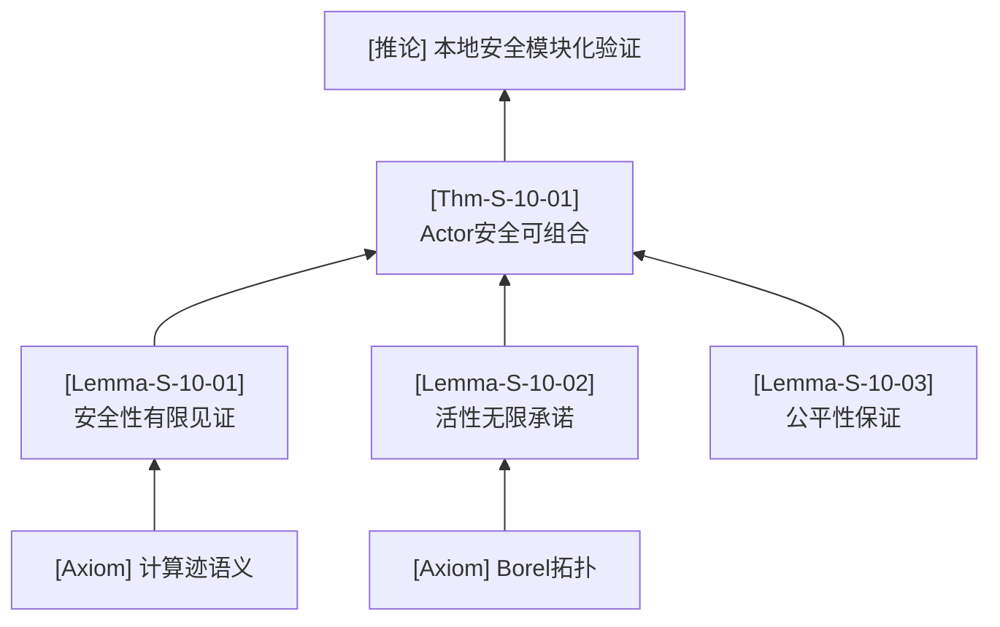
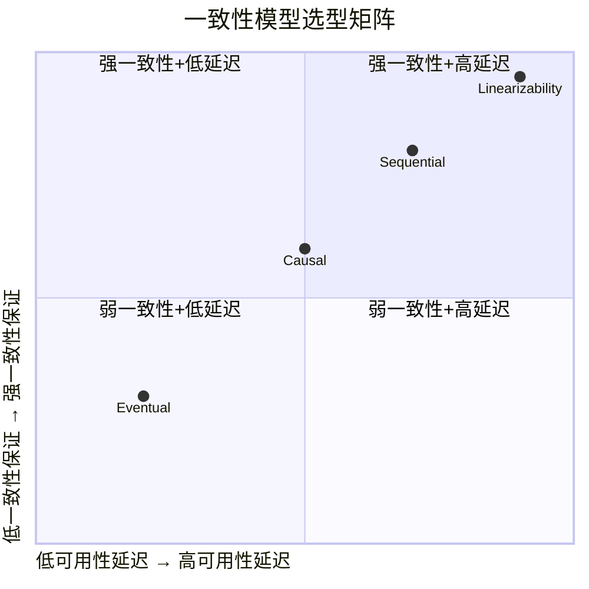
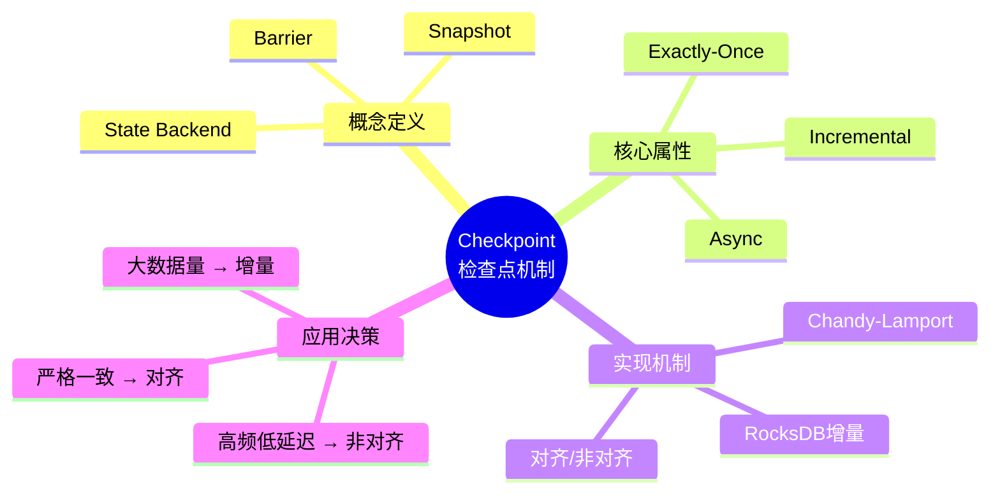
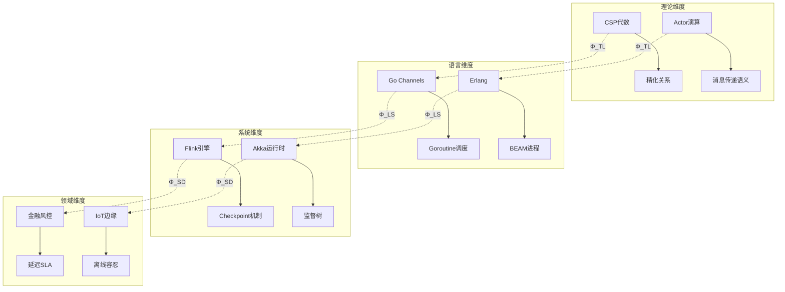

# 计划：中文内容质量深化与思维表征体系化工程（v7.0）

> **状态**: 待确认 | **提议人**: Agent | **日期**: 2026-04-24
> **前置决策**: 英文翻译全面暂停，全部资源投入中文质量深化

---

## 一、诊断结论（基于5篇抽样文档）

| 维度 | 现状 | 目标 |
|------|------|------|
| 平均八段式完整性 | **7.2/10** | 9.0/10 |
| 平均可视化丰富度 | **5.2/10** | 8.5/10 |
| 推理树覆盖率 | **0%** (5/5缺失) | 90%+ |
| 思维导图/关联树覆盖率 | **0%** (5/5缺失) | 80%+ |
| 概念矩阵覆盖率 | **0%** (5/5缺失) | 70%+ |
| 六段式空壳化比例 | **20-30%** | <5% |

### 关键缺陷分类

1. **思维表征单一化**：5,020+ Mermaid图几乎全是 `graph TB/LR` 和 `flowchart TD`，**推理树、思维导图(mindmap)、概念矩阵(quadrantChart)、关联树**四类高阶表征完全空白
2. **六段式空壳化**：`Knowledge/03-business-patterns/`、`Knowledge/10-case-studies/` 等目录通过"末尾机械附加空壳六段式"通过检测，主体内容无定义→属性→证明链条
3. **定义→属性→证明链条断裂**：工程导向文档（如fintech案例）缺乏严格形式化定义，论证代证明
4. **引用缺失**：部分Foundation文档（如unified-streaming-theory）References章节完全空白

---

## 二、思维表征体系设计（新增4类核心图型）

### 2.1 推理树（Deduction Tree）
**适用**: Struct/ 所有理论文档、Flink/ 核心机制证明文档
**语法**: `graph BT` 或 `flowchart TB`（自底向上或自顶向下）
**内容**: 公理 → 引理 → 定理 → 推论的演绎依赖路径
**示例**:

### 2.2 多维概念矩阵（Concept Matrix / Quadrant Chart）
**适用**: 所有涉及对比/选型的文档
**语法**: `quadrantChart`（Mermaid原生支持）或 `graph TB` 矩阵布局
**内容**: 两个维度交叉形成的四象限或多维矩阵，标注各象限代表的概念/技术/模式
**示例**:

### 2.3 思维导图 / 概念放射图（Mindmap / Radial Concept Map）
**适用**: Knowledge/ 工程知识文档、Flink/ 技术文档
**语法**: `mindmap`（Mermaid原生支持）
**内容**: 中心概念向外放射，逐层展开子概念、属性、关联
**示例**:

### 2.4 多维关联树（Multi-dimensional Association Tree）
**适用**: 跨层映射文档、技术选型文档、模式文档
**语法**: `graph TB` 多层嵌套子图
**内容**: 展示概念在多个维度上的关联（理论↔语言↔系统↔领域）
**示例**:

### 2.5 项目总体逻辑框架关联树（Global Knowledge Graph）
**适用**: 根目录全局索引文档
**语法**: `graph TB` 超大层级图 + 交互式SVG
**内容**: Struct/Knowledge/Flink/en 四大目录的顶层概念关联，展示项目整体知识结构

---

## 三、文档分类与修复策略

### A类：Struct/ 理论文档（约88篇）
**现状**: 八段式完整性高（8-9分），但可视化类型单一
**修复重点**:
1. 每篇补充 **推理树**（展示公理→引理→定理的依赖路径）
2. 涉及多演算/多模型对比的，补充 **概念矩阵**
3. 涉及跨层映射的，补充 **多维关联树**
4. 引用空白修复

### B类：Knowledge/02-design-patterns 设计模式（约45篇）
**现状**: 六段式较完整，但决策树单薄，缺思维导图
**修复重点**:
1. 每篇补充 **思维导图**（中心模式向外放射：适用场景→实现方式→权衡→反例）
2. 涉及选型的，补充 **决策树**（if-then-else条件分支）
3. 涉及多技术对比的，补充 **概念矩阵**

### C类：Knowledge/03-business-patterns 业务模式（约32篇）⚠️ 重点
**现状**: 六段式空壳化严重（3-4分），无形式化定义，无证明链条
**修复重点**:
1. **重构六段式**：将"问题→解决方案→实现"结构转化为严格定义→属性→关系→论证→证明
2. 补充 **思维导图**（业务实体→约束→SLA指标）
3. 补充 **多维关联树**（业务需求→系统能力→技术选型）
4. 补充 **决策树**（行业特征→架构选型路径）

### D类：Knowledge/07-best-practices 最佳实践（约28篇）
**现状**: 工程内容丰富，但缺乏形式化定义和可视化
**修复重点**:
1. 提取核心概念，补充 **定义**
2. 补充 **概念矩阵**（实践方案对比）
3. 补充 **决策树**（问题诊断路径）

### E类：Flink/ 专项文档（约437篇）
**现状**: 核心机制文档质量高，但配置/操作类文档可视化不足
**修复重点**:
1. 核心机制文档：补充 **推理树**（参数→行为→ guarantee）
2. API/配置文档：补充 **思维导图**（参数分类放射图）
3. 版本对比文档：补充 **概念矩阵**（版本特性对比）

### F类：项目全局索引（4篇：00-INDEX.md × 4）
**现状**: 纯文本列表，无全局知识结构可视化
**修复重点**:
1. 创建 **项目总体逻辑框架关联树**（超大Mermaid图）
2. 各目录INDEX补充 **思维导图** 形式的知识导航

---

## 四、执行批次规划

| 批次 | 目标文档 | 数量 | 核心任务 | 预估工作量 |
|------|----------|------|----------|-----------|
| **A1** | Struct/01-foundation 核心理论 | 5篇 | 推理树 + 概念矩阵 + 引用修复 | 中等 |
| **A2** | Struct/02-properties + 03-relationships | 5篇 | 推理树 + 多维关联树 | 中等 |
| **A3** | Struct/04-proofs + 05-comparative | 5篇 | 推理树（证明依赖链精细化） | 高 |
| **B1** | Knowledge/02-design-patterns 高频模式 | 8篇 | 思维导图 + 决策树 + 概念矩阵 | 中等 |
| **C1** | Knowledge/03-business-patterns 空壳修复 | 8篇 | **六段式重构** + 思维导图 + 关联树 | **高** |
| **D1** | Knowledge/07-best-practices 核心实践 | 6篇 | 定义补充 + 概念矩阵 + 决策树 | 中等 |
| **E1** | Flink/02-core 核心机制 | 6篇 | 推理树 + 架构关联树 | 中等 |
| **E2** | Flink/04-runtime + 09-practices | 6篇 | 思维导图 + 决策树 | 中等 |
| **F1** | 全局索引 + 根目录导航 | 4篇 | **项目总体关联树** + 思维导图 | **高** |
| **G** | 全项目质量巡检修复 | 全量 | 六段式空壳检测修复 + 引用补全 | 高 |

**总计**: 约61篇文档直接修改 + 4篇全局索引 + 全量巡检

---

## 五、质量门禁升级

当前检测器仅检查"结构存在性"，需升级为"内容实质性检查"：

| 检查项 | 当前状态 | 升级目标 |
|--------|----------|----------|
| 六段式校验 | 检查章节标题存在 | 检查每个章节内容长度>阈值（如Definitions节至少2个定义块） |
| Mermaid类型检查 | 仅语法校验 | 新增类型丰富度评分（graph/flowchart/mindmap/quadrantChart/stateDiagram各至少1种） |
| 推理链检查 | 无 | 新增：检查每篇文档是否有至少1个"推理树"类Mermaid图 |
| 引用完整性 | 检查链接有效性 | 新增：检查References节非空且引用数≥3 |
| 定义→证明链条 | 无 | 新增：Struct/文档检查是否有Def-* + Lemma-* + Thm-* 完整链条 |

---

## 六、预期成果

| 指标 | 当前 | 目标（v7.0完成） |
|------|------|------------------|
| 平均八段式完整性 | 7.2/10 | 9.0/10 |
| 平均可视化丰富度 | 5.2/10 | 8.5/10 |
| 推理树覆盖率 | 0% | 90%+ |
| 思维导图覆盖率 | 0% | 80%+ |
| 概念矩阵覆盖率 | 0% | 70%+ |
| 六段式空壳比例 | 20-30% | <5% |
| Mermaid图总数 | 5,028 | 6,500+ |
| 全局知识结构图 | 0 | 1（项目总体关联树） |

---

## 七、用户确认事项

1. **批次优先级**: 是否优先修复C类（业务模式六段式空壳）？还是先完成A类（理论文档推理树）？
2. **mindmap/quadrantChart支持**: 项目Mermaid语法检查器已支持这些类型，但部分旧渲染器可能不支持。是否接受？
3. **F1全局关联树**: 是否需要在根目录新建 `00-GLOBAL-KNOWLEDGE-GRAPH.md` 作为项目总体逻辑框架？
4. **六段式重构范围**: C类业务文档的六段式重构是否允许大幅调整原有内容结构？
5. **执行节奏**: 建议每完成1-2个批次后暂停汇报，还是持续执行到全部完成？

---

*计划版本: v1.0 | 日期: 2026-04-24 | 状态: 待用户确认*
